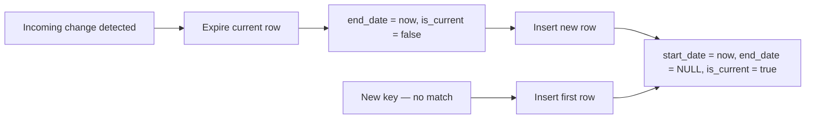

# :material-clock-plus: SCD Type 2

SCD **Type 2** preserves the complete history of every attribute change by inserting a
**new row** for each version and closing the previous one with an end date.
The dimension table can have many rows per business key — one per change event.



---

## :material-animation-play: Interactive Demo

<div id="viz-scd-type2" class="ts-viz"></div>

---

## :material-check-circle-outline: When to Use

!!! success "Good fit"
    - Full **audit trail** of every attribute change is required
    - Fact tables must be joined to the dimension value **at the time of the event**
    - Compliance or regulatory reporting demands point-in-time accuracy
    - Analysts need to answer *"what was the customer's city six months ago?"*

!!! failure "Not a good fit"
    - History is irrelevant — use Type 1 (simpler, lower storage)
    - Very high change frequency — version count explodes, query complexity increases
    - Current-state-only dashboards — filtering `WHERE is_current = TRUE` everywhere is error-prone at scale
    - You only care about the immediately previous value — use Type 3

---

## :material-toy-brick: Table Design

```sql
CREATE TABLE IF NOT EXISTS dim_customer (
    customer_sk   BIGINT GENERATED ALWAYS AS IDENTITY,  -- surrogate key
    customer_id   STRING      NOT NULL,                  -- natural / business key
    name          STRING,
    email         STRING,
    city          STRING,
    row_hash      STRING,    -- MD5 fingerprint — change detection guard
    start_date    TIMESTAMP  NOT NULL,                   -- version effective from
    end_date      TIMESTAMP,                             -- version expired at (NULL = active)
    is_current    BOOLEAN    NOT NULL                    -- convenience filter flag
)
USING DELTA
PARTITIONED BY (is_current);
```

!!! tip "Partition on `is_current`"
    Most queries filter on `is_current = TRUE`.  Partitioning isolates the small active
    partition from the much larger historical partition, cutting scan costs dramatically.

!!! note "Surrogate key"
    `customer_sk` uniquely identifies a **version row**.  Foreign keys in fact tables
    reference `customer_sk`, not `customer_id`, so point-in-time joins work correctly.

---

## :material-database-import: Seed Data

```sql
INSERT INTO dim_customer
    (customer_id, name, email, city, row_hash, start_date, end_date, is_current)
SELECT
    customer_id,
    name,
    email,
    city,
    md5(concat_ws('||', name, email, city)) AS row_hash,
    TIMESTAMP '2024-01-01 00:00:00'          AS start_date,
    NULL                                     AS end_date,
    TRUE                                     AS is_current
FROM VALUES
    ('cust1', 'Alice', 'alice@example.com', 'NY'),
    ('cust2', 'Bob',   'bob@example.com',   'CA')
AS t(customer_id, name, email, city);
```

---

## :material-tray-arrow-down: Incoming Staging Data

```sql
CREATE OR REPLACE TEMP VIEW staging_customer AS
SELECT *
FROM VALUES
    ('cust1', 'Alice',   'alice@example.com',  'NY'),   -- no change
    ('cust2', 'Bobby',   'bob@newdomain.com',  'TX'),   -- name + email + city changed
    ('cust3', 'Charlie', 'charlie@example.com','WA')    -- new customer
AS t(customer_id, name, email, city);
```

---

## :material-repeat: SCD Type 2 — Two-Step MERGE Pattern

Type 2 requires **two separate MERGE statements** because a single changed row needs
two independent operations on the target table:

1. **Expire** the existing active row (UPDATE its `end_date` and `is_current`)
2. **Insert** a brand-new version row

A single MERGE can match each target row only once — it cannot both update _and_ insert
a new sibling row for the same key in one pass.

### Step 1 — Expire rows that changed

```sql
MERGE INTO dim_customer AS tgt
USING (
    SELECT
        customer_id,
        md5(concat_ws('||', name, email, city)) AS row_hash
    FROM staging_customer
) AS src
ON  tgt.customer_id = src.customer_id
AND tgt.is_current  = TRUE
AND tgt.row_hash   <> src.row_hash        -- only rows that actually changed

WHEN MATCHED THEN
    UPDATE SET
        end_date   = current_timestamp(),
        is_current = FALSE;
```

### Step 2 — Insert new version for changed and new customers

```sql
MERGE INTO dim_customer AS tgt
USING (
    SELECT
        s.customer_id,
        s.name,
        s.email,
        s.city,
        md5(concat_ws('||', s.name, s.email, s.city)) AS row_hash
    FROM staging_customer AS s
    -- match changed (now expired) or brand-new customers
    LEFT JOIN dim_customer AS d
        ON  d.customer_id = s.customer_id
        AND d.is_current  = TRUE
    WHERE d.customer_id IS NULL          -- new customer
       OR d.row_hash   <> s.row_hash     -- just expired — needs a fresh row
) AS src
ON tgt.customer_id = src.customer_id
AND tgt.is_current = TRUE                -- will never match after Step 1 closed old rows
AND tgt.row_hash   = src.row_hash

WHEN NOT MATCHED THEN
    INSERT (customer_id, name, email, city, row_hash, start_date, end_date, is_current)
    VALUES (src.customer_id, src.name, src.email, src.city, src.row_hash,
            current_timestamp(), NULL, TRUE);
```

---

## :material-format-list-bulleted-type: Variant Patterns

### CTE-based approach — explicit change classification

Useful when the logic needs auditing or when both steps share a common staging CTE.

```sql
-- Stage 1: classify each incoming row
CREATE OR REPLACE TEMP VIEW classified AS
WITH staged AS (
    SELECT
        customer_id, name, email, city,
        md5(concat_ws('||', name, email, city)) AS row_hash
    FROM staging_customer
),
changed AS (
    SELECT s.*
    FROM staged AS s
    JOIN dim_customer AS d
        ON  d.customer_id = s.customer_id
        AND d.is_current  = TRUE
        AND d.row_hash   <> s.row_hash
),
new_customers AS (
    SELECT s.*
    FROM staged AS s
    LEFT ANTI JOIN dim_customer AS d
        ON d.customer_id = s.customer_id AND d.is_current = TRUE
)
SELECT *, 'CHANGED' AS change_type FROM changed
UNION ALL
SELECT *, 'NEW'     AS change_type FROM new_customers;

-- Stage 2: expire changed rows
UPDATE dim_customer
SET end_date = current_timestamp(), is_current = FALSE
WHERE customer_id IN (
    SELECT customer_id FROM classified WHERE change_type = 'CHANGED'
)
AND is_current = TRUE;

-- Stage 3: insert new versions
INSERT INTO dim_customer
    (customer_id, name, email, city, row_hash, start_date, end_date, is_current)
SELECT
    customer_id, name, email, city, row_hash,
    current_timestamp(), NULL, TRUE
FROM classified;
```

### Surrogate key from UUID

When `GENERATED ALWAYS AS IDENTITY` is unavailable (e.g. open-source Spark 3.5):

```sql
INSERT INTO dim_customer
    (customer_sk, customer_id, name, email, city, row_hash, start_date, end_date, is_current)
SELECT
    CAST(conv(substr(md5(concat_ws('|', customer_id, name, email,
                                   CAST(current_timestamp() AS STRING))),
                     1, 15), 16, 10) AS BIGINT)  AS customer_sk,
    customer_id, name, email, city, row_hash,
    current_timestamp(), NULL, TRUE
FROM staged_new_versions;
```

### Deduplication before merge

```sql
WITH deduped AS (
    SELECT *,
        ROW_NUMBER() OVER (
            PARTITION BY customer_id
            ORDER BY updated_at DESC
        ) AS rn
    FROM staging_customer
)
SELECT * FROM deduped WHERE rn = 1
```

Use this as the USING source instead of the raw staging view when duplicates are possible.

---

## :material-check-circle-outline: Final Output

After one change batch, `dim_customer` contains:

| customer_sk | customer_id | name    | email                  | city | is_current | start_date          | end_date            |
|-------------|-------------|---------|------------------------|------|------------|---------------------|---------------------|
| 1           | cust1       | Alice   | alice@example.com      | NY   | true       | 2024-01-01 00:00:00 | NULL                |
| 2           | cust2       | Bob     | bob@example.com        | CA   | **false**  | 2024-01-01 00:00:00 | 2024-06-15 09:00:00 |
| 3           | cust2       | Bobby   | bob@newdomain.com      | TX   | **true**   | 2024-06-15 09:00:00 | NULL                |
| 4           | cust3       | Charlie | charlie@example.com    | WA   | true       | 2024-06-15 09:00:00 | NULL                |

`cust2` now has two rows — its complete version history is preserved.

---

## :material-flask-outline: Analytical Queries

### Current state of all customers

```sql
SELECT customer_id, name, email, city, start_date
FROM dim_customer
WHERE is_current = TRUE
ORDER BY customer_id;
```

### Full version history for a customer

```sql
SELECT
    customer_sk,
    name,
    email,
    city,
    start_date,
    COALESCE(end_date, current_timestamp())   AS end_date,
    is_current,
    DATEDIFF(
        COALESCE(end_date, current_timestamp()),
        start_date
    )                                         AS days_active
FROM dim_customer
WHERE customer_id = 'cust2'
ORDER BY start_date;
```

### Point-in-time snapshot — customer state on a specific date

```sql
SELECT *
FROM dim_customer
WHERE customer_id = 'cust2'
  AND start_date <= TIMESTAMP '2024-03-01 00:00:00'
  AND (end_date   > TIMESTAMP '2024-03-01 00:00:00'
       OR end_date IS NULL);
```

### Enrich a fact table with the dimension value at the time of the event

```sql
SELECT
    o.order_id,
    o.order_date,
    o.amount,
    c.name,
    c.city     AS city_at_order_time,
    c.customer_sk
FROM orders        AS o
JOIN dim_customer  AS c
    ON  c.customer_id = o.customer_id
    AND c.start_date <= o.order_date
    AND (c.end_date   > o.order_date OR c.end_date IS NULL);
```

### Customers with more than one version (have changed at least once)

```sql
SELECT customer_id, COUNT(*) AS versions
FROM dim_customer
GROUP BY customer_id
HAVING versions > 1
ORDER BY versions DESC;
```

### Average time between changes per customer

```sql
SELECT
    customer_id,
    AVG(DATEDIFF(
        COALESCE(end_date, current_timestamp()),
        start_date
    )) AS avg_days_per_version
FROM dim_customer
GROUP BY customer_id
ORDER BY avg_days_per_version;
```

---

## :material-shield-outline: Common Pitfalls

| Pitfall | Consequence | Solution |
|---------|-------------|---------|
| Single-MERGE attempt | Delta can't UPDATE + INSERT same key in one pass | Always use two separate MERGE statements |
| No `row_hash` guard | Every row re-expires and re-inserts each run | Add `AND tgt.row_hash <> src.row_hash` to Step 1 |
| Duplicate keys in staging | Non-deterministic expiry / double inserts | Deduplicate with `ROW_NUMBER()` before MERGE |
| Fact table references `customer_id` | Point-in-time joins broken | FK must reference `customer_sk` (surrogate) |
| Forgetting `AND is_current = TRUE` in Step 1 | Historical rows incorrectly re-expired | Always scope MERGE to active partition |
| Querying without `is_current` filter | Full history scan — multiple rows per customer | Enforce `WHERE is_current = TRUE` or create a current-state view |

---

## :material-cog-outline: Best Practices

1. **Partition on `is_current`** — isolates the small active partition from the large history partition.
2. **`ZORDER BY customer_id`** — co-locates all version rows for the same customer.
3. **Create a current-state view** — avoids repeated `WHERE is_current = TRUE` across all consumers.
4. **Foreign keys reference `customer_sk`** — enables correct point-in-time fact joins.
5. **Deduplicate staging before merge** — prevents the "multiple rows matched" Delta error.
6. **Validate row counts** after every batch: `COUNT(*) WHERE is_current = TRUE` should equal distinct business keys.

```sql
-- Current-state convenience view
CREATE OR REPLACE VIEW dim_customer_current AS
SELECT * FROM dim_customer WHERE is_current = TRUE;

-- Post-merge health check
SELECT
    COUNT(DISTINCT customer_id)              AS unique_customers,
    SUM(CAST(is_current AS INT))             AS active_rows,
    COUNT(*) - SUM(CAST(is_current AS INT))  AS historical_rows
FROM dim_customer;
```

---

## :material-swap-horizontal: SCD Type Comparison

| Scenario | Recommended Type |
|----------|-----------------|
| Only current values, no history | Type 1 |
| **Full history with point-in-time accuracy** | **Type 2** |
| Current + one previous value per attribute | Type 3 |
| Current table + separate history table | Type 4 |
| Current table + history table with FK link | Type 5 |
| Current + history + previous value, single table | Type 6 |
