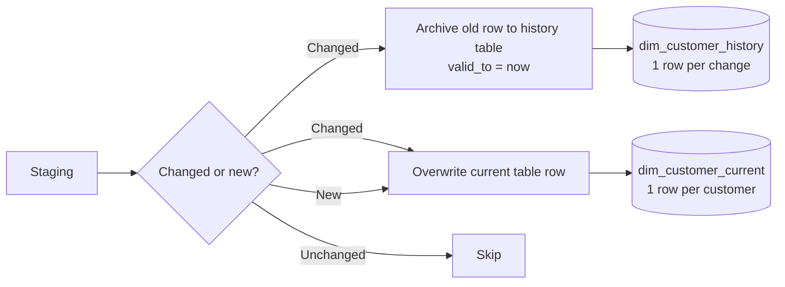

# :material-table-plus: SCD Type 4

SCD **Type 4** separates current and historical data into **two dedicated tables**:

- **Current table** (`dim_customer_current`) — one row per customer, always the latest values; queried like a Type 1 dimension
- **History table** (`dim_customer_history`) — one row per change event, full audit trail; queried like a Type 2 dimension

Neither table carries the complexity of the other. Current queries stay fast with no
`is_current` filters; historical queries go to the dedicated history table.



---

## :material-animation-play: Interactive Demo

<div id="viz-scd-type4" class="ts-viz"></div>

---

## :material-check-circle-outline: When to Use

!!! success "Good fit"
    - You need **fast current-state queries** without `WHERE is_current = TRUE` everywhere
    - AND you need a **full change audit trail** for compliance or analytics
    - Teams that own the BI layer and the audit layer are separate — each gets a clean table
    - The history table can be partitioned, archived, or tiered independently of the current table

!!! failure "Not a good fit"
    - Point-in-time fact joins via a surrogate key — Type 2 or Type 5 is better
    - The overhead of two write targets per batch is undesirable — Type 2 in one table is simpler
    - You want to navigate directly from a current row to its history without a separate lookup — use Type 5 (`hist_key` FK)

---

## :material-toy-brick: Table Design

### Current table — `dim_customer_current`

```sql
CREATE TABLE IF NOT EXISTS dim_customer_current (
    customer_id  STRING    NOT NULL,   -- natural / business key
    name         STRING,
    email        STRING,
    city         STRING,
    row_hash     STRING,               -- change-detection fingerprint
    updated_at   TIMESTAMP
)
USING DELTA;
```

### History table — `dim_customer_history`

```sql
CREATE TABLE IF NOT EXISTS dim_customer_history (
    customer_id  STRING    NOT NULL,
    name         STRING,
    email        STRING,
    city         STRING,
    row_hash     STRING,
    valid_from   TIMESTAMP NOT NULL,   -- when this version became active
    valid_to     TIMESTAMP NOT NULL    -- when this version was superseded
)
USING DELTA
PARTITIONED BY (customer_id);
```

!!! tip "Partition the history table by `customer_id`"
    History tables grow unboundedly. Partitioning on `customer_id` keeps per-customer
    history queries fast and enables efficient time-travel lookups.

---

## :material-database-import: Seed Data

```sql
-- Load initial state into the current table only.
-- No history rows exist yet — the first version has never been superseded.
INSERT INTO dim_customer_current (customer_id, name, email, city, row_hash, updated_at)
SELECT
    customer_id,
    name,
    email,
    city,
    md5(concat_ws('||', name, email, city)) AS row_hash,
    TIMESTAMP '2024-01-01 00:00:00'          AS updated_at
FROM VALUES
    ('cust1', 'Alice', 'alice@example.com', 'NY'),
    ('cust2', 'Bob',   'bob@example.com',   'CA')
AS t(customer_id, name, email, city);
```

---

## :material-tray-arrow-down: Incoming Staging Data

```sql
CREATE OR REPLACE TEMP VIEW staging_customer AS
SELECT *
FROM VALUES
    ('cust1', 'Alice',   'alice@example.com',  'NY'),   -- no change
    ('cust2', 'Bobby',   'bob@newdomain.com',  'TX'),   -- name + email + city changed
    ('cust3', 'Charlie', 'charlie@example.com','WA')    -- new customer
AS t(customer_id, name, email, city);
```

---

## :material-repeat: Step-by-Step SCD Type 4 Logic

### Step 1 — Classify incoming rows

Build a staging CTE that identifies changed and new customers in one pass.

```sql
CREATE OR REPLACE TEMP VIEW staged_classified AS
WITH hashed AS (
    SELECT
        customer_id,
        name,
        email,
        city,
        md5(concat_ws('||', name, email, city)) AS new_hash
    FROM staging_customer
)
SELECT
    h.customer_id,
    h.name,
    h.email,
    h.city,
    h.new_hash,
    c.row_hash      AS old_hash,
    c.updated_at    AS old_updated_at,
    CASE
        WHEN c.customer_id IS NULL          THEN 'NEW'
        WHEN c.row_hash <> h.new_hash       THEN 'CHANGED'
        ELSE                                     'UNCHANGED'
    END             AS change_type
FROM hashed AS h
LEFT JOIN dim_customer_current AS c USING (customer_id);
```

### Step 2 — Archive changed rows to the history table

Only rows classified as `CHANGED` are archived. The `valid_to` value is the current
timestamp — the moment the old version was superseded.

```sql
INSERT INTO dim_customer_history
    (customer_id, name, email, city, row_hash, valid_from, valid_to)
SELECT
    c.customer_id,
    c.name,
    c.email,
    c.city,
    c.row_hash,
    c.updated_at        AS valid_from,
    current_timestamp() AS valid_to
FROM dim_customer_current AS c
WHERE c.customer_id IN (
    SELECT customer_id FROM staged_classified WHERE change_type = 'CHANGED'
);
```

### Step 3 — Upsert the current table

Changed rows get overwritten; new rows get inserted; unchanged rows are skipped.

```sql
MERGE INTO dim_customer_current AS tgt
USING (
    SELECT customer_id, name, email, city, new_hash AS row_hash
    FROM staged_classified
    WHERE change_type IN ('CHANGED', 'NEW')
) AS src
ON tgt.customer_id = src.customer_id

WHEN MATCHED THEN
    UPDATE SET
        name       = src.name,
        email      = src.email,
        city       = src.city,
        row_hash   = src.row_hash,
        updated_at = current_timestamp()

WHEN NOT MATCHED THEN
    INSERT (customer_id, name, email, city, row_hash, updated_at)
    VALUES (src.customer_id, src.name, src.email, src.city,
            src.row_hash, current_timestamp());
```

!!! note "Run order matters"
    Step 2 must execute **before** Step 3.  If Step 3 runs first, the current table is
    overwritten and the old values needed for the history archive are lost.

---

## :material-check-circle-outline: Final Output

**`dim_customer_current`** — one row per customer, always current:

| customer_id | name    | email                  | city | updated_at          |
|-------------|---------|------------------------|------|---------------------|
| cust1       | Alice   | alice@example.com      | NY   | 2024-01-01 00:00:00 |
| cust2       | Bobby   | bob@newdomain.com      | TX   | 2024-06-15 09:00:00 |
| cust3       | Charlie | charlie@example.com    | WA   | 2024-06-15 09:00:00 |

**`dim_customer_history`** — one row per change event:

| customer_id | name | email           | city | valid_from          | valid_to            |
|-------------|------|-----------------|------|---------------------|---------------------|
| cust2       | Bob  | bob@example.com | CA   | 2024-01-01 00:00:00 | 2024-06-15 09:00:00 |

Only `cust2` has a history row — it was the only customer whose attributes changed.

---

## :material-flask-outline: Analytical Queries

### Current state of all customers

```sql
SELECT * FROM dim_customer_current ORDER BY customer_id;
```

### Full change history for a customer

```sql
SELECT
    customer_id,
    name,
    email,
    city,
    valid_from,
    valid_to,
    DATEDIFF(valid_to, valid_from) AS days_active
FROM dim_customer_history
WHERE customer_id = 'cust2'
ORDER BY valid_from;
```

### Complete timeline — current + history unioned

```sql
SELECT customer_id, name, email, city, updated_at AS valid_from, NULL AS valid_to, TRUE AS is_current
FROM dim_customer_current
UNION ALL
SELECT customer_id, name, email, city, valid_from, valid_to, FALSE AS is_current
FROM dim_customer_history
ORDER BY customer_id, valid_from;
```

### Point-in-time state — what did `cust2` look like on a given date?

```sql
SELECT customer_id, name, email, city, valid_from, valid_to
FROM dim_customer_history
WHERE customer_id = 'cust2'
  AND valid_from <= TIMESTAMP '2024-03-01 00:00:00'
  AND valid_to   >  TIMESTAMP '2024-03-01 00:00:00'

UNION ALL

SELECT customer_id, name, email, city, updated_at AS valid_from, NULL AS valid_to
FROM dim_customer_current
WHERE customer_id = 'cust2'
  AND updated_at <= TIMESTAMP '2024-03-01 00:00:00';
```

### Customers with the most historical versions

```sql
SELECT
    customer_id,
    COUNT(*) AS change_count,
    MIN(valid_from) AS first_change,
    MAX(valid_to)   AS last_change
FROM dim_customer_history
GROUP BY customer_id
ORDER BY change_count DESC;
```

### Fact-table join — current city enrichment

```sql
SELECT
    o.order_id,
    o.order_date,
    o.amount,
    c.name,
    c.city AS current_city
FROM orders                  AS o
JOIN dim_customer_current    AS c USING (customer_id);
```

!!! warning "Current-table join loses historical context"
    Joining facts to `dim_customer_current` gives the customer's **current** city, not
    the city at the time of the order.  For point-in-time attribution, union the history
    and current tables and apply date-range filtering as shown above.

---

## :material-layers-triple: Table Responsibility Summary

| Capability | `dim_customer_current` | `dim_customer_history` |
|-----------|----------------------|----------------------|
| Latest values | :material-check-circle-outline: | :material-close-circle-outline: |
| Full change audit trail | :material-close-circle-outline: | :material-check-circle-outline: |
| Fast current-state query | :material-check-circle-outline: (no filter needed) | :material-close-circle-outline: |
| Point-in-time lookup | :material-close-circle-outline: | :material-check-circle-outline: (date-range filter) |
| Row count | 1 per customer | 1 per change event |
| Growth rate | Bounded | Unbounded |

---

## :material-shield-outline: Common Pitfalls

| Pitfall | Consequence | Solution |
|---------|-------------|---------|
| Running Step 3 before Step 2 | Old values overwritten before archive — history gap | Always archive first, then upsert |
| Missing `row_hash` guard | Unchanged rows archived as false changes | Filter `change_type = 'CHANGED'` using hash comparison |
| No `valid_from` on history row | Cannot reconstruct timeline | Store `updated_at` from current table as `valid_from` |
| Duplicate keys in staging | Non-deterministic archive + double insert | Deduplicate with `ROW_NUMBER()` before Step 1 |
| History table not partitioned | Full table scan on per-customer queries | `PARTITIONED BY (customer_id)` |

---

## :material-swap-horizontal: SCD Type Comparison

| Scenario | Recommended Type |
|----------|-----------------|
| Only current values, no history | Type 1 |
| Full history with point-in-time accuracy, single table | Type 2 |
| Current + one previous value per attribute | Type 3 |
| **Separate current and history tables, no FK link** | **Type 4** |
| Separate tables with `hist_key` FK in current table | Type 5 |
| Current + history + previous value, single table | Type 6 |
