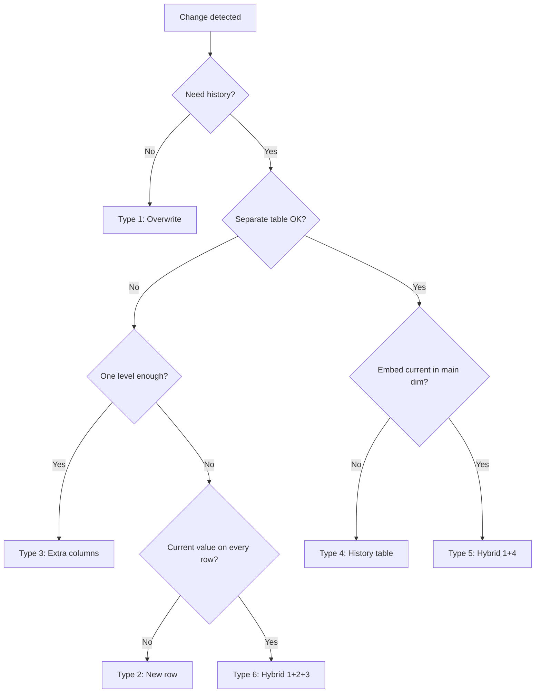

# :material-history: Slowly Changing Dimensions (SCD)

**Slowly Changing Dimensions** (SCD) are data warehousing patterns that control how changes in source data are reflected in a dimension table over time. The choice of SCD type determines whether history is discarded, versioned, or partially captured.

______________________________________________________________________

## :material-play-circle: Interactive Demo

Click each **Type** button below to see how Alice's dimension record looks after her city changes from **NY → TX**.

<div id="viz-scd-overview" class="ts-viz"></div>

______________________________________________________________________

## :material-table-of-contents: In This Section

| Page                                             | Description                                                   |
| ------------------------------------------------ | ------------------------------------------------------------- |
| [Introduction](concepts.md)                      | Core concepts, table templates, and the MERGE foundation      |
| [Type 1 — Overwrite](overwrite/index.md)         | Overwrite in place — no history. Simplest, lowest storage.    |
| [Type 2 — Full History](full_history/index.md)   | New row per change — full point-in-time history. Most common. |
| [Type 3 — Extra Columns](extra_columns/index.md) | Previous + current value columns — one level of history.      |
| [Type 4 — History Table](history_table/index.md) | Separate history table — lean current dim + full history.     |
| [Type 5 — Hybrid 1+4](hybrid_1_4/index.md)       | Type 4 with embedded current snapshot on the current dim.     |
| [Type 6 — Hybrid 1+2+3](hybrid_1_2_3/index.md)   | Rows per version AND a `current_value` column on every row.   |

______________________________________________________________________

## :material-compare: SCD Type Comparison

| Property                |      Type 1      |      Type 2      |      Type 3      |      Type 4      |      Type 5      |      Type 6      |
| ----------------------- | :--------------: | :--------------: | :--------------: | :--------------: | :--------------: | :--------------: |
| History retained        | :material-close: | :material-check: |     Partial      | :material-check: | :material-check: | :material-check: |
| Point-in-time joins     | :material-close: | :material-check: | :material-close: | :material-check: | :material-check: | :material-check: |
| Rows per change         |        0         |        +1        |        0         |    0 (+hist)     |    0 (+hist)     |        +1        |
| Surrogate key needed    |     Optional     | :material-check: | :material-close: |     Optional     |     Optional     | :material-check: |
| Current-value fast read | :material-check: |   Needs filter   | :material-check: | :material-check: | :material-check: | :material-check: |
| Schema complexity       |       Low        |      Medium      |      Medium      |      Medium      |      Medium      |       High       |
| Storage cost            |      Lowest      |       High       |       Low        |      Medium      |      Medium      |     Highest      |
| Implementation effort   |       Low        |       High       |       Low        |      Medium      |      Medium      |       High       |

______________________________________________________________________

## :material-sitemap: Decision Flowchart



______________________________________________________________________

## :material-brain: When to Use

| Scenario                                          | Recommended Type |
| ------------------------------------------------- | ---------------- |
| Corrections / data quality fixes                  | Type 1           |
| Full audit trail, compliance, GDPR                | Type 2           |
| "Previous value" reporting without joins          | Type 3           |
| High-volume dim, separate history for analysts    | Type 4           |
| Type 4 + BI tools need current value without join | Type 5           |
| Full history + current-value column on every row  | Type 6           |

______________________________________________________________________

## :material-alert-circle: Key Conventions (All Types)

!!! tip "Row hash for change detection"

    Use `md5(concat_ws('||', col1, col2, ...))` to detect changes in a single string comparison
    — no per-column `!=` chain needed in the MERGE condition.

!!! warning "Two-step MERGE for Type 2/6"

    A single MERGE cannot **expire** and **insert** a new version for the same key in one pass.
    Always use two separate MERGE statements: Step 1 — expire, Step 2 — insert.

!!! note "9999-12-31 vs NULL for open end dates"

    `NULL` is semantically clearest, but `DATE '9999-12-31'` simplifies `BETWEEN` queries.
    Pick one convention and apply it consistently across all dimension tables.

______________________________________________________________________

## :material-alert-decagram: Advanced Complications

The six SCD types above assume every change arrives on time, in order, and refers to
a dimension member that already exists. Real pipelines routinely violate all three
assumptions — these are the complications that turn "pick a Type" into a genuine
engineering problem, verified against Spark 4.2.

### Unknown Members — Facts That Arrive Before Their Dimension Row

A fact can reference a dimension key that hasn't been loaded yet (a late-registering
customer, a not-yet-synced product). Rather than dropping the fact or failing the
load, join against a reserved **unknown-member row** (conventionally surrogate key
`-1`) and fall back to it whenever the real dimension lookup misses:

```sql
-- dim_customer always contains a -1 "unknown" row, seeded once, never expired
CREATE OR REPLACE TEMP VIEW dim_customer AS
SELECT * FROM VALUES
  (-1, 'UNKNOWN', 'UNKNOWN', DATE '1900-01-01', DATE '9999-12-31'),
  (1,  'C100',    'NY',      DATE '2024-01-01', DATE '9999-12-31')
AS t(customer_sk, customer_id, state, valid_from, valid_to);

SELECT
    f.order_id,
    COALESCE(d.customer_sk, -1) AS customer_sk
FROM fact_orders_raw f
LEFT JOIN dim_customer d
    ON f.customer_id = d.customer_id
   AND d.customer_sk != -1     -- never resolve to the unknown row via a real match
WHERE 1 = 1;
```

| order_id | customer_sk |
| -------- | ----------- |
| 9001     | 1           |
| 9002     | -1          |

Verified: `C100` resolves to its real surrogate key; the not-yet-loaded `C999`
correctly falls back to `-1` instead of producing a `NULL` foreign key or being
dropped. A later backfill job re-points `-1` rows to the real key once the dimension
catches up — this is the standard **late-arriving dimension** fix.

### Late-Arriving Facts

The mirror image: the dimension row already exists, but the fact shows up with an
`event_time` that falls **inside** an already-expired SCD Type 2 version window, not
the current one. A naive join to "the current row" (`WHERE is_current = true`) would
silently attribute the fact to the wrong dimension version. The fix is always an
**effective-dated join** — join on the fact's own timestamp falling between
`valid_from` and `valid_to`, never on `is_current`:

```sql
SELECT f.*, d.state AS state_at_event_time
FROM fact_orders f
JOIN dim_customer_scd2 d
    ON f.customer_id = d.customer_id
   AND f.event_time >= d.valid_from
   AND f.event_time <  d.valid_to;      -- half-open interval, not is_current
```

See [Temporal SQL — Effective-Dated Join](../index.md#temporal-sql) for the full
point-in-time join treatment this generalizes.

### Overlapping Versions

A data-quality bug upstream (or two concurrent MERGE runs racing each other) can leave
two SCD Type 2 rows for the same key with overlapping validity windows — both claim to
be "current" for some period. Detect this with a self-join on the overlap condition
(`a.valid_from < b.valid_to AND b.valid_from < a.valid_to`), keeping the join
asymmetric (`a.valid_from < b.valid_from`) so each overlapping pair is reported once:

```sql
SELECT a.customer_id, a.valid_from AS a_from, a.valid_to AS a_to,
       b.valid_from AS b_from, b.valid_to AS b_to
FROM dim_customer_scd2 a
JOIN dim_customer_scd2 b
    ON a.customer_id = b.customer_id
   AND a.valid_from < b.valid_to
   AND b.valid_from < a.valid_to
   AND a.valid_from < b.valid_from;
```

| customer_id | a_from     | a_to       | b_from     | b_to       |
| ----------- | ---------- | ---------- | ---------- | ---------- |
| 1           | 2024-01-01 | 2024-06-01 | 2024-05-01 | 2024-12-31 |

Verified: customer 1's `NY` version (Jan–Jun) and `TX` version (May–Dec) overlap for
all of May — exactly the kind of double-booking a corrupted MERGE or a race condition
between two loaders produces. Run this as a standing data-quality check on every SCD
Type 2 table (see [Temporal Overlap](../index.md#temporal-sql)), not just after
incidents.

### Backdated Corrections

The hardest case: a correction arrives claiming a value was true **earlier** than the
current row's `valid_from` — e.g. "the customer was actually in NJ starting Jan 1,"
when the existing open row only starts Mar 1. Simply inserting a new row with
`valid_from = Jan 1` alongside the existing one creates an overlap (the bug in the
previous section). The correct fix **splits** the existing row: the correction closes
out over `[correction.valid_from, existing.valid_from)`, and the existing row is left
untouched from its own `valid_from` onward:

```sql
WITH correction AS (
    SELECT 1 AS customer_id, 'NJ' AS state, DATE '2024-01-01' AS valid_from
),
affected AS (
    SELECT d.* FROM dim_v2 d
    JOIN correction c ON d.customer_id = c.customer_id
    WHERE c.valid_from < d.valid_from     -- only rows the correction actually predates
)
SELECT c.customer_id, c.state, c.valid_from, a.valid_from AS valid_to_exclusive
FROM correction c
JOIN affected a ON c.customer_id = a.customer_id;
```

| customer_id | state | valid_from | valid_to_exclusive |
| ----------- | ----- | ---------- | ------------------ |
| 1           | NJ    | 2024-01-01 | 2024-03-01         |

Verified: the new backdated row correctly ends exactly where the existing row begins
(`2024-03-01`), leaving a contiguous, non-overlapping history — `NJ` from Jan 1–Mar 1,
then whatever the existing row already said from Mar 1 onward. Never `INSERT` a
backdated row without first checking whether it predates an existing row's
`valid_from`; if it does, the insert must carry the existing row's `valid_from` as its
own `valid_to`, not `9999-12-31` or the correction's own guess.

### MERGE Statement Gotchas

| Gotcha                                                               | Why it matters                                                                                                                                                                    |
| -------------------------------------------------------------------- | --------------------------------------------------------------------------------------------------------------------------------------------------------------------------------- |
| One `MERGE` cannot expire an old row and insert its replacement      | Already covered above — always two passes for Type 2/6.                                                                                                                           |
| `MERGE` matches on the join key, not on validity — expire explicitly | A naive `WHEN MATCHED` will overwrite the currently-open row instead of expiring it unless the `ON` clause also filters `is_current = true` or `valid_to = '9999-12-31'`.         |
| Late-arriving + backdated corrections both bypass simple `MERGE`     | Both require a row-splitting pre-step (as shown above) before any `MERGE` can run safely — `MERGE` alone assumes strictly increasing `valid_from` per key.                        |
| Referential integrity isn't enforced by `MERGE`                      | Spark has no foreign-key constraints — pair every dimension MERGE with a periodic orphan-check (see [Data Quality — Referential Integrity](../data_quality/validation-rules.md)). |

______________________________________________________________________
