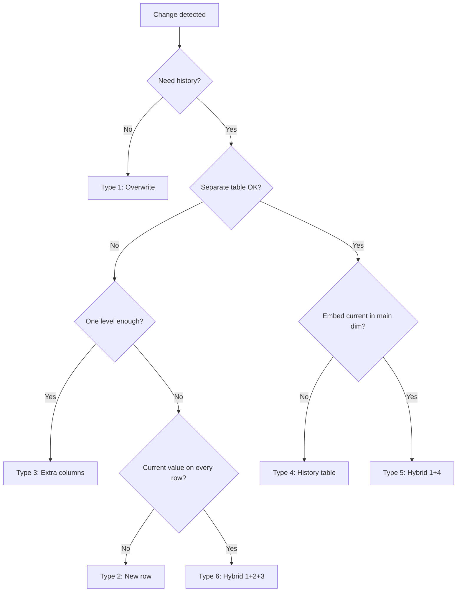

# :material-history: Slowly Changing Dimensions (SCD)

**Slowly Changing Dimensions** (SCD) are data warehousing patterns that control how changes in source data are reflected in a dimension table over time. The choice of SCD type determines whether history is discarded, versioned, or partially captured.

---

## :material-play-circle: Interactive Demo

Click each **Type** button below to see how Alice's dimension record looks after her city changes from **NY → TX**.

---

## :material-table-of-contents: In This Section

| Page | Description |
|------|-------------|
| [Introduction](concepts.md) | Core concepts, table templates, and the MERGE foundation |
| [Type 1 — Overwrite](overwrite/index.md) | Overwrite in place — no history. Simplest, lowest storage. |
| [Type 2 — Full History](full_history/index.md) | New row per change — full point-in-time history. Most common. |
| [Type 3 — Extra Columns](extra_columns/index.md) | Previous + current value columns — one level of history. |
| [Type 4 — History Table](history_table/index.md) | Separate history table — lean current dim + full history. |
| [Type 5 — Hybrid 1+4](hybrid_1_4/index.md) | Type 4 with embedded current snapshot on the current dim. |
| [Type 6 — Hybrid 1+2+3](hybrid_1_2_3/index.md) | Rows per version AND a `current_value` column on every row. |

---

## :material-compare: SCD Type Comparison

| Property | Type 1 | Type 2 | Type 3 | Type 4 | Type 5 | Type 6 |
|----------|:------:|:------:|:------:|:------:|:------:|:------:|
| History retained | :material-close: | :material-check: | Partial | :material-check: | :material-check: | :material-check: |
| Point-in-time joins | :material-close: | :material-check: | :material-close: | :material-check: | :material-check: | :material-check: |
| Rows per change | 0 | +1 | 0 | 0 (+hist) | 0 (+hist) | +1 |
| Surrogate key needed | Optional | :material-check: | :material-close: | Optional | Optional | :material-check: |
| Current-value fast read | :material-check: | Needs filter | :material-check: | :material-check: | :material-check: | :material-check: |
| Schema complexity | Low | Medium | Medium | Medium | Medium | High |
| Storage cost | Lowest | High | Low | Medium | Medium | Highest |
| Implementation effort | Low | High | Low | Medium | Medium | High |

---

## :material-sitemap: Decision Flowchart

---

## :material-brain: When to Use

| Scenario | Recommended Type |
|----------|-----------------|
| Corrections / data quality fixes | Type 1 |
| Full audit trail, compliance, GDPR | Type 2 |
| "Previous value" reporting without joins | Type 3 |
| High-volume dim, separate history for analysts | Type 4 |
| Type 4 + BI tools need current value without join | Type 5 |
| Full history + current-value column on every row | Type 6 |

---

## :material-alert-circle: Key Conventions (All Types)

!!! tip "Row hash for change detection"
    Use `md5(concat_ws('||', col1, col2, ...))` to detect changes in a single string comparison
    — no per-column `!=` chain needed in the MERGE condition.

!!! warning "Two-step MERGE for Type 2/6"
    A single MERGE cannot **expire** and **insert** a new version for the same key in one pass.
    Always use two separate MERGE statements: Step 1 — expire, Step 2 — insert.

!!! note "9999-12-31 vs NULL for open end dates"
    `NULL` is semantically clearest, but `DATE '9999-12-31'` simplifies `BETWEEN` queries.
    Pick one convention and apply it consistently across all dimension tables.

