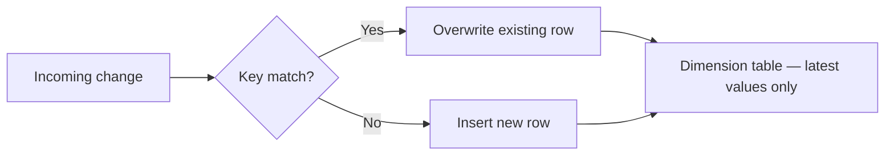

# :material-pencil: SCD Type 1

SCD **Type 1** is the simplest change-handling strategy: when a source record changes,
the existing dimension row is **overwritten in place**. No history is retained.



---

## :material-check-circle-outline: When to Use

!!! success "Good fit"
    - History is irrelevant — only the **current state** matters (e.g. phone number, email)
    - Correcting data quality errors in the source
    - Dimension attributes used purely for filtering/grouping, not for trend analysis
    - Storage or performance constraints make versioning impractical

!!! failure "Not a good fit"
    - You need to answer *"what was the customer's city six months ago?"*
    - Auditing or compliance requires a full change trail
    - Fact rows must be re-attributed to the attribute value at the time of the event

---

## :material-toy-brick: Table Design

```sql
CREATE TABLE IF NOT EXISTS dim_customer (
    customer_id  STRING    NOT NULL,   -- natural / business key
    name         STRING,
    email        STRING,
    city         STRING,
    row_hash     STRING,               -- MD5 of tracked columns — skip writes when unchanged
    updated_at   TIMESTAMP
)
USING DELTA
PARTITIONED BY (city);
```

!!! tip "Why `row_hash`?"
    Computing `md5(concat_ws('||', name, email, city))` once in the staging CTE lets the MERGE
    skip rows that have not changed with a single string comparison — no per-column `!=` chains.

---

## :material-database-import: Seed Data

```sql
INSERT INTO dim_customer (customer_id, name, email, city, row_hash, updated_at)
SELECT
    customer_id,
    name,
    email,
    city,
    md5(concat_ws('||', name, email, city)) AS row_hash,
    current_timestamp()                      AS updated_at
FROM VALUES
    ('cust1', 'Alice', 'alice@example.com', 'NY'),
    ('cust2', 'Bob',   'bob@example.com',   'CA')
AS t(customer_id, name, email, city);
```

---

## :material-tray-arrow-down: Incoming Staging Data

```sql
CREATE OR REPLACE TEMP VIEW staging_customer AS
SELECT *
FROM VALUES
    ('cust1', 'Alice',   'alice@example.com',  'NY'),   -- no change
    ('cust2', 'Bobby',   'bob@newdomain.com',  'CA'),   -- name + email changed
    ('cust3', 'Charlie', 'charlie@example.com','WA')    -- new customer
AS t(customer_id, name, email, city);
```

---

## :material-repeat: SCD Type 1 MERGE

```sql
MERGE INTO dim_customer AS tgt
USING (
    SELECT
        customer_id,
        name,
        email,
        city,
        md5(concat_ws('||', name, email, city)) AS row_hash
    FROM staging_customer
) AS src
ON src.customer_id = tgt.customer_id

-- Only update when something actually changed
WHEN MATCHED AND src.row_hash <> tgt.row_hash THEN
    UPDATE SET
        name       = src.name,
        email      = src.email,
        city       = src.city,
        row_hash   = src.row_hash,
        updated_at = current_timestamp()

WHEN NOT MATCHED THEN
    INSERT (customer_id, name, email, city, row_hash, updated_at)
    VALUES (src.customer_id, src.name, src.email, src.city,
            src.row_hash, current_timestamp());
```

---

## :material-format-list-bulleted-type: Variant Patterns

### Partial update — only selected columns

When only a subset of columns is sensitive to change, hash just those columns
to avoid false positives from irrelevant field updates.

```sql
MERGE INTO dim_customer AS tgt
USING (
    SELECT
        customer_id,
        name,
        email,
        city,
        -- hash only the columns that matter for this dimension
        md5(concat_ws('||', email, city)) AS row_hash
    FROM staging_customer
) AS src
ON src.customer_id = tgt.customer_id

WHEN MATCHED AND src.row_hash <> tgt.row_hash THEN
    UPDATE SET
        email      = src.email,
        city       = src.city,
        row_hash   = src.row_hash,
        updated_at = current_timestamp()

WHEN NOT MATCHED THEN
    INSERT (customer_id, name, email, city, row_hash, updated_at)
    VALUES (src.customer_id, src.name, src.email, src.city,
            src.row_hash, current_timestamp());
```

### Soft-delete — mark removed records as inactive

Source systems that signal deletions via a status flag rather than physical removal:

```sql
MERGE INTO dim_customer AS tgt
USING (
    SELECT
        customer_id,
        name,
        email,
        city,
        is_deleted,
        md5(concat_ws('||', name, email, city)) AS row_hash
    FROM staging_customer
) AS src
ON src.customer_id = tgt.customer_id

WHEN MATCHED AND src.is_deleted = TRUE THEN
    UPDATE SET
        is_active  = FALSE,
        updated_at = current_timestamp()

WHEN MATCHED AND src.row_hash <> tgt.row_hash THEN
    UPDATE SET
        name       = src.name,
        email      = src.email,
        city       = src.city,
        row_hash   = src.row_hash,
        updated_at = current_timestamp()

WHEN NOT MATCHED AND src.is_deleted = FALSE THEN
    INSERT (customer_id, name, email, city, is_active, row_hash, updated_at)
    VALUES (src.customer_id, src.name, src.email, src.city, TRUE,
            src.row_hash, current_timestamp());
```

### Deduplication before merge

When the source can contain duplicate natural keys, reduce to one winner before the MERGE:

```sql
WITH deduped AS (
    SELECT
        *,
        md5(concat_ws('||', name, email, city))         AS row_hash,
        ROW_NUMBER() OVER (
            PARTITION BY customer_id
            ORDER BY updated_at DESC
        )                                                AS rn
    FROM staging_customer
)
MERGE INTO dim_customer AS tgt
USING (SELECT * FROM deduped WHERE rn = 1) AS src
ON src.customer_id = tgt.customer_id

WHEN MATCHED AND src.row_hash <> tgt.row_hash THEN
    UPDATE SET
        name = src.name, email = src.email, city = src.city,
        row_hash = src.row_hash, updated_at = current_timestamp()

WHEN NOT MATCHED THEN
    INSERT (customer_id, name, email, city, row_hash, updated_at)
    VALUES (src.customer_id, src.name, src.email, src.city,
            src.row_hash, current_timestamp());
```

---

## :material-check-circle-outline: Final Output

After the merge, `dim_customer` contains one row per customer with only current values:

| customer_id | name    | email                  | city | updated_at          |
|-------------|---------|------------------------|------|---------------------|
| cust1       | Alice   | alice@example.com      | NY   | 2024-01-01 00:00:00 |
| cust2       | Bobby   | bob@newdomain.com      | CA   | 2024-06-15 09:00:00 |
| cust3       | Charlie | charlie@example.com    | WA   | 2024-06-15 09:00:00 |

`cust1` was unchanged — `updated_at` stays at its original value.

---

## :material-flask-outline: Validation Queries

### Verify final row count

```sql
SELECT COUNT(*) AS total_rows FROM dim_customer;
-- Expected: 3
```

### Confirm `cust2` was updated

```sql
SELECT customer_id, name, email, updated_at
FROM dim_customer
WHERE customer_id = 'cust2';
-- Expected: Bobby | bob@newdomain.com | <merge timestamp>
```

### Confirm `cust1` was NOT touched

```sql
SELECT customer_id, name, updated_at
FROM dim_customer
WHERE customer_id = 'cust1';
-- Expected: Alice | 2024-01-01 (original seed timestamp)
```

### Confirm `cust3` was inserted

```sql
SELECT * FROM dim_customer WHERE customer_id = 'cust3';
-- Expected: 1 row — Charlie | charlie@example.com | WA
```

### Detect duplicate natural keys (run before merge)

```sql
SELECT customer_id, COUNT(*) AS cnt
FROM staging_customer
GROUP BY customer_id
HAVING cnt > 1;
-- Expected: 0 rows — no duplicates
```

### Detect rows with NULL business key (data quality gate)

```sql
SELECT COUNT(*) AS null_keys
FROM staging_customer
WHERE customer_id IS NULL;
-- Expected: 0
```

---

## :material-shield-outline: Common Pitfalls

| Pitfall | Consequence | Solution |
|---------|-------------|---------|
| Updating unchanged rows | Inflated `updated_at`, wasted I/O | Use `row_hash` guard on `WHEN MATCHED` |
| Duplicate keys in staging | MERGE non-determinism, wrong winner | Deduplicate with `ROW_NUMBER()` before MERGE |
| NULL business key in staging | Silent INSERT of a NULL-keyed row | Add a NOT NULL constraint or a pre-merge filter |
| Hash collision (rare) | False negative — changed row not updated | Include a version/timestamp column in the hash |
| Missing columns in INSERT | NULL values silently written | Enumerate all columns explicitly in INSERT clause |
| Partitioned table + full scan | Slow MERGE on large tables | Filter staging to only relevant partition values |

---

## :material-cog-outline: Best Practices

1. **Hash only the tracked columns** — exclude `updated_at` and `row_hash` itself from the hash input.
2. **Deduplicate staging before MERGE** — a `MERGE` with multiple source rows matching one target row raises an error in Delta.
3. **Use `WHEN MATCHED AND hash <> hash THEN UPDATE`** — the conditional guard halves write amplification.
4. **Partition on a low-cardinality column** (`city`, `region`) and `ZORDER BY customer_id` for fast point lookups.
5. **Add `updated_at`** — even though Type 1 keeps no history, a timestamp tells you when the ETL last touched the row.
6. **Run validation assertions** after every merge before signalling success to downstream jobs.

---

## :material-swap-horizontal: SCD Type Comparison

| Scenario | Recommended Type |
|----------|-----------------|
| Only current values, no history | **Type 1** |
| Full history with effective-date ranges | Type 2 |
| Current + one previous value per attribute | Type 3 |
| Current table + separate history table | Type 4 |
| Current table + history table with FK link | Type 5 |
| Current + history + previous value, single table | Type 6 |
