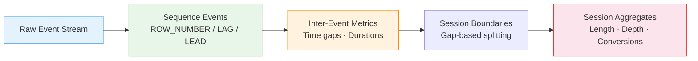

# :material-lightning-bolt: Event Stream Analytics

Process **clickstreams and event logs** — compute next/previous events, time between
events, and detect session boundaries using window functions.

______________________________________________________________________

## :material-sitemap: Processing Flow



______________________________________________________________________

## :material-code-tags: Syntax

### Sample data

```sql
CREATE OR REPLACE TEMP VIEW events AS
SELECT * FROM VALUES
  (1,  'alice', 'page_view',  'Home',     TIMESTAMP '2024-03-01 10:00:00'),
  (2,  'alice', 'page_view',  'Search',   TIMESTAMP '2024-03-01 10:02:30'),
  (3,  'alice', 'click',      'Product',  TIMESTAMP '2024-03-01 10:05:00'),
  (4,  'alice', 'page_view',  'Product',  TIMESTAMP '2024-03-01 10:05:05'),
  (5,  'alice', 'add_cart',   'Product',  TIMESTAMP '2024-03-01 10:08:00'),
  (6,  'alice', 'page_view',  'Cart',     TIMESTAMP '2024-03-01 10:08:10'),
  (7,  'alice', 'purchase',   'Checkout', TIMESTAMP '2024-03-01 10:12:00'),
  (8,  'alice', 'page_view',  'Home',     TIMESTAMP '2024-03-01 14:30:00'),
  (9,  'alice', 'page_view',  'Search',   TIMESTAMP '2024-03-01 14:32:00'),
  (10, 'bob',   'page_view',  'Home',     TIMESTAMP '2024-03-01 11:00:00'),
  (11, 'bob',   'page_view',  'Product',  TIMESTAMP '2024-03-01 11:03:00'),
  (12, 'bob',   'page_view',  'Home',     TIMESTAMP '2024-03-01 11:06:00'),
  (13, 'bob',   'page_view',  'Search',   TIMESTAMP '2024-03-01 15:00:00'),
  (14, 'bob',   'click',      'Ad',       TIMESTAMP '2024-03-01 15:01:00'),
  (15, 'bob',   'page_view',  'Product',  TIMESTAMP '2024-03-01 15:01:30')
AS t(event_id, user_id, event_type, page, event_time);
```

______________________________________________________________________

### Next and previous events (LEAD / LAG)

Compute what happened before and after each event.

```sql
SELECT
    event_id,
    user_id,
    event_type,
    page,
    event_time,
    LAG(event_type) OVER (
        PARTITION BY user_id ORDER BY event_time
    )                                              AS prev_event,
    LAG(page) OVER (
        PARTITION BY user_id ORDER BY event_time
    )                                              AS prev_page,
    LEAD(event_type) OVER (
        PARTITION BY user_id ORDER BY event_time
    )                                              AS next_event,
    LEAD(page) OVER (
        PARTITION BY user_id ORDER BY event_time
    )                                              AS next_page
FROM events
ORDER BY user_id, event_time;
```

______________________________________________________________________

### Time between events

Calculate the gap in seconds between consecutive events per user.

```sql
SELECT
    event_id,
    user_id,
    event_type,
    page,
    event_time,
    LAG(event_time) OVER (
        PARTITION BY user_id ORDER BY event_time
    )                                              AS prev_time,
    ROUND(
        (UNIX_TIMESTAMP(event_time)
         - UNIX_TIMESTAMP(LAG(event_time) OVER (
             PARTITION BY user_id ORDER BY event_time
         ))) / 60.0,
        2
    )                                              AS minutes_since_prev,
    ROUND(
        (UNIX_TIMESTAMP(LEAD(event_time) OVER (
             PARTITION BY user_id ORDER BY event_time
         )) - UNIX_TIMESTAMP(event_time)) / 60.0,
        2
    )                                              AS minutes_to_next
FROM events
ORDER BY user_id, event_time;
-- Result (alice):
-- |event_id|minutes_since_prev|minutes_to_next|
-- |1       |NULL              |2.50           |
-- |2       |2.50              |2.50           |
-- |3       |2.50              |0.08           |
-- |...     |...               |...            |
```

______________________________________________________________________

### Session boundary detection

Split the event stream into sessions using a 30-minute inactivity threshold.

```sql
WITH gaps AS (
    SELECT
        *,
        (UNIX_TIMESTAMP(event_time)
         - UNIX_TIMESTAMP(LAG(event_time) OVER (
             PARTITION BY user_id ORDER BY event_time
         ))) / 60.0                                AS gap_minutes
    FROM events
),
boundaries AS (
    SELECT
        *,
        CASE
            WHEN gap_minutes IS NULL THEN 1
            WHEN gap_minutes > 30   THEN 1
            ELSE 0
        END                                        AS is_new_session
    FROM gaps
)
SELECT
    *,
    SUM(is_new_session) OVER (
        PARTITION BY user_id
        ORDER BY event_time
        ROWS UNBOUNDED PRECEDING
    )                                              AS session_id
FROM boundaries
ORDER BY user_id, event_time;
-- Result:
-- alice events 1-7 → session_id = 1
-- alice events 8-9 → session_id = 2 (4+ hour gap)
-- bob events 10-12 → session_id = 1
-- bob events 13-15 → session_id = 2 (4 hour gap)
```

______________________________________________________________________

### Session-level aggregates

Compute metrics per session after boundary detection.

```sql
WITH sessions AS (
    SELECT
        user_id,
        event_id,
        event_type,
        page,
        event_time,
        SUM(
            CASE
                WHEN (UNIX_TIMESTAMP(event_time)
                      - UNIX_TIMESTAMP(LAG(event_time) OVER (
                          PARTITION BY user_id ORDER BY event_time
                      ))) / 60.0 > 30
                     OR LAG(event_time) OVER (
                          PARTITION BY user_id ORDER BY event_time
                      ) IS NULL
                THEN 1 ELSE 0
            END
        ) OVER (
            PARTITION BY user_id
            ORDER BY event_time
            ROWS UNBOUNDED PRECEDING
        )                                          AS session_num
    FROM events
)
SELECT
    user_id,
    session_num,
    MIN(event_time)                                AS session_start,
    MAX(event_time)                                AS session_end,
    COUNT(*)                                       AS event_count,
    COUNT(DISTINCT page)                           AS unique_pages,
    ROUND(
        (UNIX_TIMESTAMP(MAX(event_time))
         - UNIX_TIMESTAMP(MIN(event_time))) / 60.0,
        2
    )                                              AS duration_minutes,
    MAX(CASE WHEN event_type = 'purchase' THEN 1 ELSE 0 END)
                                                   AS converted
FROM sessions
GROUP BY user_id, session_num
ORDER BY user_id, session_num;
-- Result:
-- +---------+-----------+----------+--------+----------+--------+---------+
-- |user_id  |session_num|event_count|uniq_pg|duration  |converted|
-- +---------+-----------+----------+--------+----------+---------+
-- |alice    |1          |7          |5      |12.00     |1        |
-- |alice    |2          |2          |2      |2.00      |0        |
-- |bob      |1          |3          |2      |6.00      |0        |
-- |bob      |2          |3          |3      |1.50      |0        |
-- +---------+-----------+----------+--------+----------+---------+
```

______________________________________________________________________

### Event sequence patterns

Find specific sequences (e.g., search followed by purchase within same session).

```sql
WITH sequenced AS (
    SELECT
        user_id,
        event_type,
        page,
        event_time,
        LEAD(event_type, 1) OVER w                 AS next_1,
        LEAD(event_type, 2) OVER w                 AS next_2,
        LEAD(event_type, 3) OVER w                 AS next_3
    FROM events
    WINDOW w AS (PARTITION BY user_id ORDER BY event_time)
)
SELECT
    user_id,
    event_time                                     AS sequence_start,
    CONCAT(event_type, ' → ', next_1, ' → ', next_2, ' → ', next_3)
                                                   AS event_sequence
FROM sequenced
WHERE event_type = 'page_view'
  AND page = 'Search'
  AND next_1 IS NOT NULL
ORDER BY user_id, event_time;
```

______________________________________________________________________

## :material-help-circle-outline: Answering Common Event-Stream Questions

Seven questions come up constantly when analyzing an `(event_id, entity_id, event_time, event_type)` stream. Some map directly onto the patterns already shown above; others
need a distinct query shape. All verified against Spark 4.2 using the `events` sample
data.

| Question                                        | Technique                                                                                             |
| ----------------------------------------------- | ----------------------------------------------------------------------------------------------------- |
| What happened immediately before/after event X? | `LAG`/`LEAD` (shown above), then `WHERE event_type = 'X'` — see below                                 |
| What happened within N minutes after event X?   | Range self-join on `event_time`, not `LAG`/`LEAD` — see below                                         |
| Did A occur before B (per entity)?              | `MIN(CASE WHEN type=A ...) < MIN(CASE WHEN type=B ...)` — see below, mind the `NULL` trap             |
| Did A occur but B never happen?                 | `HAVING COUNT(CASE WHEN type=A ...) > 0 AND COUNT(CASE WHEN type=B ...) = 0` — see below              |
| How many A→B→C sequences occurred?              | [Sequence Mining — Specific pattern search](sequence-mining.md#specific-pattern-search-abc)           |
| What is the conversion rate from A to B?        | [Funnel Analysis — Sequential funnel with conversion rates](../customer_analytics/funnel-analysis.md) |
| What is the median time between events?         | `PERCENTILE_APPROX` over `LAG`-derived gaps — see below                                               |

### What happened immediately before a specific event?

Reuse the `LAG`/`LEAD` columns from [Next and previous events](#next-and-previous-events-lead-lag)
and filter to the event type you care about — the window function runs once over the
whole partition regardless of how many rows match the filter:

```sql
WITH seq AS (
    SELECT *,
        LAG(event_type) OVER (PARTITION BY user_id ORDER BY event_time, event_id) AS prev_event,
        LAG(page)       OVER (PARTITION BY user_id ORDER BY event_time, event_id) AS prev_page
    FROM events
)
SELECT user_id, event_time AS purchase_time, prev_event, prev_page
FROM seq
WHERE event_type = 'purchase';
```

| user_id | purchase_time       | prev_event | prev_page |
| ------- | ------------------- | ---------- | --------- |
| alice   | 2024-03-01 10:12:00 | page_view  | Cart      |

### What happened within N minutes after a specific event?

This is **not** a `LEAD` question — `LEAD(event_type, 1)` only reaches the single next
row, but "within 5 minutes" may match zero, one, or several following events. Use a
range self-join on `event_time` instead:

```sql
SELECT
    a.user_id,
    a.event_time                                   AS add_cart_time,
    f.event_type                                    AS followup_event,
    f.event_time                                    AS followup_time,
    ROUND((UNIX_TIMESTAMP(f.event_time) - UNIX_TIMESTAMP(a.event_time)) / 60.0, 2)
                                                    AS minutes_after
FROM events a
JOIN events f
    ON a.user_id = f.user_id
   AND f.event_time > a.event_time
   AND f.event_time <= a.event_time + INTERVAL 5 MINUTES
WHERE a.event_type = 'add_cart'
ORDER BY a.user_id, a.event_time, f.event_time;
```

| user_id | add_cart_time       | followup_event | followup_time       | minutes_after |
| ------- | ------------------- | -------------- | ------------------- | ------------- |
| alice   | 2024-03-01 10:08:00 | page_view      | 2024-03-01 10:08:10 | 0.17          |
| alice   | 2024-03-01 10:08:00 | purchase       | 2024-03-01 10:12:00 | 4.00          |

Verified with `EXPLAIN FORMATTED`: `user_id` becomes the `BroadcastHashJoin` equality
key, and the `event_time` range (`>` / `<=`) is applied as a residual join condition on
top of it — the equality key keeps the join from degrading into a full cross join, so
this scales the same way any other equi-join does, even though the time bound itself
is an inequality.

### Did event A occur before event B (per entity)?

```sql
SELECT
    user_id,
    MIN(CASE WHEN event_type = 'add_cart' THEN event_time END) AS first_add_cart,
    MIN(CASE WHEN event_type = 'purchase' THEN event_time END) AS first_purchase,
    MIN(CASE WHEN event_type = 'add_cart' THEN event_time END)
        < MIN(CASE WHEN event_type = 'purchase' THEN event_time END)
                                                                 AS add_cart_before_purchase
FROM events
GROUP BY user_id;
```

| user_id | first_add_cart      | first_purchase      | add_cart_before_purchase |
| ------- | ------------------- | ------------------- | ------------------------ |
| alice   | 2024-03-01 10:08:00 | 2024-03-01 10:12:00 | true                     |
| bob     | 2024-03-01 11:06:00 | `NULL`              | `NULL`                   |

!!! warning "Verified `NULL` trap: a missing event makes the comparison `NULL`, not `false`"

    Bob never purchased, so `first_purchase` is `NULL` — and `anything < NULL` is
    `NULL` in SQL's three-valued logic, **not** `false`. A naive `WHERE add_cart_before_purchase` filter would silently drop Bob instead of correctly
    excluding him as "didn't do both." If the question is really "did A happen and,
    if B also happened, was it after A," wrap the comparison — e.g.
    `COALESCE(first_add_cart < first_purchase, false)`. If the question is "did A
    happen but B never did," use the dedicated pattern below instead of relying on the
    ordering comparison's `NULL` result.

### Did event A occur but event B never happen?

```sql
SELECT user_id
FROM events
GROUP BY user_id
HAVING COUNT(CASE WHEN event_type = 'add_cart' THEN 1 END) > 0
   AND COUNT(CASE WHEN event_type = 'purchase' THEN 1 END) = 0;
```

| user_id |
| ------- |
| bob     |

Verified: Bob added to cart but never purchased; Alice did both, so she's correctly
excluded. This is the [Conditional Aggregation — Multi-Condition Presence/Absence](../aggregation/conditional-agg.md)
pattern applied to two event types instead of four months — same shape, one table
scan. It's also the reverse of [Funnel Analysis's "reverse funnel"](../customer_analytics/funnel-analysis.md)
example (which finds B-without-A instead of A-without-B).

### What is the median time between events?

```sql
WITH gaps AS (
    SELECT
        user_id,
        (UNIX_TIMESTAMP(event_time) - UNIX_TIMESTAMP(
            LAG(event_time) OVER (PARTITION BY user_id ORDER BY event_time, event_id)
        )) / 60.0                                    AS minutes_since_prev
    FROM events
)
SELECT
    user_id,
    PERCENTILE_APPROX(minutes_since_prev, 0.5)        AS median_minutes_between_events
FROM gaps
WHERE minutes_since_prev IS NOT NULL
GROUP BY user_id;
```

| user_id | median_minutes_between_events |
| ------- | ----------------------------- |
| alice   | 2.5                           |
| bob     | 3.0                           |

`PERCENTILE_APPROX` (not `AVG`) is deliberate — a handful of multi-hour session gaps
would otherwise dominate a mean and misrepresent "typical" time between events; see
the [P95 Latency Analysis](../timeseries/analysis/p95-latency-analysis.md) pattern for
the full P95/P99 latency treatment this generalizes.

______________________________________________________________________

## :material-information-outline: Key Concepts

| Technique             | Function                        | Purpose                       |
| --------------------- | ------------------------------- | ----------------------------- |
| `LAG(col, n)`         | Previous event (n steps back)   | Back-reference in stream      |
| `LEAD(col, n)`        | Next event (n steps forward)    | Forward-reference in stream   |
| `UNIX_TIMESTAMP` diff | Time delta between events       | Inter-event duration          |
| Gap detection + `SUM` | Running total of boundary flags | Session ID assignment         |
| `WINDOW w AS (...)`   | Named window specification      | Reuse across multiple columns |

!!! tip "Inactivity threshold"

    30 minutes is the industry standard (Google Analytics default). Adjust based
    on your product — mobile apps may use 5 minutes, B2B SaaS may use 60 minutes.

!!! note "Event ordering"

    When multiple events share the same timestamp, add a secondary sort key
    (e.g., `event_id`) to ensure deterministic ordering within `LAG`/`LEAD`.

______________________________________________________________________

## :material-lightbulb-outline: When to Use

| Scenario             | Technique                        |
| -------------------- | -------------------------------- |
| Clickstream analysis | LAG/LEAD for navigation flow     |
| Session attribution  | Gap-based session splitting      |
| Funnel drop-off      | Sequence pattern matching        |
| Engagement scoring   | Session duration + depth metrics |
| Bot detection        | Unusually fast inter-event times |
| Real-time alerting   | Detect specific event sequences  |

______________________________________________________________________

## :material-speedometer: Performance Notes

| Tip                                 | Reason                                       |
| ----------------------------------- | -------------------------------------------- |
| Partition by `user_id` (not global) | Avoids full-data sort; enables parallelism   |
| Filter date range before windowing  | Reduces partition sizes dramatically         |
| Use named `WINDOW` clause           | Spark optimises shared window specifications |
| Index on `(user_id, event_time)`    | Speeds up partition + order operations       |
| Pre-filter event types if possible  | Fewer rows in window computations            |

______________________________________________________________________

## :material-database-search: [Databricks] Real-World Example — System Tables

!!! note "[Databricks] Unity Catalog system tables"

    `system.access.audit` is a built-in Unity Catalog system table (no sample data
    setup needed) that records real workspace activity. An account admin must
    `GRANT USE CATALOG, USE SCHEMA, SELECT ON SCHEMA system.access TO <principal>`
    before these queries will return rows.

### 1 — Cluster action funnel per user per day (`system.access.audit`)

```sql
-- [Databricks] Requires SELECT on system.access.audit
WITH cluster_actions AS (
    SELECT
        event_date,
        COALESCE(user_identity.email, 'unknown') AS user_email,
        event_time,
        action_name
    FROM system.access.audit
    WHERE event_date >= DATE_SUB(CURRENT_DATE(), 7)
      AND service_name = 'clusters'
      AND action_name IN ('create', 'edit', 'resize', 'delete')
),
per_user_day AS (
    SELECT
        event_date,
        user_email,
        MIN(CASE WHEN action_name = 'create' THEN event_time END) AS create_time,
        MIN(CASE WHEN action_name IN ('edit', 'resize') THEN event_time END) AS manage_time,
        MIN(CASE WHEN action_name = 'delete' THEN event_time END) AS delete_time
    FROM cluster_actions
    GROUP BY event_date, user_email
)
SELECT
    event_date,
    COUNT(*) FILTER (WHERE create_time IS NOT NULL) AS users_reaching_create,
    COUNT(*) FILTER (
        WHERE create_time IS NOT NULL
          AND manage_time IS NOT NULL
          AND manage_time > create_time
    ) AS users_reaching_manage_after_create,
    COUNT(*) FILTER (
        WHERE create_time IS NOT NULL
          AND manage_time IS NOT NULL
          AND delete_time IS NOT NULL
          AND manage_time > create_time
          AND delete_time > manage_time
    ) AS users_reaching_delete_after_manage
FROM per_user_day
GROUP BY event_date
ORDER BY event_date;
-- Result (illustrative):
-- event_date | users_reaching_create | users_reaching_manage_after_create | users_reaching_delete_after_manage
-- -----------|-----------------------|------------------------------------|-----------------------------------
-- 2024-07-01 | 18                    | 12                                 | 5
-- 2024-07-02 | 22                    | 16                                 | 7
```

!!! tip

    The same `MIN(CASE WHEN ...)` funnel shape works on production audit data just
    as well as on synthetic clickstreams. Swap `service_name`, `action_name`, or
    the grouping grain (`user`, `workspace`, `day`) to measure real operational
    drop-off inside Unity Catalog system tables.

______________________________________________________________________

## :material-arrow-right: Related

- [Gaps & Islands](../sequence/gaps-islands.md) — generalised consecutive sequence detection
- [Sessionization](../sequence/sessionization.md) — session boundary patterns
- [Path Analysis](../customer_analytics/path-analysis.md) — user navigation tracking
- [Time Series: Session Windows](../timeseries/windowing/session-window.md) — session-based temporal aggregation
- [Sequence Mining](sequence-mining.md) — counting/matching A→B→C occurrence patterns
- [Funnel Analysis](../customer_analytics/funnel-analysis.md) — conversion rates and time-bounded step transitions
- [Conditional Aggregation](../aggregation/conditional-agg.md) — the "A but never B" presence/absence shape generalized
- [P95 Latency Analysis](../timeseries/analysis/p95-latency-analysis.md) — percentile-based inter-event timing
