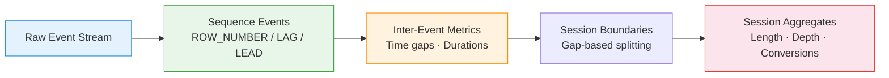

# :material-lightning-bolt: Event Stream Analytics

Process **clickstreams and event logs** — compute next/previous events, time between
events, and detect session boundaries using window functions.

---

## :material-sitemap: Processing Flow



---

## :material-code-tags: Syntax

### Sample data

```sql
CREATE OR REPLACE TEMP VIEW events AS
SELECT * FROM VALUES
  (1,  'alice', 'page_view',  'Home',     TIMESTAMP '2024-03-01 10:00:00'),
  (2,  'alice', 'page_view',  'Search',   TIMESTAMP '2024-03-01 10:02:30'),
  (3,  'alice', 'click',      'Product',  TIMESTAMP '2024-03-01 10:05:00'),
  (4,  'alice', 'page_view',  'Product',  TIMESTAMP '2024-03-01 10:05:05'),
  (5,  'alice', 'add_cart',   'Product',  TIMESTAMP '2024-03-01 10:08:00'),
  (6,  'alice', 'page_view',  'Cart',     TIMESTAMP '2024-03-01 10:08:10'),
  (7,  'alice', 'purchase',   'Checkout', TIMESTAMP '2024-03-01 10:12:00'),
  (8,  'alice', 'page_view',  'Home',     TIMESTAMP '2024-03-01 14:30:00'),
  (9,  'alice', 'page_view',  'Search',   TIMESTAMP '2024-03-01 14:32:00'),
  (10, 'bob',   'page_view',  'Home',     TIMESTAMP '2024-03-01 11:00:00'),
  (11, 'bob',   'page_view',  'Product',  TIMESTAMP '2024-03-01 11:03:00'),
  (12, 'bob',   'page_view',  'Home',     TIMESTAMP '2024-03-01 11:06:00'),
  (13, 'bob',   'page_view',  'Search',   TIMESTAMP '2024-03-01 15:00:00'),
  (14, 'bob',   'click',      'Ad',       TIMESTAMP '2024-03-01 15:01:00'),
  (15, 'bob',   'page_view',  'Product',  TIMESTAMP '2024-03-01 15:01:30')
AS t(event_id, user_id, event_type, page, event_time);
```

---

### Next and previous events (LEAD / LAG)

Compute what happened before and after each event.

```sql
SELECT
    event_id,
    user_id,
    event_type,
    page,
    event_time,
    LAG(event_type) OVER (
        PARTITION BY user_id ORDER BY event_time
    )                                              AS prev_event,
    LAG(page) OVER (
        PARTITION BY user_id ORDER BY event_time
    )                                              AS prev_page,
    LEAD(event_type) OVER (
        PARTITION BY user_id ORDER BY event_time
    )                                              AS next_event,
    LEAD(page) OVER (
        PARTITION BY user_id ORDER BY event_time
    )                                              AS next_page
FROM events
ORDER BY user_id, event_time;
```

---

### Time between events

Calculate the gap in seconds between consecutive events per user.

```sql
SELECT
    event_id,
    user_id,
    event_type,
    page,
    event_time,
    LAG(event_time) OVER (
        PARTITION BY user_id ORDER BY event_time
    )                                              AS prev_time,
    ROUND(
        (UNIX_TIMESTAMP(event_time)
         - UNIX_TIMESTAMP(LAG(event_time) OVER (
             PARTITION BY user_id ORDER BY event_time
         ))) / 60.0,
        2
    )                                              AS minutes_since_prev,
    ROUND(
        (UNIX_TIMESTAMP(LEAD(event_time) OVER (
             PARTITION BY user_id ORDER BY event_time
         )) - UNIX_TIMESTAMP(event_time)) / 60.0,
        2
    )                                              AS minutes_to_next
FROM events
ORDER BY user_id, event_time;
-- Result (alice):
-- |event_id|minutes_since_prev|minutes_to_next|
-- |1       |NULL              |2.50           |
-- |2       |2.50              |2.50           |
-- |3       |2.50              |0.08           |
-- |...     |...               |...            |
```

---

### Session boundary detection

Split the event stream into sessions using a 30-minute inactivity threshold.

```sql
WITH gaps AS (
    SELECT
        *,
        (UNIX_TIMESTAMP(event_time)
         - UNIX_TIMESTAMP(LAG(event_time) OVER (
             PARTITION BY user_id ORDER BY event_time
         ))) / 60.0                                AS gap_minutes
    FROM events
),
boundaries AS (
    SELECT
        *,
        CASE
            WHEN gap_minutes IS NULL THEN 1
            WHEN gap_minutes > 30   THEN 1
            ELSE 0
        END                                        AS is_new_session
    FROM gaps
)
SELECT
    *,
    SUM(is_new_session) OVER (
        PARTITION BY user_id
        ORDER BY event_time
        ROWS UNBOUNDED PRECEDING
    )                                              AS session_id
FROM boundaries
ORDER BY user_id, event_time;
-- Result:
-- alice events 1-7 → session_id = 1
-- alice events 8-9 → session_id = 2 (4+ hour gap)
-- bob events 10-12 → session_id = 1
-- bob events 13-15 → session_id = 2 (4 hour gap)
```

---

### Session-level aggregates

Compute metrics per session after boundary detection.

```sql
WITH sessions AS (
    SELECT
        user_id,
        event_id,
        event_type,
        page,
        event_time,
        SUM(
            CASE
                WHEN (UNIX_TIMESTAMP(event_time)
                      - UNIX_TIMESTAMP(LAG(event_time) OVER (
                          PARTITION BY user_id ORDER BY event_time
                      ))) / 60.0 > 30
                     OR LAG(event_time) OVER (
                          PARTITION BY user_id ORDER BY event_time
                      ) IS NULL
                THEN 1 ELSE 0
            END
        ) OVER (
            PARTITION BY user_id
            ORDER BY event_time
            ROWS UNBOUNDED PRECEDING
        )                                          AS session_num
    FROM events
)
SELECT
    user_id,
    session_num,
    MIN(event_time)                                AS session_start,
    MAX(event_time)                                AS session_end,
    COUNT(*)                                       AS event_count,
    COUNT(DISTINCT page)                           AS unique_pages,
    ROUND(
        (UNIX_TIMESTAMP(MAX(event_time))
         - UNIX_TIMESTAMP(MIN(event_time))) / 60.0,
        2
    )                                              AS duration_minutes,
    MAX(CASE WHEN event_type = 'purchase' THEN 1 ELSE 0 END)
                                                   AS converted
FROM sessions
GROUP BY user_id, session_num
ORDER BY user_id, session_num;
-- Result:
-- +---------+-----------+----------+--------+----------+--------+---------+
-- |user_id  |session_num|event_count|uniq_pg|duration  |converted|
-- +---------+-----------+----------+--------+----------+---------+
-- |alice    |1          |7          |5      |12.00     |1        |
-- |alice    |2          |2          |2      |2.00      |0        |
-- |bob      |1          |3          |2      |6.00      |0        |
-- |bob      |2          |3          |3      |1.50      |0        |
-- +---------+-----------+----------+--------+----------+---------+
```

---

### Event sequence patterns

Find specific sequences (e.g., search followed by purchase within same session).

```sql
WITH sequenced AS (
    SELECT
        user_id,
        event_type,
        page,
        event_time,
        LEAD(event_type, 1) OVER w                 AS next_1,
        LEAD(event_type, 2) OVER w                 AS next_2,
        LEAD(event_type, 3) OVER w                 AS next_3
    FROM events
    WINDOW w AS (PARTITION BY user_id ORDER BY event_time)
)
SELECT
    user_id,
    event_time                                     AS sequence_start,
    CONCAT(event_type, ' → ', next_1, ' → ', next_2, ' → ', next_3)
                                                   AS event_sequence
FROM sequenced
WHERE event_type = 'page_view'
  AND page = 'Search'
  AND next_1 IS NOT NULL
ORDER BY user_id, event_time;
```

---

## :material-information-outline: Key Concepts

| Technique | Function | Purpose |
|-----------|----------|---------|
| `LAG(col, n)` | Previous event (n steps back) | Back-reference in stream |
| `LEAD(col, n)` | Next event (n steps forward) | Forward-reference in stream |
| `UNIX_TIMESTAMP` diff | Time delta between events | Inter-event duration |
| Gap detection + `SUM` | Running total of boundary flags | Session ID assignment |
| `WINDOW w AS (...)` | Named window specification | Reuse across multiple columns |

!!! tip "Inactivity threshold"
    30 minutes is the industry standard (Google Analytics default). Adjust based
    on your product — mobile apps may use 5 minutes, B2B SaaS may use 60 minutes.

!!! note "Event ordering"
    When multiple events share the same timestamp, add a secondary sort key
    (e.g., `event_id`) to ensure deterministic ordering within `LAG`/`LEAD`.

---

## :material-lightbulb-outline: When to Use

| Scenario | Technique |
|----------|-----------|
| Clickstream analysis | LAG/LEAD for navigation flow |
| Session attribution | Gap-based session splitting |
| Funnel drop-off | Sequence pattern matching |
| Engagement scoring | Session duration + depth metrics |
| Bot detection | Unusually fast inter-event times |
| Real-time alerting | Detect specific event sequences |

---

## :material-speedometer: Performance Notes

| Tip | Reason |
|-----|--------|
| Partition by `user_id` (not global) | Avoids full-data sort; enables parallelism |
| Filter date range before windowing | Reduces partition sizes dramatically |
| Use named `WINDOW` clause | Spark optimises shared window specifications |
| Index on `(user_id, event_time)` | Speeds up partition + order operations |
| Pre-filter event types if possible | Fewer rows in window computations |

---

## :material-arrow-right: Related

- [Gaps & Islands](../sequence/gaps_islands.md) — generalised consecutive sequence detection
- [Sessionization](../sequence/sessionization.md) — session boundary patterns
- [Path Analysis](../customer_analytics/path_analysis.md) — user navigation tracking
- [Time Series: Session Windows](../timeseries/windowing/session_window.md) — session-based temporal aggregation
