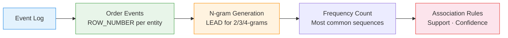

# :material-format-list-numbered: Sequence Mining

Detect **ordered event patterns** in logs and streams — find A→B→C sequences,
state transitions, and recurring patterns relevant to process mining and warehouse analysis.

---

## :material-sitemap: Mining Flow



---

## :material-code-tags: Syntax

### Sample data

```sql
CREATE OR REPLACE TEMP VIEW process_events AS
SELECT * FROM VALUES
  (1, 'wh_1', 'CREATED',  TIMESTAMP '2024-03-01 08:00:00'),
  (2, 'wh_1', 'STARTING', TIMESTAMP '2024-03-01 08:01:00'),
  (3, 'wh_1', 'RUNNING',  TIMESTAMP '2024-03-01 08:02:00'),
  (4, 'wh_1', 'STOPPING', TIMESTAMP '2024-03-01 09:00:00'),
  (5, 'wh_1', 'STOPPED',  TIMESTAMP '2024-03-01 09:01:00'),
  (6, 'wh_1', 'STARTING', TIMESTAMP '2024-03-01 10:00:00'),
  (7, 'wh_1', 'RUNNING',  TIMESTAMP '2024-03-01 10:01:00'),
  (8, 'wh_1', 'STOPPING', TIMESTAMP '2024-03-01 12:00:00'),
  (9, 'wh_1', 'STOPPED',  TIMESTAMP '2024-03-01 12:01:00'),
  (10,'wh_2', 'CREATED',  TIMESTAMP '2024-03-01 07:00:00'),
  (11,'wh_2', 'STARTING', TIMESTAMP '2024-03-01 07:01:00'),
  (12,'wh_2', 'RUNNING',  TIMESTAMP '2024-03-01 07:02:00'),
  (13,'wh_2', 'RUNNING',  TIMESTAMP '2024-03-01 08:00:00'),
  (14,'wh_2', 'STOPPING', TIMESTAMP '2024-03-01 11:00:00'),
  (15,'wh_2', 'STOPPED',  TIMESTAMP '2024-03-01 11:01:00')
AS t(event_id, entity_id, state, event_time);
```

---

### 2-gram and 3-gram sequence extraction

```sql
SELECT
    entity_id,
    state                                          AS state_1,
    LEAD(state, 1) OVER w                          AS state_2,
    LEAD(state, 2) OVER w                          AS state_3,
    CONCAT(state, ' → ', LEAD(state, 1) OVER w)   AS bigram,
    CONCAT(state, ' → ', LEAD(state, 1) OVER w,
           ' → ', LEAD(state, 2) OVER w)           AS trigram
FROM process_events
WINDOW w AS (PARTITION BY entity_id ORDER BY event_time)
ORDER BY entity_id, event_time;
```

---

### Most frequent sequences

```sql
WITH bigrams AS (
    SELECT
        CONCAT(state, ' → ', LEAD(state, 1) OVER (
            PARTITION BY entity_id ORDER BY event_time
        ))                                         AS sequence
    FROM process_events
)
SELECT
    sequence,
    COUNT(*)                                       AS frequency
FROM bigrams
WHERE sequence NOT LIKE '%null%'
GROUP BY sequence
ORDER BY frequency DESC;
-- Result:
-- |sequence            |frequency|
-- |STARTING → RUNNING |3        |
-- |RUNNING → STOPPING |3        |
-- |STOPPING → STOPPED |3        |
-- |CREATED → STARTING |2        |
-- |STOPPED → STARTING |1        |
```

---

### Specific pattern search (A→B→C)

Find occurrences of a known target pattern.

```sql
WITH sequenced AS (
    SELECT
        entity_id,
        event_time,
        state,
        LEAD(state, 1) OVER w AS next_1,
        LEAD(state, 2) OVER w AS next_2,
        LEAD(event_time, 2) OVER w AS end_time
    FROM process_events
    WINDOW w AS (PARTITION BY entity_id ORDER BY event_time)
)
SELECT
    entity_id,
    event_time                                     AS pattern_start,
    end_time                                       AS pattern_end,
    CONCAT(state, ' → ', next_1, ' → ', next_2)   AS matched_pattern
FROM sequenced
WHERE state = 'STOPPING'
  AND next_1 = 'STOPPED'
  AND next_2 = 'STARTING';
-- Finds restart sequences: STOPPING → STOPPED → STARTING
```

---

### Sequence support and confidence

```sql
WITH transitions AS (
    SELECT
        state                                      AS from_state,
        LEAD(state, 1) OVER (
            PARTITION BY entity_id ORDER BY event_time
        )                                          AS to_state
    FROM process_events
),
counts AS (
    SELECT
        from_state,
        to_state,
        COUNT(*)                                   AS pair_count
    FROM transitions
    WHERE to_state IS NOT NULL
    GROUP BY from_state, to_state
),
from_totals AS (
    SELECT from_state, SUM(pair_count) AS total
    FROM counts GROUP BY from_state
)
SELECT
    c.from_state,
    c.to_state,
    c.pair_count,
    ROUND(c.pair_count * 1.0 / (SELECT SUM(pair_count) FROM counts), 3)
                                                   AS support,
    ROUND(c.pair_count * 1.0 / ft.total, 3)        AS confidence
FROM counts c
JOIN from_totals ft ON c.from_state = ft.from_state
ORDER BY confidence DESC;
```

---

## :material-information-outline: Key Concepts

| Concept | Technique | Purpose |
|---------|-----------|---------|
| **N-gram** | `LEAD(col, 1..n)` | Extract fixed-length subsequences |
| **Frequency** | `GROUP BY sequence, COUNT(*)` | Find common patterns |
| **Support** | `pair_count / total_transitions` | How often the pattern occurs |
| **Confidence** | `pair_count / from_state_count` | Probability of B given A |
| **Pattern match** | `WHERE state = X AND next = Y` | Search for specific sequences |

!!! tip "Databricks warehouse events"
    Warehouse lifecycle events (CREATED→STARTING→RUNNING→STOPPING→STOPPED) are
    ideal for sequence mining. Detect abnormal patterns like repeated restarts
    or missing STOPPING states.

---

## :material-lightbulb-outline: When to Use

| Scenario | Application |
|----------|-------------|
| Process mining | Discover actual execution paths |
| Warehouse monitoring | Detect restart loops, stuck states |
| User journey analysis | Common navigation sequences |
| Log analysis | Error pattern detection (WARNING→ERROR→FATAL) |
| Manufacturing QA | Detect skipped assembly steps |

---

## :material-arrow-right: Related

- [State Machine Analysis](state_machine.md) — validate transitions against expected rules
- [Event Stream Analytics](event_stream_analytics.md) — clickstream processing
- [Gaps & Islands](gaps_islands.md) — consecutive sequence detection
- [Path Analysis](../customer_analytics/path_analysis.md) — user navigation paths
