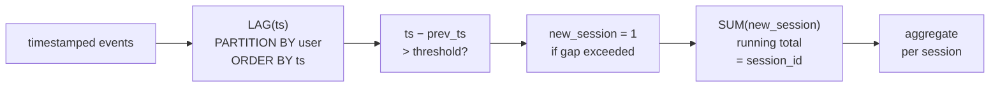

# :material-timer-outline: Sessionization

Group a stream of timestamped events into logical sessions by detecting inactivity gaps — essential for web analytics, user journey analysis, and clickstream processing.

---

## :material-sitemap: Execution Flow



---

## :material-pin: Syntax

### Core sessionization pattern

```sql
WITH lagged AS (
    SELECT
        *,
        LAG(event_time) OVER (
            PARTITION BY user_id
            ORDER BY event_time
        ) AS prev_time
    FROM events
),
flagged AS (
    SELECT
        *,
        CASE
            WHEN prev_time IS NULL THEN 1
            WHEN BIGINT(event_time) - BIGINT(prev_time) > threshold_seconds THEN 1
            ELSE 0
        END AS new_session
    FROM lagged
),
sessioned AS (
    SELECT
        *,
        SUM(new_session) OVER (
            PARTITION BY user_id
            ORDER BY event_time
            ROWS BETWEEN UNBOUNDED PRECEDING AND CURRENT ROW
        ) AS session_id
    FROM flagged
)
SELECT * FROM sessioned;
```

| Step | Purpose |
|------|---------|
| `LAG(event_time)` | Look at the previous event timestamp for the same user |
| Gap detection | Compare current − previous; if gap exceeds threshold, start a new session |
| `SUM(new_session)` running total | Assigns a monotonically increasing session number per user |

!!! note "Threshold choice"
    The inactivity gap threshold depends on the domain. Web analytics typically uses 30 minutes (1800 seconds). Mobile apps may use 5–15 minutes. Server log analysis often uses 60 minutes.

---

## :material-magnify: Behavior

1. **First event always starts a session** — when `LAG` returns `NULL` (no previous event), the flag is set to `1`.
2. **Partition isolation** — sessions are computed per user; cross-user events do not affect session boundaries.
3. **Time precision** — gap comparison works on seconds, milliseconds, or any numeric representation of time; just match the threshold unit.
4. **No global session IDs** — the running-total approach produces session numbers that are unique within each user partition but not globally. Concatenate `user_id` + `session_id` for a globally unique key.

---

## :material-database: Sample Data

### Dataset 1: Website clickstream

```sql
CREATE OR REPLACE TEMP VIEW clickstream AS
SELECT * FROM VALUES
    ('user_1', TIMESTAMP '2024-04-10 09:00:00', '/home',          'page_view'),
    ('user_1', TIMESTAMP '2024-04-10 09:02:30', '/products',      'page_view'),
    ('user_1', TIMESTAMP '2024-04-10 09:05:00', '/products/shoes', 'page_view'),
    ('user_1', TIMESTAMP '2024-04-10 09:06:15', '/cart',          'add_to_cart'),
    ('user_1', TIMESTAMP '2024-04-10 09:08:00', '/checkout',      'page_view'),
    ('user_1', TIMESTAMP '2024-04-10 09:09:30', '/checkout',      'purchase'),
    ('user_1', TIMESTAMP '2024-04-10 14:20:00', '/home',          'page_view'),
    ('user_1', TIMESTAMP '2024-04-10 14:22:00', '/deals',         'page_view'),
    ('user_1', TIMESTAMP '2024-04-10 14:25:00', '/deals/summer',  'page_view'),
    ('user_2', TIMESTAMP '2024-04-10 10:00:00', '/home',          'page_view'),
    ('user_2', TIMESTAMP '2024-04-10 10:03:00', '/blog',          'page_view'),
    ('user_2', TIMESTAMP '2024-04-10 10:45:00', '/products',      'page_view'),
    ('user_2', TIMESTAMP '2024-04-10 10:47:00', '/products/bags',  'page_view'),
    ('user_2', TIMESTAMP '2024-04-10 10:48:30', '/cart',          'add_to_cart'),
    ('user_3', TIMESTAMP '2024-04-10 11:00:00', '/home',          'page_view'),
    ('user_3', TIMESTAMP '2024-04-10 11:01:00', '/about',         'page_view'),
    ('user_3', TIMESTAMP '2024-04-10 11:55:00', '/home',          'page_view'),
    ('user_3', TIMESTAMP '2024-04-10 11:57:00', '/pricing',       'page_view'),
    ('user_3', TIMESTAMP '2024-04-10 11:58:30', '/signup',        'signup')
AS t(user_id, event_time, page, event_type);
```

### Dataset 2: Server API call logs

```sql
CREATE OR REPLACE TEMP VIEW api_logs AS
SELECT * FROM VALUES
    ('svc-auth',  TIMESTAMP '2024-05-01 08:00:10', '/login',        200, 120),
    ('svc-auth',  TIMESTAMP '2024-05-01 08:00:15', '/token/refresh', 200,  45),
    ('svc-auth',  TIMESTAMP '2024-05-01 08:00:18', '/validate',     200,  30),
    ('svc-auth',  TIMESTAMP '2024-05-01 08:15:00', '/login',        200, 110),
    ('svc-auth',  TIMESTAMP '2024-05-01 08:15:05', '/token/refresh', 200,  50),
    ('svc-auth',  TIMESTAMP '2024-05-01 08:30:00', '/login',        500, 980),
    ('svc-auth',  TIMESTAMP '2024-05-01 08:30:02', '/login',        500, 1200),
    ('svc-auth',  TIMESTAMP '2024-05-01 08:30:05', '/login',        200, 150),
    ('svc-order', TIMESTAMP '2024-05-01 09:00:00', '/create',       201, 200),
    ('svc-order', TIMESTAMP '2024-05-01 09:00:03', '/validate',     200,  80),
    ('svc-order', TIMESTAMP '2024-05-01 09:00:08', '/payment',      200, 350),
    ('svc-order', TIMESTAMP '2024-05-01 09:00:12', '/confirm',      200, 120),
    ('svc-order', TIMESTAMP '2024-05-01 10:30:00', '/create',       201, 180),
    ('svc-order', TIMESTAMP '2024-05-01 10:30:05', '/validate',     200,  90),
    ('svc-order', TIMESTAMP '2024-05-01 10:30:10', '/payment',      502, 5000),
    ('svc-order', TIMESTAMP '2024-05-01 10:30:15', '/payment',      200, 400)
AS t(service, event_time, endpoint, status_code, latency_ms);
```

### Dataset 3: Mobile app engagement

```sql
CREATE OR REPLACE TEMP VIEW app_events AS
SELECT * FROM VALUES
    ('device_A', TIMESTAMP '2024-06-15 07:30:00', 'app_open',      'feed'),
    ('device_A', TIMESTAMP '2024-06-15 07:31:00', 'scroll',        'feed'),
    ('device_A', TIMESTAMP '2024-06-15 07:32:30', 'tap_post',      'feed'),
    ('device_A', TIMESTAMP '2024-06-15 07:33:00', 'view_detail',   'post'),
    ('device_A', TIMESTAMP '2024-06-15 07:34:00', 'like',          'post'),
    ('device_A', TIMESTAMP '2024-06-15 07:35:00', 'back',          'feed'),
    ('device_A', TIMESTAMP '2024-06-15 07:36:00', 'app_background','system'),
    ('device_A', TIMESTAMP '2024-06-15 08:10:00', 'app_open',      'feed'),
    ('device_A', TIMESTAMP '2024-06-15 08:11:00', 'scroll',        'feed'),
    ('device_A', TIMESTAMP '2024-06-15 08:12:00', 'tap_story',     'stories'),
    ('device_A', TIMESTAMP '2024-06-15 08:13:30', 'view_story',    'stories'),
    ('device_A', TIMESTAMP '2024-06-15 12:00:00', 'app_open',      'feed'),
    ('device_A', TIMESTAMP '2024-06-15 12:01:00', 'scroll',        'feed'),
    ('device_A', TIMESTAMP '2024-06-15 12:02:00', 'tap_post',      'feed'),
    ('device_B', TIMESTAMP '2024-06-15 09:00:00', 'app_open',      'feed'),
    ('device_B', TIMESTAMP '2024-06-15 09:05:00', 'scroll',        'feed'),
    ('device_B', TIMESTAMP '2024-06-15 09:06:00', 'tap_post',      'feed'),
    ('device_B', TIMESTAMP '2024-06-15 09:20:00', 'app_open',      'feed'),
    ('device_B', TIMESTAMP '2024-06-15 09:21:00', 'scroll',        'feed')
AS t(device_id, event_time, event_name, screen);
```

---

## :material-flask-outline: Practical Examples

### 1 — Basic clickstream sessionization (30-minute gap)

```sql
WITH lagged AS (
    SELECT
        user_id,
        event_time,
        page,
        event_type,
        LAG(event_time) OVER (
            PARTITION BY user_id ORDER BY event_time
        ) AS prev_time
    FROM clickstream
),
flagged AS (
    SELECT
        *,
        CASE
            WHEN prev_time IS NULL THEN 1
            WHEN BIGINT(event_time) - BIGINT(prev_time) > 1800 THEN 1
            ELSE 0
        END AS new_session
    FROM lagged
),
sessioned AS (
    SELECT
        *,
        SUM(new_session) OVER (
            PARTITION BY user_id
            ORDER BY event_time
            ROWS BETWEEN UNBOUNDED PRECEDING AND CURRENT ROW
        ) AS session_num
    FROM flagged
)
SELECT user_id, session_num, event_time, page, event_type
FROM sessioned
ORDER BY user_id, event_time;
```

??? success "Expected output"

    | user_id | session_num | event_time | page | event_type |
    |---------|-------------|------------|------|------------|
    | user_1 | 1 | 2024-04-10 09:00:00 | /home | page_view |
    | user_1 | 1 | 2024-04-10 09:02:30 | /products | page_view |
    | user_1 | 1 | 2024-04-10 09:05:00 | /products/shoes | page_view |
    | user_1 | 1 | 2024-04-10 09:06:15 | /cart | add_to_cart |
    | user_1 | 1 | 2024-04-10 09:08:00 | /checkout | page_view |
    | user_1 | 1 | 2024-04-10 09:09:30 | /checkout | purchase |
    | user_1 | 2 | 2024-04-10 14:20:00 | /home | page_view |
    | user_1 | 2 | 2024-04-10 14:22:00 | /deals | page_view |
    | user_1 | 2 | 2024-04-10 14:25:00 | /deals/summer | page_view |
    | user_2 | 1 | 2024-04-10 10:00:00 | /home | page_view |
    | user_2 | 1 | 2024-04-10 10:03:00 | /blog | page_view |
    | user_2 | 2 | 2024-04-10 10:45:00 | /products | page_view |
    | user_2 | 2 | 2024-04-10 10:47:00 | /products/bags | page_view |
    | user_2 | 2 | 2024-04-10 10:48:30 | /cart | add_to_cart |
    | user_3 | 1 | 2024-04-10 11:00:00 | /home | page_view |
    | user_3 | 1 | 2024-04-10 11:01:00 | /about | page_view |
    | user_3 | 2 | 2024-04-10 11:55:00 | /home | page_view |
    | user_3 | 2 | 2024-04-10 11:57:00 | /pricing | page_view |
    | user_3 | 2 | 2024-04-10 11:58:30 | /signup | signup |

!!! note "user_2 session split"
    user_2's gap between 10:03 and 10:45 is 42 minutes, which exceeds the 30-minute threshold, so the second event group becomes session 2.

### 2 — Session-level aggregation (duration, depth, conversion)

```sql
WITH lagged AS (
    SELECT *, LAG(event_time) OVER (PARTITION BY user_id ORDER BY event_time) AS prev_time
    FROM clickstream
),
flagged AS (
    SELECT *,
        CASE WHEN prev_time IS NULL OR BIGINT(event_time) - BIGINT(prev_time) > 1800 THEN 1 ELSE 0 END AS new_session
    FROM lagged
),
sessioned AS (
    SELECT *,
        SUM(new_session) OVER (PARTITION BY user_id ORDER BY event_time ROWS BETWEEN UNBOUNDED PRECEDING AND CURRENT ROW) AS session_num
    FROM flagged
)
SELECT
    user_id,
    session_num,
    MIN(event_time) AS session_start,
    MAX(event_time) AS session_end,
    ROUND((BIGINT(MAX(event_time)) - BIGINT(MIN(event_time))) / 60.0, 1) AS duration_min,
    COUNT(*) AS event_count,
    COUNT(DISTINCT page) AS pages_viewed,
    MAX(CASE WHEN event_type = 'purchase' THEN 1 ELSE 0 END) AS converted,
    FIRST(page) AS entry_page,
    LAST(page) AS exit_page
FROM sessioned
GROUP BY user_id, session_num
ORDER BY user_id, session_num;
```

??? success "Expected output"

    | user_id | session_num | session_start | session_end | duration_min | event_count | pages_viewed | converted | entry_page | exit_page |
    |---------|-------------|---------------|-------------|--------------|-------------|--------------|-----------|------------|-----------|
    | user_1 | 1 | 2024-04-10 09:00:00 | 2024-04-10 09:09:30 | 9.5 | 6 | 4 | 1 | /home | /checkout |
    | user_1 | 2 | 2024-04-10 14:20:00 | 2024-04-10 14:25:00 | 5.0 | 3 | 3 | 0 | /home | /deals/summer |
    | user_2 | 1 | 2024-04-10 10:00:00 | 2024-04-10 10:03:00 | 3.0 | 2 | 2 | 0 | /home | /blog |
    | user_2 | 2 | 2024-04-10 10:45:00 | 2024-04-10 10:48:30 | 3.5 | 3 | 3 | 0 | /products | /cart |
    | user_3 | 1 | 2024-04-10 11:00:00 | 2024-04-10 11:01:00 | 1.0 | 2 | 2 | 0 | /home | /about |
    | user_3 | 2 | 2024-04-10 11:55:00 | 2024-04-10 11:58:30 | 3.5 | 3 | 3 | 0 | /home | /signup |

### 3 — Session funnel analysis

Track which sessions reached each stage of the conversion funnel:

```sql
WITH lagged AS (
    SELECT *, LAG(event_time) OVER (PARTITION BY user_id ORDER BY event_time) AS prev_time
    FROM clickstream
),
flagged AS (
    SELECT *,
        CASE WHEN prev_time IS NULL OR BIGINT(event_time) - BIGINT(prev_time) > 1800 THEN 1 ELSE 0 END AS new_session
    FROM lagged
),
sessioned AS (
    SELECT *,
        SUM(new_session) OVER (PARTITION BY user_id ORDER BY event_time ROWS BETWEEN UNBOUNDED PRECEDING AND CURRENT ROW) AS session_num
    FROM flagged
),
funnel AS (
    SELECT
        user_id,
        session_num,
        MAX(CASE WHEN page = '/home' THEN 1 ELSE 0 END)     AS hit_home,
        MAX(CASE WHEN page LIKE '/products%' THEN 1 ELSE 0 END) AS hit_products,
        MAX(CASE WHEN event_type = 'add_to_cart' THEN 1 ELSE 0 END) AS hit_cart,
        MAX(CASE WHEN page = '/checkout' THEN 1 ELSE 0 END) AS hit_checkout,
        MAX(CASE WHEN event_type = 'purchase' THEN 1 ELSE 0 END) AS purchased
    FROM sessioned
    GROUP BY user_id, session_num
)
SELECT
    COUNT(*) AS total_sessions,
    SUM(hit_home) AS reached_home,
    SUM(hit_products) AS reached_products,
    SUM(hit_cart) AS reached_cart,
    SUM(hit_checkout) AS reached_checkout,
    SUM(purchased) AS completed_purchase
FROM funnel;
```

??? success "Expected output"

    | total_sessions | reached_home | reached_products | reached_cart | reached_checkout | completed_purchase |
    |----------------|--------------|------------------|--------------|------------------|--------------------|
    | 6 | 6 | 3 | 2 | 1 | 1 |

### 4 — API burst detection (5-minute gap)

Group API calls into bursts to detect related request clusters:

```sql
WITH lagged AS (
    SELECT *, LAG(event_time) OVER (PARTITION BY service ORDER BY event_time) AS prev_time
    FROM api_logs
),
flagged AS (
    SELECT *,
        CASE WHEN prev_time IS NULL OR BIGINT(event_time) - BIGINT(prev_time) > 300 THEN 1 ELSE 0 END AS new_burst
    FROM lagged
),
sessioned AS (
    SELECT *,
        SUM(new_burst) OVER (PARTITION BY service ORDER BY event_time ROWS BETWEEN UNBOUNDED PRECEDING AND CURRENT ROW) AS burst_num
    FROM flagged
)
SELECT
    service,
    burst_num,
    MIN(event_time) AS burst_start,
    MAX(event_time) AS burst_end,
    COUNT(*) AS call_count,
    SUM(CASE WHEN status_code >= 500 THEN 1 ELSE 0 END) AS error_count,
    ROUND(AVG(latency_ms), 0) AS avg_latency_ms,
    MAX(latency_ms) AS max_latency_ms
FROM sessioned
GROUP BY service, burst_num
ORDER BY service, burst_num;
```

??? success "Expected output"

    | service | burst_num | burst_start | burst_end | call_count | error_count | avg_latency_ms | max_latency_ms |
    |---------|-----------|-------------|-----------|------------|-------------|----------------|----------------|
    | svc-auth | 1 | 2024-05-01 08:00:10 | 2024-05-01 08:00:18 | 3 | 0 | 65 | 120 |
    | svc-auth | 2 | 2024-05-01 08:15:00 | 2024-05-01 08:15:05 | 2 | 0 | 80 | 110 |
    | svc-auth | 3 | 2024-05-01 08:30:00 | 2024-05-01 08:30:05 | 3 | 2 | 777 | 1200 |
    | svc-order | 1 | 2024-05-01 09:00:00 | 2024-05-01 09:00:12 | 4 | 0 | 188 | 350 |
    | svc-order | 2 | 2024-05-01 10:30:00 | 2024-05-01 10:30:15 | 4 | 1 | 1418 | 5000 |

!!! tip "Error burst isolation"
    svc-auth burst 3 contains 2 errors with a max latency of 1200ms — a clear incident cluster. Sessionizing API logs this way makes incident detection straightforward.

### 5 — Mobile app sessions (10-minute gap)

```sql
WITH lagged AS (
    SELECT *, LAG(event_time) OVER (PARTITION BY device_id ORDER BY event_time) AS prev_time
    FROM app_events
),
flagged AS (
    SELECT *,
        CASE WHEN prev_time IS NULL OR BIGINT(event_time) - BIGINT(prev_time) > 600 THEN 1 ELSE 0 END AS new_session
    FROM lagged
),
sessioned AS (
    SELECT *,
        SUM(new_session) OVER (PARTITION BY device_id ORDER BY event_time ROWS BETWEEN UNBOUNDED PRECEDING AND CURRENT ROW) AS session_num
    FROM flagged
)
SELECT
    device_id,
    session_num,
    MIN(event_time) AS session_start,
    MAX(event_time) AS session_end,
    ROUND((BIGINT(MAX(event_time)) - BIGINT(MIN(event_time))) / 60.0, 1) AS duration_min,
    COUNT(*) AS event_count,
    COLLECT_SET(screen) AS screens_visited
FROM sessioned
GROUP BY device_id, session_num
ORDER BY device_id, session_num;
```

??? success "Expected output"

    | device_id | session_num | session_start | session_end | duration_min | event_count | screens_visited |
    |-----------|-------------|---------------|-------------|--------------|-------------|-----------------|
    | device_A | 1 | 2024-06-15 07:30:00 | 2024-06-15 07:36:00 | 6.0 | 7 | [feed, post, system] |
    | device_A | 2 | 2024-06-15 08:10:00 | 2024-06-15 08:13:30 | 3.5 | 4 | [feed, stories] |
    | device_A | 3 | 2024-06-15 12:00:00 | 2024-06-15 12:02:00 | 2.0 | 3 | [feed] |
    | device_B | 1 | 2024-06-15 09:00:00 | 2024-06-15 09:06:00 | 6.0 | 3 | [feed] |
    | device_B | 2 | 2024-06-15 09:20:00 | 2024-06-15 09:21:00 | 1.0 | 2 | [feed] |

### 6 — Globally unique session IDs

Combine user and session number for a globally unique key:

```sql
WITH lagged AS (
    SELECT *, LAG(event_time) OVER (PARTITION BY user_id ORDER BY event_time) AS prev_time
    FROM clickstream
),
flagged AS (
    SELECT *,
        CASE WHEN prev_time IS NULL OR BIGINT(event_time) - BIGINT(prev_time) > 1800 THEN 1 ELSE 0 END AS new_session
    FROM lagged
),
sessioned AS (
    SELECT *,
        SUM(new_session) OVER (PARTITION BY user_id ORDER BY event_time ROWS BETWEEN UNBOUNDED PRECEDING AND CURRENT ROW) AS session_num
    FROM flagged
)
SELECT
    CONCAT(user_id, '_s', CAST(session_num AS STRING)) AS session_id,
    user_id,
    session_num,
    event_time,
    page,
    event_type
FROM sessioned
ORDER BY user_id, event_time;
```

??? success "Expected output"

    | session_id | user_id | session_num | event_time | page | event_type |
    |------------|---------|-------------|------------|------|------------|
    | user_1_s1 | user_1 | 1 | 2024-04-10 09:00:00 | /home | page_view |
    | user_1_s1 | user_1 | 1 | 2024-04-10 09:02:30 | /products | page_view |
    | user_1_s1 | user_1 | 1 | 2024-04-10 09:05:00 | /products/shoes | page_view |
    | ... | | | | | |
    | user_1_s2 | user_1 | 2 | 2024-04-10 14:20:00 | /home | page_view |
    | ... | | | | | |

### 7 — Session-over-session comparison

Compare each session's metrics to the user's previous session using `LAG`:

```sql
WITH lagged AS (
    SELECT *, LAG(event_time) OVER (PARTITION BY user_id ORDER BY event_time) AS prev_time
    FROM clickstream
),
flagged AS (
    SELECT *,
        CASE WHEN prev_time IS NULL OR BIGINT(event_time) - BIGINT(prev_time) > 1800 THEN 1 ELSE 0 END AS new_session
    FROM lagged
),
sessioned AS (
    SELECT *,
        SUM(new_session) OVER (PARTITION BY user_id ORDER BY event_time ROWS BETWEEN UNBOUNDED PRECEDING AND CURRENT ROW) AS session_num
    FROM flagged
),
session_stats AS (
    SELECT
        user_id,
        session_num,
        MIN(event_time) AS session_start,
        COUNT(*) AS event_count,
        COUNT(DISTINCT page) AS pages_viewed
    FROM sessioned
    GROUP BY user_id, session_num
)
SELECT
    user_id,
    session_num,
    session_start,
    event_count,
    pages_viewed,
    LAG(event_count) OVER (PARTITION BY user_id ORDER BY session_num) AS prev_event_count,
    LAG(pages_viewed) OVER (PARTITION BY user_id ORDER BY session_num) AS prev_pages_viewed,
    event_count - COALESCE(LAG(event_count) OVER (PARTITION BY user_id ORDER BY session_num), 0) AS event_count_delta
FROM session_stats
ORDER BY user_id, session_num;
```

??? success "Expected output"

    | user_id | session_num | session_start | event_count | pages_viewed | prev_event_count | prev_pages_viewed | event_count_delta |
    |---------|-------------|---------------|-------------|--------------|------------------|-------------------|-------------------|
    | user_1 | 1 | 2024-04-10 09:00:00 | 6 | 4 | NULL | NULL | 6 |
    | user_1 | 2 | 2024-04-10 14:20:00 | 3 | 3 | 6 | 4 | -3 |
    | user_2 | 1 | 2024-04-10 10:00:00 | 2 | 2 | NULL | NULL | 2 |
    | user_2 | 2 | 2024-04-10 10:45:00 | 3 | 3 | 2 | 2 | 1 |
    | user_3 | 1 | 2024-04-10 11:00:00 | 2 | 2 | NULL | NULL | 2 |
    | user_3 | 2 | 2024-04-10 11:55:00 | 3 | 3 | 2 | 2 | 1 |

### 8 — Bounce rate per user (single-event sessions)

```sql
WITH lagged AS (
    SELECT *, LAG(event_time) OVER (PARTITION BY user_id ORDER BY event_time) AS prev_time
    FROM clickstream
),
flagged AS (
    SELECT *,
        CASE WHEN prev_time IS NULL OR BIGINT(event_time) - BIGINT(prev_time) > 1800 THEN 1 ELSE 0 END AS new_session
    FROM lagged
),
sessioned AS (
    SELECT *,
        SUM(new_session) OVER (PARTITION BY user_id ORDER BY event_time ROWS BETWEEN UNBOUNDED PRECEDING AND CURRENT ROW) AS session_num
    FROM flagged
),
session_counts AS (
    SELECT user_id, session_num, COUNT(*) AS event_count
    FROM sessioned
    GROUP BY user_id, session_num
)
SELECT
    user_id,
    COUNT(*) AS total_sessions,
    SUM(CASE WHEN event_count = 1 THEN 1 ELSE 0 END) AS bounced_sessions,
    ROUND(
        SUM(CASE WHEN event_count = 1 THEN 1 ELSE 0 END) * 100.0 / COUNT(*), 1
    ) AS bounce_rate_pct
FROM session_counts
GROUP BY user_id
ORDER BY user_id;
```

??? success "Expected output"

    | user_id | total_sessions | bounced_sessions | bounce_rate_pct |
    |---------|----------------|------------------|-----------------|
    | user_1 | 2 | 0 | 0.0 |
    | user_2 | 2 | 0 | 0.0 |
    | user_3 | 2 | 0 | 0.0 |

!!! note "No bounces in this dataset"
    All sessions in the sample data have 2+ events. In production data, single-page sessions are common and the bounce rate provides a key engagement metric.

### 9 — Configurable threshold via variable

Use a CTE constant to make the threshold easy to change:

```sql
WITH config AS (
    SELECT 1800 AS gap_threshold_sec
),
lagged AS (
    SELECT
        c.*,
        e.*,
        LAG(e.event_time) OVER (PARTITION BY e.user_id ORDER BY e.event_time) AS prev_time
    FROM clickstream e
    CROSS JOIN config c
),
flagged AS (
    SELECT *,
        CASE WHEN prev_time IS NULL OR BIGINT(event_time) - BIGINT(prev_time) > gap_threshold_sec THEN 1 ELSE 0 END AS new_session
    FROM lagged
),
sessioned AS (
    SELECT *,
        SUM(new_session) OVER (PARTITION BY user_id ORDER BY event_time ROWS BETWEEN UNBOUNDED PRECEDING AND CURRENT ROW) AS session_num
    FROM flagged
)
SELECT user_id, session_num, event_time, page
FROM sessioned
ORDER BY user_id, event_time;
```

!!! tip "Single place to tune"
    Changing `1800` in the `config` CTE adjusts the gap threshold everywhere. This pattern avoids scattering magic numbers throughout the query.

### 10 — Event-type-aware sessions (split on explicit logout)

Sometimes a session should end on a specific event, not just a time gap:

```sql
WITH boundary_flagged AS (
    SELECT
        user_id,
        event_time,
        page,
        event_type,
        LAG(event_time) OVER (PARTITION BY user_id ORDER BY event_time) AS prev_time,
        LAG(event_type) OVER (PARTITION BY user_id ORDER BY event_time) AS prev_event_type
    FROM clickstream
),
flagged AS (
    SELECT
        *,
        CASE
            WHEN prev_time IS NULL THEN 1
            WHEN prev_event_type = 'purchase' THEN 1
            WHEN BIGINT(event_time) - BIGINT(prev_time) > 1800 THEN 1
            ELSE 0
        END AS new_session
    FROM boundary_flagged
),
sessioned AS (
    SELECT *,
        SUM(new_session) OVER (PARTITION BY user_id ORDER BY event_time ROWS BETWEEN UNBOUNDED PRECEDING AND CURRENT ROW) AS session_num
    FROM flagged
)
SELECT user_id, session_num, event_time, page, event_type
FROM sessioned
ORDER BY user_id, event_time;
```

??? success "Expected output"

    | user_id | session_num | event_time | page | event_type |
    |---------|-------------|------------|------|------------|
    | user_1 | 1 | 2024-04-10 09:00:00 | /home | page_view |
    | user_1 | 1 | 2024-04-10 09:02:30 | /products | page_view |
    | user_1 | 1 | 2024-04-10 09:05:00 | /products/shoes | page_view |
    | user_1 | 1 | 2024-04-10 09:06:15 | /cart | add_to_cart |
    | user_1 | 1 | 2024-04-10 09:08:00 | /checkout | page_view |
    | user_1 | 1 | 2024-04-10 09:09:30 | /checkout | purchase |
    | user_1 | 2 | 2024-04-10 14:20:00 | /home | page_view |
    | user_1 | 2 | 2024-04-10 14:22:00 | /deals | page_view |
    | user_1 | 2 | 2024-04-10 14:25:00 | /deals/summer | page_view |
    | ... | | | | |

!!! note "Purchase as session boundary"
    The `purchase` event at 09:09:30 ends session 1. The next event at 14:20:00 would start a new session anyway due to the time gap, but this pattern ensures sessions also split after a conversion regardless of timing.

---

## :material-shield-outline: Behavior Notes

!!! warning "Timestamp precision"
    `BIGINT(event_time)` converts a `TIMESTAMP` to epoch seconds in Spark SQL. If your timestamps have sub-second precision and you need millisecond-level gap detection, use `UNIX_MILLIS(event_time)` and set the threshold in milliseconds.

!!! warning "Out-of-order events"
    The `LAG` approach assumes events are processed in chronological order. If your data has late-arriving or out-of-order events, sort by `event_time` in the window spec — Spark handles this correctly. However, if the same timestamp appears on multiple events, add a tie-breaker column.

!!! tip "Materialise sessions as a table"
    For repeated analysis, materialise the sessioned output into a Delta table. Recomputing sessions on every query is expensive for large event streams.

---

## :material-brain: When to Use

| Scenario | Pattern |
|----------|---------|
| Web clickstream session detection | 30-min gap, `LAG` + running `SUM` |
| Mobile app engagement sessions | 5–15 min gap depending on app type |
| API burst / incident clustering | 1–5 min gap on server logs |
| Session-level KPIs (duration, depth) | Sessionize first, then `GROUP BY session` |
| Conversion funnel per session | Conditional aggregation over session groups |
| Bounce rate calculation | Count single-event sessions |
| Event-driven session boundary | Split on explicit events (logout, purchase) |
| Session-over-session comparison | `LAG` on session-level aggregates |
| Globally unique session IDs | `CONCAT(user_id, '_s', session_num)` |
| Configurable threshold | `CROSS JOIN` a config CTE for the gap value |

---

!!! note "Related"
    For the windowing view of the same idea — variable-length, gap-based windows — see
    [Session Windows](../timeseries/windowing/session_window.md).
