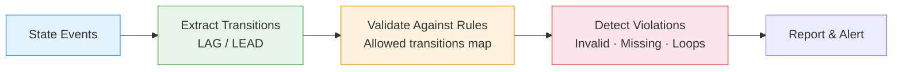
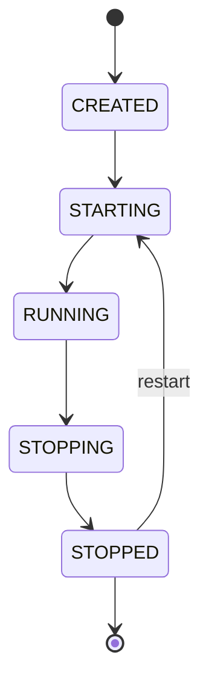
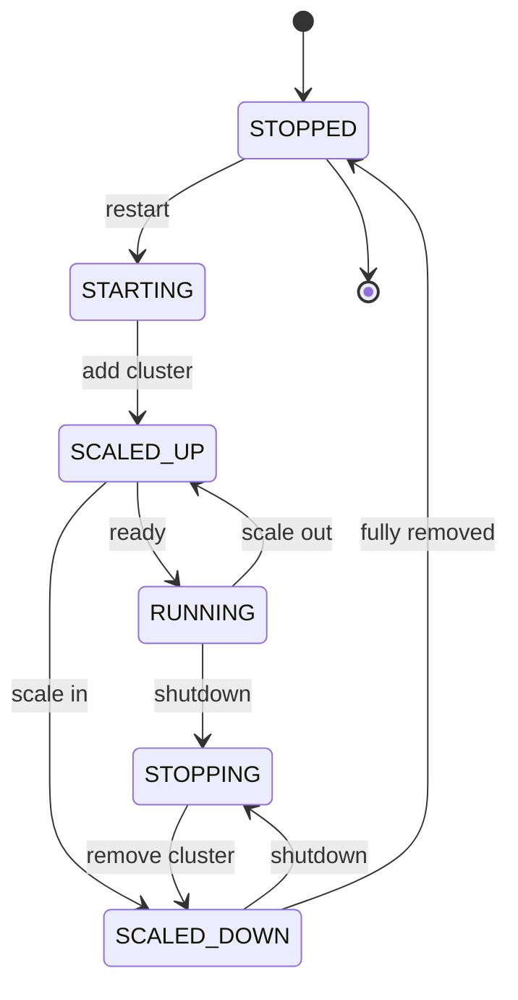

# :material-state-machine: State Machine Analysis

Validate **state transitions** — detect invalid transitions, missing states,
repeated states, and restart loops in process lifecycles.

---

## :material-sitemap: Validation Flow



### Expected state machine



---

## :material-code-tags: Syntax

### Sample data

```sql
CREATE OR REPLACE TEMP VIEW state_events AS
SELECT * FROM VALUES
  ('wh_1', 'CREATED',  TIMESTAMP '2024-03-01 08:00:00'),
  ('wh_1', 'STARTING', TIMESTAMP '2024-03-01 08:01:00'),
  ('wh_1', 'RUNNING',  TIMESTAMP '2024-03-01 08:02:00'),
  ('wh_1', 'STOPPING', TIMESTAMP '2024-03-01 09:00:00'),
  ('wh_1', 'STOPPED',  TIMESTAMP '2024-03-01 09:01:00'),
  ('wh_2', 'CREATED',  TIMESTAMP '2024-03-01 07:00:00'),
  ('wh_2', 'RUNNING',  TIMESTAMP '2024-03-01 07:01:00'),
  ('wh_2', 'STOPPING', TIMESTAMP '2024-03-01 08:00:00'),
  ('wh_2', 'STOPPED',  TIMESTAMP '2024-03-01 08:01:00'),
  ('wh_3', 'CREATED',  TIMESTAMP '2024-03-01 06:00:00'),
  ('wh_3', 'STARTING', TIMESTAMP '2024-03-01 06:01:00'),
  ('wh_3', 'RUNNING',  TIMESTAMP '2024-03-01 06:02:00'),
  ('wh_3', 'RUNNING',  TIMESTAMP '2024-03-01 06:05:00'),
  ('wh_3', 'STOPPING', TIMESTAMP '2024-03-01 07:00:00'),
  ('wh_3', 'STARTING', TIMESTAMP '2024-03-01 07:01:00'),
  ('wh_3', 'RUNNING',  TIMESTAMP '2024-03-01 07:02:00'),
  ('wh_3', 'STOPPING', TIMESTAMP '2024-03-01 08:00:00'),
  ('wh_3', 'STOPPED',  TIMESTAMP '2024-03-01 08:01:00')
AS t(entity_id, state, event_time);

-- Valid transitions lookup
CREATE OR REPLACE TEMP VIEW valid_transitions AS
SELECT * FROM VALUES
  ('CREATED',  'STARTING'),
  ('STARTING', 'RUNNING'),
  ('RUNNING',  'STOPPING'),
  ('STOPPING', 'STOPPED'),
  ('STOPPED',  'STARTING')
AS t(from_state, to_state);
```

---

### Invalid transition detection

```sql
WITH transitions AS (
    SELECT
        entity_id,
        state                                      AS from_state,
        LEAD(state) OVER (
            PARTITION BY entity_id ORDER BY event_time
        )                                          AS to_state,
        event_time
    FROM state_events
)
SELECT
    t.entity_id,
    t.from_state,
    t.to_state,
    t.event_time,
    'INVALID_TRANSITION'                           AS violation
FROM transitions t
LEFT JOIN valid_transitions v
    ON t.from_state = v.from_state
    AND t.to_state = v.to_state
WHERE t.to_state IS NOT NULL
  AND v.from_state IS NULL
ORDER BY t.entity_id, t.event_time;
-- Result:
-- |entity_id|from_state|to_state|violation          |
-- |wh_2     |CREATED   |RUNNING |INVALID_TRANSITION | ← skipped STARTING
-- |wh_3     |RUNNING   |RUNNING |INVALID_TRANSITION | ← repeated state
-- |wh_3     |STOPPING  |STARTING|INVALID_TRANSITION | ← skipped STOPPED
```

---

### Missing state detection

```sql
WITH expected_path AS (
    SELECT * FROM VALUES
      (1, 'CREATED'), (2, 'STARTING'), (3, 'RUNNING'),
      (4, 'STOPPING'), (5, 'STOPPED')
    AS t(step_order, expected_state)
),
entity_states AS (
    SELECT
        entity_id,
        COLLECT_SET(state) AS observed_states
    FROM state_events
    GROUP BY entity_id
)
SELECT
    es.entity_id,
    ep.expected_state                              AS missing_state
FROM entity_states es
CROSS JOIN expected_path ep
WHERE NOT ARRAY_CONTAINS(es.observed_states, ep.expected_state)
ORDER BY es.entity_id, ep.step_order;
-- Result:
-- |entity_id|missing_state|
-- |wh_2     |STARTING     |
```

---

### Repeated state detection

```sql
WITH sequenced AS (
    SELECT
        entity_id,
        state,
        event_time,
        LAG(state) OVER (
            PARTITION BY entity_id ORDER BY event_time
        )                                          AS prev_state
    FROM state_events
)
SELECT
    entity_id,
    state                                          AS repeated_state,
    event_time,
    'REPEATED_STATE'                               AS violation
FROM sequenced
WHERE state = prev_state
ORDER BY entity_id, event_time;
```

---

### Restart loop detection

```sql
WITH restarts AS (
    SELECT
        entity_id,
        event_time,
        state,
        SUM(CASE WHEN state = 'STARTING' THEN 1 ELSE 0 END) OVER (
            PARTITION BY entity_id
            ORDER BY event_time
            ROWS UNBOUNDED PRECEDING
        )                                          AS start_count
    FROM state_events
)
SELECT
    entity_id,
    MAX(start_count)                               AS total_starts,
    CASE
        WHEN MAX(start_count) > 3 THEN 'RESTART_LOOP'
        WHEN MAX(start_count) > 1 THEN 'RESTARTED'
        ELSE 'NORMAL'
    END                                            AS lifecycle_status
FROM restarts
GROUP BY entity_id
ORDER BY total_starts DESC;
```

---

### Complete state machine audit

```sql
WITH transitions AS (
    SELECT
        entity_id,
        state AS from_state,
        LEAD(state) OVER w AS to_state,
        event_time,
        LAG(state) OVER w AS prev_state
    FROM state_events
    WINDOW w AS (PARTITION BY entity_id ORDER BY event_time)
)
SELECT
    entity_id,
    from_state,
    to_state,
    event_time,
    CASE
        WHEN to_state IS NULL THEN 'END_OF_LOG'
        WHEN from_state = to_state THEN 'REPEATED_STATE'
        WHEN CONCAT(from_state, '->', to_state) NOT IN (
            'CREATED->STARTING', 'STARTING->RUNNING',
            'RUNNING->STOPPING', 'STOPPING->STOPPED',
            'STOPPED->STARTING'
        ) THEN 'INVALID_TRANSITION'
        ELSE 'VALID'
    END                                            AS audit_result
FROM transitions
WHERE to_state IS NOT NULL
ORDER BY entity_id, event_time;
```

---

## :material-information-outline: Key Concepts

| Violation | Detection | Example |
|-----------|-----------|---------|
| **Invalid transition** | LEFT JOIN valid_transitions IS NULL | CREATED→RUNNING (skipped STARTING) |
| **Missing state** | COLLECT_SET vs expected set | Never reached STOPPED |
| **Repeated state** | `state = LAG(state)` | RUNNING→RUNNING |
| **Restart loop** | COUNT of STARTING events > threshold | 5+ restarts in 1 hour |
| **Stuck state** | Long duration in non-terminal state | STARTING for > 10 min |

!!! tip "Databricks warehouse lifecycle"
    This pattern directly applies to Databricks SQL warehouse state monitoring:
    CREATED→STARTING→RUNNING→STOPPING→STOPPED. Alert on invalid transitions
    or excessive restart loops.

---

## :material-flask-outline: [Databricks] Warehouse Events — Real-World Example

!!! note "[Databricks] System Table"
    This section uses `system.compute.warehouse_events`, a Databricks Unity Catalog
    system table. Not available on open-source Spark.

### Warehouse Events Schema

| Column | Type | Description |
|--------|------|-------------|
| `account_id` | string | Databricks account ID |
| `workspace_id` | string | Workspace where the warehouse is deployed |
| `warehouse_id` | string | SQL warehouse the event relates to |
| `event_type` | string | `STARTING`, `RUNNING`, `SCALED_UP`, `SCALED_DOWN`, `STOPPING`, `STOPPED` |
| `cluster_count` | integer | Number of clusters actively running |
| `event_time` | timestamp | When the event occurred (UTC) |

### Warehouse State Machine



!!! info "Valid Transitions Reference"

    | # | From State | To State | Meaning |
    |:-:|-----------|----------|---------|
    | 1 | `STARTING` | `SCALED_UP` | First cluster added during startup |
    | 2 | `SCALED_UP` | `RUNNING` | Cluster ready to serve queries |
    | 3 | `RUNNING` | `SCALED_UP` | Additional cluster added under load |
    | 4 | `SCALED_UP` | `SCALED_DOWN` | Excess cluster removed |
    | 5 | `SCALED_DOWN` | `STOPPING` | Begin shutdown after scale-in |
    | 6 | `STOPPING` | `SCALED_DOWN` | Cluster removed during shutdown |
    | 7 | `SCALED_DOWN` | `STOPPED` | All clusters removed — fully stopped |
    | 8 | `STOPPED` | `STARTING` | Warehouse restart |
    | 9 | `RUNNING` | `STOPPING` | Direct shutdown (single-cluster) |

### Sample Data

```sql
-- [Databricks] Simulated warehouse_events for demonstration
CREATE OR REPLACE TEMP VIEW warehouse_events AS
SELECT * FROM VALUES
  -- wh_A: valid lifecycle — startup, scale out, scale in, shutdown
  ('acct_1', 'ws_100', 'wh_A', 'STARTING',    1, TIMESTAMP '2024-03-01 08:00:00'),
  ('acct_1', 'ws_100', 'wh_A', 'SCALED_UP',   1, TIMESTAMP '2024-03-01 08:01:00'),
  ('acct_1', 'ws_100', 'wh_A', 'RUNNING',     1, TIMESTAMP '2024-03-01 08:02:00'),
  ('acct_1', 'ws_100', 'wh_A', 'SCALED_UP',   2, TIMESTAMP '2024-03-01 08:30:00'),
  ('acct_1', 'ws_100', 'wh_A', 'SCALED_UP',   3, TIMESTAMP '2024-03-01 09:00:00'),
  ('acct_1', 'ws_100', 'wh_A', 'SCALED_DOWN', 2, TIMESTAMP '2024-03-01 10:00:00'),
  ('acct_1', 'ws_100', 'wh_A', 'STOPPING',    0, TIMESTAMP '2024-03-01 11:00:00'),
  ('acct_1', 'ws_100', 'wh_A', 'SCALED_DOWN', 0, TIMESTAMP '2024-03-01 11:01:00'),
  ('acct_1', 'ws_100', 'wh_A', 'STOPPED',     0, TIMESTAMP '2024-03-01 11:02:00'),
  -- wh_A: second session — single-cluster direct shutdown
  ('acct_1', 'ws_100', 'wh_A', 'STOPPED',     0, TIMESTAMP '2024-03-01 13:59:00'),
  ('acct_1', 'ws_100', 'wh_A', 'STARTING',    1, TIMESTAMP '2024-03-01 14:00:00'),
  ('acct_1', 'ws_100', 'wh_A', 'SCALED_UP',   1, TIMESTAMP '2024-03-01 14:01:00'),
  ('acct_1', 'ws_100', 'wh_A', 'RUNNING',     1, TIMESTAMP '2024-03-01 14:02:00'),
  ('acct_1', 'ws_100', 'wh_A', 'STOPPING',    0, TIMESTAMP '2024-03-01 15:00:00'),
  ('acct_1', 'ws_100', 'wh_A', 'SCALED_DOWN', 0, TIMESTAMP '2024-03-01 15:01:00'),
  ('acct_1', 'ws_100', 'wh_A', 'STOPPED',     0, TIMESTAMP '2024-03-01 15:02:00'),
  -- wh_B: INVALID — skips SCALED_UP after STARTING, duplicate STARTING
  ('acct_1', 'ws_200', 'wh_B', 'STARTING',    1, TIMESTAMP '2024-03-01 07:00:00'),
  ('acct_1', 'ws_200', 'wh_B', 'RUNNING',     1, TIMESTAMP '2024-03-01 07:01:00'),
  ('acct_1', 'ws_200', 'wh_B', 'STOPPED',     0, TIMESTAMP '2024-03-01 09:00:00'),
  ('acct_1', 'ws_200', 'wh_B', 'STARTING',    1, TIMESTAMP '2024-03-01 09:05:00'),
  ('acct_1', 'ws_200', 'wh_B', 'STARTING',    1, TIMESTAMP '2024-03-01 09:06:00'),
  ('acct_1', 'ws_200', 'wh_B', 'SCALED_UP',   1, TIMESTAMP '2024-03-01 09:07:00'),
  ('acct_1', 'ws_200', 'wh_B', 'RUNNING',     1, TIMESTAMP '2024-03-01 09:08:00'),
  ('acct_1', 'ws_200', 'wh_B', 'STOPPING',    0, TIMESTAMP '2024-03-01 10:00:00'),
  ('acct_1', 'ws_200', 'wh_B', 'SCALED_DOWN', 0, TIMESTAMP '2024-03-01 10:01:00'),
  ('acct_1', 'ws_200', 'wh_B', 'STOPPED',     0, TIMESTAMP '2024-03-01 10:02:00')
AS t(account_id, workspace_id, warehouse_id, event_type, cluster_count, event_time);

-- [Databricks] Valid transitions for warehouse lifecycle
CREATE OR REPLACE TEMP VIEW wh_valid_transitions AS
SELECT * FROM VALUES
  ('STARTING',    'SCALED_UP'),    -- first cluster added during startup
  ('SCALED_UP',   'RUNNING'),      -- cluster ready to serve queries
  ('RUNNING',     'SCALED_UP'),    -- additional cluster added under load
  ('SCALED_UP',   'SCALED_DOWN'),  -- excess cluster removed
  ('SCALED_DOWN', 'STOPPING'),     -- begin shutdown after scale-in
  ('STOPPING',    'SCALED_DOWN'),  -- cluster removed during shutdown
  ('SCALED_DOWN', 'STOPPED'),      -- all clusters removed — fully stopped
  ('STOPPED',     'STARTING'),     -- warehouse restart
  ('RUNNING',     'STOPPING')      -- direct shutdown (single-cluster)
AS t(from_state, to_state);
```

!!! tip "Understanding the transitions"
    The lifecycle follows: **STOPPED → STARTING → SCALED_UP → RUNNING**.
    Shutdown reverses: **RUNNING → STOPPING → SCALED_DOWN → STOPPED**.
    Scaling during operation: **RUNNING → SCALED_UP → SCALED_DOWN → STOPPING**.
    A `RUNNING` warehouse with a single cluster can go directly to `STOPPING`.

### Detect Invalid Warehouse Transitions

```sql
-- [Databricks]
WITH transitions AS (
    SELECT
        warehouse_id,
        event_type AS from_state,
        LEAD(event_type) OVER (
            PARTITION BY warehouse_id ORDER BY event_time
        ) AS to_state,
        event_time,
        cluster_count
    FROM warehouse_events
)
SELECT
    t.warehouse_id,
    t.from_state,
    t.to_state,
    t.event_time,
    t.cluster_count,
    'INVALID_TRANSITION' AS violation
FROM transitions t
LEFT JOIN wh_valid_transitions v
    ON t.from_state = v.from_state
    AND t.to_state = v.to_state
WHERE t.to_state IS NOT NULL
  AND v.from_state IS NULL
ORDER BY t.warehouse_id, t.event_time;
```

??? success "Expected Output"

    | warehouse_id | from_state | to_state | event_time          | cluster_count | violation          |
    |--------------|------------|----------|---------------------|:-------------:|-------------------|
    | wh_B         | STARTING   | RUNNING  | 2024-03-01 07:00:00 |             1 | INVALID_TRANSITION |
    | wh_B         | RUNNING    | STOPPED  | 2024-03-01 07:01:00 |             1 | INVALID_TRANSITION |
    | wh_B         | STARTING   | STARTING | 2024-03-01 09:05:00 |             1 | INVALID_TRANSITION |

    **Violations explained:**

    - **wh_B `STARTING→RUNNING`** — must go through `SCALED_UP` first (cluster must be added before ready).
    - **wh_B `RUNNING→STOPPED`** — skipped both `STOPPING` and `SCALED_DOWN` (abrupt termination).
    - **wh_B `STARTING→STARTING`** — duplicate `STARTING` event (potential startup retry bug).

### Warehouse Uptime Duration Per Session

Calculate how long each warehouse was in the `RUNNING`/`SCALED_UP`/`SCALED_DOWN` state:

```sql
-- [Databricks]
WITH sessions AS (
    SELECT
        warehouse_id,
        event_type,
        event_time,
        cluster_count,
        LEAD(event_time) OVER (
            PARTITION BY warehouse_id ORDER BY event_time
        ) AS next_event_time,
        SUM(CASE WHEN event_type = 'STARTING' THEN 1 ELSE 0 END) OVER (
            PARTITION BY warehouse_id
            ORDER BY event_time
            ROWS BETWEEN UNBOUNDED PRECEDING AND CURRENT ROW
        ) AS session_id
    FROM warehouse_events
)
SELECT
    warehouse_id,
    session_id,
    MIN(event_time) AS session_start,
    MAX(next_event_time) AS session_end,
    ROUND(
        (UNIX_TIMESTAMP(MAX(next_event_time)) - UNIX_TIMESTAMP(MIN(event_time))) / 60.0,
        1
    ) AS duration_minutes,
    MAX(cluster_count) AS peak_clusters
FROM sessions
WHERE event_type IN ('RUNNING', 'SCALED_UP', 'SCALED_DOWN')
GROUP BY warehouse_id, session_id
ORDER BY warehouse_id, session_id;
```

??? success "Expected Output"

    | warehouse_id | session_id | session_start       | session_end         | duration_minutes | peak_clusters |
    |--------------|:----------:|---------------------|---------------------|:----------------:|:-------------:|
    | wh_A         |          1 | 2024-03-01 08:01:00 | 2024-03-01 11:00:00 |            179.0 |             3 |
    | wh_A         |          2 | 2024-03-01 14:01:00 | 2024-03-01 15:00:00 |             59.0 |             1 |
    | wh_B         |          1 | 2024-03-01 07:01:00 | 2024-03-01 09:00:00 |            119.0 |             1 |
    | wh_B         |          2 | 2024-03-01 09:07:00 | 2024-03-01 10:00:00 |             53.0 |             1 |

    - **wh_A session 1** ran for ~3 hours and scaled out to 3 clusters.
    - **wh_B session 1** has an invalid `RUNNING→STOPPED` transition but still registers duration.
    - Sessions are separated by `STARTING` events using the cumulative count technique.

### Excessive Restart Detection

```sql
-- [Databricks] Flag warehouses with too many restarts in a rolling 24-hour window
SELECT
    warehouse_id,
    event_time,
    event_type,
    COUNT(*) OVER (
        PARTITION BY warehouse_id
        ORDER BY event_time
        RANGE BETWEEN INTERVAL '24' HOUR PRECEDING AND CURRENT ROW
    ) AS starts_24h,
    CASE
        WHEN COUNT(*) OVER (
            PARTITION BY warehouse_id
            ORDER BY event_time
            RANGE BETWEEN INTERVAL '24' HOUR PRECEDING AND CURRENT ROW
        ) > 3 THEN 'RESTART_LOOP_ALERT'
        ELSE 'OK'
    END AS status
FROM warehouse_events
WHERE event_type = 'STARTING'
ORDER BY warehouse_id, event_time;
```

??? success "Expected Output"

    | warehouse_id | event_time          | event_type | starts_24h | status |
    |--------------|---------------------|------------|:----------:|--------|
    | wh_A         | 2024-03-01 08:00:00 | STARTING   |          1 | OK     |
    | wh_A         | 2024-03-01 14:00:00 | STARTING   |          2 | OK     |
    | wh_B         | 2024-03-01 07:00:00 | STARTING   |          1 | OK     |
    | wh_B         | 2024-03-01 09:05:00 | STARTING   |          2 | OK     |
    | wh_B         | 2024-03-01 09:06:00 | STARTING   |          3 | OK     |

    None exceed the threshold of 3 in this sample. In production, warehouses with
    `starts_24h > 3` indicate a restart loop requiring investigation.

### Cluster Scaling Timeline

Track how the cluster count changes over time:

```sql
-- [Databricks]
SELECT
    warehouse_id,
    event_time,
    event_type,
    cluster_count,
    LAG(cluster_count) OVER (
        PARTITION BY warehouse_id ORDER BY event_time
    ) AS prev_cluster_count,
    cluster_count - COALESCE(LAG(cluster_count) OVER (
        PARTITION BY warehouse_id ORDER BY event_time
    ), 0) AS cluster_delta
FROM warehouse_events
WHERE event_type IN ('RUNNING', 'SCALED_UP', 'SCALED_DOWN', 'STARTING')
  AND warehouse_id = 'wh_A'
ORDER BY event_time;
```

??? success "Expected Output"

    | warehouse_id | event_time          | event_type | cluster_count | prev_cluster_count | cluster_delta |
    |--------------|---------------------|------------|:-------------:|:------------------:|--------------:|
    | wh_A         | 2024-03-01 08:00:00 | STARTING   |             1 |               NULL |             1 |
    | wh_A         | 2024-03-01 08:01:00 | SCALED_UP  |             1 |                  1 |             0 |
    | wh_A         | 2024-03-01 08:02:00 | RUNNING    |             1 |                  1 |             0 |
    | wh_A         | 2024-03-01 08:30:00 | SCALED_UP  |             2 |                  1 |             1 |
    | wh_A         | 2024-03-01 09:00:00 | SCALED_UP  |             3 |                  2 |             1 |
    | wh_A         | 2024-03-01 10:00:00 | SCALED_DOWN|             2 |                  3 |            -1 |
    | wh_A         | 2024-03-01 14:00:00 | STARTING   |             1 |                  2 |            -1 |
    | wh_A         | 2024-03-01 14:01:00 | SCALED_UP  |             1 |                  1 |             0 |
    | wh_A         | 2024-03-01 14:02:00 | RUNNING    |             1 |                  1 |             0 |

    `cluster_delta` shows scaling direction: +1 = scale out, -1 = scale in, 0 = no change.

### Discover Allowed Transitions from Production Data

Before hardcoding valid transitions, discover them from actual event history.
Rare transitions may indicate bugs or undocumented state changes.

```sql
-- [Databricks] Discover all observed transitions with frequency
SELECT
    event_type      AS from_state,
    next_event_type AS to_state,
    COUNT(*)        AS occurrences
FROM (
    SELECT
        event_type,
        LEAD(event_type) OVER (
            PARTITION BY workspace_id, warehouse_id
            ORDER BY event_time
        ) AS next_event_type
    FROM system.compute.warehouse_events
    WHERE event_time > CURRENT_DATE - INTERVAL '30' DAY
)
WHERE next_event_type IS NOT NULL
GROUP BY event_type, next_event_type
ORDER BY occurrences DESC;
```

!!! tip "Interpreting results"
    - **High-frequency** transitions (thousands+) → confirmed valid transitions.
    - **Low-frequency** transitions (single digits) → likely bugs, race conditions,
      or undocumented edge cases worth investigating.
    - Use this output to populate or update your `wh_valid_transitions` view.

### Build Valid Transitions View from Production Data

Instead of manually maintaining the allowed transitions, derive them directly
from observed history — then use the view for violation detection:

```sql
-- [Databricks] Auto-generate valid transitions from the last 30 days
CREATE OR REPLACE TEMP VIEW wh_valid_transitions AS
SELECT from_state, to_state
FROM (
    SELECT
        event_type      AS from_state,
        next_event_type AS to_state
    FROM (
        SELECT
            event_type,
            LEAD(event_type) OVER (
                PARTITION BY workspace_id, warehouse_id
                ORDER BY event_time
            ) AS next_event_type
        FROM system.compute.warehouse_events
        WHERE event_time > CURRENT_DATE - INTERVAL '30' DAY
    )
    WHERE next_event_type IS NOT NULL
    GROUP BY event_type, next_event_type
);
```

!!! warning "Use with caution"
    This approach trusts that **all transitions observed in the last 30 days are valid**.
    If bugs caused invalid transitions during that period, they will be treated as allowed.
    For stricter validation, filter by `occurrences > threshold` or manually curate:

    ```sql
    -- Only accept transitions seen 10+ times as "valid"
    CREATE OR REPLACE TEMP VIEW wh_valid_transitions AS
    SELECT from_state, to_state
    FROM (
        SELECT
            event_type      AS from_state,
            next_event_type AS to_state,
            COUNT(*)        AS occurrences
        FROM (
            SELECT
                event_type,
                LEAD(event_type) OVER (
                    PARTITION BY workspace_id, warehouse_id
                    ORDER BY event_time
                ) AS next_event_type
            FROM system.compute.warehouse_events
            WHERE event_time > CURRENT_DATE - INTERVAL '30' DAY
        )
        WHERE next_event_type IS NOT NULL
        GROUP BY event_type, next_event_type
    )
    WHERE occurrences >= 10;
    ```

For a simple unique-pairs view (without counts):

```sql
-- [Databricks] Unique transition pairs only
SELECT DISTINCT
    event_type      AS from_state,
    next_event_type AS to_state
FROM (
    SELECT
        event_type,
        LEAD(event_type) OVER (
            PARTITION BY workspace_id, warehouse_id
            ORDER BY event_time
        ) AS next_event_type
    FROM system.compute.warehouse_events
    WHERE event_time > CURRENT_DATE - INTERVAL '30' DAY
)
WHERE next_event_type IS NOT NULL
ORDER BY from_state, to_state;
```

### Production Query — Detect Invalid Transitions

```sql
-- [Databricks] Query actual system table (requires Unity Catalog access)
WITH transitions AS (
    SELECT
        warehouse_id,
        event_type AS from_state,
        LEAD(event_type) OVER (
            PARTITION BY warehouse_id ORDER BY event_time
        ) AS to_state,
        event_time,
        cluster_count
    FROM system.compute.warehouse_events
    WHERE event_time >= CURRENT_DATE - INTERVAL '7' DAY
)
SELECT
    warehouse_id,
    from_state,
    to_state,
    event_time,
    cluster_count
FROM transitions t
LEFT JOIN wh_valid_transitions v
    ON t.from_state = v.from_state
    AND t.to_state = v.to_state
WHERE t.to_state IS NOT NULL
  AND v.from_state IS NULL
ORDER BY event_time DESC
LIMIT 50;
```

!!! warning "System table access"
    `system.compute.warehouse_events` requires account-level admin or
    `USE CATALOG system` privileges. The table only retains events for
    the configured retention period (typically 365 days).

---

## :material-lightbulb-outline: When to Use

| Scenario | Check |
|----------|-------|
| Warehouse health monitoring | Invalid transitions, restart loops |
| CI/CD pipeline validation | Missing stages, stuck builds |
| Order processing | Skipped fulfilment steps |
| Microservice orchestration | Out-of-order state changes |
| IoT device lifecycle | Unexpected state combinations |

---

## :material-arrow-right: Related

- [Sequence Mining](sequence_mining.md) — discover frequent patterns in event logs
- [Event Stream Analytics](event_stream_analytics.md) — general event processing
- [Gaps & Islands](gaps_islands.md) — consecutive state duration calculation
