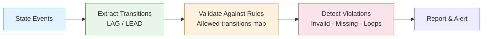
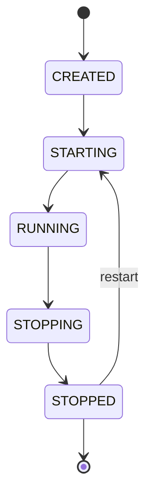

# :material-state-machine: State Machine Analysis

Validate **state transitions** — detect invalid transitions, missing states,
repeated states, and restart loops in process lifecycles.

---

## :material-sitemap: Validation Flow



### Expected state machine



---

## :material-code-tags: Syntax

### Sample data

```sql
CREATE OR REPLACE TEMP VIEW state_events AS
SELECT * FROM VALUES
  ('wh_1', 'CREATED',  TIMESTAMP '2024-03-01 08:00:00'),
  ('wh_1', 'STARTING', TIMESTAMP '2024-03-01 08:01:00'),
  ('wh_1', 'RUNNING',  TIMESTAMP '2024-03-01 08:02:00'),
  ('wh_1', 'STOPPING', TIMESTAMP '2024-03-01 09:00:00'),
  ('wh_1', 'STOPPED',  TIMESTAMP '2024-03-01 09:01:00'),
  ('wh_2', 'CREATED',  TIMESTAMP '2024-03-01 07:00:00'),
  ('wh_2', 'RUNNING',  TIMESTAMP '2024-03-01 07:01:00'),
  ('wh_2', 'STOPPING', TIMESTAMP '2024-03-01 08:00:00'),
  ('wh_2', 'STOPPED',  TIMESTAMP '2024-03-01 08:01:00'),
  ('wh_3', 'CREATED',  TIMESTAMP '2024-03-01 06:00:00'),
  ('wh_3', 'STARTING', TIMESTAMP '2024-03-01 06:01:00'),
  ('wh_3', 'RUNNING',  TIMESTAMP '2024-03-01 06:02:00'),
  ('wh_3', 'RUNNING',  TIMESTAMP '2024-03-01 06:05:00'),
  ('wh_3', 'STOPPING', TIMESTAMP '2024-03-01 07:00:00'),
  ('wh_3', 'STARTING', TIMESTAMP '2024-03-01 07:01:00'),
  ('wh_3', 'RUNNING',  TIMESTAMP '2024-03-01 07:02:00'),
  ('wh_3', 'STOPPING', TIMESTAMP '2024-03-01 08:00:00'),
  ('wh_3', 'STOPPED',  TIMESTAMP '2024-03-01 08:01:00')
AS t(entity_id, state, event_time);

-- Valid transitions lookup
CREATE OR REPLACE TEMP VIEW valid_transitions AS
SELECT * FROM VALUES
  ('CREATED',  'STARTING'),
  ('STARTING', 'RUNNING'),
  ('RUNNING',  'STOPPING'),
  ('STOPPING', 'STOPPED'),
  ('STOPPED',  'STARTING')
AS t(from_state, to_state);
```

---

### Invalid transition detection

```sql
WITH transitions AS (
    SELECT
        entity_id,
        state                                      AS from_state,
        LEAD(state) OVER (
            PARTITION BY entity_id ORDER BY event_time
        )                                          AS to_state,
        event_time
    FROM state_events
)
SELECT
    t.entity_id,
    t.from_state,
    t.to_state,
    t.event_time,
    'INVALID_TRANSITION'                           AS violation
FROM transitions t
LEFT JOIN valid_transitions v
    ON t.from_state = v.from_state
    AND t.to_state = v.to_state
WHERE t.to_state IS NOT NULL
  AND v.from_state IS NULL
ORDER BY t.entity_id, t.event_time;
-- Result:
-- |entity_id|from_state|to_state|violation          |
-- |wh_2     |CREATED   |RUNNING |INVALID_TRANSITION | ← skipped STARTING
-- |wh_3     |RUNNING   |RUNNING |INVALID_TRANSITION | ← repeated state
-- |wh_3     |STOPPING  |STARTING|INVALID_TRANSITION | ← skipped STOPPED
```

---

### Missing state detection

```sql
WITH expected_path AS (
    SELECT * FROM VALUES
      (1, 'CREATED'), (2, 'STARTING'), (3, 'RUNNING'),
      (4, 'STOPPING'), (5, 'STOPPED')
    AS t(step_order, expected_state)
),
entity_states AS (
    SELECT
        entity_id,
        COLLECT_SET(state) AS observed_states
    FROM state_events
    GROUP BY entity_id
)
SELECT
    es.entity_id,
    ep.expected_state                              AS missing_state
FROM entity_states es
CROSS JOIN expected_path ep
WHERE NOT ARRAY_CONTAINS(es.observed_states, ep.expected_state)
ORDER BY es.entity_id, ep.step_order;
-- Result:
-- |entity_id|missing_state|
-- |wh_2     |STARTING     |
```

---

### Repeated state detection

```sql
WITH sequenced AS (
    SELECT
        entity_id,
        state,
        event_time,
        LAG(state) OVER (
            PARTITION BY entity_id ORDER BY event_time
        )                                          AS prev_state
    FROM state_events
)
SELECT
    entity_id,
    state                                          AS repeated_state,
    event_time,
    'REPEATED_STATE'                               AS violation
FROM sequenced
WHERE state = prev_state
ORDER BY entity_id, event_time;
```

---

### Restart loop detection

```sql
WITH restarts AS (
    SELECT
        entity_id,
        event_time,
        state,
        SUM(CASE WHEN state = 'STARTING' THEN 1 ELSE 0 END) OVER (
            PARTITION BY entity_id
            ORDER BY event_time
            ROWS UNBOUNDED PRECEDING
        )                                          AS start_count
    FROM state_events
)
SELECT
    entity_id,
    MAX(start_count)                               AS total_starts,
    CASE
        WHEN MAX(start_count) > 3 THEN 'RESTART_LOOP'
        WHEN MAX(start_count) > 1 THEN 'RESTARTED'
        ELSE 'NORMAL'
    END                                            AS lifecycle_status
FROM restarts
GROUP BY entity_id
ORDER BY total_starts DESC;
```

---

### Complete state machine audit

```sql
WITH transitions AS (
    SELECT
        entity_id,
        state AS from_state,
        LEAD(state) OVER w AS to_state,
        event_time,
        LAG(state) OVER w AS prev_state
    FROM state_events
    WINDOW w AS (PARTITION BY entity_id ORDER BY event_time)
)
SELECT
    entity_id,
    from_state,
    to_state,
    event_time,
    CASE
        WHEN to_state IS NULL THEN 'END_OF_LOG'
        WHEN from_state = to_state THEN 'REPEATED_STATE'
        WHEN CONCAT(from_state, '->', to_state) NOT IN (
            'CREATED->STARTING', 'STARTING->RUNNING',
            'RUNNING->STOPPING', 'STOPPING->STOPPED',
            'STOPPED->STARTING'
        ) THEN 'INVALID_TRANSITION'
        ELSE 'VALID'
    END                                            AS audit_result
FROM transitions
WHERE to_state IS NOT NULL
ORDER BY entity_id, event_time;
```

---

## :material-information-outline: Key Concepts

| Violation | Detection | Example |
|-----------|-----------|---------|
| **Invalid transition** | LEFT JOIN valid_transitions IS NULL | CREATED→RUNNING (skipped STARTING) |
| **Missing state** | COLLECT_SET vs expected set | Never reached STOPPED |
| **Repeated state** | `state = LAG(state)` | RUNNING→RUNNING |
| **Restart loop** | COUNT of STARTING events > threshold | 5+ restarts in 1 hour |
| **Stuck state** | Long duration in non-terminal state | STARTING for > 10 min |

!!! tip "Databricks warehouse lifecycle"
    This pattern directly applies to Databricks SQL warehouse state monitoring:
    CREATED→STARTING→RUNNING→STOPPING→STOPPED. Alert on invalid transitions
    or excessive restart loops.

---

## :material-lightbulb-outline: When to Use

| Scenario | Check |
|----------|-------|
| Warehouse health monitoring | Invalid transitions, restart loops |
| CI/CD pipeline validation | Missing stages, stuck builds |
| Order processing | Skipped fulfilment steps |
| Microservice orchestration | Out-of-order state changes |
| IoT device lifecycle | Unexpected state combinations |

---

## :material-arrow-right: Related

- [Sequence Mining](sequence_mining.md) — discover frequent patterns in event logs
- [Event Stream Analytics](event_stream_analytics.md) — general event processing
- [Gaps & Islands](gaps_islands.md) — consecutive state duration calculation
