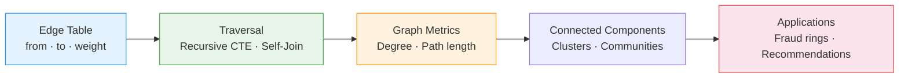

# :material-graph: Graph Analytics

Analyze **relationships between entities** — detect fraud rings, build recommendation
graphs, and traverse social networks using self-joins and recursive CTEs.

______________________________________________________________________

## :material-sitemap: Graph Processing Flow



______________________________________________________________________

## :material-code-tags: Syntax

### Sample data

```sql
CREATE OR REPLACE TEMP VIEW friendships AS
SELECT * FROM VALUES
  ('alice', 'bob'),   ('alice', 'carol'),
  ('bob',   'dave'),  ('bob',   'eve'),
  ('carol', 'frank'), ('dave',  'eve'),
  ('frank', 'grace'), ('eve',   'grace'),
  ('hank',  'iris'),  ('iris',  'jack')
AS t(person_a, person_b);
```

______________________________________________________________________

### Node degree (connection count)

```sql
WITH all_edges AS (
    SELECT person_a AS node FROM friendships
    UNION ALL
    SELECT person_b AS node FROM friendships
)
SELECT
    node,
    COUNT(*)                                       AS degree
FROM all_edges
GROUP BY node
ORDER BY degree DESC;
-- Result:
-- |node |degree|
-- |bob  |3     |
-- |eve  |3     |
-- |alice|2     |
```

______________________________________________________________________

### Friends of friends (2-hop traversal)

```sql
SELECT DISTINCT
    f1.person_a                                    AS person,
    f2.person_b                                    AS friend_of_friend
FROM friendships f1
JOIN friendships f2
    ON f1.person_b = f2.person_a
WHERE f2.person_b != f1.person_a
ORDER BY person, friend_of_friend;
```

______________________________________________________________________

### Connected components (recursive CTE)

Find clusters of connected users.

```sql
WITH RECURSIVE edges AS (
    SELECT person_a, person_b FROM friendships
    UNION ALL
    SELECT person_b, person_a FROM friendships
),
components AS (
    SELECT person_a AS node, person_a AS component
    FROM edges
    UNION
    SELECT e.person_b, c.component
    FROM edges e
    JOIN components c ON e.person_a = c.node
    WHERE e.person_b != c.component
)
SELECT
    component                                      AS cluster_id,
    COLLECT_SET(node)                              AS members,
    COUNT(DISTINCT node)                           AS cluster_size
FROM components
GROUP BY component
HAVING COUNT(DISTINCT node) > 1
ORDER BY cluster_size DESC;
```

______________________________________________________________________

### Shortest path between two nodes

```sql
WITH RECURSIVE paths AS (
    SELECT
        person_a AS start_node,
        person_b AS current_node,
        ARRAY(person_a, person_b)                  AS path,
        1                                          AS hops
    FROM friendships
    WHERE person_a = 'alice'

    UNION ALL

    SELECT
        p.start_node,
        f.person_b,
        ARRAY_APPEND(p.path, f.person_b),
        p.hops + 1
    FROM paths p
    JOIN friendships f ON p.current_node = f.person_a
    WHERE NOT ARRAY_CONTAINS(p.path, f.person_b)
      AND p.hops < 5
)
SELECT path, hops
FROM paths
WHERE current_node = 'grace'
ORDER BY hops ASC
LIMIT 1;
```

______________________________________________________________________

### Mutual connections (recommendation candidates)

```sql
WITH bidirectional AS (
    SELECT person_a, person_b FROM friendships
    UNION
    SELECT person_b, person_a FROM friendships
)
SELECT
    a.person_a                                     AS user_1,
    b.person_b                                     AS user_2,
    COUNT(*)                                       AS mutual_friends
FROM bidirectional a
JOIN bidirectional b
    ON a.person_b = b.person_a
WHERE a.person_a < b.person_b
  AND NOT EXISTS (
      SELECT 1 FROM bidirectional x
      WHERE x.person_a = a.person_a AND x.person_b = b.person_b
  )
GROUP BY a.person_a, b.person_b
HAVING COUNT(*) >= 2
ORDER BY mutual_friends DESC;
```

______________________________________________________________________

## :material-information-outline: Key Concepts

| Concept                  | Technique                      | Use Case               |
| ------------------------ | ------------------------------ | ---------------------- |
| **Degree centrality**    | COUNT edges per node           | Identify influencers   |
| **N-hop traversal**      | N self-joins or recursive CTE  | Friend recommendations |
| **Connected components** | Recursive BFS/DFS              | Fraud ring detection   |
| **Shortest path**        | Recursive CTE with depth limit | Network distance       |
| **Mutual connections**   | Two-hop join with exclusion    | "People you may know"  |

!!! warning "Recursion depth"

    Spark limits recursive CTE iterations. Set `spark.sql.analyzer.maxIterationsForFixedPoint`
    for deep graphs. For very large graphs, consider GraphX or GraphFrames.

______________________________________________________________________

## :material-lightbulb-outline: When to Use

| Scenario               | Approach                                       |
| ---------------------- | ---------------------------------------------- |
| Fraud ring detection   | Connected components — clustered bad actors    |
| Social recommendations | Mutual friends with ≥ 2 shared connections     |
| Influence analysis     | Degree centrality + PageRank (GraphFrames)     |
| Supply chain mapping   | Multi-hop traversal from source to destination |
| Knowledge graphs       | Entity relationships with typed edges          |

______________________________________________________________________

## :material-database-search: [Databricks] Real-World Example — System Tables

!!! note "[Databricks] Unity Catalog system tables"

    `system.access.table_lineage` and `system.access.column_lineage` are built-in
    Unity Catalog system tables that capture real upstream/downstream
    dependencies, so no synthetic sample graph is needed here. An account admin
    must `GRANT USE CATALOG, USE SCHEMA, SELECT ON SCHEMA system.access TO <principal>` before these lineage queries will return rows.

### 1 — Multi-hop downstream reachability from a source table

```sql
-- [Databricks] Requires SELECT on system.access.table_lineage
WITH RECURSIVE edges AS (
    SELECT DISTINCT
        source_table_full_name AS src,
        target_table_full_name AS dst
    FROM system.access.table_lineage
    WHERE source_type = 'TABLE'
      AND target_type = 'TABLE'
      AND event_time >= DATE_SUB(CURRENT_DATE(), 30)
),
downstream AS (
    SELECT
        src,
        dst,
        1 AS depth,
        ARRAY(src, dst) AS path
    FROM edges
    WHERE src = 'main.bronze.orders_raw'

    UNION ALL

    SELECT
        d.src,
        e.dst,
        d.depth + 1,
        ARRAY_APPEND(d.path, e.dst) AS path
    FROM downstream AS d
    JOIN edges AS e
        ON d.dst = e.src
    WHERE NOT ARRAY_CONTAINS(d.path, e.dst)
      AND d.depth < 10
)
SELECT DISTINCT
    src AS root_table,
    dst AS downstream_table,
    depth,
    path
FROM downstream
ORDER BY depth, downstream_table;
-- Result (illustrative):
-- root_table              | downstream_table         | depth | path
-- ------------------------|--------------------------|-------|----------------------------------------------
-- main.bronze.orders_raw  | main.silver.orders_clean | 1     | [main.bronze.orders_raw, main.silver.orders_clean]
-- main.bronze.orders_raw  | main.gold.daily_sales    | 2     | [main.bronze.orders_raw, main.silver.orders_clean, main.gold.daily_sales]
-- main.bronze.orders_raw  | main.ml.sales_features   | 3     | [main.bronze.orders_raw, main.silver.orders_clean, main.gold.daily_sales, main.ml.sales_features]
```

!!! tip "Same reachability pattern, production lineage"

    The recursive edge walk is the same graph traversal used for friendships or
    supply chains above — only the vertices change from people to
    `catalog.schema.table` names. That makes
    `system.access.table_lineage` a practical production graph for impact
    analysis, blast-radius checks, and downstream refresh planning.

______________________________________________________________________

## :material-arrow-right: Related

- [Hierarchy](hierarchy.md) — tree-structured parent-child traversal
- [Network Analysis](network-analysis.md) — IP/device/user relationship graphs
- [Fraud Pattern Detection](../data_quality/fraud-detection.md) — fraud-specific graph patterns
