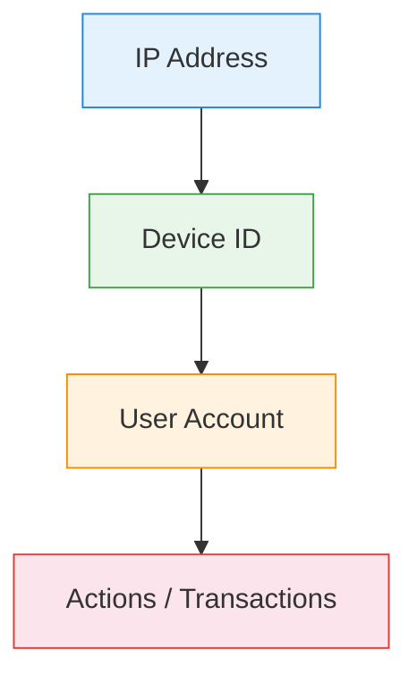

# :material-lan: Network Analysis

Analyze **IP-device-user relationships** — map network topology, detect shared
infrastructure, and identify suspicious connection patterns.

______________________________________________________________________

## :material-sitemap: Analysis Flow



______________________________________________________________________

## :material-code-tags: Syntax

### Sample data

```sql
CREATE OR REPLACE TEMP VIEW login_events AS
SELECT * FROM VALUES
  (1,  'user_1', 'dev_A', '192.168.1.10', TIMESTAMP '2024-03-01 09:00:00'),
  (2,  'user_1', 'dev_A', '192.168.1.10', TIMESTAMP '2024-03-01 14:00:00'),
  (3,  'user_2', 'dev_B', '192.168.1.10', TIMESTAMP '2024-03-01 10:00:00'),
  (4,  'user_2', 'dev_A', '10.0.0.5',     TIMESTAMP '2024-03-02 08:00:00'),
  (5,  'user_3', 'dev_C', '10.0.0.5',     TIMESTAMP '2024-03-01 11:00:00'),
  (6,  'user_3', 'dev_C', '172.16.0.1',   TIMESTAMP '2024-03-02 09:00:00'),
  (7,  'user_4', 'dev_A', '192.168.1.10', TIMESTAMP '2024-03-03 10:00:00'),
  (8,  'user_5', 'dev_D', '172.16.0.1',   TIMESTAMP '2024-03-01 15:00:00'),
  (9,  'user_5', 'dev_D', '203.0.113.1',  TIMESTAMP '2024-03-03 12:00:00'),
  (10, 'user_6', 'dev_E', '203.0.113.1',  TIMESTAMP '2024-03-03 12:05:00')
AS t(event_id, user_id, device_id, ip_address, login_time);
```

______________________________________________________________________

### Users sharing the same device

```sql
SELECT
    device_id,
    COLLECT_SET(user_id)                           AS users,
    COUNT(DISTINCT user_id)                        AS user_count
FROM login_events
GROUP BY device_id
HAVING COUNT(DISTINCT user_id) > 1
ORDER BY user_count DESC;
-- Result:
-- |device_id|users              |user_count|
-- |dev_A    |[user_1,user_2,user_4]|3      |
```

______________________________________________________________________

### Users sharing the same IP

```sql
SELECT
    ip_address,
    COLLECT_SET(user_id)                           AS users,
    COUNT(DISTINCT user_id)                        AS user_count,
    COUNT(DISTINCT device_id)                      AS device_count
FROM login_events
GROUP BY ip_address
HAVING COUNT(DISTINCT user_id) > 1
ORDER BY user_count DESC;
```

______________________________________________________________________

### Network graph: user-to-user via shared device

```sql
SELECT DISTINCT
    a.user_id                                      AS user_a,
    b.user_id                                      AS user_b,
    a.device_id                                    AS shared_device,
    'device'                                       AS link_type
FROM login_events a
JOIN login_events b
    ON a.device_id = b.device_id
    AND a.user_id < b.user_id

UNION ALL

SELECT DISTINCT
    a.user_id,
    b.user_id,
    a.ip_address                                   AS shared_resource,
    'ip'                                           AS link_type
FROM login_events a
JOIN login_events b
    ON a.ip_address = b.ip_address
    AND a.user_id < b.user_id
ORDER BY user_a, user_b;
```

______________________________________________________________________

### Connection strength (multi-factor links)

```sql
WITH links AS (
    SELECT a.user_id AS u1, b.user_id AS u2, 'device' AS factor
    FROM login_events a JOIN login_events b
        ON a.device_id = b.device_id AND a.user_id < b.user_id
    UNION ALL
    SELECT a.user_id, b.user_id, 'ip'
    FROM login_events a JOIN login_events b
        ON a.ip_address = b.ip_address AND a.user_id < b.user_id
)
SELECT
    u1,
    u2,
    COUNT(DISTINCT factor)                         AS link_factors,
    COLLECT_SET(factor)                            AS link_types
FROM links
GROUP BY u1, u2
ORDER BY link_factors DESC;
-- Users linked by BOTH device AND IP are stronger connections (potential same person)
```

______________________________________________________________________

### IP geolocation anomaly (impossible travel)

```sql
WITH ordered AS (
    SELECT
        user_id,
        ip_address,
        login_time,
        LAG(ip_address) OVER w                     AS prev_ip,
        LAG(login_time) OVER w                     AS prev_time,
        (UNIX_TIMESTAMP(login_time)
         - UNIX_TIMESTAMP(LAG(login_time) OVER w)) / 3600.0
                                                   AS hours_gap
    FROM login_events
    WINDOW w AS (PARTITION BY user_id ORDER BY login_time)
)
SELECT
    user_id,
    prev_ip,
    ip_address                                     AS current_ip,
    ROUND(hours_gap, 2)                            AS hours_between,
    CASE
        WHEN prev_ip != ip_address AND hours_gap < 1
            THEN 'SUSPICIOUS'
        ELSE 'NORMAL'
    END                                            AS travel_flag
FROM ordered
WHERE prev_ip IS NOT NULL
  AND prev_ip != ip_address
ORDER BY hours_between ASC;
```

______________________________________________________________________

## :material-information-outline: Key Concepts

| Pattern            | Technique                    | Detects                       |
| ------------------ | ---------------------------- | ----------------------------- |
| Shared device      | GROUP BY device, COUNT users | Account sharing / fraud rings |
| Shared IP          | GROUP BY IP, COUNT users     | Proxy usage, NAT collisions   |
| User-to-user graph | Self-join on shared resource | Relationship network          |
| Link strength      | COUNT DISTINCT factors       | Strong vs weak connections    |
| Impossible travel  | LAG on IP with time check    | Credential theft              |

!!! tip "NAT and VPN considerations"

    Multiple users on the same IP may be legitimate (corporate NAT, VPN).
    Combine IP sharing with device sharing for higher-confidence fraud signals.

______________________________________________________________________

## :material-lightbulb-outline: When to Use

| Scenario                   | Approach                                  |
| -------------------------- | ----------------------------------------- |
| Account takeover detection | IP change + device change in short time   |
| Fraud ring identification  | Connected component of shared devices/IPs |
| Bot detection              | Many accounts, one device, rapid logins   |
| Compliance (KYC)           | Verify one user per identity per device   |
| Access pattern audit       | Map who accesses what from where          |

______________________________________________________________________

## :material-database-search: [Databricks] Real-World Example — System Tables

!!! note "[Databricks] Unity Catalog system tables"

    `system.access.table_lineage` and `system.access.column_lineage` form a real
    dependency network between Unity Catalog assets, so no synthetic edge list is
    required here. An account admin must
    `GRANT USE CATALOG, USE SCHEMA, SELECT ON SCHEMA system.access TO <principal>` before these lineage queries will return rows.

### 1 — Fan-in / fan-out degree for lineage hubs

```sql
-- [Databricks] Requires SELECT on system.access.table_lineage
WITH edges AS (
    SELECT DISTINCT
        source_table_full_name AS src,
        target_table_full_name AS dst
    FROM system.access.table_lineage
    WHERE source_type = 'TABLE'
      AND target_type = 'TABLE'
      AND event_time >= DATE_SUB(CURRENT_DATE(), 30)
),
degree_inputs AS (
    SELECT
        src AS table_name,
        COUNT(*) AS fan_out,
        0 AS fan_in
    FROM edges
    GROUP BY src

    UNION ALL

    SELECT
        dst AS table_name,
        0 AS fan_out,
        COUNT(*) AS fan_in
    FROM edges
    GROUP BY dst
)
SELECT
    table_name,
    SUM(fan_in) AS upstream_edges,
    SUM(fan_out) AS downstream_edges,
    SUM(fan_in) + SUM(fan_out) AS total_degree
FROM degree_inputs
GROUP BY table_name
ORDER BY total_degree DESC, table_name
LIMIT 20;
-- Result (illustrative):
-- table_name                 | upstream_edges | downstream_edges | total_degree
-- ---------------------------|----------------|------------------|-------------
-- main.silver.orders_clean   | 4              | 9                | 13
-- main.gold.customer_360     | 7              | 5                | 12
-- main.shared.dim_calendar   | 1              | 10               | 11
```

!!! tip "Same network metric, production lineage"

    Counting incoming and outgoing edges is the same degree-analysis pattern used
    for shared devices, shared IPs, or user-to-user graphs above. On
    `system.access.table_lineage`, it surfaces hub tables that many pipelines
    depend on, which is useful for dependency risk reviews and change planning.

______________________________________________________________________

## :material-arrow-right: Related

- [Graph Analytics](graph-analytics.md) — general graph traversal and components
- [Fraud Pattern Detection](../data_quality/fraud-detection.md) — fraud-specific detection rules
- [Event Stream Analytics](../sequence/event-stream-analytics.md) — session and event processing
