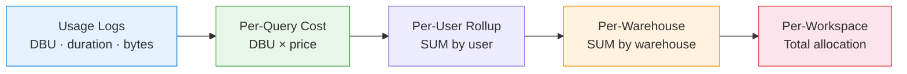

# :material-currency-usd: Cost Attribution

Attribute **costs to queries, warehouses, users, and workspaces** — track Databricks
spend by entity for chargeback, budgeting, and optimisation. **[Databricks]**

______________________________________________________________________

## :material-animation-play: Interactive Demo

Click a legend entry to focus one warehouse's contribution across the daily spend profile. Hover any stacked segment to inspect the attributed cost for that day.

<div id="viz-cost-attribution" class="ts-viz"></div>

*Stacked daily bars show total cost, while legend clicks isolate each warehouse's chargeback footprint.*

______________________________________________________________________

## :material-sitemap: Attribution Flow



______________________________________________________________________

## :material-code-tags: Syntax

### Sample data

```sql
CREATE OR REPLACE TEMP VIEW query_usage AS
SELECT * FROM VALUES
  (1,  'wh_prod',  'ws_analytics', 'user_1', 0.5,   30,  DATE '2024-03-01'),
  (2,  'wh_prod',  'ws_analytics', 'user_1', 2.0,   180, DATE '2024-03-01'),
  (3,  'wh_prod',  'ws_analytics', 'user_2', 0.1,   5,   DATE '2024-03-01'),
  (4,  'wh_dev',   'ws_dev',       'user_3', 5.0,   600, DATE '2024-03-01'),
  (5,  'wh_dev',   'ws_dev',       'user_3', 3.0,   300, DATE '2024-03-01'),
  (6,  'wh_prod',  'ws_analytics', 'user_2', 1.5,   120, DATE '2024-03-01'),
  (7,  'wh_bi',    'ws_bi',        'svc_bi', 0.05,  3,   DATE '2024-03-01'),
  (8,  'wh_bi',    'ws_bi',        'svc_bi', 0.05,  2,   DATE '2024-03-01'),
  (9,  'wh_bi',    'ws_bi',        'svc_bi', 0.05,  4,   DATE '2024-03-01'),
  (10, 'wh_prod',  'ws_analytics', 'user_1', 10.0,  900, DATE '2024-03-02')
AS t(query_id, warehouse_id, workspace_id, user_id, dbu_consumed, duration_sec, query_date);
```

______________________________________________________________________

### Cost per query

```sql
SELECT
    query_id,
    warehouse_id,
    user_id,
    dbu_consumed,
    duration_sec,
    -- Assuming $0.22 per DBU (serverless SQL)
    ROUND(dbu_consumed * 0.22, 4)                  AS query_cost_usd
FROM query_usage
ORDER BY query_cost_usd DESC;
```

______________________________________________________________________

### Cost per user

```sql
SELECT
    user_id,
    COUNT(*)                                       AS queries,
    ROUND(SUM(dbu_consumed), 2)                    AS total_dbu,
    ROUND(SUM(dbu_consumed) * 0.22, 2)             AS total_cost_usd,
    ROUND(AVG(dbu_consumed) * 0.22, 4)             AS avg_cost_per_query,
    ROUND(
        SUM(dbu_consumed) * 100.0 / (SELECT SUM(dbu_consumed) FROM query_usage),
        1
    )                                              AS cost_share_pct
FROM query_usage
GROUP BY user_id
ORDER BY total_cost_usd DESC;
```

______________________________________________________________________

### Cost per warehouse

```sql
SELECT
    warehouse_id,
    COUNT(*)                                       AS queries,
    COUNT(DISTINCT user_id)                        AS users,
    ROUND(SUM(dbu_consumed), 2)                    AS total_dbu,
    ROUND(SUM(dbu_consumed) * 0.22, 2)             AS total_cost_usd,
    ROUND(SUM(duration_sec) / 3600.0, 2)           AS total_hours
FROM query_usage
GROUP BY warehouse_id
ORDER BY total_cost_usd DESC;
```

______________________________________________________________________

### Cost per workspace

```sql
SELECT
    workspace_id,
    COUNT(DISTINCT warehouse_id)                   AS warehouses,
    COUNT(DISTINCT user_id)                        AS users,
    COUNT(*)                                       AS queries,
    ROUND(SUM(dbu_consumed) * 0.22, 2)             AS total_cost_usd,
    ROUND(AVG(dbu_consumed) * 0.22, 4)             AS avg_query_cost
FROM query_usage
GROUP BY workspace_id
ORDER BY total_cost_usd DESC;
```

______________________________________________________________________

### Daily cost trend

```sql
SELECT
    query_date,
    warehouse_id,
    COUNT(*)                                       AS queries,
    ROUND(SUM(dbu_consumed) * 0.22, 2)             AS daily_cost,
    LAG(ROUND(SUM(dbu_consumed) * 0.22, 2)) OVER (
        PARTITION BY warehouse_id ORDER BY query_date
    )                                              AS prev_day_cost
FROM query_usage
GROUP BY query_date, warehouse_id
ORDER BY warehouse_id, query_date;
```

______________________________________________________________________

## :material-information-outline: Key Concepts

| Dimension         | Aggregation      | Use Case                          |
| ----------------- | ---------------- | --------------------------------- |
| **Per query**     | Single row cost  | Identify expensive queries        |
| **Per user**      | SUM by user      | Chargeback / budget enforcement   |
| **Per warehouse** | SUM by warehouse | Right-sizing decisions            |
| **Per workspace** | SUM by workspace | Department allocation             |
| **Per day**       | SUM by date      | Trend monitoring / anomaly alerts |

!!! tip "DBU pricing varies"

    Databricks pricing differs by SKU: Jobs Compute ($0.15), SQL Serverless ($0.22),
    All-Purpose ($0.40). Join with a pricing table for accurate attribution.

______________________________________________________________________

## :material-lightbulb-outline: When to Use

| Scenario               | Analysis                                             |
| ---------------------- | ---------------------------------------------------- |
| Monthly chargeback     | Per-user and per-workspace cost rollup               |
| Budget alerts          | Daily cost trend with threshold warnings             |
| Query optimisation     | Find top-10 expensive queries to tune                |
| Warehouse right-sizing | Compare cost vs query count to find over-provisioned |
| Executive dashboard    | Cost per workspace with MoM comparison               |

______________________________________________________________________

## :material-database-search: [Databricks] Real-World Example — System Tables

!!! note "[Databricks] Unity Catalog system tables"

    `system.billing.usage` is a built-in Unity Catalog system table (no
    sample data setup needed) that records billable usage over time, plus
    `custom_tags` such as `Team`, `Tenant`, or `Env` when your compute is
    tagged. An account admin must grant `USE CATALOG` on `system`,
    `USE SCHEMA` on `system.billing`, and `SELECT` on
    `system.billing.usage` before these queries will return rows.

### Daily usage attribution by team tag

```sql
-- [Databricks] Requires SELECT on system.billing.usage
SELECT
    usage_date,
    COALESCE(custom_tags['Team'], 'unassigned') AS team,
    sku_name,
    usage_unit,
    ROUND(SUM(usage_quantity), 2) AS total_usage_quantity,
    ROUND(
        SUM(usage_quantity) * 100.0
        / SUM(SUM(usage_quantity)) OVER (
            PARTITION BY usage_date, usage_unit
        ),
        1
    ) AS daily_share_pct
FROM system.billing.usage
WHERE usage_date >= DATE_SUB(CURRENT_DATE(), 30)
GROUP BY
    usage_date,
    COALESCE(custom_tags['Team'], 'unassigned'),
    sku_name,
    usage_unit
ORDER BY usage_date DESC, daily_share_pct DESC, team;
-- Result (illustrative):
-- usage_date | team          | sku_name              | usage_unit | total_usage_quantity | daily_share_pct
-- ---------- | ------------- | --------------------- | ---------- | -------------------- | ---------------
-- 2024-07-02 | data-platform | PREMIUM_JOBS_COMPUTE  | DBU        | 842.75               | 46.2
-- 2024-07-02 | analytics     | SERVERLESS_SQL        | DBU        | 515.20               | 28.2
-- 2024-07-02 | unassigned    | STANDARD_ALL_PURPOSE  | DBU        | 214.10               | 11.7
```

!!! tip "Tag-based attribution scales to production chargeback"

    This is the same `GROUP BY` pattern as the sample data version, but now
    the allocation key comes from real `custom_tags`. If you later join to
    `system.billing.list_prices`, the exact same grouping produces dollar
    cost by team, tenant, environment, or cost center.

______________________________________________________________________

## :material-arrow-right: Related

- [Workload Classification](workload-classification.md) — classify query types for allocation
- [Resource Efficiency](resource-efficiency.md) — cost per unit of work
- [Capacity Planning](capacity-planning.md) — forecast cost growth
