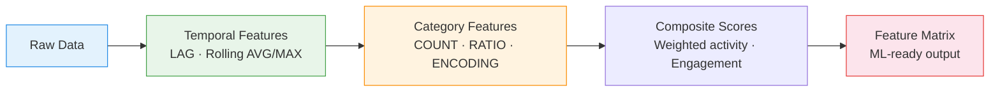

# :material-robot: Feature Engineering

Create **ML-ready features** from raw data — moving averages, rolling maximums,
category counts, and composite activity scores for model training.

---

## :material-sitemap: Feature Pipeline



---

## :material-code-tags: Syntax

### Sample data

```sql
CREATE OR REPLACE TEMP VIEW user_events AS
SELECT * FROM VALUES
  (1, 'alice', 'purchase',  DATE '2024-03-01', 120.00, 'electronics'),
  (2, 'alice', 'page_view', DATE '2024-03-02', 0.00,   'electronics'),
  (3, 'alice', 'purchase',  DATE '2024-03-05', 45.00,  'books'),
  (4, 'alice', 'review',    DATE '2024-03-06', 0.00,   'books'),
  (5, 'alice', 'purchase',  DATE '2024-03-10', 89.00,  'clothing'),
  (6, 'bob',   'page_view', DATE '2024-03-01', 0.00,   'electronics'),
  (7, 'bob',   'purchase',  DATE '2024-03-03', 250.00, 'electronics'),
  (8, 'bob',   'page_view', DATE '2024-03-08', 0.00,   'clothing'),
  (9, 'bob',   'purchase',  DATE '2024-03-12', 30.00,  'books'),
  (10,'carol', 'purchase',  DATE '2024-03-02', 500.00, 'electronics'),
  (11,'carol', 'purchase',  DATE '2024-03-04', 75.00,  'clothing'),
  (12,'carol', 'review',    DATE '2024-03-05', 0.00,   'electronics'),
  (13,'carol', 'purchase',  DATE '2024-03-09', 200.00, 'electronics'),
  (14,'carol', 'purchase',  DATE '2024-03-11', 150.00, 'books')
AS t(event_id, user_id, event_type, event_date, amount, category);
```

---

### Moving average and rolling max

```sql
SELECT
    user_id,
    event_date,
    amount,
    ROUND(AVG(amount) OVER (
        PARTITION BY user_id ORDER BY event_date
        ROWS BETWEEN 4 PRECEDING AND CURRENT ROW
    ), 2)                                          AS moving_avg_5,
    MAX(amount) OVER (
        PARTITION BY user_id ORDER BY event_date
        ROWS BETWEEN 4 PRECEDING AND CURRENT ROW
    )                                              AS rolling_max_5,
    SUM(amount) OVER (
        PARTITION BY user_id ORDER BY event_date
        ROWS BETWEEN 6 PRECEDING AND CURRENT ROW
    )                                              AS rolling_sum_7
FROM user_events
WHERE event_type = 'purchase'
ORDER BY user_id, event_date;
```

---

### Category counts and ratios

```sql
WITH user_cats AS (
    SELECT
        user_id,
        COUNT(*)                                   AS total_events,
        COUNT(CASE WHEN category = 'electronics' THEN 1 END)
                                                   AS electronics_count,
        COUNT(CASE WHEN category = 'clothing' THEN 1 END)
                                                   AS clothing_count,
        COUNT(CASE WHEN category = 'books' THEN 1 END)
                                                   AS books_count,
        COUNT(DISTINCT category)                   AS category_breadth
    FROM user_events
    GROUP BY user_id
)
SELECT
    user_id,
    total_events,
    category_breadth,
    ROUND(electronics_count * 1.0 / total_events, 3) AS electronics_ratio,
    ROUND(clothing_count * 1.0 / total_events, 3)    AS clothing_ratio,
    ROUND(books_count * 1.0 / total_events, 3)       AS books_ratio
FROM user_cats
ORDER BY user_id;
```

---

### User activity score (composite)

Combine recency, frequency, and engagement into a single score.

```sql
WITH user_metrics AS (
    SELECT
        user_id,
        DATEDIFF(DATE '2024-03-15', MAX(event_date))  AS recency_days,
        COUNT(*)                                       AS frequency,
        COUNT(CASE WHEN event_type = 'purchase' THEN 1 END)
                                                       AS purchase_count,
        COALESCE(SUM(amount), 0)                       AS total_spend,
        COUNT(DISTINCT event_type)                     AS action_diversity
    FROM user_events
    GROUP BY user_id
)
SELECT
    user_id,
    recency_days,
    frequency,
    purchase_count,
    total_spend,
    action_diversity,
    -- Composite activity score (normalised 0-100)
    ROUND(
        (1.0 / (1 + recency_days)) * 30              -- recency weight
        + LEAST(frequency / 10.0, 1.0) * 25          -- frequency weight
        + LEAST(total_spend / 500.0, 1.0) * 30       -- monetary weight
        + (action_diversity / 4.0) * 15,             -- diversity weight
        2
    )                                              AS activity_score
FROM user_metrics
ORDER BY activity_score DESC;
```

---

### Complete feature matrix

```sql
WITH base AS (
    SELECT
        user_id,
        COUNT(*)                                   AS total_events,
        COUNT(CASE WHEN event_type = 'purchase' THEN 1 END) AS purchases,
        COUNT(CASE WHEN event_type = 'page_view' THEN 1 END) AS views,
        COUNT(CASE WHEN event_type = 'review' THEN 1 END) AS reviews,
        SUM(amount)                                AS total_spend,
        AVG(amount)                                AS avg_amount,
        MAX(amount)                                AS max_amount,
        COUNT(DISTINCT category)                   AS categories_explored,
        COUNT(DISTINCT event_date)                 AS active_days,
        DATEDIFF(MAX(event_date), MIN(event_date)) AS lifespan_days,
        DATEDIFF(DATE '2024-03-15', MAX(event_date)) AS recency
    FROM user_events
    GROUP BY user_id
)
SELECT
    user_id,
    total_events,
    purchases,
    views,
    reviews,
    ROUND(total_spend, 2)                          AS total_spend,
    ROUND(avg_amount, 2)                           AS avg_order_value,
    max_amount,
    categories_explored,
    active_days,
    lifespan_days,
    recency,
    -- Derived ratios
    ROUND(purchases * 1.0 / NULLIF(total_events, 0), 3) AS purchase_rate,
    ROUND(views * 1.0 / NULLIF(purchases, 0), 2)  AS view_to_purchase,
    ROUND(active_days * 1.0 / NULLIF(lifespan_days, 0), 3) AS activity_density
FROM base
ORDER BY user_id;
```

---

## :material-information-outline: Key Concepts

| Feature Type | Technique | Example |
|-------------|-----------|---------|
| **Temporal** | `LAG`, `AVG/MAX OVER (ROWS)` | Moving avg, rolling max |
| **Categorical** | `COUNT(CASE WHEN ...)` | Category distribution ratios |
| **Frequency** | `COUNT`, `COUNT(DISTINCT)` | Event count, active days |
| **Monetary** | `SUM`, `AVG`, `MAX` | Total spend, AOV |
| **Composite** | Weighted formula | Activity score, engagement index |
| **Ratio** | Division of counts | Purchase rate, view-to-buy ratio |

!!! warning "Feature leakage"
    Never include future data in features. Always use `ROWS BETWEEN n PRECEDING AND CURRENT ROW`
    and filter events to before the prediction date.

---

## :material-lightbulb-outline: When to Use

| Scenario | Features |
|----------|----------|
| Churn prediction | Recency, frequency decline, activity score |
| Recommendation engine | Category ratios, purchase patterns |
| Customer segmentation | Composite scores, RFM features |
| Fraud detection | Velocity features, amount anomalies |
| Demand forecasting | Rolling avg, seasonal lags |

---

## :material-arrow-right: Related

- [Forecast Features](forecast_features.md) — time-series-specific lag and rolling features
- [Rolling Statistics](rolling_statistics.md) — variance, stddev, z-scores
- [RFM Segmentation](../../customer_analytics/rfm_segmentation.md) — recency/frequency/monetary scoring
