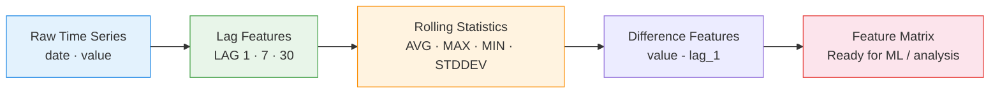

# :material-chart-bell-curve-cumulative: Time Series Forecast Features

Generate **lag features and rolling statistics** for time series forecasting — transform
raw time series into a feature matrix suitable for ML models or trend analysis.

______________________________________________________________________

## :material-animation-play: Interactive Demo

Use the prev/next buttons to move the forecast origin and see which earlier observations become lag-1 and lag-7 features for that row. Connector lines make the feature lookup explicit.

<div id="viz-forecast-features" class="ts-viz"></div>

*The highlighted point is the row being scored; the amber and teal points feed its lag-based forecast features.*

______________________________________________________________________

## :material-sitemap: Feature Engineering Pipeline



______________________________________________________________________

## :material-code-tags: Syntax

### Sample data

```sql
CREATE OR REPLACE TEMP VIEW daily_sales AS
SELECT * FROM VALUES
  ('electronics', DATE '2024-01-01', 1200),
  ('electronics', DATE '2024-01-02', 1350),
  ('electronics', DATE '2024-01-03', 980),
  ('electronics', DATE '2024-01-04', 1100),
  ('electronics', DATE '2024-01-05', 1450),
  ('electronics', DATE '2024-01-06', 1600),
  ('electronics', DATE '2024-01-07', 1750),
  ('electronics', DATE '2024-01-08', 1300),
  ('electronics', DATE '2024-01-09', 1150),
  ('electronics', DATE '2024-01-10', 1400),
  ('electronics', DATE '2024-01-11', 1550),
  ('electronics', DATE '2024-01-12', 1200),
  ('electronics', DATE '2024-01-13', 1680),
  ('electronics', DATE '2024-01-14', 1900),
  ('electronics', DATE '2024-01-15', 1350),
  ('clothing',    DATE '2024-01-01', 800),
  ('clothing',    DATE '2024-01-02', 750),
  ('clothing',    DATE '2024-01-03', 900),
  ('clothing',    DATE '2024-01-04', 680),
  ('clothing',    DATE '2024-01-05', 720),
  ('clothing',    DATE '2024-01-06', 850),
  ('clothing',    DATE '2024-01-07', 920),
  ('clothing',    DATE '2024-01-08', 780),
  ('clothing',    DATE '2024-01-09', 810),
  ('clothing',    DATE '2024-01-10', 690),
  ('clothing',    DATE '2024-01-11', 740),
  ('clothing',    DATE '2024-01-12', 880),
  ('clothing',    DATE '2024-01-13', 960),
  ('clothing',    DATE '2024-01-14', 1020),
  ('clothing',    DATE '2024-01-15', 770)
AS t(category, sale_date, revenue);
```

______________________________________________________________________

### Lag features (1, 7, 30 days)

Create point-in-time lag features — each row references past values only.

```sql
SELECT
    category,
    sale_date,
    revenue,
    -- Short-term lag
    LAG(revenue, 1) OVER w                         AS lag_1,
    -- Weekly lag (same day last week)
    LAG(revenue, 7) OVER w                         AS lag_7,
    -- Monthly lag (approximation)
    LAG(revenue, 30) OVER w                        AS lag_30,
    -- Day-over-day change
    revenue - LAG(revenue, 1) OVER w               AS diff_1,
    -- Week-over-week change
    revenue - LAG(revenue, 7) OVER w               AS diff_7
FROM daily_sales
WINDOW w AS (PARTITION BY category ORDER BY sale_date)
ORDER BY category, sale_date;
-- Result (electronics, partial):
-- |sale_date  |revenue|lag_1|lag_7|diff_1|diff_7|
-- |2024-01-01 |1200   |NULL |NULL |NULL  |NULL  |
-- |2024-01-02 |1350   |1200 |NULL |150   |NULL  |
-- |2024-01-08 |1300   |1750 |1200 |-450  |100   |
```

______________________________________________________________________

### Rolling averages (7-day and 14-day)

Compute moving averages using only past data (no future leakage).

```sql
SELECT
    category,
    sale_date,
    revenue,
    -- 7-day rolling average (past 6 days + current)
    ROUND(AVG(revenue) OVER (
        PARTITION BY category
        ORDER BY sale_date
        ROWS BETWEEN 6 PRECEDING AND CURRENT ROW
    ), 2)                                          AS rolling_avg_7,
    -- 14-day rolling average
    ROUND(AVG(revenue) OVER (
        PARTITION BY category
        ORDER BY sale_date
        ROWS BETWEEN 13 PRECEDING AND CURRENT ROW
    ), 2)                                          AS rolling_avg_14
FROM daily_sales
ORDER BY category, sale_date;
```

______________________________________________________________________

### Rolling maximum and minimum

Detect peaks and troughs within a lookback window.

```sql
SELECT
    category,
    sale_date,
    revenue,
    -- 7-day rolling max
    MAX(revenue) OVER (
        PARTITION BY category
        ORDER BY sale_date
        ROWS BETWEEN 6 PRECEDING AND CURRENT ROW
    )                                              AS rolling_max_7,
    -- 7-day rolling min
    MIN(revenue) OVER (
        PARTITION BY category
        ORDER BY sale_date
        ROWS BETWEEN 6 PRECEDING AND CURRENT ROW
    )                                              AS rolling_min_7,
    -- Range (max - min) as volatility proxy
    MAX(revenue) OVER (
        PARTITION BY category
        ORDER BY sale_date
        ROWS BETWEEN 6 PRECEDING AND CURRENT ROW
    ) - MIN(revenue) OVER (
        PARTITION BY category
        ORDER BY sale_date
        ROWS BETWEEN 6 PRECEDING AND CURRENT ROW
    )                                              AS rolling_range_7
FROM daily_sales
ORDER BY category, sale_date;
```

______________________________________________________________________

### Rolling standard deviation

Measure volatility for anomaly detection or confidence intervals.

```sql
SELECT
    category,
    sale_date,
    revenue,
    ROUND(STDDEV(revenue) OVER (
        PARTITION BY category
        ORDER BY sale_date
        ROWS BETWEEN 6 PRECEDING AND CURRENT ROW
    ), 2)                                          AS rolling_stddev_7,
    -- Z-score: how far current value is from rolling mean
    ROUND(
        (revenue - AVG(revenue) OVER (
            PARTITION BY category
            ORDER BY sale_date
            ROWS BETWEEN 6 PRECEDING AND CURRENT ROW
        )) / NULLIF(STDDEV(revenue) OVER (
            PARTITION BY category
            ORDER BY sale_date
            ROWS BETWEEN 6 PRECEDING AND CURRENT ROW
        ), 0),
        2
    )                                              AS z_score_7
FROM daily_sales
ORDER BY category, sale_date;
```

______________________________________________________________________

### Complete feature matrix

Combine all features into a single query ready for ML export.

```sql
SELECT
    category,
    sale_date,
    revenue,
    -- Lag features
    LAG(revenue, 1) OVER w                         AS lag_1,
    LAG(revenue, 7) OVER w                         AS lag_7,
    -- Difference features
    revenue - LAG(revenue, 1) OVER w               AS diff_1,
    revenue - LAG(revenue, 7) OVER w               AS diff_7,
    -- Ratio features
    ROUND(
        revenue * 1.0 / NULLIF(LAG(revenue, 1) OVER w, 0),
        4
    )                                              AS ratio_1,
    -- Rolling aggregates
    ROUND(AVG(revenue) OVER w7, 2)                 AS rolling_avg_7,
    MAX(revenue) OVER w7                           AS rolling_max_7,
    MIN(revenue) OVER w7                           AS rolling_min_7,
    ROUND(STDDEV(revenue) OVER w7, 2)              AS rolling_stddev_7,
    -- Position within rolling window
    ROUND(
        (revenue - MIN(revenue) OVER w7) * 1.0
        / NULLIF(MAX(revenue) OVER w7 - MIN(revenue) OVER w7, 0),
        4
    )                                              AS rolling_position_7,
    -- Day of week (cyclical feature)
    DAYOFWEEK(sale_date)                           AS dow
FROM daily_sales
WINDOW
    w  AS (PARTITION BY category ORDER BY sale_date),
    w7 AS (PARTITION BY category ORDER BY sale_date
           ROWS BETWEEN 6 PRECEDING AND CURRENT ROW)
ORDER BY category, sale_date;
```

!!! warning "Avoid future leakage"

    Always use `ROWS BETWEEN n PRECEDING AND CURRENT ROW` — never include
    `FOLLOWING` rows in features used for forecasting. Future data would
    invalidate the model during inference.

______________________________________________________________________

## :material-information-outline: Key Concepts

| Feature Type     | Window Spec                                  | Purpose                         |
| ---------------- | -------------------------------------------- | ------------------------------- |
| `LAG(col, n)`    | Partition + Order                            | Point-in-time past value        |
| `diff_n`         | `value - LAG(value, n)`                      | Rate of change                  |
| `ratio_n`        | `value / LAG(value, n)`                      | Relative change (growth factor) |
| Rolling AVG      | `ROWS BETWEEN n-1 PRECEDING AND CURRENT ROW` | Trend smoothing                 |
| Rolling MAX/MIN  | Same frame                                   | Peak/trough detection           |
| Rolling STDDEV   | Same frame                                   | Volatility / anomaly detection  |
| Z-score          | `(value - rolling_avg) / rolling_stddev`     | Outlier identification          |
| Rolling position | `(value - min) / (max - min)`                | Normalised position in range    |

!!! tip "Named WINDOW clauses"

    Use `WINDOW w AS (...)` to define reusable window specifications. Spark
    optimises shared windows — multiple aggregates over the same frame share
    a single sort pass.

______________________________________________________________________

## :material-lightbulb-outline: When to Use

| Scenario                 | Features                               |
| ------------------------ | -------------------------------------- |
| Demand forecasting       | Lag 1/7/30 + rolling avg + day-of-week |
| Anomaly detection        | Z-score + rolling stddev               |
| Trend identification     | Rolling avg comparison (7 vs 30)       |
| Seasonality capture      | Lag 7 (weekly), lag 30 (monthly)       |
| Feature store population | Complete matrix exported to Parquet    |

______________________________________________________________________

## :material-speedometer: Performance Notes

| Tip                                             | Reason                                                 |
| ----------------------------------------------- | ------------------------------------------------------ |
| Use named `WINDOW` clause                       | Single sort pass for multiple aggregates               |
| Partition by entity (category, product)         | Enables parallelism across partitions                  |
| Filter warmup period (`WHERE sale_date >= ...`) | First N rows have NULLs from LAG                       |
| Write features to Parquet with partitioning     | Columnar format + partition pruning for downstream ML  |
| Use `ROWS` not `RANGE` for fixed-size windows   | `ROWS` is deterministic; `RANGE` depends on value gaps |

______________________________________________________________________

## :material-database-search: [Databricks] Real-World Example — System Tables

!!! note "[Databricks] Unity Catalog system tables"

    `system.billing.usage` is a built-in Unity Catalog system table (no
    sample data setup needed) with a natural daily time series in
    `usage_date`. An account admin must grant `USE CATALOG` on `system`,
    `USE SCHEMA` on `system.billing`, and `SELECT` on
    `system.billing.usage` before these queries will return rows.

### Forecast features from daily billing usage

```sql
-- [Databricks] Requires SELECT on system.billing.usage
WITH daily_usage AS (
    SELECT
        sku_name,
        usage_date,
        ROUND(SUM(usage_quantity), 2) AS daily_usage_quantity
    FROM system.billing.usage
    WHERE usage_date >= DATE_SUB(CURRENT_DATE(), 60)
    GROUP BY sku_name, usage_date
)
SELECT
    sku_name,
    usage_date,
    daily_usage_quantity,
    LAG(daily_usage_quantity, 1) OVER w AS lag_1,
    LAG(daily_usage_quantity, 7) OVER w AS lag_7,
    daily_usage_quantity - LAG(daily_usage_quantity, 1) OVER w AS diff_1,
    ROUND(AVG(daily_usage_quantity) OVER (
        PARTITION BY sku_name
        ORDER BY usage_date
        ROWS BETWEEN 6 PRECEDING AND CURRENT ROW
    ), 2) AS rolling_avg_7,
    ROUND(MAX(daily_usage_quantity) OVER (
        PARTITION BY sku_name
        ORDER BY usage_date
        ROWS BETWEEN 6 PRECEDING AND CURRENT ROW
    ), 2) AS rolling_max_7,
    DAYOFWEEK(usage_date) AS dow
FROM daily_usage
WINDOW w AS (PARTITION BY sku_name ORDER BY usage_date)
ORDER BY sku_name, usage_date;
-- Result (illustrative):
-- sku_name             | usage_date  | daily_usage_quantity | lag_1 | lag_7 | diff_1 | rolling_avg_7 | rolling_max_7 | dow
-- -------------------- | ----------- | -------------------- | ----- | ----- | ------ | ------------- | ------------- | ---
-- SERVERLESS_SQL       | 2024-07-02  | 418.25               | 401.8 | 389.4 | 16.45  | 397.62        | 418.25        | 3
-- PREMIUM_JOBS_COMPUTE | 2024-07-02  | 955.10               | 931.2 | 904.6 | 23.90  | 918.87        | 955.10        | 3
```

!!! tip "Same feature set, production forecasting"

    Real forecasting datasets usually start as a daily aggregate over an
    operational table like `system.billing.usage`. Once the series is at a
    stable grain, the exact same lag, diff, and rolling-window features work
    unchanged.

______________________________________________________________________

## :material-arrow-right: Related

- [Lag & Lead Analysis](lag-and-lead.md) — foundational LAG/LEAD patterns
- [Time Aggregation](time-aggregation.md) — temporal GROUP BY patterns
- [Gap Filling](gap-filling.md) — handle missing dates before computing features
- [Tumbling Windows](../windowing/tumbling-window.md) — fixed-interval aggregation
