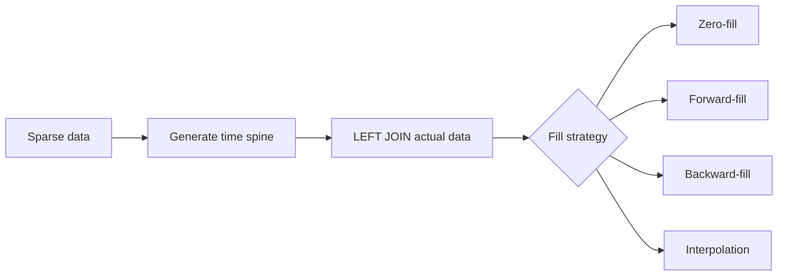

# :material-table-sync: Gap Fill

Real-world time series are often **sparse**: some dates or hours have no events.
Gap filling generates a complete, contiguous sequence of time buckets and fills missing entries using a chosen strategy.

---

## :material-magnify: Why Gap Fill?

Without gap filling, rolling averages and charts silently skip missing periods, distorting results.



---

## :material-database: Sample Data

### Sparse daily sales (random gaps — realistic pattern)

Real data rarely has uniform gaps. Here the North region has a 3-day outage mid-month,
while the South region drops data on scattered weekdays — mimicking ETL failures,
holiday closures, and upstream system downtime.

```sql
-- Sales data with irregular gaps per region
-- North: missing Jan 4-6 (3-day outage), then single gaps on Jan 9, 14
-- South: missing Jan 2, 5, 8-10 (weekend + Monday outage), 13
CREATE OR REPLACE TEMP VIEW sparse_sales AS
SELECT * FROM VALUES
  (DATE('2024-01-01'), 'North', 1200.00),
  (DATE('2024-01-02'), 'North', 1350.00),
  (DATE('2024-01-03'), 'North', 1500.00),
  -- North gap: Jan 4, 5, 6 (3-day outage)
  (DATE('2024-01-07'), 'North', 2100.00),
  (DATE('2024-01-08'), 'North', 1950.00),
  -- North gap: Jan 9 (single day)
  (DATE('2024-01-10'), 'North', 1700.00),
  (DATE('2024-01-11'), 'North', 1650.00),
  (DATE('2024-01-12'), 'North', 1800.00),
  (DATE('2024-01-13'), 'North', 1400.00),
  -- North gap: Jan 14 (single day)
  (DATE('2024-01-15'), 'North', 1550.00),

  (DATE('2024-01-01'), 'South',  800.00),
  -- South gap: Jan 2 (single day)
  (DATE('2024-01-03'), 'South',  950.00),
  (DATE('2024-01-04'), 'South', 1020.00),
  -- South gap: Jan 5 (single day)
  (DATE('2024-01-06'), 'South',  870.00),
  (DATE('2024-01-07'), 'South',  920.00),
  -- South gap: Jan 8, 9, 10 (weekend + Monday outage)
  (DATE('2024-01-11'), 'South', 1100.00),
  (DATE('2024-01-12'), 'South', 1050.00),
  -- South gap: Jan 13 (single day)
  (DATE('2024-01-14'), 'South',  980.00),
  (DATE('2024-01-15'), 'South', 1150.00)
AS sparse_sales(sale_date, region, revenue);
```

??? note "Visual: which days have data?"

    Gaps are **irregular** — note the multi-day outage for North (Jan 4–6) and South (Jan 8–10):

    | Date       | North | South |
    |------------|:-----:|:-----:|
    | 2024-01-01 | 1200  | 800   |
    | 2024-01-02 | 1350  | —     |
    | 2024-01-03 | 1500  | 950   |
    | 2024-01-04 | —     | 1020  |
    | 2024-01-05 | —     | —     |
    | 2024-01-06 | —     | 870   |
    | 2024-01-07 | 2100  | 920   |
    | 2024-01-08 | 1950  | —     |
    | 2024-01-09 | —     | —     |
    | 2024-01-10 | 1700  | —     |
    | 2024-01-11 | 1650  | 1100  |
    | 2024-01-12 | 1800  | 1050  |
    | 2024-01-13 | 1400  | —     |
    | 2024-01-14 | —     | 980   |
    | 2024-01-15 | 1550  | 1150  |

### Sparse hourly metrics (server monitoring — irregular)

Servers report at unpredictable intervals: `web-01` has a 4-hour gap mid-day
(network partition), while `db-01` only reports every few hours with varying spacing.

```sql
-- CPU utilization with realistic irregular gaps
-- web-01: reports hourly but has a 4-hour gap (09:00–12:00) and a 2-hour gap (15:00–16:00)
-- db-01: reports sporadically — only 5 samples across 24 hours
CREATE OR REPLACE TEMP VIEW sparse_metrics AS
SELECT * FROM VALUES
  (TIMESTAMP('2024-06-01 06:00:00'), 'web-01', 35.0),
  (TIMESTAMP('2024-06-01 07:00:00'), 'web-01', 42.0),
  (TIMESTAMP('2024-06-01 08:00:00'), 'web-01', 58.0),
  -- web-01 gap: 09, 10, 11, 12 (4-hour network partition)
  (TIMESTAMP('2024-06-01 13:00:00'), 'web-01', 78.0),
  (TIMESTAMP('2024-06-01 14:00:00'), 'web-01', 65.0),
  -- web-01 gap: 15, 16 (2-hour gap)
  (TIMESTAMP('2024-06-01 17:00:00'), 'web-01', 88.0),
  (TIMESTAMP('2024-06-01 18:00:00'), 'web-01', 72.0),
  (TIMESTAMP('2024-06-01 19:00:00'), 'web-01', 55.0),
  (TIMESTAMP('2024-06-01 20:00:00'), 'web-01', 30.0),

  (TIMESTAMP('2024-06-01 06:00:00'), 'db-01',  22.0),
  -- db-01 gap: 07, 08, 09 (3 hours)
  (TIMESTAMP('2024-06-01 10:00:00'), 'db-01',  45.0),
  -- db-01 gap: 11, 12, 13, 14 (4 hours)
  (TIMESTAMP('2024-06-01 15:00:00'), 'db-01',  72.0),
  -- db-01 gap: 16 (1 hour)
  (TIMESTAMP('2024-06-01 17:00:00'), 'db-01',  55.0),
  -- db-01 gap: 18, 19 (2 hours)
  (TIMESTAMP('2024-06-01 20:00:00'), 'db-01',  30.0)
AS sparse_metrics(metric_time, server, cpu_pct);
```

---

## :material-calendar-range: Step 1 — Generate a Date Spine

```sql
-- Daily spine covering the full range (15 days)
CREATE OR REPLACE TEMP VIEW date_spine AS
SELECT EXPLODE(
    SEQUENCE(DATE '2024-01-01', DATE '2024-01-15', INTERVAL 1 DAY)
) AS sale_date;
```

??? success "Expected output"

    | sale_date  |
    |------------|
    | 2024-01-01 |
    | 2024-01-02 |
    | 2024-01-03 |
    | ...        |
    | 2024-01-15 |

For hourly resolution:

```sql
-- Hourly spine (15-hour window)
CREATE OR REPLACE TEMP VIEW hour_spine AS
SELECT EXPLODE(
    SEQUENCE(
        TIMESTAMP '2024-06-01 06:00:00',
        TIMESTAMP '2024-06-01 20:00:00',
        INTERVAL 1 HOUR
    )
) AS metric_hour;
```

---

## :material-table-merge-cells: Step 2 — Build a Complete Grid

Cross-join the spine with all dimension values to get every `(date, region)` combination:

```sql
CREATE OR REPLACE TEMP VIEW full_grid AS
SELECT d.sale_date, r.region
FROM date_spine AS d
CROSS JOIN (SELECT DISTINCT region FROM sparse_sales) AS r;
```

??? success "Expected output (30 rows — 15 days × 2 regions)"

    | sale_date  | region |
    |------------|--------|
    | 2024-01-01 | North  |
    | 2024-01-01 | South  |
    | 2024-01-02 | North  |
    | 2024-01-02 | South  |
    | ...        | ...    |
    | 2024-01-15 | North  |
    | 2024-01-15 | South  |

---

## :material-numeric-0-circle-outline: Zero-Fill

Replace missing values with `0`:

```sql
SELECT
    g.sale_date,
    g.region,
    COALESCE(s.revenue, 0.0) AS revenue
FROM full_grid AS g
LEFT JOIN sparse_sales AS s
    ON g.sale_date = s.sale_date
    AND g.region = s.region
ORDER BY g.region, g.sale_date;
```

??? success "Expected output (North region — note multi-day zero blocks)"

    | sale_date  | region | revenue |
    |------------|--------|---------|
    | 2024-01-01 | North  | 1200.00 |
    | 2024-01-02 | North  | 1350.00 |
    | 2024-01-03 | North  | 1500.00 |
    | 2024-01-04 | North  | **0.00** |
    | 2024-01-05 | North  | **0.00** |
    | 2024-01-06 | North  | **0.00** |
    | 2024-01-07 | North  | 2100.00 |
    | 2024-01-08 | North  | 1950.00 |
    | 2024-01-09 | North  | **0.00** |
    | 2024-01-10 | North  | 1700.00 |
    | 2024-01-11 | North  | 1650.00 |
    | 2024-01-12 | North  | 1800.00 |
    | 2024-01-13 | North  | 1400.00 |
    | 2024-01-14 | North  | **0.00** |
    | 2024-01-15 | North  | 1550.00 |

---

## :material-arrow-right-bold: Forward-Fill

Carry the last known value forward into gaps using `LAST_VALUE(expr, TRUE)` (second arg = ignore nulls):

```sql
WITH joined AS (
    SELECT g.sale_date, g.region, s.revenue
    FROM full_grid AS g
    LEFT JOIN sparse_sales AS s
        ON g.sale_date = s.sale_date AND g.region = s.region
)
SELECT
    sale_date,
    region,
    revenue AS raw_revenue,
    LAST_VALUE(revenue, TRUE) OVER (
        PARTITION BY region
        ORDER BY sale_date
        ROWS BETWEEN UNBOUNDED PRECEDING AND CURRENT ROW
    ) AS ffill_revenue
FROM joined
ORDER BY region, sale_date;
```

??? success "Expected output (North region — forward-fill carries through multi-day gaps)"

    | sale_date  | region | raw_revenue | ffill_revenue |
    |------------|--------|-------------|---------------|
    | 2024-01-01 | North  | 1200.00     | 1200.00       |
    | 2024-01-02 | North  | 1350.00     | 1350.00       |
    | 2024-01-03 | North  | 1500.00     | 1500.00       |
    | 2024-01-04 | North  | NULL        | **1500.00**   |
    | 2024-01-05 | North  | NULL        | **1500.00**   |
    | 2024-01-06 | North  | NULL        | **1500.00**   |
    | 2024-01-07 | North  | 2100.00     | 2100.00       |
    | 2024-01-08 | North  | 1950.00     | 1950.00       |
    | 2024-01-09 | North  | NULL        | **1950.00**   |
    | 2024-01-10 | North  | 1700.00     | 1700.00       |
    | 2024-01-11 | North  | 1650.00     | 1650.00       |
    | 2024-01-12 | North  | 1800.00     | 1800.00       |
    | 2024-01-13 | North  | 1400.00     | 1400.00       |
    | 2024-01-14 | North  | NULL        | **1400.00**   |
    | 2024-01-15 | North  | 1550.00     | 1550.00       |

!!! warning "Stale data in long gaps"

    Forward-fill repeats Jan 3's value (1500) for 3 consecutive days. For multi-day
    outages, consider combining forward-fill with a **staleness threshold** that
    reverts to NULL after N days without a fresh reading.

---

## :material-arrow-left-bold: Backward-Fill

Fill NULLs with the **next** known value using `FIRST_VALUE(expr, TRUE)` (second arg = ignore nulls):

```sql
WITH joined AS (
    SELECT g.sale_date, g.region, s.revenue
    FROM full_grid AS g
    LEFT JOIN sparse_sales AS s
        ON g.sale_date = s.sale_date AND g.region = s.region
)
SELECT
    sale_date,
    region,
    revenue AS raw_revenue,
    FIRST_VALUE(revenue, TRUE) OVER (
        PARTITION BY region
        ORDER BY sale_date
        ROWS BETWEEN CURRENT ROW AND UNBOUNDED FOLLOWING
    ) AS bfill_revenue
FROM joined
ORDER BY region, sale_date;
```

??? success "Expected output (North region — backward-fill pulls future value into gaps)"

    | sale_date  | region | raw_revenue | bfill_revenue |
    |------------|--------|-------------|---------------|
    | 2024-01-01 | North  | 1200.00     | 1200.00       |
    | 2024-01-02 | North  | 1350.00     | 1350.00       |
    | 2024-01-03 | North  | 1500.00     | 1500.00       |
    | 2024-01-04 | North  | NULL        | **2100.00**   |
    | 2024-01-05 | North  | NULL        | **2100.00**   |
    | 2024-01-06 | North  | NULL        | **2100.00**   |
    | 2024-01-07 | North  | 2100.00     | 2100.00       |
    | 2024-01-08 | North  | 1950.00     | 1950.00       |
    | 2024-01-09 | North  | NULL        | **1700.00**   |
    | 2024-01-10 | North  | 1700.00     | 1700.00       |
    | 2024-01-11 | North  | 1650.00     | 1650.00       |
    | 2024-01-12 | North  | 1800.00     | 1800.00       |
    | 2024-01-13 | North  | 1400.00     | 1400.00       |
    | 2024-01-14 | North  | NULL        | **1550.00**   |
    | 2024-01-15 | North  | 1550.00     | 1550.00       |

---

## :material-timer-sand: Forward-Fill with Staleness Threshold

When gaps are irregular and potentially long, unbounded forward-fill can propagate
stale data for days. A **staleness threshold** limits how far a value carries forward:

```sql
WITH joined AS (
    SELECT g.sale_date, g.region, s.revenue
    FROM full_grid AS g
    LEFT JOIN sparse_sales AS s
        ON g.sale_date = s.sale_date AND g.region = s.region
),
with_last_known AS (
    SELECT *,
        LAST_VALUE(revenue, TRUE) OVER (
            PARTITION BY region ORDER BY sale_date
            ROWS BETWEEN UNBOUNDED PRECEDING AND CURRENT ROW
        ) AS last_known_value,
        LAST_VALUE(
            CASE WHEN revenue IS NOT NULL THEN sale_date END, TRUE
        ) OVER (
            PARTITION BY region ORDER BY sale_date
            ROWS BETWEEN UNBOUNDED PRECEDING AND CURRENT ROW
        ) AS last_known_date
    FROM joined
)
SELECT
    sale_date,
    region,
    revenue AS raw_revenue,
    CASE
        WHEN revenue IS NOT NULL THEN revenue
        WHEN DATEDIFF(sale_date, last_known_date) <= 2 THEN last_known_value
        ELSE NULL  -- stale: gap exceeds threshold
    END AS ffill_2day_max
FROM with_last_known
WHERE region = 'North'
ORDER BY sale_date;
```

??? success "Expected output (North — 2-day staleness limit)"

    The 3-day gap (Jan 4–6) gets **partially** filled: Jan 4–5 carry forward, but Jan 6
    reverts to NULL because the last reading (Jan 3) is 3 days old:

    | sale_date  | region | raw_revenue | ffill_2day_max |
    |------------|--------|-------------|----------------|
    | 2024-01-01 | North  | 1200.00     | 1200.00        |
    | 2024-01-02 | North  | 1350.00     | 1350.00        |
    | 2024-01-03 | North  | 1500.00     | 1500.00        |
    | 2024-01-04 | North  | NULL        | **1500.00**    |
    | 2024-01-05 | North  | NULL        | **1500.00**    |
    | 2024-01-06 | North  | NULL        | **NULL**       |
    | 2024-01-07 | North  | 2100.00     | 2100.00        |
    | 2024-01-08 | North  | 1950.00     | 1950.00        |
    | 2024-01-09 | North  | NULL        | **1950.00**    |
    | 2024-01-10 | North  | 1700.00     | 1700.00        |
    | ...        |        |             |                |

!!! tip "Choosing a staleness threshold"

    - **Sensor data**: 2–3× the expected reporting interval
    - **Daily business data**: 1–2 days (single missed ETL is OK, multi-day isn't)
    - **Weekly aggregates**: 7–10 days

---

## :material-chart-line: Linear Interpolation

Fill gaps with values on the straight line between surrounding known points.
With irregular gaps, interpolation distributes the change proportionally across the gap width:

```sql
WITH joined AS (
    SELECT g.sale_date, g.region, s.revenue,
        DATEDIFF(g.sale_date, DATE '2024-01-01') AS day_offset
    FROM full_grid AS g
    LEFT JOIN sparse_sales AS s
        ON g.sale_date = s.sale_date AND g.region = s.region
),
with_anchors AS (
    SELECT *,
        LAST_VALUE(revenue, TRUE) OVER (
            PARTITION BY region ORDER BY sale_date
            ROWS BETWEEN UNBOUNDED PRECEDING AND CURRENT ROW) AS prev_value,
        LAST_VALUE(day_offset, TRUE) OVER (
            PARTITION BY region ORDER BY sale_date
            ROWS BETWEEN UNBOUNDED PRECEDING AND CURRENT ROW) AS prev_offset,
        FIRST_VALUE(revenue, TRUE) OVER (
            PARTITION BY region ORDER BY sale_date
            ROWS BETWEEN CURRENT ROW AND UNBOUNDED FOLLOWING) AS next_value,
        FIRST_VALUE(day_offset, TRUE) OVER (
            PARTITION BY region ORDER BY sale_date
            ROWS BETWEEN CURRENT ROW AND UNBOUNDED FOLLOWING) AS next_offset
    FROM joined
)
SELECT sale_date, region, revenue AS raw_revenue,
    CASE
        WHEN revenue IS NOT NULL THEN revenue
        WHEN prev_offset = next_offset THEN prev_value
        ELSE ROUND(prev_value
            + (next_value - prev_value)
              * (day_offset - prev_offset)
              / NULLIF(next_offset - prev_offset, 0), 2)
    END AS interpolated_revenue
FROM with_anchors
ORDER BY region, sale_date;
```

??? success "Expected output (North region — note how 3-day gap interpolates differently than 1-day gaps)"

    The 3-day gap (Jan 4–6) spans from 1500 → 2100, so each day steps by +150:

    | sale_date  | region | raw_revenue | interpolated_revenue |
    |------------|--------|-------------|----------------------|
    | 2024-01-01 | North  | 1200.00     | 1200.00              |
    | 2024-01-02 | North  | 1350.00     | 1350.00              |
    | 2024-01-03 | North  | 1500.00     | 1500.00              |
    | 2024-01-04 | North  | NULL        | **1650.00**          |
    | 2024-01-05 | North  | NULL        | **1800.00**          |
    | 2024-01-06 | North  | NULL        | **1950.00**          |
    | 2024-01-07 | North  | 2100.00     | 2100.00              |
    | 2024-01-08 | North  | 1950.00     | 1950.00              |
    | 2024-01-09 | North  | NULL        | **1825.00**          |
    | 2024-01-10 | North  | 1700.00     | 1700.00              |
    | 2024-01-11 | North  | 1650.00     | 1650.00              |
    | 2024-01-12 | North  | 1800.00     | 1800.00              |
    | 2024-01-13 | North  | 1400.00     | 1400.00              |
    | 2024-01-14 | North  | NULL        | **1475.00**          |
    | 2024-01-15 | North  | 1550.00     | 1550.00              |

!!! tip "Interpolation accuracy degrades with gap width"

    A 1-day gap (Jan 9) interpolates well because the anchors are close.
    A 3-day gap (Jan 4–6) assumes linear change over 4 days — which may not reflect
    reality if there was a spike/dip within the gap. Consider cubic spline or
    domain-specific models for gaps wider than 2–3 periods.

---

## :material-clock-outline: Hourly Gap Fill (Server Metrics)

```sql
-- Full hourly grid for all servers
WITH hour_grid AS (
    SELECT h.metric_hour, s.server
    FROM hour_spine h
    CROSS JOIN (SELECT DISTINCT server FROM sparse_metrics) s
),
joined AS (
    SELECT g.metric_hour, g.server, m.cpu_pct
    FROM hour_grid g
    LEFT JOIN sparse_metrics m
        ON g.metric_hour = m.metric_time AND g.server = m.server
)
SELECT
    metric_hour,
    server,
    cpu_pct AS raw_cpu,
    LAST_VALUE(cpu_pct, TRUE) OVER (
        PARTITION BY server ORDER BY metric_hour
        ROWS BETWEEN UNBOUNDED PRECEDING AND CURRENT ROW
    ) AS ffill_cpu
FROM joined
ORDER BY server, metric_hour;
```

??? success "Expected output (db-01 — note 4-hour gap with stale forward-fill)"

    | metric_hour         | server | raw_cpu | ffill_cpu |
    |---------------------|--------|---------|-----------|
    | 2024-06-01 06:00:00 | db-01  | 22.0    | 22.0      |
    | 2024-06-01 07:00:00 | db-01  | NULL    | **22.0**  |
    | 2024-06-01 08:00:00 | db-01  | NULL    | **22.0**  |
    | 2024-06-01 09:00:00 | db-01  | NULL    | **22.0**  |
    | 2024-06-01 10:00:00 | db-01  | 45.0    | 45.0      |
    | 2024-06-01 11:00:00 | db-01  | NULL    | **45.0**  |
    | 2024-06-01 12:00:00 | db-01  | NULL    | **45.0**  |
    | 2024-06-01 13:00:00 | db-01  | NULL    | **45.0**  |
    | 2024-06-01 14:00:00 | db-01  | NULL    | **45.0**  |
    | 2024-06-01 15:00:00 | db-01  | 72.0    | 72.0      |
    | 2024-06-01 16:00:00 | db-01  | NULL    | **72.0**  |
    | 2024-06-01 17:00:00 | db-01  | 55.0    | 55.0      |
    | 2024-06-01 18:00:00 | db-01  | NULL    | **55.0**  |
    | 2024-06-01 19:00:00 | db-01  | NULL    | **55.0**  |
    | 2024-06-01 20:00:00 | db-01  | 30.0    | 30.0      |

---

## :material-chart-bell-curve: Rolling Average on Filled Series

Combine zero-fill with a rolling window for correct moving averages:

```sql
WITH filled AS (
    SELECT g.sale_date, g.region, COALESCE(s.revenue, 0.0) AS revenue
    FROM full_grid AS g
    LEFT JOIN sparse_sales AS s
        ON g.sale_date = s.sale_date AND g.region = s.region
)
SELECT sale_date, region, revenue,
    ROUND(AVG(revenue) OVER (
        PARTITION BY region ORDER BY sale_date
        ROWS BETWEEN 2 PRECEDING AND CURRENT ROW
    ), 2) AS ma_3d
FROM filled
ORDER BY region, sale_date;
```

??? success "Expected output (North region — notice how the 3-day outage creates a distorted trough)"

    | sale_date  | region | revenue | ma_3d   |
    |------------|--------|---------|---------|
    | 2024-01-01 | North  | 1200.00 | 1200.00 |
    | 2024-01-02 | North  | 1350.00 | 1275.00 |
    | 2024-01-03 | North  | 1500.00 | 1350.00 |
    | 2024-01-04 | North  | 0.00    | 950.00  |
    | 2024-01-05 | North  | 0.00    | 500.00  |
    | 2024-01-06 | North  | 0.00    | 0.00    |
    | 2024-01-07 | North  | 2100.00 | 700.00  |
    | 2024-01-08 | North  | 1950.00 | 1350.00 |
    | 2024-01-09 | North  | 0.00    | 1350.00 |
    | 2024-01-10 | North  | 1700.00 | 1216.67 |
    | 2024-01-11 | North  | 1650.00 | 1116.67 |
    | 2024-01-12 | North  | 1800.00 | 1716.67 |
    | 2024-01-13 | North  | 1400.00 | 1616.67 |
    | 2024-01-14 | North  | 0.00    | 1066.67 |
    | 2024-01-15 | North  | 1550.00 | 983.33  |

!!! tip "Compare: with vs without gap fill"

    Without zero-fill, a 3-day moving average on Jan 7 would be `AVG(1500, 2100) = 1800`
    — skipping the 3-day outage entirely and **overstating** the average by 157%.
    
    Zero-fill correctly shows the trough (Jan 5–6: ma=0–500), making the outage
    visible in dashboards. For multi-day gaps, consider **forward-fill** instead if
    "no data ≠ zero activity" in your domain.

---

## :material-alert-circle-outline: Gap Detection

Report each contiguous block of missing dates — with irregular gaps, multi-day blocks are
clearly distinguished from single-day dropouts:

```sql
WITH flagged AS (
    SELECT g.sale_date, g.region, s.revenue IS NULL AS in_gap,
        SUM(CASE WHEN s.revenue IS NOT NULL THEN 1 ELSE 0 END) OVER (
            PARTITION BY g.region ORDER BY g.sale_date
            ROWS BETWEEN UNBOUNDED PRECEDING AND CURRENT ROW
        ) AS gap_group
    FROM full_grid AS g
    LEFT JOIN sparse_sales AS s
        ON g.sale_date = s.sale_date AND g.region = s.region
)
SELECT region, MIN(sale_date) AS gap_start, MAX(sale_date) AS gap_end, COUNT(*) AS gap_days
FROM flagged
WHERE in_gap
GROUP BY region, gap_group
ORDER BY region, gap_start;
```

??? success "Expected output — irregular gaps clearly identified"

    | region | gap_start  | gap_end    | gap_days |
    |--------|------------|------------|----------|
    | North  | 2024-01-04 | 2024-01-06 | **3**    |
    | North  | 2024-01-09 | 2024-01-09 | 1        |
    | North  | 2024-01-14 | 2024-01-14 | 1        |
    | South  | 2024-01-02 | 2024-01-02 | 1        |
    | South  | 2024-01-05 | 2024-01-05 | 1        |
    | South  | 2024-01-08 | 2024-01-10 | **3**    |
    | South  | 2024-01-13 | 2024-01-13 | 1        |

!!! note "Gap severity classification"

    Use `gap_days` to triage data quality issues:
    
    - **1 day**: Likely transient (single ETL failure, holiday)
    - **2–3 days**: Potential system issue (weekend + recovery, network partition)
    - **4+ days**: Probable outage requiring investigation

---

## :material-compare: Fill All Strategies Side-by-Side

```sql
WITH joined AS (
    SELECT g.sale_date, g.region, s.revenue,
        DATEDIFF(g.sale_date, DATE '2024-01-01') AS day_offset
    FROM full_grid AS g
    LEFT JOIN sparse_sales AS s
        ON g.sale_date = s.sale_date AND g.region = s.region
)
SELECT
    sale_date,
    region,
    revenue                                                                 AS raw,
    COALESCE(revenue, 0.0)                                                  AS zero_fill,
    LAST_VALUE(revenue, TRUE) OVER (
        PARTITION BY region ORDER BY sale_date
        ROWS BETWEEN UNBOUNDED PRECEDING AND CURRENT ROW)                   AS forward_fill,
    FIRST_VALUE(revenue, TRUE) OVER (
        PARTITION BY region ORDER BY sale_date
        ROWS BETWEEN CURRENT ROW AND UNBOUNDED FOLLOWING)                   AS backward_fill
FROM joined
WHERE region = 'North'
ORDER BY sale_date;
```

??? success "Expected output — compare how each strategy handles the 3-day gap differently"

    | sale_date  | region | raw     | zero_fill | forward_fill | backward_fill |
    |------------|--------|---------|-----------|--------------|---------------|
    | 2024-01-01 | North  | 1200.00 | 1200.00   | 1200.00      | 1200.00       |
    | 2024-01-02 | North  | 1350.00 | 1350.00   | 1350.00      | 1350.00       |
    | 2024-01-03 | North  | 1500.00 | 1500.00   | 1500.00      | 1500.00       |
    | 2024-01-04 | North  | NULL    | 0.00      | 1500.00      | 2100.00       |
    | 2024-01-05 | North  | NULL    | 0.00      | 1500.00      | 2100.00       |
    | 2024-01-06 | North  | NULL    | 0.00      | 1500.00      | 2100.00       |
    | 2024-01-07 | North  | 2100.00 | 2100.00   | 2100.00      | 2100.00       |
    | 2024-01-08 | North  | 1950.00 | 1950.00   | 1950.00      | 1950.00       |
    | 2024-01-09 | North  | NULL    | 0.00      | 1950.00      | 1700.00       |
    | 2024-01-10 | North  | 1700.00 | 1700.00   | 1700.00      | 1700.00       |
    | 2024-01-11 | North  | 1650.00 | 1650.00   | 1650.00      | 1650.00       |
    | 2024-01-12 | North  | 1800.00 | 1800.00   | 1800.00      | 1800.00       |
    | 2024-01-13 | North  | 1400.00 | 1400.00   | 1400.00      | 1400.00       |
    | 2024-01-14 | North  | NULL    | 0.00      | 1400.00      | 1550.00       |
    | 2024-01-15 | North  | 1550.00 | 1550.00   | 1550.00      | 1550.00       |

---

## :material-table-check: Strategy Comparison

| Strategy | Best for | Behaviour on leading NULLs | Example |
|----------|----------|---------------------------|---------|
| Zero-fill | Counts, events, absence = no activity | Always 0 | Order count per hour |
| Forward-fill | Prices, sensor state, last-known | NULL until first data point | Stock price, CPU % |
| Backward-fill | Initialisation from future | NULL after last data point | Planned capacity |
| Interpolation | Smooth continuous metrics | Requires both neighbours | Temperature, load |

!!! warning "Choosing the wrong strategy distorts analytics"

    - Zero-filling revenue gaps inflates averages downward
    - Forward-filling event counts misrepresents activity
    - Interpolation assumes linear behaviour between points
    
    Choose the strategy that matches the **business meaning** of a missing value.

---

## :material-animation-play: Interactive Demo

> Click the buttons below the chart to switch between fill strategies.
> **Purple** bars = original data. **Orange** bars = filled values.

<div id="viz-gapfill" class="ts-viz"></div>
