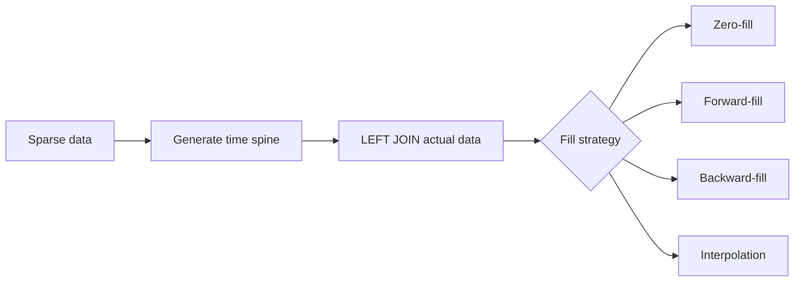

# :material-table-sync: Gap Fill

Real-world time series are often **sparse**: some dates or hours have no events.
Gap filling generates a complete, contiguous sequence of time buckets and fills missing entries using a chosen strategy.

---

## :material-magnify: Why Gap Fill?

Without gap filling, rolling averages and charts silently skip missing periods, distorting results.



---

## :material-database: Sample Data

### Sparse daily sales (gaps on some days)

```sql
-- Sales data with intentional gaps (no data for Jan 2, 4, 6)
CREATE OR REPLACE TEMP VIEW sparse_sales AS
SELECT * FROM VALUES
  (DATE('2024-01-01'), 'North', 1200.00),
  (DATE('2024-01-01'), 'South',  800.00),
  (DATE('2024-01-03'), 'North', 1500.00),
  (DATE('2024-01-03'), 'South',  950.00),
  (DATE('2024-01-05'), 'North', 1800.00),
  (DATE('2024-01-05'), 'South', 1100.00),
  (DATE('2024-01-07'), 'North', 1350.00),
  (DATE('2024-01-07'), 'South',  900.00)
AS sparse_sales(sale_date, region, revenue);
```

??? note "Visual: which days have data?"

    | Date       | North | South |
    |------------|:-----:|:-----:|
    | 2024-01-01 | 1200  | 800   |
    | 2024-01-02 | —     | —     |
    | 2024-01-03 | 1500  | 950   |
    | 2024-01-04 | —     | —     |
    | 2024-01-05 | 1800  | 1100  |
    | 2024-01-06 | —     | —     |
    | 2024-01-07 | 1350  | 900   |

### Sparse hourly metrics (server monitoring)

```sql
-- CPU utilization samples with missing hours
CREATE OR REPLACE TEMP VIEW sparse_metrics AS
SELECT * FROM VALUES
  (TIMESTAMP('2024-06-01 00:00:00'), 'web-01', 35.0),
  (TIMESTAMP('2024-06-01 01:00:00'), 'web-01', 42.0),
  (TIMESTAMP('2024-06-01 03:00:00'), 'web-01', 78.0),
  (TIMESTAMP('2024-06-01 04:00:00'), 'web-01', 65.0),
  (TIMESTAMP('2024-06-01 07:00:00'), 'web-01', 88.0),
  (TIMESTAMP('2024-06-01 08:00:00'), 'web-01', 92.0),
  (TIMESTAMP('2024-06-01 00:00:00'), 'db-01',  22.0),
  (TIMESTAMP('2024-06-01 02:00:00'), 'db-01',  28.0),
  (TIMESTAMP('2024-06-01 05:00:00'), 'db-01',  55.0),
  (TIMESTAMP('2024-06-01 08:00:00'), 'db-01',  45.0)
AS sparse_metrics(metric_time, server, cpu_pct);
```

---

## :material-calendar-range: Step 1 — Generate a Date Spine

```sql
-- Daily spine
CREATE OR REPLACE TEMP VIEW date_spine AS
SELECT EXPLODE(
    SEQUENCE(DATE '2024-01-01', DATE '2024-01-07', INTERVAL 1 DAY)
) AS sale_date;
```

??? success "Expected output"

    | sale_date  |
    |------------|
    | 2024-01-01 |
    | 2024-01-02 |
    | 2024-01-03 |
    | 2024-01-04 |
    | 2024-01-05 |
    | 2024-01-06 |
    | 2024-01-07 |

For hourly resolution:

```sql
-- Hourly spine
CREATE OR REPLACE TEMP VIEW hour_spine AS
SELECT EXPLODE(
    SEQUENCE(
        TIMESTAMP '2024-06-01 00:00:00',
        TIMESTAMP '2024-06-01 08:00:00',
        INTERVAL 1 HOUR
    )
) AS metric_hour;
```

---

## :material-table-merge-cells: Step 2 — Build a Complete Grid

Cross-join the spine with all dimension values to get every `(date, region)` combination:

```sql
CREATE OR REPLACE TEMP VIEW full_grid AS
SELECT d.sale_date, r.region
FROM date_spine AS d
CROSS JOIN (SELECT DISTINCT region FROM sparse_sales) AS r;
```

??? success "Expected output (14 rows)"

    | sale_date  | region |
    |------------|--------|
    | 2024-01-01 | North  |
    | 2024-01-01 | South  |
    | 2024-01-02 | North  |
    | 2024-01-02 | South  |
    | 2024-01-03 | North  |
    | 2024-01-03 | South  |
    | ...        | ...    |

---

## :material-numeric-0-circle-outline: Zero-Fill

Replace missing values with `0`:

```sql
SELECT
    g.sale_date,
    g.region,
    COALESCE(s.revenue, 0.0) AS revenue
FROM full_grid AS g
LEFT JOIN sparse_sales AS s
    ON g.sale_date = s.sale_date
    AND g.region = s.region
ORDER BY g.region, g.sale_date;
```

??? success "Expected output (North region)"

    | sale_date  | region | revenue |
    |------------|--------|---------|
    | 2024-01-01 | North  | 1200.00 |
    | 2024-01-02 | North  | **0.00** |
    | 2024-01-03 | North  | 1500.00 |
    | 2024-01-04 | North  | **0.00** |
    | 2024-01-05 | North  | 1800.00 |
    | 2024-01-06 | North  | **0.00** |
    | 2024-01-07 | North  | 1350.00 |

---

## :material-arrow-right-bold: Forward-Fill

Carry the last known value forward into gaps using `LAST_VALUE(expr, TRUE)` (second arg = ignore nulls):

```sql
WITH joined AS (
    SELECT g.sale_date, g.region, s.revenue
    FROM full_grid AS g
    LEFT JOIN sparse_sales AS s
        ON g.sale_date = s.sale_date AND g.region = s.region
)
SELECT
    sale_date,
    region,
    revenue AS raw_revenue,
    LAST_VALUE(revenue, TRUE) OVER (
        PARTITION BY region
        ORDER BY sale_date
        ROWS BETWEEN UNBOUNDED PRECEDING AND CURRENT ROW
    ) AS ffill_revenue
FROM joined
ORDER BY region, sale_date;
```

??? success "Expected output (North region)"

    | sale_date  | region | raw_revenue | ffill_revenue |
    |------------|--------|-------------|---------------|
    | 2024-01-01 | North  | 1200.00     | 1200.00       |
    | 2024-01-02 | North  | NULL        | **1200.00**   |
    | 2024-01-03 | North  | 1500.00     | 1500.00       |
    | 2024-01-04 | North  | NULL        | **1500.00**   |
    | 2024-01-05 | North  | 1800.00     | 1800.00       |
    | 2024-01-06 | North  | NULL        | **1800.00**   |
    | 2024-01-07 | North  | 1350.00     | 1350.00       |

---

## :material-arrow-left-bold: Backward-Fill

Fill NULLs with the **next** known value using `FIRST_VALUE(expr, TRUE)` (second arg = ignore nulls):

```sql
WITH joined AS (
    SELECT g.sale_date, g.region, s.revenue
    FROM full_grid AS g
    LEFT JOIN sparse_sales AS s
        ON g.sale_date = s.sale_date AND g.region = s.region
)
SELECT
    sale_date,
    region,
    revenue AS raw_revenue,
    FIRST_VALUE(revenue, TRUE) OVER (
        PARTITION BY region
        ORDER BY sale_date
        ROWS BETWEEN CURRENT ROW AND UNBOUNDED FOLLOWING
    ) AS bfill_revenue
FROM joined
ORDER BY region, sale_date;
```

??? success "Expected output (North region)"

    | sale_date  | region | raw_revenue | bfill_revenue |
    |------------|--------|-------------|---------------|
    | 2024-01-01 | North  | 1200.00     | 1200.00       |
    | 2024-01-02 | North  | NULL        | **1500.00**   |
    | 2024-01-03 | North  | 1500.00     | 1500.00       |
    | 2024-01-04 | North  | NULL        | **1800.00**   |
    | 2024-01-05 | North  | 1800.00     | 1800.00       |
    | 2024-01-06 | North  | NULL        | **1350.00**   |
    | 2024-01-07 | North  | 1350.00     | 1350.00       |

---

## :material-chart-line: Linear Interpolation

Fill gaps with values on the straight line between surrounding known points:

```sql
WITH joined AS (
    SELECT g.sale_date, g.region, s.revenue,
        DATEDIFF(g.sale_date, DATE '2024-01-01') AS day_offset
    FROM full_grid AS g
    LEFT JOIN sparse_sales AS s
        ON g.sale_date = s.sale_date AND g.region = s.region
),
with_anchors AS (
    SELECT *,
        LAST_VALUE(revenue, TRUE) OVER (
            PARTITION BY region ORDER BY sale_date
            ROWS BETWEEN UNBOUNDED PRECEDING AND CURRENT ROW) AS prev_value,
        LAST_VALUE(day_offset, TRUE) OVER (
            PARTITION BY region ORDER BY sale_date
            ROWS BETWEEN UNBOUNDED PRECEDING AND CURRENT ROW) AS prev_offset,
        FIRST_VALUE(revenue, TRUE) OVER (
            PARTITION BY region ORDER BY sale_date
            ROWS BETWEEN CURRENT ROW AND UNBOUNDED FOLLOWING) AS next_value,
        FIRST_VALUE(day_offset, TRUE) OVER (
            PARTITION BY region ORDER BY sale_date
            ROWS BETWEEN CURRENT ROW AND UNBOUNDED FOLLOWING) AS next_offset
    FROM joined
)
SELECT sale_date, region, revenue AS raw_revenue,
    CASE
        WHEN revenue IS NOT NULL THEN revenue
        WHEN prev_offset = next_offset THEN prev_value
        ELSE ROUND(prev_value
            + (next_value - prev_value)
              * (day_offset - prev_offset)
              / NULLIF(next_offset - prev_offset, 0), 2)
    END AS interpolated_revenue
FROM with_anchors
ORDER BY region, sale_date;
```

??? success "Expected output (North region)"

    | sale_date  | region | raw_revenue | interpolated_revenue |
    |------------|--------|-------------|----------------------|
    | 2024-01-01 | North  | 1200.00     | 1200.00              |
    | 2024-01-02 | North  | NULL        | **1350.00**          |
    | 2024-01-03 | North  | 1500.00     | 1500.00              |
    | 2024-01-04 | North  | NULL        | **1650.00**          |
    | 2024-01-05 | North  | 1800.00     | 1800.00              |
    | 2024-01-06 | North  | NULL        | **1575.00**          |
    | 2024-01-07 | North  | 1350.00     | 1350.00              |

---

## :material-clock-outline: Hourly Gap Fill (Server Metrics)

```sql
-- Full hourly grid for all servers
WITH hour_grid AS (
    SELECT h.metric_hour, s.server
    FROM hour_spine h
    CROSS JOIN (SELECT DISTINCT server FROM sparse_metrics) s
),
joined AS (
    SELECT g.metric_hour, g.server, m.cpu_pct
    FROM hour_grid g
    LEFT JOIN sparse_metrics m
        ON g.metric_hour = m.metric_time AND g.server = m.server
)
SELECT
    metric_hour,
    server,
    cpu_pct AS raw_cpu,
    LAST_VALUE(cpu_pct, TRUE) OVER (
        PARTITION BY server ORDER BY metric_hour
        ROWS BETWEEN UNBOUNDED PRECEDING AND CURRENT ROW
    ) AS ffill_cpu
FROM joined
ORDER BY server, metric_hour;
```

??? success "Expected output (db-01)"

    | metric_hour         | server | raw_cpu | ffill_cpu |
    |---------------------|--------|---------|-----------|
    | 2024-06-01 00:00:00 | db-01  | 22.0    | 22.0      |
    | 2024-06-01 01:00:00 | db-01  | NULL    | **22.0**  |
    | 2024-06-01 02:00:00 | db-01  | 28.0    | 28.0      |
    | 2024-06-01 03:00:00 | db-01  | NULL    | **28.0**  |
    | 2024-06-01 04:00:00 | db-01  | NULL    | **28.0**  |
    | 2024-06-01 05:00:00 | db-01  | 55.0    | 55.0      |
    | 2024-06-01 06:00:00 | db-01  | NULL    | **55.0**  |
    | 2024-06-01 07:00:00 | db-01  | NULL    | **55.0**  |
    | 2024-06-01 08:00:00 | db-01  | 45.0    | 45.0      |

---

## :material-chart-bell-curve: Rolling Average on Filled Series

Combine zero-fill with a rolling window for correct moving averages:

```sql
WITH filled AS (
    SELECT g.sale_date, g.region, COALESCE(s.revenue, 0.0) AS revenue
    FROM full_grid AS g
    LEFT JOIN sparse_sales AS s
        ON g.sale_date = s.sale_date AND g.region = s.region
)
SELECT sale_date, region, revenue,
    ROUND(AVG(revenue) OVER (
        PARTITION BY region ORDER BY sale_date
        ROWS BETWEEN 2 PRECEDING AND CURRENT ROW
    ), 2) AS ma_3d
FROM filled
ORDER BY region, sale_date;
```

??? success "Expected output (North region)"

    | sale_date  | region | revenue | ma_3d   |
    |------------|--------|---------|---------|
    | 2024-01-01 | North  | 1200.00 | 1200.00 |
    | 2024-01-02 | North  | 0.00    | 600.00  |
    | 2024-01-03 | North  | 1500.00 | 900.00  |
    | 2024-01-04 | North  | 0.00    | 500.00  |
    | 2024-01-05 | North  | 1800.00 | 1100.00 |
    | 2024-01-06 | North  | 0.00    | 600.00  |
    | 2024-01-07 | North  | 1350.00 | 1050.00 |

!!! tip "Compare: with vs without gap fill"

    Without zero-fill, a 3-day moving average on Jan 5 would be `AVG(1200, 1500, 1800) = 1500` — skipping the zero-revenue days and inflating the average by 36%.

---

## :material-alert-circle-outline: Gap Detection

Report each contiguous block of missing dates:

```sql
WITH flagged AS (
    SELECT g.sale_date, g.region, s.revenue IS NULL AS in_gap,
        SUM(CASE WHEN s.revenue IS NOT NULL THEN 1 ELSE 0 END) OVER (
            PARTITION BY g.region ORDER BY g.sale_date
            ROWS BETWEEN UNBOUNDED PRECEDING AND CURRENT ROW
        ) AS gap_group
    FROM full_grid AS g
    LEFT JOIN sparse_sales AS s
        ON g.sale_date = s.sale_date AND g.region = s.region
)
SELECT region, MIN(sale_date) AS gap_start, MAX(sale_date) AS gap_end, COUNT(*) AS gap_days
FROM flagged
WHERE in_gap
GROUP BY region, gap_group
ORDER BY region, gap_start;
```

??? success "Expected output"

    | region | gap_start  | gap_end    | gap_days |
    |--------|------------|------------|----------|
    | North  | 2024-01-02 | 2024-01-02 | 1        |
    | North  | 2024-01-04 | 2024-01-04 | 1        |
    | North  | 2024-01-06 | 2024-01-06 | 1        |
    | South  | 2024-01-02 | 2024-01-02 | 1        |
    | South  | 2024-01-04 | 2024-01-04 | 1        |
    | South  | 2024-01-06 | 2024-01-06 | 1        |

---

## :material-compare: Fill All Strategies Side-by-Side

```sql
WITH joined AS (
    SELECT g.sale_date, g.region, s.revenue,
        DATEDIFF(g.sale_date, DATE '2024-01-01') AS day_offset
    FROM full_grid AS g
    LEFT JOIN sparse_sales AS s
        ON g.sale_date = s.sale_date AND g.region = s.region
)
SELECT
    sale_date,
    region,
    revenue                                                                 AS raw,
    COALESCE(revenue, 0.0)                                                  AS zero_fill,
    LAST_VALUE(revenue, TRUE) OVER (
        PARTITION BY region ORDER BY sale_date
        ROWS BETWEEN UNBOUNDED PRECEDING AND CURRENT ROW)                   AS forward_fill,
    FIRST_VALUE(revenue, TRUE) OVER (
        PARTITION BY region ORDER BY sale_date
        ROWS BETWEEN CURRENT ROW AND UNBOUNDED FOLLOWING)                   AS backward_fill
FROM joined
WHERE region = 'North'
ORDER BY sale_date;
```

??? success "Expected output"

    | sale_date  | region | raw     | zero_fill | forward_fill | backward_fill |
    |------------|--------|---------|-----------|--------------|---------------|
    | 2024-01-01 | North  | 1200.00 | 1200.00   | 1200.00      | 1200.00       |
    | 2024-01-02 | North  | NULL    | 0.00      | 1200.00      | 1500.00       |
    | 2024-01-03 | North  | 1500.00 | 1500.00   | 1500.00      | 1500.00       |
    | 2024-01-04 | North  | NULL    | 0.00      | 1500.00      | 1800.00       |
    | 2024-01-05 | North  | 1800.00 | 1800.00   | 1800.00      | 1800.00       |
    | 2024-01-06 | North  | NULL    | 0.00      | 1800.00      | 1350.00       |
    | 2024-01-07 | North  | 1350.00 | 1350.00   | 1350.00      | 1350.00       |

---

## :material-table-check: Strategy Comparison

| Strategy | Best for | Behaviour on leading NULLs | Example |
|----------|----------|---------------------------|---------|
| Zero-fill | Counts, events, absence = no activity | Always 0 | Order count per hour |
| Forward-fill | Prices, sensor state, last-known | NULL until first data point | Stock price, CPU % |
| Backward-fill | Initialisation from future | NULL after last data point | Planned capacity |
| Interpolation | Smooth continuous metrics | Requires both neighbours | Temperature, load |

!!! warning "Choosing the wrong strategy distorts analytics"

    - Zero-filling revenue gaps inflates averages downward
    - Forward-filling event counts misrepresents activity
    - Interpolation assumes linear behaviour between points
    
    Choose the strategy that matches the **business meaning** of a missing value.

---

## :material-animation-play: Interactive Demo

> Click the buttons below the chart to switch between fill strategies.
> **Purple** bars = original data. **Orange** bars = filled values.

<div id="viz-gapfill" class="ts-viz"></div>
