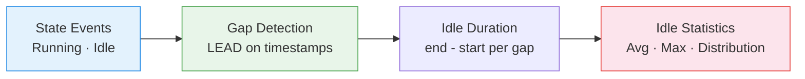

# :material-sleep: Idle Time Analysis

Compute **idle periods between active intervals** — measure wasted capacity,
identify auto-suspend opportunities, and optimise resource scheduling.

______________________________________________________________________

## :material-animation-play: Interactive Demo

Hover the hatched gaps to inspect how long the resource sat idle between active intervals. The summary below the chart shows how much of the tracked span was lost to inactivity.

<div id="viz-idle-time" class="ts-viz"></div>

*Teal blocks are active work. Hatched gray spans are idle gaps that drive the idle-time percentage.*

______________________________________________________________________

## :material-sitemap: Analysis Flow



______________________________________________________________________

## :material-code-tags: Syntax

### Sample data

```sql
CREATE OR REPLACE TEMP VIEW activity_log AS
SELECT * FROM VALUES
  ('wh_1', TIMESTAMP '2024-03-01 08:00', TIMESTAMP '2024-03-01 08:45'),
  ('wh_1', TIMESTAMP '2024-03-01 09:30', TIMESTAMP '2024-03-01 10:15'),
  ('wh_1', TIMESTAMP '2024-03-01 10:20', TIMESTAMP '2024-03-01 11:00'),
  ('wh_1', TIMESTAMP '2024-03-01 14:00', TIMESTAMP '2024-03-01 15:30'),
  ('wh_2', TIMESTAMP '2024-03-01 07:00', TIMESTAMP '2024-03-01 09:00'),
  ('wh_2', TIMESTAMP '2024-03-01 09:05', TIMESTAMP '2024-03-01 11:00'),
  ('wh_2', TIMESTAMP '2024-03-01 15:00', TIMESTAMP '2024-03-01 16:00')
AS t(resource_id, active_start, active_end);
```

______________________________________________________________________

### Idle gaps between active periods

```sql
SELECT
    resource_id,
    active_end                                     AS idle_start,
    LEAD(active_start) OVER (
        PARTITION BY resource_id ORDER BY active_start
    )                                              AS idle_end,
    ROUND(
        (UNIX_TIMESTAMP(LEAD(active_start) OVER (
            PARTITION BY resource_id ORDER BY active_start
        )) - UNIX_TIMESTAMP(active_end)) / 60.0,
        1
    )                                              AS idle_minutes
FROM activity_log
ORDER BY resource_id, active_start;
-- Result:
-- |resource_id|idle_start|idle_end |idle_minutes|
-- |wh_1       |08:45     |09:30    |45.0        |
-- |wh_1       |10:15     |10:20    |5.0         |
-- |wh_1       |11:00     |14:00    |180.0       |  ← 3 hour idle gap
-- |wh_2       |09:00     |09:05    |5.0         |
-- |wh_2       |11:00     |15:00    |240.0       |  ← 4 hour idle gap
```

______________________________________________________________________

### Idle time summary per resource

```sql
WITH idle_gaps AS (
    SELECT
        resource_id,
        (UNIX_TIMESTAMP(LEAD(active_start) OVER (
            PARTITION BY resource_id ORDER BY active_start
        )) - UNIX_TIMESTAMP(active_end)) / 60.0    AS idle_minutes
    FROM activity_log
)
SELECT
    resource_id,
    COUNT(*)                                       AS idle_periods,
    ROUND(SUM(idle_minutes), 1)                    AS total_idle_min,
    ROUND(AVG(idle_minutes), 1)                    AS avg_idle_min,
    ROUND(MAX(idle_minutes), 1)                    AS max_idle_min,
    -- Could auto-suspend have saved cost? (idle > 10 min)
    COUNT(CASE WHEN idle_minutes > 10 THEN 1 END) AS suspendable_gaps,
    ROUND(SUM(CASE WHEN idle_minutes > 10 THEN idle_minutes ELSE 0 END), 1)
                                                   AS suspendable_minutes
FROM idle_gaps
WHERE idle_minutes IS NOT NULL AND idle_minutes > 0
GROUP BY resource_id;
```

______________________________________________________________________

### Auto-suspend recommendation

```sql
WITH idle_gaps AS (
    SELECT
        resource_id,
        (UNIX_TIMESTAMP(LEAD(active_start) OVER (
            PARTITION BY resource_id ORDER BY active_start
        )) - UNIX_TIMESTAMP(active_end)) / 60.0 AS idle_min
    FROM activity_log
)
SELECT
    resource_id,
    ROUND(PERCENTILE_APPROX(idle_min, 0.5), 0)    AS median_idle_min,
    CASE
        WHEN PERCENTILE_APPROX(idle_min, 0.5) > 30 THEN 'Set auto-suspend to 10 min'
        WHEN PERCENTILE_APPROX(idle_min, 0.5) > 10 THEN 'Set auto-suspend to 5 min'
        ELSE 'Keep always-on (frequent short gaps)'
    END                                            AS recommendation
FROM idle_gaps
WHERE idle_min IS NOT NULL AND idle_min > 0
GROUP BY resource_id;
```

______________________________________________________________________

## :material-information-outline: Key Concepts

| Metric               | Formula                       | Meaning                      |
| -------------------- | ----------------------------- | ---------------------------- |
| **Idle Period**      | `next_start - current_end`    | Gap between active intervals |
| **Total Idle**       | `SUM(idle_periods)`           | Cumulative wasted time       |
| **Suspendable Time** | Idle periods > threshold      | Potential cost savings       |
| **Idle Ratio**       | `idle_time / (active + idle)` | Efficiency measure           |

!!! tip "Auto-suspend threshold"

    Set auto-suspend slightly below median idle gap. If median idle is 45 min,
    a 10-min auto-suspend saves ~35 min per gap while minimising cold-start latency.

______________________________________________________________________

## :material-lightbulb-outline: When to Use

| Scenario                          | Action                                 |
| --------------------------------- | -------------------------------------- |
| Databricks warehouse auto-suspend | Recommend optimal suspend timeout      |
| Cost optimisation                 | Quantify idle-time cost at DBU rate    |
| Schedule consolidation            | Merge workloads to eliminate idle gaps |
| Capacity planning                 | Right-size based on actual active time |

______________________________________________________________________

## :material-database-search: [Databricks] Real-World Example — System Tables

!!! note "[Databricks] Unity Catalog system tables"

    `system.query.history` is a built-in Unity Catalog system table (no
    sample data setup needed) that records real warehouse query intervals.
    An account admin must grant `USE CATALOG` on `system`, `USE SCHEMA` on
    `system.query`, and `SELECT` on `system.query.history` before these
    queries will return rows.

### Idle gaps between warehouse queries

```sql
-- [Databricks] Requires SELECT on system.query.history
WITH warehouse_activity AS (
    SELECT
        compute.warehouse_id AS warehouse_id,
        start_time AS active_start,
        end_time AS active_end
    FROM system.query.history
    WHERE start_time >= CURRENT_TIMESTAMP() - INTERVAL 7 DAYS
      AND compute.warehouse_id IS NOT NULL
      AND end_time IS NOT NULL
),
idle_gaps AS (
    SELECT
        warehouse_id,
        active_end AS idle_start,
        LEAD(active_start) OVER (
            PARTITION BY warehouse_id
            ORDER BY active_start
        ) AS idle_end
    FROM warehouse_activity
)
SELECT
    warehouse_id,
    idle_start,
    idle_end,
    ROUND(
        (UNIX_TIMESTAMP(idle_end) - UNIX_TIMESTAMP(idle_start)) / 60.0,
        1
    ) AS idle_minutes
FROM idle_gaps
WHERE idle_end IS NOT NULL
ORDER BY idle_minutes DESC, warehouse_id;
-- Result (illustrative):
-- warehouse_id | idle_start          | idle_end            | idle_minutes
-- ------------ | ------------------- | ------------------- | ------------
-- 6f91a...     | 2024-07-02 11:18:03 | 2024-07-02 13:02:14 | 104.2
-- 8b22c...     | 2024-07-02 15:47:50 | 2024-07-02 16:11:21 | 23.5
```

!!! tip "Same gap analysis, real warehouse activity"

    The synthetic `LEAD(next_start) - current_end` pattern translates
    directly to warehouse activity intervals. Once you have real idle gaps,
    they can drive auto-stop tuning, schedule consolidation, and cost-saving
    estimates.

______________________________________________________________________

## :material-arrow-right: Related

- [Utilization Analysis](utilization-analysis.md) — full busy/idle/maintenance breakdown
- [Time Allocation](time-allocation.md) — state-based time splitting
- [Cost Attribution](cost-attribution.md) — cost of idle resources
