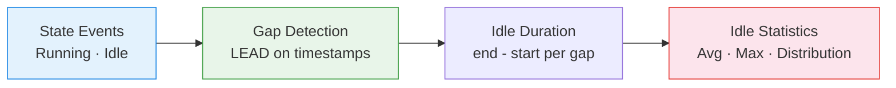

# :material-sleep: Idle Time Analysis

Compute **idle periods between active intervals** — measure wasted capacity,
identify auto-suspend opportunities, and optimise resource scheduling.

---

## :material-sitemap: Analysis Flow



---

## :material-code-tags: Syntax

### Sample data

```sql
CREATE OR REPLACE TEMP VIEW activity_log AS
SELECT * FROM VALUES
  ('wh_1', TIMESTAMP '2024-03-01 08:00', TIMESTAMP '2024-03-01 08:45'),
  ('wh_1', TIMESTAMP '2024-03-01 09:30', TIMESTAMP '2024-03-01 10:15'),
  ('wh_1', TIMESTAMP '2024-03-01 10:20', TIMESTAMP '2024-03-01 11:00'),
  ('wh_1', TIMESTAMP '2024-03-01 14:00', TIMESTAMP '2024-03-01 15:30'),
  ('wh_2', TIMESTAMP '2024-03-01 07:00', TIMESTAMP '2024-03-01 09:00'),
  ('wh_2', TIMESTAMP '2024-03-01 09:05', TIMESTAMP '2024-03-01 11:00'),
  ('wh_2', TIMESTAMP '2024-03-01 15:00', TIMESTAMP '2024-03-01 16:00')
AS t(resource_id, active_start, active_end);
```

---

### Idle gaps between active periods

```sql
SELECT
    resource_id,
    active_end                                     AS idle_start,
    LEAD(active_start) OVER (
        PARTITION BY resource_id ORDER BY active_start
    )                                              AS idle_end,
    ROUND(
        (UNIX_TIMESTAMP(LEAD(active_start) OVER (
            PARTITION BY resource_id ORDER BY active_start
        )) - UNIX_TIMESTAMP(active_end)) / 60.0,
        1
    )                                              AS idle_minutes
FROM activity_log
ORDER BY resource_id, active_start;
-- Result:
-- |resource_id|idle_start|idle_end |idle_minutes|
-- |wh_1       |08:45     |09:30    |45.0        |
-- |wh_1       |10:15     |10:20    |5.0         |
-- |wh_1       |11:00     |14:00    |180.0       |  ← 3 hour idle gap
-- |wh_2       |09:00     |09:05    |5.0         |
-- |wh_2       |11:00     |15:00    |240.0       |  ← 4 hour idle gap
```

---

### Idle time summary per resource

```sql
WITH idle_gaps AS (
    SELECT
        resource_id,
        (UNIX_TIMESTAMP(LEAD(active_start) OVER (
            PARTITION BY resource_id ORDER BY active_start
        )) - UNIX_TIMESTAMP(active_end)) / 60.0    AS idle_minutes
    FROM activity_log
)
SELECT
    resource_id,
    COUNT(*)                                       AS idle_periods,
    ROUND(SUM(idle_minutes), 1)                    AS total_idle_min,
    ROUND(AVG(idle_minutes), 1)                    AS avg_idle_min,
    ROUND(MAX(idle_minutes), 1)                    AS max_idle_min,
    -- Could auto-suspend have saved cost? (idle > 10 min)
    COUNT(CASE WHEN idle_minutes > 10 THEN 1 END) AS suspendable_gaps,
    ROUND(SUM(CASE WHEN idle_minutes > 10 THEN idle_minutes ELSE 0 END), 1)
                                                   AS suspendable_minutes
FROM idle_gaps
WHERE idle_minutes IS NOT NULL AND idle_minutes > 0
GROUP BY resource_id;
```

---

### Auto-suspend recommendation

```sql
WITH idle_gaps AS (
    SELECT
        resource_id,
        (UNIX_TIMESTAMP(LEAD(active_start) OVER (
            PARTITION BY resource_id ORDER BY active_start
        )) - UNIX_TIMESTAMP(active_end)) / 60.0 AS idle_min
    FROM activity_log
)
SELECT
    resource_id,
    ROUND(PERCENTILE_APPROX(idle_min, 0.5), 0)    AS median_idle_min,
    CASE
        WHEN PERCENTILE_APPROX(idle_min, 0.5) > 30 THEN 'Set auto-suspend to 10 min'
        WHEN PERCENTILE_APPROX(idle_min, 0.5) > 10 THEN 'Set auto-suspend to 5 min'
        ELSE 'Keep always-on (frequent short gaps)'
    END                                            AS recommendation
FROM idle_gaps
WHERE idle_min IS NOT NULL AND idle_min > 0
GROUP BY resource_id;
```

---

## :material-information-outline: Key Concepts

| Metric | Formula | Meaning |
|--------|---------|---------|
| **Idle Period** | `next_start - current_end` | Gap between active intervals |
| **Total Idle** | `SUM(idle_periods)` | Cumulative wasted time |
| **Suspendable Time** | Idle periods > threshold | Potential cost savings |
| **Idle Ratio** | `idle_time / (active + idle)` | Efficiency measure |

!!! tip "Auto-suspend threshold"
    Set auto-suspend slightly below median idle gap. If median idle is 45 min,
    a 10-min auto-suspend saves ~35 min per gap while minimising cold-start latency.

---

## :material-lightbulb-outline: When to Use

| Scenario | Action |
|----------|--------|
| Databricks warehouse auto-suspend | Recommend optimal suspend timeout |
| Cost optimisation | Quantify idle-time cost at DBU rate |
| Schedule consolidation | Merge workloads to eliminate idle gaps |
| Capacity planning | Right-size based on actual active time |

---

## :material-arrow-right: Related

- [Utilization Analysis](utilization_analysis.md) — full busy/idle/maintenance breakdown
- [Time Allocation](time_allocation.md) — state-based time splitting
- [Cost Attribution](cost_attribution.md) — cost of idle resources
