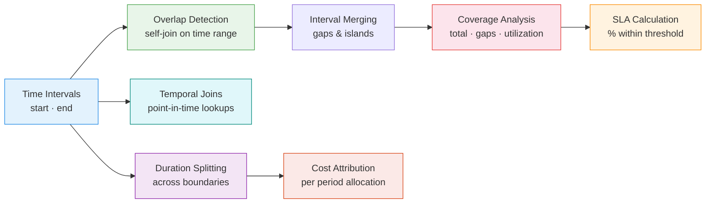
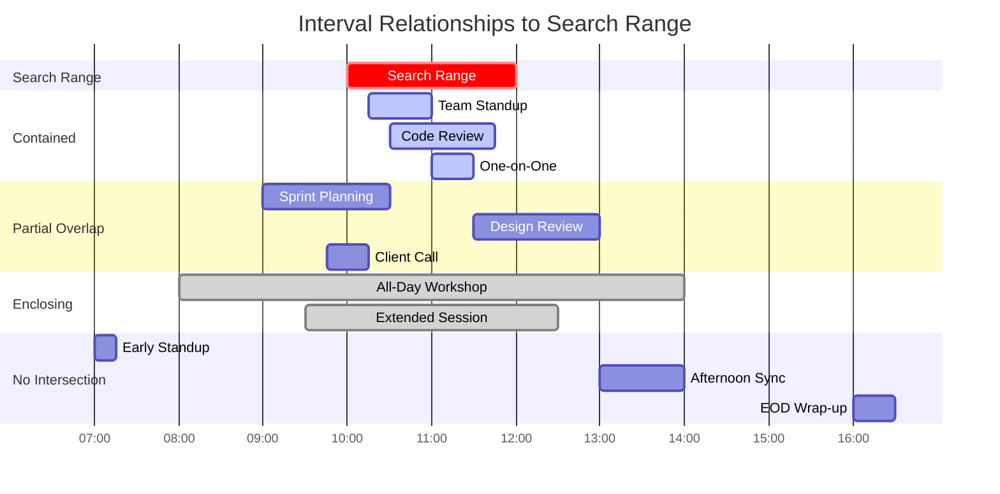

# :material-arrow-expand-horizontal: Interval Analytics

Analyze **overlapping, adjacent, and gapped time intervals** — detect conflicts,
measure SLA compliance, split events across boundaries, perform temporal joins,
and attribute costs to time windows.

---

## :material-sitemap: Analysis Flow



---

## :material-database: Sample Data

Multiple datasets covering common interval scenarios — resource bookings,
server incidents, worker shifts, and billing events with realistic overlaps,
gaps, and boundary crossings.

```sql
-- Room bookings: overlapping meetings, back-to-back, gaps
CREATE OR REPLACE TEMP VIEW bookings AS
SELECT * FROM VALUES
  (1,  'Room A', TIMESTAMP '2024-03-01 09:00', TIMESTAMP '2024-03-01 10:00', 'alice',  'standup'),
  (2,  'Room A', TIMESTAMP '2024-03-01 09:30', TIMESTAMP '2024-03-01 10:30', 'bob',    'design review'),
  (3,  'Room A', TIMESTAMP '2024-03-01 11:00', TIMESTAMP '2024-03-01 12:00', 'carol',  'sprint planning'),
  (4,  'Room A', TIMESTAMP '2024-03-01 12:00', TIMESTAMP '2024-03-01 13:00', 'dave',   'lunch meeting'),
  (5,  'Room A', TIMESTAMP '2024-03-01 14:30', TIMESTAMP '2024-03-01 16:00', 'eve',    'workshop'),
  (6,  'Room B', TIMESTAMP '2024-03-01 09:00', TIMESTAMP '2024-03-01 11:00', 'frank',  'client call'),
  (7,  'Room B', TIMESTAMP '2024-03-01 10:30', TIMESTAMP '2024-03-01 12:00', 'grace',  'demo'),
  (8,  'Room B', TIMESTAMP '2024-03-01 14:00', TIMESTAMP '2024-03-01 15:00', 'hank',   'retro'),
  (9,  'Room B', TIMESTAMP '2024-03-01 14:45', TIMESTAMP '2024-03-01 16:30', 'iris',   'deep work'),
  (10, 'Room C', TIMESTAMP '2024-03-01 08:00', TIMESTAMP '2024-03-01 17:00', 'jill',   'all-day offsite')
AS t(booking_id, resource, start_time, end_time, booked_by, purpose);

-- Server incidents: outages with varying durations spanning midnight
CREATE OR REPLACE TEMP VIEW incidents AS
SELECT * FROM VALUES
  ('INC-001', 'api-gw',    TIMESTAMP '2024-03-01 23:15', TIMESTAMP '2024-03-02 01:30', 'network',  'P1'),
  ('INC-002', 'api-gw',    TIMESTAMP '2024-03-02 06:00', TIMESTAMP '2024-03-02 06:45', 'latency',  'P2'),
  ('INC-003', 'payments',  TIMESTAMP '2024-03-01 14:20', TIMESTAMP '2024-03-01 14:55', 'timeout',  'P2'),
  ('INC-004', 'payments',  TIMESTAMP '2024-03-01 22:00', TIMESTAMP '2024-03-02 03:00', 'outage',   'P1'),
  ('INC-005', 'search',    TIMESTAMP '2024-03-02 10:00', TIMESTAMP '2024-03-02 10:08', 'cpu',      'P3'),
  ('INC-006', 'search',    TIMESTAMP '2024-03-02 10:05', TIMESTAMP '2024-03-02 10:20', 'memory',   'P2'),
  ('INC-007', 'search',    TIMESTAMP '2024-03-02 10:18', TIMESTAMP '2024-03-02 10:45', 'cascade',  'P1'),
  ('INC-008', 'api-gw',    TIMESTAMP '2024-03-02 14:00', TIMESTAMP '2024-03-02 14:30', 'deploy',   'P3')
AS t(incident_id, service, start_time, end_time, category, severity);

-- Worker shifts: irregular patterns with overlapping coverage
CREATE OR REPLACE TEMP VIEW shifts AS
SELECT * FROM VALUES
  ('worker_1', 'ops',   TIMESTAMP '2024-03-01 06:00', TIMESTAMP '2024-03-01 14:00'),
  ('worker_2', 'ops',   TIMESTAMP '2024-03-01 08:00', TIMESTAMP '2024-03-01 16:00'),
  ('worker_3', 'ops',   TIMESTAMP '2024-03-01 14:00', TIMESTAMP '2024-03-01 22:00'),
  ('worker_4', 'ops',   TIMESTAMP '2024-03-01 16:00', TIMESTAMP '2024-03-01 23:00'),
  ('worker_5', 'ops',   TIMESTAMP '2024-03-01 22:00', TIMESTAMP '2024-03-02 06:00'),
  ('worker_6', 'dev',   TIMESTAMP '2024-03-01 09:00', TIMESTAMP '2024-03-01 17:00'),
  ('worker_7', 'dev',   TIMESTAMP '2024-03-01 10:00', TIMESTAMP '2024-03-01 18:00'),
  ('worker_8', 'dev',   TIMESTAMP '2024-03-01 13:00', TIMESTAMP '2024-03-01 21:00')
AS t(worker_id, team, shift_start, shift_end);

-- Billing rates: time-varying prices for cost attribution
CREATE OR REPLACE TEMP VIEW billing_rates AS
SELECT * FROM VALUES
  ('compute',  TIMESTAMP '2024-03-01 00:00', TIMESTAMP '2024-03-01 08:00', 0.50),
  ('compute',  TIMESTAMP '2024-03-01 08:00', TIMESTAMP '2024-03-01 18:00', 1.20),
  ('compute',  TIMESTAMP '2024-03-01 18:00', TIMESTAMP '2024-03-02 00:00', 0.80),
  ('compute',  TIMESTAMP '2024-03-02 00:00', TIMESTAMP '2024-03-02 08:00', 0.50),
  ('compute',  TIMESTAMP '2024-03-02 08:00', TIMESTAMP '2024-03-02 18:00', 1.20),
  ('storage',  TIMESTAMP '2024-03-01 00:00', TIMESTAMP '2024-03-02 00:00', 0.02),
  ('storage',  TIMESTAMP '2024-03-02 00:00', TIMESTAMP '2024-03-03 00:00', 0.02)
AS t(resource_type, rate_start, rate_end, hourly_rate);
```

---

## :material-swap-horizontal: Overlap Detection

### Pairwise conflicts

Two intervals overlap when each starts before the other ends:

```sql
SELECT
    a.booking_id                                   AS booking_1,
    b.booking_id                                   AS booking_2,
    a.resource,
    a.booked_by                                    AS user_1,
    b.booked_by                                    AS user_2,
    a.purpose                                      AS purpose_1,
    b.purpose                                      AS purpose_2,
    GREATEST(a.start_time, b.start_time)           AS overlap_start,
    LEAST(a.end_time, b.end_time)                  AS overlap_end,
    ROUND(
        (UNIX_TIMESTAMP(LEAST(a.end_time, b.end_time))
         - UNIX_TIMESTAMP(GREATEST(a.start_time, b.start_time))) / 60.0,
        1
    )                                              AS overlap_minutes
FROM bookings AS a
JOIN bookings AS b
    ON  a.resource   = b.resource
    AND a.booking_id < b.booking_id
    AND a.start_time < b.end_time
    AND b.start_time < a.end_time
ORDER BY a.resource, overlap_minutes DESC;
```

??? success "Expected output"

    | booking_1 | booking_2 | resource | user_1 | user_2 | overlap_minutes |
    |-----------|-----------|----------|--------|--------|-----------------|
    | 1         | 2         | Room A   | alice  | bob    | 30.0            |
    | 6         | 7         | Room B   | frank  | grace  | 30.0            |
    | 8         | 9         | Room B   | hank   | iris   | 15.0            |

### Overlap detection with window functions (no self-join)

For large tables, avoid the O(N²) self-join by using `LAG`/`MAX` to detect overlaps
with the previous interval:

```sql
WITH ordered AS (
    SELECT
        booking_id,
        resource,
        booked_by,
        purpose,
        start_time,
        end_time,
        MAX(end_time) OVER (
            PARTITION BY resource
            ORDER BY start_time
            ROWS BETWEEN UNBOUNDED PRECEDING AND 1 PRECEDING
        )                                          AS max_prev_end,
        LAG(booking_id) OVER (
            PARTITION BY resource ORDER BY start_time
        )                                          AS prev_booking_id,
        LAG(booked_by) OVER (
            PARTITION BY resource ORDER BY start_time
        )                                          AS prev_booked_by
    FROM bookings
)
SELECT
    resource,
    prev_booking_id                                AS booking_1,
    booking_id                                     AS booking_2,
    prev_booked_by                                 AS user_1,
    booked_by                                      AS user_2,
    start_time                                     AS overlap_start,
    LEAST(end_time, max_prev_end)                  AS overlap_end,
    ROUND(
        (UNIX_TIMESTAMP(LEAST(end_time, max_prev_end))
         - UNIX_TIMESTAMP(start_time)) / 60.0, 1
    )                                              AS overlap_minutes
FROM ordered
WHERE max_prev_end IS NOT NULL
  AND start_time < max_prev_end
ORDER BY resource, overlap_minutes DESC;
```

!!! tip "When to use window vs self-join"

    - **Window approach**: O(N log N), detects overlap with *any* preceding interval.
      Best for large datasets where you need "is there a conflict?" but don't need
      every pairwise combination.
    - **Self-join**: O(N²) worst case, returns *all* overlapping pairs.
      Necessary when you need complete conflict details between specific bookings.

### Concurrent resource usage (max concurrency)

The +1/−1 delta technique counts how many intervals are active at each boundary:

```sql
WITH boundaries AS (
    SELECT resource, start_time AS ts, 1 AS delta FROM bookings
    UNION ALL
    SELECT resource, end_time, -1 FROM bookings
),
running AS (
    SELECT
        resource,
        ts,
        SUM(delta) OVER (
            PARTITION BY resource ORDER BY ts, delta
            ROWS UNBOUNDED PRECEDING
        )                                          AS concurrent_bookings
    FROM boundaries
)
SELECT
    resource,
    MAX(concurrent_bookings)                       AS peak_concurrency
FROM running
GROUP BY resource
ORDER BY resource;
```

??? success "Expected output"

    | resource | peak_concurrency |
    |----------|-----------------|
    | Room A   | 2               |
    | Room B   | 2               |
    | Room C   | 1               |

### Containment vs overlap (Allen's interval relations)

Events can relate to a search range in four ways — **contained**, **partial overlap**,
**enclosing**, or **no intersection**:



**Example data** used in the diagram:

| Event | Start | End | Relationship | Overlap with Range |
|-------|-------|-----|-------------|-------------------|
| Team Standup | 10:15 | 11:00 | Contained | 45 min (full event) |
| Code Review | 10:30 | 11:45 | Contained | 75 min (full event) |
| 1-on-1 | 11:00 | 11:30 | Contained | 30 min (full event) |
| Sprint Planning | 09:00 | 10:30 | Partial overlap (left) | 30 min (10:00–10:30) |
| Design Review | 11:30 | 13:00 | Partial overlap (right) | 30 min (11:30–12:00) |
| Client Call | 09:45 | 10:15 | Partial overlap (left) | 15 min (10:00–10:15) |
| All-Day Workshop | 08:00 | 14:00 | Enclosing | 120 min (full range) |
| Extended Session | 09:30 | 12:30 | Enclosing | 120 min (full range) |
| Early Standup | 07:00 | 07:15 | No intersection | 0 min |
| Afternoon Sync | 13:00 | 14:00 | No intersection | 0 min |
| EOD Wrap-up | 16:00 | 16:30 | No intersection | 0 min |

| Relationship | Condition | Predicate |
|-------------|-----------|-----------|
| **Contained** | Event fully inside range | `event.start >= range.start AND event.end <= range.end` |
| **Partial overlap** | Event crosses one boundary | `event.start < range.start AND event.end > range.start` (left) or `event.start < range.end AND event.end > range.end` (right) |
| **Enclosing** | Event fully surrounds range | `event.start < range.start AND event.end > range.end` |
| **No intersection** | Event outside range | `event.end <= range.start OR event.start >= range.end` |
| **Any intersection** | Catches contained + partial + enclosing | `event.start < range.end AND event.end > range.start` |

The overlap predicate catches all intersecting cases:

```sql
-- All events that intersect with a search range (any overlap)
-- Covers: contained, partial overlap, and enclosing
SELECT
    booking_id,
    resource,
    booked_by,
    start_time,
    end_time,
    CASE
        WHEN start_time >= TIMESTAMP '2024-03-01 10:00:00'
         AND end_time   <= TIMESTAMP '2024-03-01 12:00:00'
            THEN 'contained'
        WHEN start_time <  TIMESTAMP '2024-03-01 10:00:00'
         AND end_time   >  TIMESTAMP '2024-03-01 12:00:00'
            THEN 'enclosing'
        ELSE 'partial_overlap'
    END                                            AS match_type,
    GREATEST(start_time, TIMESTAMP '2024-03-01 10:00:00')
                                                   AS effective_start,
    LEAST(end_time, TIMESTAMP '2024-03-01 12:00:00')
                                                   AS effective_end,
    ROUND(
        (UNIX_TIMESTAMP(LEAST(end_time, TIMESTAMP '2024-03-01 12:00:00'))
         - UNIX_TIMESTAMP(GREATEST(start_time, TIMESTAMP '2024-03-01 10:00:00')))
        / 60.0, 1
    )                                              AS overlap_minutes
FROM bookings
WHERE start_time < TIMESTAMP '2024-03-01 12:00:00'   -- starts before range ends
  AND end_time   > TIMESTAMP '2024-03-01 10:00:00'   -- ends after range starts
ORDER BY start_time;
```

??? success "Expected output"

    | booking_id | resource | match_type | overlap_minutes |
    |-----------|----------|------------|-----------------|
    | 1         | Room A   | partial_overlap | 30.0       |
    | 2         | Room A   | contained  | 60.0            |
    | 5         | Room B   | partial_overlap | 60.0       |

!!! tip "Allen's interval relations"

    The overlap predicate `a.start < b.end AND a.end > b.start` captures **all**
    intersecting relationships (overlaps, contains, during, starts, finishes, equals).
    Containment is a special case — if you only need fully contained events, use:

    ```sql
    WHERE start_time >= :range_start AND end_time <= :range_end
    ```

### Parameterized range search with window context

Use window functions to add context — show how each event relates to its neighbors
within the search range:

```sql
WITH range_matches AS (
    SELECT
        booking_id,
        resource,
        booked_by,
        start_time,
        end_time,
        CASE
            WHEN start_time >= TIMESTAMP '2024-03-01 09:00:00'
             AND end_time   <= TIMESTAMP '2024-03-01 13:00:00'
                THEN 'contained'
            WHEN start_time <  TIMESTAMP '2024-03-01 09:00:00'
             AND end_time   >  TIMESTAMP '2024-03-01 13:00:00'
                THEN 'enclosing'
            ELSE 'partial_overlap'
        END                                        AS match_type
    FROM bookings
    WHERE start_time < TIMESTAMP '2024-03-01 13:00:00'
      AND end_time   > TIMESTAMP '2024-03-01 09:00:00'
)
SELECT
    booking_id,
    resource,
    match_type,
    start_time,
    end_time,
    LAG(end_time) OVER (
        PARTITION BY resource ORDER BY start_time
    )                                              AS prev_end,
    LEAD(start_time) OVER (
        PARTITION BY resource ORDER BY start_time
    )                                              AS next_start,
    ROW_NUMBER() OVER (
        PARTITION BY resource ORDER BY start_time
    )                                              AS position_in_range
FROM range_matches
ORDER BY resource, start_time;
```

---

## :material-shield-check: SLA Calculation

### Uptime percentage from incident intervals

Merge overlapping outages per service, then compute availability:

```sql
WITH ordered AS (
    SELECT
        service,
        start_time,
        end_time,
        MAX(end_time) OVER (
            PARTITION BY service
            ORDER BY start_time
            ROWS BETWEEN UNBOUNDED PRECEDING AND CURRENT ROW
        )                                          AS running_max_end,
        LAG(end_time) OVER (
            PARTITION BY service ORDER BY start_time
        )                                          AS prev_end
    FROM incidents
),
grouped AS (
    SELECT *,
        SUM(
            CASE WHEN start_time > COALESCE(prev_end, start_time) THEN 1 ELSE 0 END
        ) OVER (
            PARTITION BY service ORDER BY start_time
            ROWS UNBOUNDED PRECEDING
        )                                          AS grp
    FROM ordered
),
merged_outages AS (
    SELECT
        service,
        MIN(start_time)                            AS outage_start,
        MAX(end_time)                              AS outage_end,
        (UNIX_TIMESTAMP(MAX(end_time))
         - UNIX_TIMESTAMP(MIN(start_time))) / 60.0 AS outage_minutes
    FROM grouped
    GROUP BY service, grp
),
sla_window AS (
    SELECT
        service,
        SUM(outage_minutes)                        AS total_outage_minutes,
        48.0 * 60                                  AS sla_window_minutes
    FROM merged_outages
    GROUP BY service
)
SELECT
    service,
    ROUND(total_outage_minutes, 1)                 AS outage_minutes,
    ROUND(sla_window_minutes - total_outage_minutes, 1)
                                                   AS uptime_minutes,
    ROUND(
        100.0 * (sla_window_minutes - total_outage_minutes)
        / sla_window_minutes, 3
    )                                              AS availability_pct,
    CASE
        WHEN 100.0 * (sla_window_minutes - total_outage_minutes)
            / sla_window_minutes >= 99.9           THEN 'MET'
        ELSE 'BREACHED'
    END                                            AS sla_99_9_status
FROM sla_window
ORDER BY availability_pct;
```

??? success "Expected output"

    | service  | outage_minutes | uptime_minutes | availability_pct | sla_99_9_status |
    |----------|---------------|----------------|-----------------|-----------------|
    | payments | 335.0         | 2545.0         | 88.368          | BREACHED        |
    | api-gw   | 210.0         | 2670.0         | 92.708          | BREACHED        |
    | search   | 45.0          | 2835.0         | 98.438          | BREACHED        |

### SLA by severity tier

Break down outage minutes by incident priority:

```sql
SELECT
    service,
    severity,
    COUNT(*)                                       AS incident_count,
    ROUND(SUM(
        (UNIX_TIMESTAMP(end_time) - UNIX_TIMESTAMP(start_time)) / 60.0
    ), 1)                                          AS total_minutes,
    ROUND(AVG(
        (UNIX_TIMESTAMP(end_time) - UNIX_TIMESTAMP(start_time)) / 60.0
    ), 1)                                          AS avg_minutes
FROM incidents
GROUP BY service, severity
ORDER BY service, severity;
```

### Running SLA breach detection (window function)

Track cumulative outage in real-time and flag the exact moment SLA is breached:

```sql
WITH incident_durations AS (
    SELECT
        service,
        incident_id,
        start_time,
        end_time,
        (UNIX_TIMESTAMP(end_time) - UNIX_TIMESTAMP(start_time)) / 60.0
                                                   AS duration_minutes
    FROM incidents
)
SELECT
    service,
    incident_id,
    start_time,
    duration_minutes,
    SUM(duration_minutes) OVER (
        PARTITION BY service
        ORDER BY start_time
        ROWS BETWEEN UNBOUNDED PRECEDING AND CURRENT ROW
    )                                              AS cumulative_outage_min,
    CASE
        WHEN SUM(duration_minutes) OVER (
            PARTITION BY service
            ORDER BY start_time
            ROWS BETWEEN UNBOUNDED PRECEDING AND CURRENT ROW
        ) > 2880 * 0.001                           -- 0.1% of 48h = 2.88 min
        THEN 'BREACHED'
        ELSE 'OK'
    END                                            AS sla_99_9_status,
    -- Time between incidents (recovery window)
    ROUND(
        (UNIX_TIMESTAMP(start_time)
         - UNIX_TIMESTAMP(LAG(end_time) OVER (
             PARTITION BY service ORDER BY start_time
         ))) / 60.0, 1
    )                                              AS minutes_since_last_incident
FROM incident_durations
ORDER BY service, start_time;
```

??? success "Expected output (api-gw — cumulative outage tracking)"

    | service | incident_id | start_time          | duration_min | cumulative_min | sla_status | min_since_last |
    |---------|-------------|---------------------|-------------|---------------|------------|----------------|
    | api-gw  | INC-001     | 2024-03-01 23:15:00 | 135.0       | 135.0         | BREACHED   | NULL           |
    | api-gw  | INC-002     | 2024-03-02 06:00:00 | 45.0        | 180.0         | BREACHED   | 270.0          |
    | api-gw  | INC-008     | 2024-03-02 14:00:00 | 30.0        | 210.0         | BREACHED   | 435.0          |

---

## :material-call-split: Event Duration Splitting

### Split intervals across day boundaries

When an incident spans midnight, allocate duration to each calendar day:

```sql
WITH date_spine AS (
    SELECT EXPLODE(
        SEQUENCE(DATE '2024-03-01', DATE '2024-03-03', INTERVAL 1 DAY)
    ) AS day_date
),
split AS (
    SELECT
        i.incident_id,
        i.service,
        i.severity,
        d.day_date,
        GREATEST(i.start_time, CAST(d.day_date AS TIMESTAMP))
                                                   AS segment_start,
        LEAST(i.end_time, CAST(d.day_date + INTERVAL 1 DAY AS TIMESTAMP))
                                                   AS segment_end
    FROM incidents AS i
    CROSS JOIN date_spine AS d
    WHERE CAST(d.day_date AS TIMESTAMP) < i.end_time
      AND CAST(d.day_date + INTERVAL 1 DAY AS TIMESTAMP) > i.start_time
)
SELECT
    incident_id,
    service,
    severity,
    day_date,
    segment_start,
    segment_end,
    ROUND(
        (UNIX_TIMESTAMP(segment_end) - UNIX_TIMESTAMP(segment_start)) / 60.0,
        1
    )                                              AS minutes_in_day
FROM split
ORDER BY incident_id, day_date;
```

??? success "Expected output (midnight-spanning incidents)"

    | incident_id | service  | day_date   | segment_start       | segment_end         | minutes_in_day |
    |-------------|----------|------------|---------------------|---------------------|---------------|
    | INC-001     | api-gw   | 2024-03-01 | 2024-03-01 23:15:00 | 2024-03-02 00:00:00 | 45.0          |
    | INC-001     | api-gw   | 2024-03-02 | 2024-03-02 00:00:00 | 2024-03-02 01:30:00 | 90.0          |
    | INC-004     | payments | 2024-03-01 | 2024-03-01 22:00:00 | 2024-03-02 00:00:00 | 120.0         |
    | INC-004     | payments | 2024-03-02 | 2024-03-02 00:00:00 | 2024-03-02 03:00:00 | 180.0         |

### Window function alternative: proportional day allocation

When you need cumulative/proportional splits without a date spine join:

```sql
WITH incident_days AS (
    SELECT
        incident_id,
        service,
        severity,
        start_time,
        end_time,
        (UNIX_TIMESTAMP(end_time) - UNIX_TIMESTAMP(start_time)) / 60.0
                                                   AS total_duration_min,
        DATE(start_time)                           AS start_date,
        DATE(end_time)                             AS end_date,
        -- Minutes in the first day (start to midnight)
        (UNIX_TIMESTAMP(
            LEAST(end_time, CAST(DATE(start_time) + INTERVAL 1 DAY AS TIMESTAMP))
        ) - UNIX_TIMESTAMP(start_time)) / 60.0     AS first_day_minutes
    FROM incidents
)
SELECT
    incident_id,
    service,
    total_duration_min,
    first_day_minutes,
    total_duration_min - first_day_minutes         AS remaining_day_minutes,
    -- Running proportion across days
    ROUND(
        first_day_minutes / NULLIF(total_duration_min, 0) * 100, 1
    )                                              AS pct_first_day,
    -- Cumulative outage per service
    SUM(total_duration_min) OVER (
        PARTITION BY service
        ORDER BY start_time
        ROWS BETWEEN UNBOUNDED PRECEDING AND CURRENT ROW
    )                                              AS cumulative_outage_min
FROM incident_days
ORDER BY service, start_time;
```

### Split intervals across hourly billing windows

Allocate a long-running job to each pricing period:

```sql
WITH job AS (
    SELECT
        'wh-prod-01'                               AS warehouse,
        TIMESTAMP '2024-03-01 17:00'               AS job_start,
        TIMESTAMP '2024-03-02 02:00'               AS job_end
),
rate_overlap AS (
    SELECT
        j.warehouse,
        r.resource_type,
        r.hourly_rate,
        GREATEST(j.job_start, r.rate_start)        AS segment_start,
        LEAST(j.job_end, r.rate_end)               AS segment_end
    FROM job AS j
    CROSS JOIN billing_rates AS r
    WHERE r.resource_type = 'compute'
      AND j.job_start < r.rate_end
      AND j.job_end   > r.rate_start
)
SELECT
    warehouse,
    segment_start,
    segment_end,
    hourly_rate,
    ROUND(
        (UNIX_TIMESTAMP(segment_end) - UNIX_TIMESTAMP(segment_start)) / 3600.0,
        2
    )                                              AS hours,
    ROUND(
        hourly_rate
        * (UNIX_TIMESTAMP(segment_end) - UNIX_TIMESTAMP(segment_start)) / 3600.0,
        2
    )                                              AS cost_usd
FROM rate_overlap
ORDER BY segment_start;
```

??? success "Expected output"

    | warehouse  | segment_start       | segment_end         | hourly_rate | hours | cost_usd |
    |------------|---------------------|---------------------|-------------|-------|----------|
    | wh-prod-01 | 2024-03-01 17:00:00 | 2024-03-01 18:00:00 | 1.20       | 1.00  | 1.20     |
    | wh-prod-01 | 2024-03-01 18:00:00 | 2024-03-02 00:00:00 | 0.80       | 6.00  | 4.80     |
    | wh-prod-01 | 2024-03-02 00:00:00 | 2024-03-02 02:00:00 | 0.50       | 2.00  | 1.00     |

    Total cost: $7.00 — running the job 1 hour later saved $0.40 vs starting at 16:00.

---

## :material-transit-connection-variant: Temporal Joins

### Point-in-time rate lookup

Find which billing rate was active for each incident start time:

```sql
SELECT
    i.incident_id,
    i.service,
    i.start_time,
    r.hourly_rate                                  AS rate_at_start,
    r.rate_start,
    r.rate_end
FROM incidents AS i
JOIN billing_rates AS r
    ON  r.resource_type = 'compute'
    AND i.start_time >= r.rate_start
    AND i.start_time <  r.rate_end
ORDER BY i.start_time;
```

??? success "Expected output"

    | incident_id | service  | start_time          | rate_at_start | rate_start          | rate_end            |
    |-------------|----------|---------------------|---------------|---------------------|---------------------|
    | INC-003     | payments | 2024-03-01 14:20:00 | 1.20          | 2024-03-01 08:00:00 | 2024-03-01 18:00:00 |
    | INC-004     | payments | 2024-03-01 22:00:00 | 0.80          | 2024-03-01 18:00:00 | 2024-03-02 00:00:00 |
    | INC-001     | api-gw   | 2024-03-01 23:15:00 | 0.80          | 2024-03-01 18:00:00 | 2024-03-02 00:00:00 |
    | ...         |          |                     |               |                     |                     |

### AS-OF join: find who was on shift when each incident started

```sql
SELECT
    i.incident_id,
    i.service,
    i.severity,
    i.start_time                                   AS incident_time,
    s.worker_id,
    s.team
FROM incidents AS i
JOIN shifts AS s
    ON  i.start_time >= s.shift_start
    AND i.start_time <  s.shift_end
ORDER BY i.start_time, s.worker_id;
```

??? success "Expected output (who was on duty for each incident)"

    | incident_id | service  | severity | incident_time       | worker_id | team |
    |-------------|----------|----------|---------------------|-----------|------|
    | INC-003     | payments | P2       | 2024-03-01 14:20:00 | worker_2  | ops  |
    | INC-003     | payments | P2       | 2024-03-01 14:20:00 | worker_3  | ops  |
    | INC-003     | payments | P2       | 2024-03-01 14:20:00 | worker_8  | dev  |
    | INC-004     | payments | P1       | 2024-03-01 22:00:00 | worker_3  | ops  |
    | INC-004     | payments | P1       | 2024-03-01 22:00:00 | worker_4  | ops  |
    | INC-001     | api-gw   | P1       | 2024-03-01 23:15:00 | worker_5  | ops  |

!!! tip "Temporal join performance"

    For large tables, filter both sides by date range **before** the join.
    If the rate/shift table is small, use `/*+ BROADCAST(rates) */` to avoid
    a shuffle join.

### Window function alternative: AS-OF lookup without join

When events and rates share the same timeline, use `LAST_VALUE` to look up
the most recent rate change before each event — avoiding a range join entirely:

```sql
WITH combined_timeline AS (
    -- Union events and rate boundaries into a single timeline
    SELECT
        'incident'     AS record_type,
        incident_id    AS id,
        service,
        start_time     AS ts,
        NULL           AS hourly_rate
    FROM incidents

    UNION ALL

    SELECT
        'rate_change'  AS record_type,
        NULL           AS id,
        NULL           AS service,
        rate_start     AS ts,
        hourly_rate
    FROM billing_rates
    WHERE resource_type = 'compute'
)
SELECT
    id                                             AS incident_id,
    service,
    ts                                             AS incident_time,
    LAST_VALUE(hourly_rate, TRUE) OVER (
        ORDER BY ts
        ROWS BETWEEN UNBOUNDED PRECEDING AND CURRENT ROW
    )                                              AS rate_at_time
FROM combined_timeline
WHERE record_type = 'incident'
ORDER BY ts;
```

!!! note "When to use timeline union vs range join"

    - **Timeline union + `LAST_VALUE`**: Best when the dimension is a flat timeline
      (rates, exchange rates, config changes) and you need the "most recent value."
      Avoids range join entirely — O(N log N) sort only.
    - **Range join**: Necessary when the dimension has overlapping intervals
      (shifts, bookings) or when the entity has a composite key.

---

## :material-account-group: Shift Coverage Analysis

### Coverage depth at every boundary

```sql
WITH boundaries AS (
    SELECT team, shift_start AS ts, 1 AS delta FROM shifts
    UNION ALL
    SELECT team, shift_end, -1 FROM shifts
),
coverage AS (
    SELECT
        team,
        ts,
        SUM(delta) OVER (
            PARTITION BY team ORDER BY ts, delta
            ROWS UNBOUNDED PRECEDING
        )                                          AS workers_on_duty,
        LEAD(ts) OVER (PARTITION BY team ORDER BY ts)
                                                   AS next_change
    FROM boundaries
)
SELECT
    team,
    ts                                             AS period_start,
    next_change                                    AS period_end,
    workers_on_duty,
    CASE
        WHEN workers_on_duty = 0 THEN 'UNCOVERED'
        WHEN workers_on_duty = 1 THEN 'MINIMAL'
        WHEN workers_on_duty >= 3 THEN 'WELL_STAFFED'
        ELSE 'ADEQUATE'
    END                                            AS coverage_status,
    ROUND(
        (UNIX_TIMESTAMP(next_change) - UNIX_TIMESTAMP(ts)) / 60.0, 0
    )                                              AS duration_minutes
FROM coverage
WHERE next_change IS NOT NULL
ORDER BY team, ts;
```

??? success "Expected output (ops team — 24-hour cycle)"

    | team | period_start        | period_end          | workers_on_duty | coverage_status | duration_minutes |
    |------|---------------------|---------------------|-----------------|----------------|-----------------|
    | ops  | 2024-03-01 06:00:00 | 2024-03-01 08:00:00 | 1               | MINIMAL        | 120             |
    | ops  | 2024-03-01 08:00:00 | 2024-03-01 14:00:00 | 2               | ADEQUATE       | 360             |
    | ops  | 2024-03-01 14:00:00 | 2024-03-01 16:00:00 | 2               | ADEQUATE       | 120             |
    | ops  | 2024-03-01 16:00:00 | 2024-03-01 22:00:00 | 2               | ADEQUATE       | 360             |
    | ops  | 2024-03-01 22:00:00 | 2024-03-01 23:00:00 | 2               | ADEQUATE       | 60              |
    | ops  | 2024-03-01 23:00:00 | 2024-03-02 06:00:00 | 1               | MINIMAL        | 420             |

### Coverage gaps (uncovered periods)

```sql
WITH team_boundaries AS (
    SELECT team, shift_start AS ts, 1 AS delta FROM shifts
    UNION ALL
    SELECT team, shift_end, -1 FROM shifts
),
coverage AS (
    SELECT
        team,
        ts,
        SUM(delta) OVER (
            PARTITION BY team ORDER BY ts, delta
            ROWS UNBOUNDED PRECEDING
        )                                          AS workers_on_duty,
        LEAD(ts) OVER (PARTITION BY team ORDER BY ts)
                                                   AS next_ts
    FROM team_boundaries
)
SELECT
    team,
    ts                                             AS gap_start,
    next_ts                                        AS gap_end,
    ROUND(
        (UNIX_TIMESTAMP(next_ts) - UNIX_TIMESTAMP(ts)) / 60.0, 0
    )                                              AS gap_minutes
FROM coverage
WHERE workers_on_duty = 0
  AND next_ts IS NOT NULL
ORDER BY team, ts;
```

---

## :material-table-clock: Gap Detection Between Intervals

Find idle periods where a resource has no bookings:

```sql
WITH ordered AS (
    SELECT
        resource,
        booking_id,
        purpose,
        start_time,
        end_time,
        LEAD(start_time) OVER (
            PARTITION BY resource ORDER BY start_time
        )                                          AS next_start,
        LEAD(purpose) OVER (
            PARTITION BY resource ORDER BY start_time
        )                                          AS next_purpose
    FROM bookings
)
SELECT
    resource,
    purpose                                        AS before_event,
    next_purpose                                   AS after_event,
    end_time                                       AS gap_start,
    next_start                                     AS gap_end,
    ROUND(
        (UNIX_TIMESTAMP(next_start) - UNIX_TIMESTAMP(end_time)) / 60.0,
        1
    )                                              AS gap_minutes
FROM ordered
WHERE next_start IS NOT NULL
  AND next_start > end_time
ORDER BY resource, gap_start;
```

??? success "Expected output"

    | resource | before_event    | after_event   | gap_start           | gap_end             | gap_minutes |
    |----------|-----------------|---------------|---------------------|---------------------|-------------|
    | Room A   | lunch meeting   | workshop      | 2024-03-01 13:00:00 | 2024-03-01 14:30:00 | 90.0        |
    | Room B   | demo            | retro         | 2024-03-01 12:00:00 | 2024-03-01 14:00:00 | 120.0       |

### Extended gap analysis with window functions

Combine gap detection with utilization stats per resource using multiple window functions:

```sql
WITH interval_stats AS (
    SELECT
        resource,
        booking_id,
        purpose,
        start_time,
        end_time,
        -- Duration of this booking
        (UNIX_TIMESTAMP(end_time) - UNIX_TIMESTAMP(start_time)) / 60.0
                                                   AS booking_minutes,
        -- Gap to next booking
        LEAD(start_time) OVER w                    AS next_start,
        -- Gap from previous booking
        LAG(end_time) OVER w                       AS prev_end,
        -- Running total of booked time
        SUM(
            (UNIX_TIMESTAMP(end_time) - UNIX_TIMESTAMP(start_time)) / 60.0
        ) OVER (
            PARTITION BY resource
            ORDER BY start_time
            ROWS BETWEEN UNBOUNDED PRECEDING AND CURRENT ROW
        )                                          AS cumulative_booked_minutes,
        -- Booking sequence number
        ROW_NUMBER() OVER w                        AS booking_seq,
        -- Total bookings for this resource
        COUNT(*) OVER (PARTITION BY resource)      AS total_bookings
    FROM bookings
    WINDOW w AS (PARTITION BY resource ORDER BY start_time)
)
SELECT
    resource,
    booking_seq,
    purpose,
    ROUND(booking_minutes, 1)                      AS duration_min,
    ROUND(
        (UNIX_TIMESTAMP(next_start) - UNIX_TIMESTAMP(end_time)) / 60.0, 1
    )                                              AS gap_after_min,
    ROUND(
        (UNIX_TIMESTAMP(start_time) - UNIX_TIMESTAMP(COALESCE(prev_end, start_time))) / 60.0, 1
    )                                              AS gap_before_min,
    ROUND(cumulative_booked_minutes, 1)            AS cumul_booked_min,
    -- Utilization so far (booked / elapsed since first booking)
    ROUND(
        100.0 * cumulative_booked_minutes
        / NULLIF(
            (UNIX_TIMESTAMP(end_time)
             - UNIX_TIMESTAMP(FIRST_VALUE(start_time) OVER (
                 PARTITION BY resource ORDER BY start_time
                 ROWS BETWEEN UNBOUNDED PRECEDING AND CURRENT ROW
             ))) / 60.0, 0
        ), 1
    )                                              AS running_utilization_pct
FROM interval_stats
ORDER BY resource, booking_seq;
```

??? success "Expected output (Room A — running utilization tracks booking density)"

    | resource | seq | purpose         | duration | gap_after | cumul_min | running_util_pct |
    |----------|-----|-----------------|----------|-----------|-----------|-----------------|
    | Room A   | 1   | standup         | 60.0     | -30.0     | 60.0      | 100.0           |
    | Room A   | 2   | design review   | 60.0     | 30.0      | 120.0     | 133.3           |
    | Room A   | 3   | sprint planning | 60.0     | 0.0       | 180.0     | 100.0           |
    | Room A   | 4   | lunch meeting   | 60.0     | 90.0      | 240.0     | 100.0           |
    | Room A   | 5   | workshop        | 90.0     | NULL      | 330.0     | 78.6            |

---

## :material-cash-multiple: Cost Attribution by Time Window

Allocate infrastructure cost across teams based on how long each team's jobs
ran within each pricing period:

```sql
WITH workloads AS (
    SELECT * FROM VALUES
        ('team_data',  TIMESTAMP '2024-03-01 06:00', TIMESTAMP '2024-03-01 10:00'),
        ('team_data',  TIMESTAMP '2024-03-01 20:00', TIMESTAMP '2024-03-02 04:00'),
        ('team_ml',    TIMESTAMP '2024-03-01 09:00', TIMESTAMP '2024-03-01 15:00'),
        ('team_web',   TIMESTAMP '2024-03-01 07:00', TIMESTAMP '2024-03-01 19:00')
    AS t(team, job_start, job_end)
),
allocated AS (
    SELECT
        w.team,
        r.hourly_rate,
        GREATEST(w.job_start, r.rate_start)        AS seg_start,
        LEAST(w.job_end, r.rate_end)               AS seg_end
    FROM workloads AS w
    JOIN billing_rates AS r
        ON  r.resource_type = 'compute'
        AND w.job_start < r.rate_end
        AND w.job_end   > r.rate_start
)
SELECT
    team,
    ROUND(SUM(
        (UNIX_TIMESTAMP(seg_end) - UNIX_TIMESTAMP(seg_start)) / 3600.0
    ), 2)                                          AS total_hours,
    ROUND(SUM(
        hourly_rate
        * (UNIX_TIMESTAMP(seg_end) - UNIX_TIMESTAMP(seg_start)) / 3600.0
    ), 2)                                          AS total_cost_usd
FROM allocated
GROUP BY team
ORDER BY total_cost_usd DESC;
```

??? success "Expected output"

    | team      | total_hours | total_cost_usd |
    |-----------|-------------|----------------|
    | team_web  | 12.00       | 13.00          |
    | team_data | 12.00       | 8.60           |
    | team_ml   | 6.00        | 7.20           |

!!! note "team_data runs cheaper hours"

    Despite equal total hours, `team_data` costs less than `team_web` because
    its overnight job (20:00–04:00) runs during off-peak pricing periods.

### Window function: running cost accumulation per team

Track how cost accumulates over time for each team without a rate-table join:

```sql
WITH workloads AS (
    SELECT * FROM VALUES
        ('team_data',  TIMESTAMP '2024-03-01 06:00', TIMESTAMP '2024-03-01 10:00', 4.0 * 0.50 + 2.0 * 1.20),
        ('team_data',  TIMESTAMP '2024-03-01 20:00', TIMESTAMP '2024-03-02 04:00', 4.0 * 0.80 + 4.0 * 0.50),
        ('team_ml',    TIMESTAMP '2024-03-01 09:00', TIMESTAMP '2024-03-01 15:00', 6.0 * 1.20),
        ('team_web',   TIMESTAMP '2024-03-01 07:00', TIMESTAMP '2024-03-01 19:00', 1.0 * 0.50 + 10.0 * 1.20 + 1.0 * 0.80)
    AS t(team, job_start, job_end, job_cost)
)
SELECT
    team,
    job_start,
    job_end,
    ROUND(
        (UNIX_TIMESTAMP(job_end) - UNIX_TIMESTAMP(job_start)) / 3600.0, 1
    )                                              AS job_hours,
    ROUND(job_cost, 2)                             AS job_cost_usd,
    -- Running cost total per team
    ROUND(SUM(job_cost) OVER (
        PARTITION BY team
        ORDER BY job_start
        ROWS BETWEEN UNBOUNDED PRECEDING AND CURRENT ROW
    ), 2)                                          AS cumulative_cost_usd,
    -- Cost rank across all teams
    DENSE_RANK() OVER (ORDER BY job_cost DESC)     AS cost_rank,
    -- Percent of total spend (all teams)
    ROUND(
        100.0 * job_cost / SUM(job_cost) OVER (), 1
    )                                              AS pct_of_total_spend
FROM workloads
ORDER BY team, job_start;
```

---

## :material-information-outline: Key Concepts

| Pattern | Condition | Use Case |
|---------|-----------|----------|
| **Overlap** | `A.start < B.end AND B.start < A.end` | Meeting conflicts, double-booking |
| **Concurrency** | Running sum of +1 (start) / −1 (end) | Max parallel usage |
| **Gap** | `LEAD(start) > current end` | Idle periods, scheduling holes |
| **Coverage** | Concurrency > 0 at all points | Shift scheduling, 24/7 ops |
| **Merge** | Overlapping intervals → single span | Total uptime, deduplicated outages |
| **Duration split** | Interval × date/hour spine | Cross-boundary cost allocation |
| **Temporal join** | Point-in-time range lookup | AS-OF joins, rate lookups |
| **SLA** | Merged outage vs total window | Availability percentage |

### :material-function: Window Function Reference for Interval Patterns

| Interval Pattern | Window Function | Frame | Purpose |
|-----------------|----------------|-------|---------|
| Overlap detection | `MAX(end_time) OVER (... ROWS TO 1 PRECEDING)` | Preceding only | Check if current start falls within any previous interval |
| Gap detection | `LEAD(start_time) OVER (ORDER BY start)` | Default | Find next interval's start to measure idle time |
| Gap detection | `LAG(end_time) OVER (ORDER BY start)` | Default | Find previous interval's end to measure preceding gap |
| Interval merging | `MAX(end) OVER (... ROWS UNBOUNDED PRECEDING)` | Running max | Detect group boundaries for gaps-and-islands |
| Group assignment | `SUM(flag) OVER (... ROWS UNBOUNDED PRECEDING)` | Running sum | Assign group IDs to merged interval clusters |
| Concurrency | `SUM(delta) OVER (ORDER BY ts ROWS UNBOUNDED PRECEDING)` | Running sum | Count active intervals at each boundary |
| Running SLA | `SUM(duration) OVER (ORDER BY ts ROWS UNBOUNDED PRECEDING)` | Running sum | Cumulative outage to detect breach point |
| Temporal lookup | `LAST_VALUE(val, TRUE) OVER (ORDER BY ts)` | To current row | Find most recent non-null value (AS-OF join alternative) |
| Utilization | `SUM(duration) OVER (PARTITION BY entity ...)` | Running sum | Track cumulative busy/idle ratio over time |
| Scheduling | `LEAD/LAG + FIRST_VALUE` | Multiple | Look ahead/behind + find anchors for proportional splits |

!!! warning "Edge case: touching vs overlapping"

    `start_time < end_time` (strict) treats back-to-back intervals (10:00–11:00
    followed by 11:00–12:00) as **non-overlapping**. Use `<=` if adjacent intervals
    should be considered continuous.

---

## :material-lightbulb-outline: When to Use

| Scenario | Analysis |
|----------|----------|
| Meeting room conflicts | Overlap detection |
| Machine maintenance windows | Gap analysis for scheduling |
| Warehouse uptime / availability | Merged intervals → SLA % |
| Employee shift coverage | Concurrency at each time point |
| SLA compliance reporting | Merged outages vs window |
| Nightly job cost breakdown | Duration split across rate periods |
| "Who was on call?" | Temporal join (incident × shift) |
| Cross-day incident reporting | Day-boundary splitting |
| Chargeback / showback | Cost attribution by team × rate |

---

## :material-speedometer: Performance Best Practices

Interval queries are among the most expensive patterns in Spark/Databricks because
they typically involve range joins, temporal lookups, overlap detection, and interval
explosions. The strategies below — ordered from highest to lowest impact — can reduce
runtime from hours to minutes on multi-billion-row datasets.

### 1. Always add an equi-join key before range predicates

Range joins (`>=`, `<`) prevent hash joins — Spark falls back to broadcast nested loop
or sort-merge with cartesian-like behavior.

```sql
-- Expensive: pure range join on large tables
SELECT *
FROM fact_sales AS f
JOIN dim_customer_scd2 AS d
    ON f.ts >= d.valid_from
    AND f.ts <  d.valid_to;

-- Better: add business key first, then range
SELECT *
FROM fact_sales AS f
JOIN dim_customer_scd2 AS d
    ON  f.customer_id = d.customer_id     -- equi-join enables hash/sort-merge
    AND f.ts >= d.valid_from
    AND f.ts <  d.valid_to;
```

!!! tip "Rule of thumb"

    Every temporal join should have **at least one equi-join column** (business key,
    entity ID, resource type) before the range predicates.

### 2. Partition and filter by time early

Push date/time filters as early as possible to enable partition pruning:

```sql
-- Partition schema
-- PARTITIONED BY (event_date DATE)

-- Filter BEFORE joins — prunes partitions
SELECT *
FROM warehouse_events
WHERE event_date >= '2026-07-01'
  AND event_date <  '2026-08-01';
```

For Delta tables, combine with data skipping:

```sql
-- [Databricks] ZORDER co-locates related rows in the same files
OPTIMIZE warehouse_events
ZORDER BY (warehouse_id, event_time);
```

### 3. Use time binning to reduce candidate comparisons

Convert interval joins into equi-joins on time buckets, then validate the exact range:

```sql
-- Create hour-level bins for both sides
WITH fact_binned AS (
    SELECT *,
        FLOOR(UNIX_TIMESTAMP(event_time) / 3600) AS hour_bin
    FROM fact_events
    WHERE event_date = '2026-07-15'
),
dim_binned AS (
    SELECT d.*,
        bin.hour_bin
    FROM dim_rates AS d
    LATERAL VIEW EXPLODE(
        SEQUENCE(
            FLOOR(UNIX_TIMESTAMP(d.valid_from) / 3600),
            FLOOR(UNIX_TIMESTAMP(d.valid_to) / 3600)
        )
    ) bin AS hour_bin
)
SELECT f.*, d.rate
FROM fact_binned AS f
JOIN dim_binned AS d
    ON  f.entity_id = d.entity_id           -- business key
    AND f.hour_bin  = d.hour_bin             -- bin equi-join
    AND f.event_time >= d.valid_from         -- exact validation
    AND f.event_time <  d.valid_to;
```

This often reduces candidate comparisons by **90%+** compared to a pure range join.

### 4. Avoid small-grain `EXPLODE(SEQUENCE())`

Exploding intervals is one of the most dangerous patterns for data volume:

| Source rows | Interval | Grain | Output rows |
|-------------|----------|-------|-------------|
| 10M | 1 day | 1 minute | **14.4 billion** |
| 10M | 1 day | 15 minutes | 960 million |
| 10M | 1 day | 1 hour | 240 million |

```sql
-- Dangerous: minute-level explosion
SELECT EXPLODE(SEQUENCE(start_time, end_time, INTERVAL 1 MINUTE));

-- Much safer: use the coarsest grain that meets requirements
SELECT EXPLODE(SEQUENCE(start_time, end_time, INTERVAL 1 HOUR));
```

!!! warning "Before exploding, ask: do I actually need per-bucket rows?"

    Many reporting queries can use `TIMESTAMPDIFF` or `UNIX_TIMESTAMP` arithmetic
    directly without exploding intervals into individual rows.

### 5. Broadcast small temporal dimensions

When the dimension table fits in memory, broadcast it to avoid a shuffle join:

```sql
-- dim_customer_scd2: 5M rows (~200 MB) — fits broadcast
SELECT /*+ BROADCAST(d) */
    f.order_id,
    f.ts,
    d.customer_name,
    d.segment
FROM fact_sales AS f
JOIN dim_customer_scd2 AS d
    ON  f.customer_id = d.customer_id
    AND f.ts >= d.valid_from
    AND f.ts <  d.valid_to;
```

Check the default broadcast threshold:

```sql
-- [Databricks] Default is 10 MB; increase for larger dims
SET spark.sql.autoBroadcastJoinThreshold = 256m;
```

### 6. Prefer window functions over self-joins

Self-joins for gap/overlap detection are O(N²). Window functions are O(N log N):

```sql
-- Expensive: self-join to find gaps between intervals
SELECT a.end_time AS gap_start, b.start_time AS gap_end
FROM intervals AS a
JOIN intervals AS b
    ON  a.entity_id = b.entity_id
    AND b.start_time > a.end_time
    AND NOT EXISTS (
        SELECT 1 FROM intervals AS c
        WHERE c.entity_id = a.entity_id
          AND c.start_time > a.end_time
          AND c.start_time < b.start_time
    );

-- Much cheaper: LEAD window function
SELECT
    entity_id,
    end_time                                       AS gap_start,
    LEAD(start_time) OVER (
        PARTITION BY entity_id ORDER BY start_time
    )                                              AS gap_end
FROM intervals;
```

### 7. Materialize reusable time grids

Instead of repeatedly generating time spines with `EXPLODE(SEQUENCE(...))`, create
permanent dimension tables:

```sql
-- [Databricks] Create once, reuse everywhere
CREATE TABLE IF NOT EXISTS dim_date AS
SELECT EXPLODE(
    SEQUENCE(DATE '2020-01-01', DATE '2030-12-31', INTERVAL 1 DAY)
) AS date_key;

CREATE TABLE IF NOT EXISTS dim_time_15min AS
SELECT EXPLODE(
    SEQUENCE(
        TIMESTAMP '2000-01-01 00:00:00',
        TIMESTAMP '2000-01-01 23:45:00',
        INTERVAL 15 MINUTES
    )
) AS time_key;
```

### 8. Precompute interval duration at ingestion

Avoid recomputing `UNIX_TIMESTAMP(end) - UNIX_TIMESTAMP(start)` in every query:

```sql
-- Add during ingestion / ETL
ALTER TABLE job_runs ADD COLUMN duration_seconds LONG;
UPDATE job_runs
SET duration_seconds = UNIX_TIMESTAMP(end_time) - UNIX_TIMESTAMP(start_time);
```

Useful for dashboards, aggregations, and cost attribution where duration is
used repeatedly across multiple queries.

### 9. Use Liquid Clustering for temporal tables

For large tables accessed across multiple time ranges, Liquid Clustering
outperforms traditional date partitioning:

```sql
-- [Databricks] Liquid Clustering — adaptive, no manual partition management
ALTER TABLE query_history
CLUSTER BY (warehouse_id, start_time);
```

Especially effective for:

- SCD2 dimension tables
- Event/audit log tables
- Job runtime tables
- Query history / billing tables

### 10. Keep overlap predicates simple and sargable

Spark can push down simple comparison predicates but not complex expressions:

```sql
-- Good: simple, sargable overlap condition
WHERE a.start_time < b.end_time
  AND a.end_time   > b.start_time

-- Bad: wrapping in CASE or functions defeats pushdown
WHERE CASE
    WHEN a.start_time < b.end_time AND a.end_time > b.start_time
    THEN TRUE ELSE FALSE
END
```

### 11. Optimize SCD2 lookups with ZORDER

SCD2 tables are the most common large temporal dimension. Co-locate rows by
business key and temporal boundary:

```sql
-- [Databricks] Optimize for point-in-time lookups
OPTIMIZE dim_customer
ZORDER BY (customer_id, valid_from);
```

This collocates all versions of a customer in the same file group, making
the range predicate (`ts >= valid_from AND ts < valid_to`) scan far fewer files.

---

### :material-table: Scalability Summary

| Pattern | Scalability | Notes |
|---------|------------|-------|
| `BETWEEN start AND end` range join | :material-alert: Poor | Full cartesian on large tables |
| Range join + business key | :material-check: Good | Hash join on key, range filter |
| Range join + time binning | :material-check-all: Very Good | 90%+ candidate reduction |
| Range join + binning + ZORDER | :material-star: Excellent | File-level pruning + bin join |
| `EXPLODE(SEQUENCE(...1 MINUTE))` | :material-alert: Dangerous | Row explosion on large data |
| Prebuilt time dimension | :material-star: Excellent | One-time cost, reusable |
| Window function (LEAD/LAG) | :material-star: Excellent | O(N log N) vs O(N²) self-join |
| Broadcast temporal dimension | :material-check-all: Very Good | Eliminates shuffle for small dims |

---

## :material-arrow-right: Related

- [Time Binning](time_binning.md) — convert range joins to equi-joins with hour/day bins (10–100× speedup)
- [Interval Merge](../../sequence/interval_merge.md) — detailed merging of overlapping intervals
- [Sessionization](../../sequence/sessionization.md) — gap-based session detection from events
- [Gaps & Islands](../../sequence/gaps_islands.md) — general gaps-and-islands pattern
- [Utilization Analysis](utilization_analysis.md) — resource busy/idle measurement
- [Queue Analysis](queue_analysis.md) — waiting and processing time intervals
- [Cost Attribution](cost_attribution.md) — extended cost allocation patterns
- [Time Allocation](time_allocation.md) — proportional time distribution
