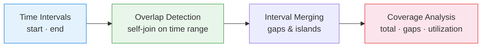

# :material-arrow-expand-horizontal: Interval Analytics

Analyze **overlapping and adjacent time intervals** — detect meeting conflicts,
maintenance windows, shift coverage, and warehouse uptime gaps.

---

## :material-sitemap: Analysis Flow



---

## :material-code-tags: Syntax

### Sample data

```sql
CREATE OR REPLACE TEMP VIEW bookings AS
SELECT * FROM VALUES
  (1, 'Room A', TIMESTAMP '2024-03-01 09:00', TIMESTAMP '2024-03-01 10:00', 'alice'),
  (2, 'Room A', TIMESTAMP '2024-03-01 09:30', TIMESTAMP '2024-03-01 10:30', 'bob'),
  (3, 'Room A', TIMESTAMP '2024-03-01 11:00', TIMESTAMP '2024-03-01 12:00', 'carol'),
  (4, 'Room B', TIMESTAMP '2024-03-01 09:00', TIMESTAMP '2024-03-01 11:00', 'dave'),
  (5, 'Room B', TIMESTAMP '2024-03-01 10:30', TIMESTAMP '2024-03-01 12:00', 'eve'),
  (6, 'Room B', TIMESTAMP '2024-03-01 14:00', TIMESTAMP '2024-03-01 15:00', 'frank')
AS t(booking_id, resource, start_time, end_time, booked_by);

CREATE OR REPLACE TEMP VIEW shifts AS
SELECT * FROM VALUES
  ('worker_1', TIMESTAMP '2024-03-01 06:00', TIMESTAMP '2024-03-01 14:00'),
  ('worker_2', TIMESTAMP '2024-03-01 08:00', TIMESTAMP '2024-03-01 16:00'),
  ('worker_3', TIMESTAMP '2024-03-01 14:00', TIMESTAMP '2024-03-01 22:00'),
  ('worker_4', TIMESTAMP '2024-03-01 16:00', TIMESTAMP '2024-03-01 23:00')
AS t(worker_id, shift_start, shift_end);
```

---

### Overlap detection (conflicts)

```sql
SELECT
    a.booking_id                                   AS booking_1,
    b.booking_id                                   AS booking_2,
    a.resource,
    a.booked_by                                    AS user_1,
    b.booked_by                                    AS user_2,
    GREATEST(a.start_time, b.start_time)           AS overlap_start,
    LEAST(a.end_time, b.end_time)                  AS overlap_end,
    ROUND(
        (UNIX_TIMESTAMP(LEAST(a.end_time, b.end_time))
         - UNIX_TIMESTAMP(GREATEST(a.start_time, b.start_time))) / 60.0,
        1
    )                                              AS overlap_minutes
FROM bookings a
JOIN bookings b
    ON a.resource = b.resource
    AND a.booking_id < b.booking_id
    AND a.start_time < b.end_time
    AND b.start_time < a.end_time
ORDER BY a.resource, overlap_minutes DESC;
```

---

### Concurrent resource usage (max concurrency)

```sql
WITH boundaries AS (
    SELECT resource, start_time AS ts, 1 AS delta FROM bookings
    UNION ALL
    SELECT resource, end_time, -1 FROM bookings
)
SELECT
    resource,
    ts,
    SUM(delta) OVER (
        PARTITION BY resource ORDER BY ts
        ROWS UNBOUNDED PRECEDING
    )                                              AS concurrent_bookings
FROM boundaries
ORDER BY resource, ts;
```

---

### Shift coverage analysis

```sql
WITH boundaries AS (
    SELECT shift_start AS ts, 1 AS delta FROM shifts
    UNION ALL
    SELECT shift_end, -1 FROM shifts
),
coverage AS (
    SELECT
        ts,
        SUM(delta) OVER (ORDER BY ts ROWS UNBOUNDED PRECEDING)
                                                   AS workers_on_duty
    FROM boundaries
)
SELECT
    ts,
    workers_on_duty,
    CASE
        WHEN workers_on_duty = 0 THEN 'UNCOVERED'
        WHEN workers_on_duty = 1 THEN 'MINIMAL'
        ELSE 'ADEQUATE'
    END                                            AS coverage_status
FROM coverage
ORDER BY ts;
```

---

### Gap detection between intervals

```sql
WITH ordered AS (
    SELECT
        resource,
        start_time,
        end_time,
        LEAD(start_time) OVER (
            PARTITION BY resource ORDER BY start_time
        )                                          AS next_start
    FROM bookings
)
SELECT
    resource,
    end_time                                       AS gap_start,
    next_start                                     AS gap_end,
    ROUND(
        (UNIX_TIMESTAMP(next_start) - UNIX_TIMESTAMP(end_time)) / 60.0,
        1
    )                                              AS gap_minutes
FROM ordered
WHERE next_start IS NOT NULL
  AND next_start > end_time
ORDER BY gap_minutes DESC;
```

---

## :material-information-outline: Key Concepts

| Pattern | Condition | Use Case |
|---------|-----------|----------|
| **Overlap** | `A.start < B.end AND B.start < A.end` | Meeting conflicts |
| **Concurrency** | Running sum of +1 (start) / -1 (end) | Max parallel usage |
| **Gap** | `LEAD(start) > current end` | Idle periods between bookings |
| **Coverage** | Concurrency > 0 at all points | Shift scheduling |
| **Merge** | Overlapping intervals → single span | Total uptime calculation |

---

## :material-lightbulb-outline: When to Use

| Scenario | Analysis |
|----------|----------|
| Meeting room conflicts | Overlap detection |
| Machine maintenance windows | Gap analysis for scheduling |
| Warehouse uptime | Merged intervals for availability % |
| Employee shift coverage | Concurrency at each time point |
| SLA compliance | Ensure ≥1 worker during business hours |

---

## :material-arrow-right: Related

- [Interval Merge](../../sequence/interval_merge.md) — merge overlapping intervals
- [Utilization Analysis](utilization_analysis.md) — resource busy/idle measurement
- [Queue Analysis](queue_analysis.md) — waiting and processing time intervals
