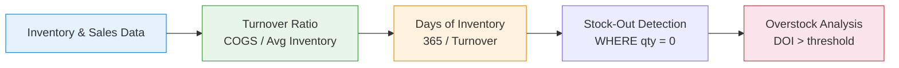

# :material-warehouse: Inventory Analytics

Calculate **days of inventory, turnover ratio, stock-out detection, and overstock
identification** — core metrics for supply chain management and working capital optimisation.

---

## :material-sitemap: Analytics Flow



---

## :material-code-tags: Syntax

### Sample data

```sql
CREATE OR REPLACE TEMP VIEW inventory_snapshots AS
SELECT * FROM VALUES
  ('SKU-001', 'Electronics', DATE '2024-01-01', 500, 12.00),
  ('SKU-001', 'Electronics', DATE '2024-02-01', 420, 12.00),
  ('SKU-001', 'Electronics', DATE '2024-03-01', 350, 12.00),
  ('SKU-001', 'Electronics', DATE '2024-04-01', 280, 12.00),
  ('SKU-001', 'Electronics', DATE '2024-05-01', 450, 12.00),
  ('SKU-001', 'Electronics', DATE '2024-06-01', 380, 12.00),
  ('SKU-002', 'Clothing',    DATE '2024-01-01', 200, 25.00),
  ('SKU-002', 'Clothing',    DATE '2024-02-01', 180, 25.00),
  ('SKU-002', 'Clothing',    DATE '2024-03-01', 50,  25.00),
  ('SKU-002', 'Clothing',    DATE '2024-04-01', 0,   25.00),
  ('SKU-002', 'Clothing',    DATE '2024-05-01', 300, 25.00),
  ('SKU-002', 'Clothing',    DATE '2024-06-01', 250, 25.00),
  ('SKU-003', 'Books',       DATE '2024-01-01', 1000, 8.00),
  ('SKU-003', 'Books',       DATE '2024-02-01', 980, 8.00),
  ('SKU-003', 'Books',       DATE '2024-03-01', 960, 8.00),
  ('SKU-003', 'Books',       DATE '2024-04-01', 950, 8.00),
  ('SKU-003', 'Books',       DATE '2024-05-01', 940, 8.00),
  ('SKU-003', 'Books',       DATE '2024-06-01', 930, 8.00)
AS t(sku, category, snapshot_date, qty_on_hand, unit_cost);

CREATE OR REPLACE TEMP VIEW daily_sales AS
SELECT * FROM VALUES
  ('SKU-001', DATE '2024-01-15', 30),
  ('SKU-001', DATE '2024-02-10', 25),
  ('SKU-001', DATE '2024-03-05', 28),
  ('SKU-001', DATE '2024-04-20', 22),
  ('SKU-001', DATE '2024-05-12', 35),
  ('SKU-002', DATE '2024-01-10', 15),
  ('SKU-002', DATE '2024-02-08', 20),
  ('SKU-002', DATE '2024-03-01', 18),
  ('SKU-002', DATE '2024-05-05', 12),
  ('SKU-002', DATE '2024-05-20', 10),
  ('SKU-003', DATE '2024-01-05', 5),
  ('SKU-003', DATE '2024-02-15', 4),
  ('SKU-003', DATE '2024-03-10', 3),
  ('SKU-003', DATE '2024-04-08', 4),
  ('SKU-003', DATE '2024-05-22', 3)
AS t(sku, sale_date, qty_sold);
```

---

### Inventory turnover ratio

Measure how many times inventory is sold and replaced over a period.

```sql
WITH sales_summary AS (
    SELECT
        sku,
        SUM(qty_sold)                              AS total_units_sold
    FROM daily_sales
    GROUP BY sku
),
avg_inventory AS (
    SELECT
        sku,
        category,
        unit_cost,
        ROUND(AVG(qty_on_hand), 1)                 AS avg_qty_on_hand,
        ROUND(AVG(qty_on_hand * unit_cost), 2)     AS avg_inventory_value
    FROM inventory_snapshots
    GROUP BY sku, category, unit_cost
)
SELECT
    ai.sku,
    ai.category,
    ss.total_units_sold,
    ai.avg_qty_on_hand,
    -- Turnover = units sold / average inventory
    ROUND(
        ss.total_units_sold * 1.0 / NULLIF(ai.avg_qty_on_hand, 0),
        3
    )                                              AS turnover_ratio,
    -- Annualised turnover (assuming 6 months of data × 2)
    ROUND(
        ss.total_units_sold * 2.0 / NULLIF(ai.avg_qty_on_hand, 0),
        3
    )                                              AS annual_turnover
FROM avg_inventory ai
JOIN sales_summary ss ON ai.sku = ss.sku
ORDER BY turnover_ratio DESC;
-- Result:
-- |sku    |category   |sold|avg_qty|turnover|annual_turn|
-- |SKU-002|Clothing   |75  |163.3  |0.459   |0.919      |
-- |SKU-001|Electronics|140 |396.7  |0.353   |0.706      |
-- |SKU-003|Books      |19  |960.0  |0.020   |0.040      |
```

---

### Days of inventory (DOI)

Calculate how many days current stock will last at the current sales rate.

```sql
WITH daily_demand AS (
    SELECT
        sku,
        SUM(qty_sold)                              AS total_sold,
        DATEDIFF(MAX(sale_date), MIN(sale_date))   AS selling_days,
        ROUND(
            SUM(qty_sold) * 1.0
            / NULLIF(DATEDIFF(MAX(sale_date), MIN(sale_date)), 0),
            3
        )                                          AS avg_daily_demand
    FROM daily_sales
    GROUP BY sku
),
current_stock AS (
    SELECT
        sku,
        qty_on_hand,
        ROW_NUMBER() OVER (
            PARTITION BY sku ORDER BY snapshot_date DESC
        )                                          AS rn
    FROM inventory_snapshots
)
SELECT
    cs.sku,
    cs.qty_on_hand                                 AS current_stock,
    dd.avg_daily_demand,
    -- Days of inventory remaining
    ROUND(
        cs.qty_on_hand / NULLIF(dd.avg_daily_demand, 0),
        1
    )                                              AS days_of_inventory,
    CASE
        WHEN cs.qty_on_hand / NULLIF(dd.avg_daily_demand, 0) <= 14
            THEN 'REORDER NOW'
        WHEN cs.qty_on_hand / NULLIF(dd.avg_daily_demand, 0) <= 30
            THEN 'LOW STOCK'
        WHEN cs.qty_on_hand / NULLIF(dd.avg_daily_demand, 0) > 180
            THEN 'OVERSTOCK'
        ELSE 'HEALTHY'
    END                                            AS stock_status
FROM current_stock cs
JOIN daily_demand dd ON cs.sku = dd.sku
WHERE cs.rn = 1
ORDER BY days_of_inventory ASC;
-- Result:
-- |sku    |stock|daily_demand|DOI   |status      |
-- |SKU-002|250  |0.577       |433.3 |OVERSTOCK   |
-- |SKU-001|380  |1.151       |330.1 |OVERSTOCK   |
-- |SKU-003|930  |0.139       |6690.6|OVERSTOCK   |
```

---

### Stock-out detection and duration

Identify periods where inventory hit zero.

```sql
WITH stock_status AS (
    SELECT
        sku,
        category,
        snapshot_date,
        qty_on_hand,
        CASE WHEN qty_on_hand = 0 THEN 1 ELSE 0 END
                                                   AS is_stockout,
        LAG(qty_on_hand) OVER (
            PARTITION BY sku ORDER BY snapshot_date
        )                                          AS prev_qty
    FROM inventory_snapshots
)
SELECT
    sku,
    category,
    snapshot_date                                   AS stockout_date,
    prev_qty                                       AS last_known_qty,
    -- Find when stock recovered
    LEAD(snapshot_date) OVER (
        PARTITION BY sku ORDER BY snapshot_date
    )                                              AS recovery_date,
    DATEDIFF(
        LEAD(snapshot_date) OVER (
            PARTITION BY sku ORDER BY snapshot_date
        ),
        snapshot_date
    )                                              AS stockout_days
FROM stock_status
WHERE is_stockout = 1
ORDER BY sku, snapshot_date;
-- Result:
-- |sku    |category|stockout_date|last_qty|recovery_date|stockout_days|
-- |SKU-002|Clothing|2024-04-01   |50      |2024-05-01   |30           |
```

---

### Stock-out frequency and impact

Summarise stock-out history per SKU for remediation prioritisation.

```sql
WITH stockouts AS (
    SELECT
        sku,
        category,
        snapshot_date,
        qty_on_hand
    FROM inventory_snapshots
    WHERE qty_on_hand = 0
)
SELECT
    s.sku,
    s.category,
    COUNT(*)                                       AS stockout_periods,
    -- Estimated lost sales during stock-out
    COALESCE(
        ROUND(
            COUNT(*) * (
                SELECT AVG(qty_sold)
                FROM daily_sales ds
                WHERE ds.sku = s.sku
            ) * 30,
            0
        ),
        0
    )                                              AS est_lost_units,
    ROUND(
        COUNT(*) * 100.0 / (
            SELECT COUNT(*) FROM inventory_snapshots i2
            WHERE i2.sku = s.sku
        ),
        1
    )                                              AS stockout_rate_pct
FROM stockouts s
GROUP BY s.sku, s.category
ORDER BY stockout_periods DESC;
```

---

### Overstock identification

Flag items with excessive inventory relative to their demand.

```sql
WITH demand_rate AS (
    SELECT
        sku,
        ROUND(SUM(qty_sold) * 1.0
            / NULLIF(DATEDIFF(MAX(sale_date), MIN(sale_date)), 0),
            3
        )                                          AS daily_demand
    FROM daily_sales
    GROUP BY sku
),
current_inv AS (
    SELECT
        i.sku,
        i.category,
        i.qty_on_hand,
        i.unit_cost,
        i.qty_on_hand * i.unit_cost                AS inventory_value,
        ROW_NUMBER() OVER (
            PARTITION BY i.sku ORDER BY i.snapshot_date DESC
        )                                          AS rn
    FROM inventory_snapshots i
)
SELECT
    ci.sku,
    ci.category,
    ci.qty_on_hand,
    ci.inventory_value,
    dr.daily_demand,
    ROUND(ci.qty_on_hand / NULLIF(dr.daily_demand, 0), 0)
                                                   AS days_of_supply,
    -- Excess = stock beyond 90-day supply
    GREATEST(0,
        ci.qty_on_hand - ROUND(dr.daily_demand * 90, 0)
    )                                              AS excess_units,
    GREATEST(0,
        (ci.qty_on_hand - ROUND(dr.daily_demand * 90, 0))
        * ci.unit_cost
    )                                              AS excess_value
FROM current_inv ci
JOIN demand_rate dr ON ci.sku = dr.sku
WHERE ci.rn = 1
ORDER BY excess_value DESC;
```

---

### Inventory health dashboard

Combine all metrics into a single SKU-level report.

```sql
WITH demand AS (
    SELECT
        sku,
        SUM(qty_sold)                              AS total_sold,
        ROUND(
            SUM(qty_sold) * 1.0
            / NULLIF(DATEDIFF(MAX(sale_date), MIN(sale_date)), 0),
            3
        )                                          AS daily_demand
    FROM daily_sales
    GROUP BY sku
),
inv_stats AS (
    SELECT
        sku,
        category,
        unit_cost,
        AVG(qty_on_hand)                           AS avg_inventory,
        MAX(CASE
            WHEN snapshot_date = (SELECT MAX(snapshot_date) FROM inventory_snapshots)
            THEN qty_on_hand
        END)                                       AS current_qty,
        SUM(CASE WHEN qty_on_hand = 0 THEN 1 ELSE 0 END)
                                                   AS stockout_months
    FROM inventory_snapshots
    GROUP BY sku, category, unit_cost
)
SELECT
    i.sku,
    i.category,
    i.current_qty,
    ROUND(i.avg_inventory, 0)                      AS avg_inventory,
    d.daily_demand,
    -- Days of inventory
    ROUND(i.current_qty / NULLIF(d.daily_demand, 0), 0)
                                                   AS doi,
    -- Turnover (annualised)
    ROUND(d.total_sold * 2.0 / NULLIF(i.avg_inventory, 0), 3)
                                                   AS annual_turnover,
    -- Inventory value
    ROUND(i.current_qty * i.unit_cost, 2)          AS inventory_value,
    -- Stock-out frequency
    i.stockout_months,
    -- Health classification
    CASE
        WHEN i.current_qty = 0 THEN 'STOCKOUT'
        WHEN i.current_qty / NULLIF(d.daily_demand, 0) <= 14
            THEN 'CRITICAL LOW'
        WHEN i.current_qty / NULLIF(d.daily_demand, 0) <= 30
            THEN 'LOW'
        WHEN i.current_qty / NULLIF(d.daily_demand, 0) > 180
            THEN 'OVERSTOCK'
        ELSE 'HEALTHY'
    END                                            AS health_status
FROM inv_stats i
JOIN demand d ON i.sku = d.sku
ORDER BY
    CASE
        WHEN i.current_qty = 0 THEN 1
        WHEN i.current_qty / NULLIF(d.daily_demand, 0) <= 14 THEN 2
        WHEN i.current_qty / NULLIF(d.daily_demand, 0) > 180 THEN 3
        ELSE 4
    END;
```

---

## :material-information-outline: Key Concepts

| Metric | Formula | Interpretation |
|--------|---------|----------------|
| **Turnover Ratio** | `units_sold / avg_inventory` | How fast stock cycles; higher = more efficient |
| **Days of Inventory** | `current_stock / daily_demand` | How long stock lasts at current rate |
| **Stock-Out Rate** | `stockout_periods / total_periods × 100` | % of time with zero inventory |
| **Excess Inventory** | `stock - (demand × target_days)` | Units beyond target supply |
| **Carrying Cost** | `excess_value × holding_rate` | Financial cost of overstock |

!!! tip "Target DOI varies by category"
    Perishables: 7–14 days. Electronics: 30–60 days. Slow-moving (books): 90–180 days.
    Set thresholds per category rather than using a single global number.

!!! warning "Demand seasonality"
    Average daily demand calculated over 6 months may not reflect seasonal spikes.
    For seasonal items, use the demand rate from the same period last year.

---

## :material-lightbulb-outline: When to Use

| Scenario | Key Metrics |
|----------|-------------|
| Reorder point calculation | DOI < safety threshold → trigger purchase order |
| Working capital reduction | Identify overstock → liquidate or reduce procurement |
| Lost sales estimation | Stock-out days × daily demand × margin |
| Supplier performance | Stock-out frequency correlated with lead times |
| ABC/XYZ classification | Turnover × demand variability segmentation |

---

## :material-speedometer: Performance Notes

| Tip | Reason |
|-----|--------|
| Pre-aggregate sales to daily/weekly | Reduces row count for demand calculations |
| Partition by `sku` | Enables parallel window functions per item |
| Use latest snapshot only for current state | Avoid full-table scan for status reports |
| Materialise demand rates daily | Reuse across DOI, overstock, and reorder queries |
| Filter to active SKUs | Exclude discontinued items from turnover metrics |

---

## :material-arrow-right: Related

- [ABC Classification](../../customer_analytics/abc_classification.md) — Pareto-based inventory segmentation
- [Seasonality Detection](seasonality_detection.md) — adjust demand for seasonal patterns
- [Trend Detection](trend_detection.md) — spot demand acceleration or decline
- [Capacity Planning](capacity_planning.md) — warehouse space and storage forecasting
