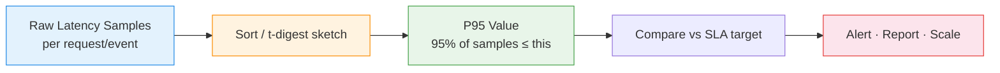

# :material-speedometer: P95 Latency Analysis

Compute the **95th percentile (P95)** of a latency or duration metric — the
industry-standard way to describe "typical worst-case" performance while
ignoring rare, extreme outliers.

!!! note "Source"
    Full runnable example: `sql/timeseries/p95_latency.sql`

---

## :material-sitemap: Analysis Flow



---

## :material-information-outline: What P95 Means

P95 is the value **below which 95% of observations fall** — equivalently,
only the slowest 5% of requests exceed it.

```
P95 = PERCENTILE_APPROX(latency_ms, 0.95)
```

| Metric | Meaning | Weakness |
|--------|---------|----------|
| `AVG` | Typical value, but skewed by outliers | Hides tail latency spikes |
| `MAX` | Worst observed value | A single fluke dominates the metric |
| `P50` (median) | Middle value | Ignores tail behaviour entirely |
| `P95` | Practical worst-case for 95% of traffic | Good balance of realism and stability |
| `P99` | Stricter tail bound | More sensitive to sample size / noise |

!!! tip "Why P95, not average?"
    Latency distributions are right-skewed — most requests are fast, but a
    long tail of slow requests drags user experience down. Averaging hides
    that tail; P95 captures it without being dominated by a single extreme
    sample the way `MAX` is.

---

## :material-code-tags: Syntax

### Sample data

```sql
CREATE OR REPLACE TEMP VIEW api_requests AS
SELECT * FROM VALUES
  ('checkout', TIMESTAMP '2024-03-01 09:00:01', 120),
  ('checkout', TIMESTAMP '2024-03-01 09:00:05', 145),
  ('checkout', TIMESTAMP '2024-03-01 09:00:12', 110),
  ('checkout', TIMESTAMP '2024-03-01 09:00:20', 980),
  ('checkout', TIMESTAMP '2024-03-01 09:00:31', 130),
  ('checkout', TIMESTAMP '2024-03-01 09:00:40', 150),
  ('checkout', TIMESTAMP '2024-03-01 09:00:55', 125),
  ('checkout', TIMESTAMP '2024-03-01 09:01:10', 118),
  ('checkout', TIMESTAMP '2024-03-01 09:01:22', 640),
  ('checkout', TIMESTAMP '2024-03-01 09:01:40', 135),
  ('search',   TIMESTAMP '2024-03-01 09:00:03', 45),
  ('search',   TIMESTAMP '2024-03-01 09:00:18', 52),
  ('search',   TIMESTAMP '2024-03-01 09:00:29', 48),
  ('search',   TIMESTAMP '2024-03-01 09:00:47', 260),
  ('search',   TIMESTAMP '2024-03-01 09:01:02', 51),
  ('search',   TIMESTAMP '2024-03-01 09:01:15', 49),
  ('search',   TIMESTAMP '2024-03-01 09:01:33', 55),
  ('search',   TIMESTAMP '2024-03-01 09:01:50', 47)
AS t(endpoint, request_ts, latency_ms);
```

---

### P95 latency per endpoint

```sql
SELECT
    endpoint,
    COUNT(*)                                        AS request_count,
    ROUND(AVG(latency_ms), 1)                       AS avg_latency_ms,
    MAX(latency_ms)                                 AS max_latency_ms,
    ROUND(PERCENTILE_APPROX(latency_ms, 0.50), 1)   AS p50_latency_ms,
    ROUND(PERCENTILE_APPROX(latency_ms, 0.95), 1)   AS p95_latency_ms,
    ROUND(PERCENTILE_APPROX(latency_ms, 0.99), 1)   AS p99_latency_ms
FROM api_requests
GROUP BY endpoint
ORDER BY p95_latency_ms DESC;
-- Result:
-- |endpoint |count|avg  |max |p50 |p95  |p99  |
-- |checkout |10   |165.3|980 |130 |875.5|965.9|
-- |search   |8    |75.9 |260 |50  |212.4|253.6|
```

`AVG` for `checkout` (165 ms) looks fine, but `P95` (876 ms) reveals that 1
in 20 requests is nearly 6x slower — the signal `AVG` masks.

---

### P95 over time (per-minute windows)

Track how the tail behaves across time buckets, not just in aggregate.

```sql
SELECT
    endpoint,
    DATE_TRUNC('minute', request_ts)                AS minute_bucket,
    COUNT(*)                                        AS request_count,
    ROUND(PERCENTILE_APPROX(latency_ms, 0.95), 1)   AS p95_latency_ms
FROM api_requests
GROUP BY endpoint, DATE_TRUNC('minute', request_ts)
ORDER BY endpoint, minute_bucket;
```

---

### Rolling P95 with a window frame

`PERCENTILE_APPROX` is an **aggregate** function, not a window function, so
it cannot be used directly with `OVER`. Combine it with a self-join or
`WITH` aggregation per rolling group instead — here using date-bucketed
groups with a trailing window join:

```sql
WITH daily AS (
    SELECT
        endpoint,
        DATE(request_ts)                            AS request_date,
        latency_ms
    FROM api_requests
),
daily_p95 AS (
    SELECT
        endpoint,
        request_date,
        PERCENTILE_APPROX(latency_ms, 0.95)         AS p95_latency_ms
    FROM daily
    GROUP BY endpoint, request_date
)
SELECT
    endpoint,
    request_date,
    p95_latency_ms,
    ROUND(AVG(p95_latency_ms) OVER (
        PARTITION BY endpoint
        ORDER BY request_date
        ROWS BETWEEN 6 PRECEDING AND CURRENT ROW
    ), 1)                                            AS rolling_7d_avg_p95
FROM daily_p95
ORDER BY endpoint, request_date;
```

!!! note "Aggregate-then-window pattern"
    Pre-aggregate P95 per day (or hour), then apply a window function
    (`AVG`, `LAG`) over that smaller per-bucket result to compute rolling
    trends. This avoids recomputing the percentile sketch per row.

---

### SLA breach detection against a P95 target

```sql
WITH sla_targets AS (
    SELECT * FROM VALUES
      ('checkout', 300.0),
      ('search',   150.0)
    AS t(endpoint, p95_target_ms)
),
endpoint_p95 AS (
    SELECT
        endpoint,
        ROUND(PERCENTILE_APPROX(latency_ms, 0.95), 1) AS p95_latency_ms
    FROM api_requests
    GROUP BY endpoint
)
SELECT
    e.endpoint,
    e.p95_latency_ms,
    s.p95_target_ms,
    ROUND(e.p95_latency_ms - s.p95_target_ms, 1)      AS overage_ms,
    CASE
        WHEN e.p95_latency_ms > s.p95_target_ms THEN 'BREACHED'
        ELSE 'MET'
    END                                                AS sla_status
FROM endpoint_p95 e
JOIN sla_targets s ON e.endpoint = s.endpoint
ORDER BY overage_ms DESC;
-- Result:
-- |endpoint |p95_latency|target|overage|status  |
-- |checkout |875.5      |300.0 |575.5  |BREACHED|
-- |search   |212.4      |150.0 |62.4   |BREACHED|
```

---

### Flagging individual outlier requests above P95

Attach the group's P95 threshold back to every row to flag which requests
drove the tail.

```sql
WITH endpoint_p95 AS (
    SELECT
        endpoint,
        PERCENTILE_APPROX(latency_ms, 0.95) AS p95_latency_ms
    FROM api_requests
    GROUP BY endpoint
)
SELECT
    r.endpoint,
    r.request_ts,
    r.latency_ms,
    p.p95_latency_ms,
    CASE
        WHEN r.latency_ms > p.p95_latency_ms THEN 'ABOVE_P95'
        ELSE 'NORMAL'
    END                                      AS tail_flag
FROM api_requests r
JOIN endpoint_p95 p ON r.endpoint = p.endpoint
ORDER BY r.endpoint, r.latency_ms DESC;
```

---

## :material-cog-outline: How PERCENTILE_APPROX Computes P95

`PERCENTILE_APPROX(col, 0.95, accuracy)` uses a **t-digest** sketch instead
of sorting the full dataset:

| Step | Description |
|------|-------------|
| 1 | Values are streamed into compact "centroid" buckets that approximate the distribution |
| 2 | More centroids are kept near the tails (like the 95th percentile) where precision matters most |
| 3 | The 0.95 quantile is read directly off the sketch — no full sort required |
| 4 | `accuracy` (default `10000`) controls sketch resolution; higher = more precise, more memory |

```sql
-- Increase accuracy for a tighter approximation (more memory per group)
SELECT PERCENTILE_APPROX(latency_ms, 0.95, 100000) AS p95_latency_ms
FROM api_requests;
```

!!! warning "PERCENTILE vs PERCENTILE_APPROX"
    `PERCENTILE(col, 0.95)` is exact but requires a full sort per group —
    only practical for small groups (a few thousand rows). Use
    `PERCENTILE_APPROX` for production-scale latency/duration datasets.

---

## :material-information-outline: Key Concepts

| Concept | Formula / Note |
|---------|----------------|
| **P95 definition** | Value at or below which 95% of samples fall |
| **Function** | `PERCENTILE_APPROX(col, 0.95[, accuracy])` |
| **Multiple percentiles at once** | `PERCENTILE_APPROX(col, array(0.5, 0.95, 0.99))` |
| **Type** | Aggregate function — use `GROUP BY`, not `OVER` directly |
| **Rolling P95** | Pre-aggregate per bucket, then apply a window `AVG`/`LAG` over the bucketed results |
| **Outlier row flag** | Join per-group P95 back to raw rows, compare `latency_ms > p95_latency_ms` |

---

## :material-lightbulb-outline: When to Use

| Scenario | Why P95 |
|----------|---------|
| API / service latency SLAs | Standard SLO metric ("P95 < 300ms") |
| Page load time monitoring | Represents realistic worst-case for most users |
| Batch job duration tracking | Detects tail slowdowns without one-off outlier skew |
| Capacity planning | See [Capacity Planning](capacity_planning.md) — P95 usage as "practical peak" |
| Queue / wait time SLAs | See [Queue Analysis](queue_analysis.md) — P95 wait time breach detection |

---

## :material-speedometer: Performance Notes

| Tip | Reason |
|-----|--------|
| Use `PERCENTILE_APPROX`, not `PERCENTILE`, at scale | Avoids full sort per group |
| Lower the `accuracy` argument if memory-bound | Trades sketch precision for lower memory footprint |
| Pre-aggregate to hourly/daily buckets before trending | Reduces rows before rolling window computation |
| Compute multiple percentiles in one call | `PERCENTILE_APPROX(col, array(0.5, 0.95, 0.99))` avoids re-scanning the data three times |
| Partition by endpoint/service before grouping | Enables parallel per-group sketch computation |

---

## :material-arrow-right: Related

- [Median and Approximate Percentiles](../../../window-functions/application/median.md) — `PERCENTILE_APPROX` fundamentals and window vs group-by patterns
- [Capacity Planning](capacity_planning.md) — P95 usage as "practical peak" for scaling decisions
- [Queue Analysis](queue_analysis.md) — P95 wait/total time and SLA breach detection
- [Outlier Detection](../../data_quality/outlier_detection.md) — flagging values beyond percentile thresholds
