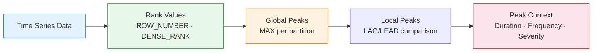

# :material-chart-line-variant: Peak Detection

Find **maximum traffic, peak CPU, highest sales hours** — identify local and global
peaks in time series data for capacity planning, alerting, and trend analysis.

---

## :material-sitemap: Detection Flow



---

## :material-code-tags: Syntax

### Sample data

```sql
CREATE OR REPLACE TEMP VIEW metrics AS
SELECT * FROM VALUES
  ('web_traffic',  TIMESTAMP '2024-03-01 00:00', 1200),
  ('web_traffic',  TIMESTAMP '2024-03-01 01:00', 980),
  ('web_traffic',  TIMESTAMP '2024-03-01 02:00', 650),
  ('web_traffic',  TIMESTAMP '2024-03-01 03:00', 420),
  ('web_traffic',  TIMESTAMP '2024-03-01 04:00', 380),
  ('web_traffic',  TIMESTAMP '2024-03-01 05:00', 510),
  ('web_traffic',  TIMESTAMP '2024-03-01 06:00', 890),
  ('web_traffic',  TIMESTAMP '2024-03-01 07:00', 1450),
  ('web_traffic',  TIMESTAMP '2024-03-01 08:00', 2100),
  ('web_traffic',  TIMESTAMP '2024-03-01 09:00', 2850),
  ('web_traffic',  TIMESTAMP '2024-03-01 10:00', 3200),
  ('web_traffic',  TIMESTAMP '2024-03-01 11:00', 3050),
  ('web_traffic',  TIMESTAMP '2024-03-01 12:00', 2900),
  ('web_traffic',  TIMESTAMP '2024-03-01 13:00', 3100),
  ('web_traffic',  TIMESTAMP '2024-03-01 14:00', 3400),
  ('web_traffic',  TIMESTAMP '2024-03-01 15:00', 3150),
  ('web_traffic',  TIMESTAMP '2024-03-01 16:00', 2800),
  ('web_traffic',  TIMESTAMP '2024-03-01 17:00', 2600),
  ('web_traffic',  TIMESTAMP '2024-03-01 18:00', 2200),
  ('web_traffic',  TIMESTAMP '2024-03-01 19:00', 1900),
  ('web_traffic',  TIMESTAMP '2024-03-01 20:00', 1700),
  ('web_traffic',  TIMESTAMP '2024-03-01 21:00', 1500),
  ('web_traffic',  TIMESTAMP '2024-03-01 22:00', 1350),
  ('web_traffic',  TIMESTAMP '2024-03-01 23:00', 1100),
  ('cpu_usage',    TIMESTAMP '2024-03-01 08:00', 45.2),
  ('cpu_usage',    TIMESTAMP '2024-03-01 09:00', 62.8),
  ('cpu_usage',    TIMESTAMP '2024-03-01 10:00', 78.5),
  ('cpu_usage',    TIMESTAMP '2024-03-01 11:00', 85.3),
  ('cpu_usage',    TIMESTAMP '2024-03-01 12:00', 72.1),
  ('cpu_usage',    TIMESTAMP '2024-03-01 13:00', 68.9),
  ('cpu_usage',    TIMESTAMP '2024-03-01 14:00', 91.7),
  ('cpu_usage',    TIMESTAMP '2024-03-01 15:00', 88.4),
  ('cpu_usage',    TIMESTAMP '2024-03-01 16:00', 76.2),
  ('cpu_usage',    TIMESTAMP '2024-03-01 17:00', 55.1)
AS t(metric_name, ts, value);
```

---

### Global peak per metric

Find the single highest value for each metric.

```sql
SELECT
    metric_name,
    ts                                             AS peak_time,
    value                                          AS peak_value
FROM (
    SELECT
        metric_name,
        ts,
        value,
        ROW_NUMBER() OVER (
            PARTITION BY metric_name
            ORDER BY value DESC
        )                                          AS rn
    FROM metrics
)
WHERE rn = 1;
-- Result:
-- +------------+------------------+-----------+
-- |metric_name |peak_time         |peak_value |
-- +------------+------------------+-----------+
-- |web_traffic |2024-03-01 14:00  |3400       |
-- |cpu_usage   |2024-03-01 14:00  |91.7       |
-- +------------+------------------+-----------+
```

---

### Top-N peaks per metric

Return the highest N readings (useful for capacity planning).

```sql
SELECT
    metric_name,
    ts,
    value,
    DENSE_RANK() OVER (
        PARTITION BY metric_name
        ORDER BY value DESC
    )                                              AS peak_rank
FROM metrics
QUALIFY peak_rank <= 5
ORDER BY metric_name, peak_rank;
```

!!! note "QUALIFY alternative"
    If `QUALIFY` is unavailable, wrap in a subquery and filter with `WHERE peak_rank <= 5`.

---

### Local peak detection (higher than neighbours)

A local peak is a point where the value is greater than both the preceding and
following values — identifying distinct spikes rather than just the global maximum.

```sql
WITH neighbours AS (
    SELECT
        metric_name,
        ts,
        value,
        LAG(value, 1) OVER w                       AS prev_value,
        LEAD(value, 1) OVER w                      AS next_value
    FROM metrics
    WINDOW w AS (PARTITION BY metric_name ORDER BY ts)
)
SELECT
    metric_name,
    ts                                             AS peak_time,
    value                                          AS peak_value,
    value - prev_value                             AS rise,
    value - next_value                             AS fall
FROM neighbours
WHERE value > COALESCE(prev_value, value - 1)
  AND value > COALESCE(next_value, value - 1)
ORDER BY metric_name, value DESC;
-- Result (web_traffic):
-- |peak_time        |peak_value|rise|fall|
-- |2024-03-01 10:00 |3200      |350 |150 |  ← morning peak
-- |2024-03-01 14:00 |3400      |300 |250 |  ← afternoon peak
```

---

### Peak hours analysis (recurring daily peaks)

Identify which hours consistently have the highest values across multiple days.

```sql
WITH hourly_stats AS (
    SELECT
        metric_name,
        HOUR(ts)                                   AS hr,
        AVG(value)                                 AS avg_value,
        MAX(value)                                 AS max_value,
        COUNT(*)                                   AS sample_count
    FROM metrics
    GROUP BY metric_name, HOUR(ts)
)
SELECT
    metric_name,
    hr                                             AS peak_hour,
    ROUND(avg_value, 2)                            AS avg_value,
    max_value,
    DENSE_RANK() OVER (
        PARTITION BY metric_name
        ORDER BY avg_value DESC
    )                                              AS hour_rank
FROM hourly_stats
ORDER BY metric_name, avg_value DESC;
```

---

### Peak duration (how long above threshold)

Measure how long a metric stays above a critical threshold.

```sql
WITH above_threshold AS (
    SELECT
        metric_name,
        ts,
        value,
        CASE WHEN value > 3000 THEN 1 ELSE 0 END  AS is_peak,
        SUM(CASE
            WHEN value > 3000 THEN 0 ELSE 1
        END) OVER (
            PARTITION BY metric_name
            ORDER BY ts
            ROWS UNBOUNDED PRECEDING
        )                                          AS peak_group
    FROM metrics
    WHERE metric_name = 'web_traffic'
)
SELECT
    MIN(ts)                                        AS peak_start,
    MAX(ts)                                        AS peak_end,
    COUNT(*)                                       AS hours_above,
    ROUND(AVG(value), 0)                           AS avg_during_peak,
    MAX(value)                                     AS max_during_peak
FROM above_threshold
WHERE is_peak = 1
GROUP BY peak_group
ORDER BY peak_start;
-- Result:
-- |peak_start       |peak_end         |hours_above|avg_peak|max_peak|
-- |2024-03-01 10:00 |2024-03-01 15:00 |5          |3140    |3400    |
```

---

### Peaks relative to rolling baseline

Detect peaks as deviations from a rolling average (adaptive threshold).

```sql
WITH baseline AS (
    SELECT
        metric_name,
        ts,
        value,
        AVG(value) OVER (
            PARTITION BY metric_name
            ORDER BY ts
            ROWS BETWEEN 6 PRECEDING AND 1 PRECEDING
        )                                          AS rolling_avg_excl,
        STDDEV(value) OVER (
            PARTITION BY metric_name
            ORDER BY ts
            ROWS BETWEEN 6 PRECEDING AND 1 PRECEDING
        )                                          AS rolling_stddev_excl
    FROM metrics
)
SELECT
    metric_name,
    ts,
    value,
    ROUND(rolling_avg_excl, 2)                     AS baseline,
    ROUND(
        (value - rolling_avg_excl)
        / NULLIF(rolling_stddev_excl, 0), 2
    )                                              AS sigma_above,
    CASE
        WHEN value > rolling_avg_excl + 2 * rolling_stddev_excl
            THEN 'PEAK'
        ELSE 'NORMAL'
    END                                            AS status
FROM baseline
WHERE rolling_avg_excl IS NOT NULL
ORDER BY metric_name, ts;
```

---

## :material-information-outline: Key Concepts

| Technique | Purpose | Best For |
|-----------|---------|----------|
| `ROW_NUMBER ORDER BY value DESC` | Global top-N | "What was the highest ever?" |
| `LAG/LEAD` comparison | Local peaks (higher than neighbours) | Finding distinct spikes |
| `GROUP BY HOUR(ts)` | Recurring peak hours | Capacity scheduling |
| Gaps-and-islands grouping | Peak duration / episodes | "How long was it elevated?" |
| Rolling baseline + σ | Adaptive peak detection | Variable baselines (weekday vs weekend) |

!!! tip "Exclude current row from baseline"
    Use `ROWS BETWEEN n PRECEDING AND 1 PRECEDING` to exclude the current row
    from the baseline calculation — prevents the peak itself from inflating the
    threshold.

!!! warning "Multiple peaks at same value"
    `ROW_NUMBER` arbitrarily picks one; use `DENSE_RANK` to return all ties
    at the peak value.

---

## :material-lightbulb-outline: When to Use

| Scenario | Approach |
|----------|----------|
| Maximum traffic hour | Global peak with `ROW_NUMBER` |
| CPU capacity planning | Top-N peaks + peak duration |
| Sales flash detection | Local peaks (LAG/LEAD) |
| SLA breach duration | Gaps-and-islands above threshold |
| Auto-scaling triggers | Rolling baseline + adaptive σ threshold |
| Recurring bottlenecks | Peak hours aggregation across days |

---

## :material-speedometer: Performance Notes

| Tip | Reason |
|-----|--------|
| Filter date range before peak detection | Reduces window sort cost |
| Partition by metric/entity | Enables parallelism, avoids global sort |
| Use `QUALIFY` for Top-N | Avoids extra subquery wrapping |
| Pre-aggregate to target granularity | Hourly peaks don't need minute-level data |
| Materialise rolling baselines | Reuse across multiple detection rules |

---

## :material-arrow-right: Related

- [Rolling Statistics](rolling_statistics.md) — stddev, variance, Z-scores for anomaly detection
- [Forecast Features](forecast_features.md) — lag features for ML-based peak prediction
- [Seasonality Detection](seasonality_detection.md) — recurring peak patterns by period
- [Gap Filling](gap_filling.md) — ensure no missing timestamps before peak analysis
