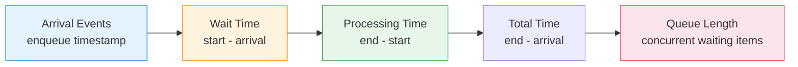

# :material-tray-full: Queue Analysis

Measure **wait time, processing time, and queue length** — essential for service-level
monitoring, bottleneck identification, and capacity planning.

______________________________________________________________________

## :material-animation-play: Interactive Demo

Hover each segment to compare queue wait time with active processing time for the same request.

<div id="viz-queue" class="ts-viz"></div>

*Each bar is total time in system: amber for waiting, teal for processing.*

______________________________________________________________________

## :material-sitemap: Analysis Flow



______________________________________________________________________

## :material-code-tags: Syntax

### Sample data

```sql
CREATE OR REPLACE TEMP VIEW queue_events AS
SELECT * FROM VALUES
  (1,  'order', TIMESTAMP '2024-03-01 09:00:00', TIMESTAMP '2024-03-01 09:05:00', TIMESTAMP '2024-03-01 09:12:00'),
  (2,  'order', TIMESTAMP '2024-03-01 09:02:00', TIMESTAMP '2024-03-01 09:12:00', TIMESTAMP '2024-03-01 09:20:00'),
  (3,  'order', TIMESTAMP '2024-03-01 09:03:00', TIMESTAMP '2024-03-01 09:20:00', TIMESTAMP '2024-03-01 09:28:00'),
  (4,  'order', TIMESTAMP '2024-03-01 09:10:00', TIMESTAMP '2024-03-01 09:15:00', TIMESTAMP '2024-03-01 09:22:00'),
  (5,  'order', TIMESTAMP '2024-03-01 09:15:00', TIMESTAMP '2024-03-01 09:22:00', TIMESTAMP '2024-03-01 09:35:00'),
  (6,  'order', TIMESTAMP '2024-03-01 09:20:00', TIMESTAMP '2024-03-01 09:28:00', TIMESTAMP '2024-03-01 09:40:00'),
  (7,  'order', TIMESTAMP '2024-03-01 09:30:00', TIMESTAMP '2024-03-01 09:35:00', TIMESTAMP '2024-03-01 09:42:00'),
  (8,  'order', TIMESTAMP '2024-03-01 09:45:00', TIMESTAMP '2024-03-01 09:46:00', TIMESTAMP '2024-03-01 09:50:00'),
  (9,  'refund', TIMESTAMP '2024-03-01 09:05:00', TIMESTAMP '2024-03-01 09:10:00', TIMESTAMP '2024-03-01 09:25:00'),
  (10, 'refund', TIMESTAMP '2024-03-01 09:12:00', TIMESTAMP '2024-03-01 09:25:00', TIMESTAMP '2024-03-01 09:38:00'),
  (11, 'refund', TIMESTAMP '2024-03-01 09:30:00', TIMESTAMP '2024-03-01 09:38:00', TIMESTAMP '2024-03-01 09:50:00'),
  (12, 'refund', TIMESTAMP '2024-03-01 09:50:00', TIMESTAMP '2024-03-01 09:51:00', TIMESTAMP '2024-03-01 09:58:00')
AS t(item_id, queue_type, arrived_at, started_at, completed_at);
```

______________________________________________________________________

### Wait time, processing time, and total time

Compute per-item timing metrics.

```sql
SELECT
    item_id,
    queue_type,
    arrived_at,
    started_at,
    completed_at,
    -- Wait time: how long in the queue before processing starts
    ROUND(
        (UNIX_TIMESTAMP(started_at) - UNIX_TIMESTAMP(arrived_at)) / 60.0,
        2
    )                                              AS wait_minutes,
    -- Processing time: how long active processing takes
    ROUND(
        (UNIX_TIMESTAMP(completed_at) - UNIX_TIMESTAMP(started_at)) / 60.0,
        2
    )                                              AS process_minutes,
    -- Total time: end-to-end from arrival to completion
    ROUND(
        (UNIX_TIMESTAMP(completed_at) - UNIX_TIMESTAMP(arrived_at)) / 60.0,
        2
    )                                              AS total_minutes
FROM queue_events
ORDER BY queue_type, arrived_at;
-- Result (order queue):
-- |item_id|arrived  |started |wait_min|process_min|total_min|
-- |1      |09:00    |09:05   |5.00    |7.00       |12.00    |
-- |2      |09:02    |09:12   |10.00   |8.00       |18.00    |
-- |3      |09:03    |09:20   |17.00   |8.00       |25.00    |
-- |8      |09:45    |09:46   |1.00    |4.00       |5.00     |
```

______________________________________________________________________

### Queue summary statistics

Aggregate timing metrics per queue for SLA reporting.

```sql
SELECT
    queue_type,
    COUNT(*)                                       AS items_processed,
    ROUND(AVG(
        (UNIX_TIMESTAMP(started_at) - UNIX_TIMESTAMP(arrived_at)) / 60.0
    ), 2)                                          AS avg_wait_min,
    ROUND(MAX(
        (UNIX_TIMESTAMP(started_at) - UNIX_TIMESTAMP(arrived_at)) / 60.0
    ), 2)                                          AS max_wait_min,
    ROUND(AVG(
        (UNIX_TIMESTAMP(completed_at) - UNIX_TIMESTAMP(started_at)) / 60.0
    ), 2)                                          AS avg_process_min,
    ROUND(PERCENTILE_APPROX(
        (UNIX_TIMESTAMP(started_at) - UNIX_TIMESTAMP(arrived_at)) / 60.0,
        0.95
    ), 2)                                          AS p95_wait_min,
    ROUND(PERCENTILE_APPROX(
        (UNIX_TIMESTAMP(completed_at) - UNIX_TIMESTAMP(arrived_at)) / 60.0,
        0.95
    ), 2)                                          AS p95_total_min
FROM queue_events
GROUP BY queue_type
ORDER BY avg_wait_min DESC;
```

______________________________________________________________________

### Queue length at any point in time

Count how many items are waiting (arrived but not yet started) at each event boundary.

```sql
WITH boundaries AS (
    SELECT DISTINCT ts FROM (
        SELECT arrived_at AS ts FROM queue_events
        UNION ALL
        SELECT started_at FROM queue_events
        UNION ALL
        SELECT completed_at FROM queue_events
    )
),
queue_at_time AS (
    SELECT
        b.ts,
        q.queue_type,
        COUNT(*)                                   AS queue_length
    FROM boundaries b
    JOIN queue_events q
        ON q.arrived_at <= b.ts
        AND q.started_at > b.ts
    GROUP BY b.ts, q.queue_type
)
SELECT
    ts,
    queue_type,
    queue_length
FROM queue_at_time
ORDER BY queue_type, ts;
-- Result: queue depth at each moment
-- |ts              |queue_type|queue_length|
-- |2024-03-01 09:03|order     |2           |  ← items 2,3 waiting
-- |2024-03-01 09:10|order     |3           |  ← items 2,3,4 waiting
```

______________________________________________________________________

### Peak queue length per hour

Find the maximum queue depth for capacity planning.

```sql
WITH boundaries AS (
    SELECT DISTINCT ts FROM (
        SELECT arrived_at AS ts FROM queue_events
        UNION ALL
        SELECT started_at FROM queue_events
    )
),
queue_at_time AS (
    SELECT
        b.ts,
        q.queue_type,
        COUNT(*)                                   AS queue_length
    FROM boundaries b
    JOIN queue_events q
        ON q.arrived_at <= b.ts
        AND q.started_at > b.ts
    GROUP BY b.ts, q.queue_type
)
SELECT
    queue_type,
    HOUR(ts)                                       AS hr,
    MAX(queue_length)                              AS peak_queue_length,
    ROUND(AVG(queue_length), 1)                    AS avg_queue_length
FROM queue_at_time
GROUP BY queue_type, HOUR(ts)
ORDER BY queue_type, hr;
```

______________________________________________________________________

### Throughput and arrival rate

Compute items per minute/hour for flow analysis.

```sql
WITH time_buckets AS (
    SELECT
        queue_type,
        DATE_TRUNC('hour', arrived_at)             AS bucket,
        COUNT(*)                                   AS arrivals
    FROM queue_events
    GROUP BY queue_type, DATE_TRUNC('hour', arrived_at)
),
completions AS (
    SELECT
        queue_type,
        DATE_TRUNC('hour', completed_at)           AS bucket,
        COUNT(*)                                   AS completions
    FROM queue_events
    GROUP BY queue_type, DATE_TRUNC('hour', completed_at)
)
SELECT
    COALESCE(a.queue_type, c.queue_type)           AS queue_type,
    COALESCE(a.bucket, c.bucket)                   AS hour_bucket,
    COALESCE(a.arrivals, 0)                        AS arrivals,
    COALESCE(c.completions, 0)                     AS completions,
    COALESCE(a.arrivals, 0) - COALESCE(c.completions, 0)
                                                   AS net_queue_change
FROM time_buckets a
FULL OUTER JOIN completions c
    ON a.queue_type = c.queue_type
    AND a.bucket = c.bucket
ORDER BY queue_type, hour_bucket;
```

______________________________________________________________________

### SLA breach detection

Flag items that exceeded the target wait time.

```sql
WITH sla_targets AS (
    SELECT * FROM VALUES
      ('order',  10.0),
      ('refund', 15.0)
    AS t(queue_type, max_wait_minutes)
)
SELECT
    q.item_id,
    q.queue_type,
    q.arrived_at,
    q.started_at,
    ROUND(
        (UNIX_TIMESTAMP(q.started_at) - UNIX_TIMESTAMP(q.arrived_at)) / 60.0,
        2
    )                                              AS actual_wait_min,
    s.max_wait_minutes                             AS sla_target_min,
    CASE
        WHEN (UNIX_TIMESTAMP(q.started_at) - UNIX_TIMESTAMP(q.arrived_at)) / 60.0
             > s.max_wait_minutes
            THEN 'BREACHED'
        ELSE 'MET'
    END                                            AS sla_status,
    ROUND(
        (UNIX_TIMESTAMP(q.started_at) - UNIX_TIMESTAMP(q.arrived_at)) / 60.0
        - s.max_wait_minutes,
        2
    )                                              AS breach_minutes
FROM queue_events q
JOIN sla_targets s ON q.queue_type = s.queue_type
ORDER BY sla_status DESC, actual_wait_min DESC;
```

______________________________________________________________________

## :material-information-outline: Key Concepts

| Metric              | Formula                             | Interpretation                        |
| ------------------- | ----------------------------------- | ------------------------------------- |
| **Wait Time**       | `started_at - arrived_at`           | Time spent in queue before processing |
| **Processing Time** | `completed_at - started_at`         | Active service duration               |
| **Total Time**      | `completed_at - arrived_at`         | End-to-end latency                    |
| **Queue Length**    | Count where `arrived < t < started` | Items waiting at time t               |
| **Throughput**      | `completions / time_period`         | Processing rate                       |
| **Utilization**     | `busy_time / available_time`        | Server load factor                    |

!!! tip "Little's Law"

    `L = λ × W` — Average queue length (L) equals arrival rate (λ) multiplied
    by average wait time (W). Use this to validate your metrics or estimate
    one from the other two.

!!! warning "Concurrent processing"

    If multiple items can be processed simultaneously, queue length calculation
    must account for parallelism — items are "waiting" only if all processors
    are busy.

______________________________________________________________________

## :material-lightbulb-outline: When to Use

| Scenario                 | Key Metrics                                   |
| ------------------------ | --------------------------------------------- |
| Customer support tickets | Wait time, P95 total time, SLA breach rate    |
| Order fulfillment        | Processing time, peak queue length            |
| API request queues       | Throughput, arrival rate vs completion rate   |
| Manufacturing lines      | Idle time between items, bottleneck detection |
| Hospital ER triage       | Wait by priority, queue length by hour        |

______________________________________________________________________

## :material-speedometer: Performance Notes

| Tip                                          | Reason                                              |
| -------------------------------------------- | --------------------------------------------------- |
| Pre-compute timing columns                   | Avoid repeated `UNIX_TIMESTAMP` in multiple queries |
| Use event-boundary approach for queue length | More efficient than per-second sampling             |
| Partition by `queue_type` and date           | Enables parallel computation per queue              |
| Use `PERCENTILE_APPROX` for P95/P99          | Faster than exact percentile on large datasets      |
| Filter to recent time window                 | Queue tables grow quickly; always bound temporally  |

______________________________________________________________________

## :material-database-search: [Databricks] Real-World Example — System Tables

!!! note "[Databricks] Unity Catalog system tables"

    `system.query.history` is a built-in Unity Catalog system table (no
    sample data setup needed) that records real queueing delays for
    Databricks SQL warehouses. An account admin must grant `USE CATALOG` on
    `system`, `USE SCHEMA` on `system.query`, and `SELECT` on
    `system.query.history` before these queries will return rows.

### Queue wait by warehouse and hour

```sql
-- [Databricks] Requires SELECT on system.query.history
SELECT
    compute.warehouse_id AS warehouse_id,
    DATE_TRUNC('hour', start_time) AS hour_bucket,
    COUNT(*) AS query_count,
    ROUND(AVG(waiting_for_compute_duration_ms), 1) AS avg_compute_wait_ms,
    ROUND(PERCENTILE_APPROX(waiting_at_capacity_duration_ms, 0.95), 1) AS p95_capacity_wait_ms,
    ROUND(
        AVG(waiting_for_compute_duration_ms + waiting_at_capacity_duration_ms),
        1
    ) AS avg_total_queue_wait_ms
FROM system.query.history
WHERE start_time >= CURRENT_TIMESTAMP() - INTERVAL 7 DAYS
  AND compute.warehouse_id IS NOT NULL
GROUP BY compute.warehouse_id, DATE_TRUNC('hour', start_time)
HAVING MAX(
    waiting_for_compute_duration_ms + waiting_at_capacity_duration_ms
) > 0
ORDER BY avg_total_queue_wait_ms DESC, hour_bucket DESC;
-- Result (illustrative):
-- warehouse_id | hour_bucket          | query_count | avg_compute_wait_ms | p95_capacity_wait_ms | avg_total_queue_wait_ms
-- ------------ | -------------------- | ----------- | ------------------- | -------------------- | -----------------------
-- 6f91a...     | 2024-07-02 10:00:00  | 143         | 220.5               | 1880.0               | 514.2
-- 8b22c...     | 2024-07-02 14:00:00  | 57          | 18.0                | 95.0                 | 31.6
```

!!! tip "Queue metrics are just time-series aggregates"

    Once queue wait is exposed as a numeric measure over time, the same
    aggregation, percentile, and trend patterns apply as they do for any
    other operational latency series.

______________________________________________________________________

## :material-arrow-right: Related

- [Utilization Analysis](utilization-analysis.md) — resource busy/idle measurement
- [Event Stream Analytics](../../sequence/event-stream-analytics.md) — processing event sequences
- [Gaps & Islands](../../sequence/gaps-islands.md) — detecting continuous busy/idle intervals
- [Peak Detection](peak-detection.md) — find maximum queue depth moments
