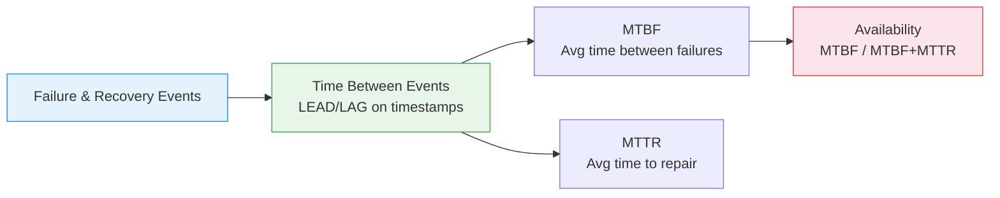

# :material-shield-check: Reliability Metrics

Compute **MTBF, MTTR, failure rate, and availability percentage** — core reliability
engineering metrics derived from failure and recovery events.

______________________________________________________________________

## :material-animation-play: Interactive Demo

Hover the red downtime segments to see how each outage contributes to MTTR while the summary line recomputes the reliability metrics.

<div id="viz-reliability" class="ts-viz"></div>

*Illustrative service states across four days. Teal = uptime, red = downtime, and the captioned summary shows MTBF, MTTR, and availability from the sample timeline.*

______________________________________________________________________

## :material-sitemap: Metrics Flow



______________________________________________________________________

## :material-code-tags: Syntax

### Sample data

```sql
CREATE OR REPLACE TEMP VIEW incidents AS
SELECT * FROM VALUES
  ('server_1', TIMESTAMP '2024-01-05 08:00', TIMESTAMP '2024-01-05 08:45'),
  ('server_1', TIMESTAMP '2024-01-20 14:00', TIMESTAMP '2024-01-20 14:30'),
  ('server_1', TIMESTAMP '2024-02-10 03:00', TIMESTAMP '2024-02-10 04:15'),
  ('server_1', TIMESTAMP '2024-03-01 11:00', TIMESTAMP '2024-03-01 11:20'),
  ('server_2', TIMESTAMP '2024-01-15 09:00', TIMESTAMP '2024-01-15 10:30'),
  ('server_2', TIMESTAMP '2024-02-28 16:00', TIMESTAMP '2024-02-28 16:45')
AS t(resource_id, failure_time, recovery_time);
```

______________________________________________________________________

### MTBF and MTTR per resource

```sql
WITH repair_times AS (
    SELECT
        resource_id,
        failure_time,
        recovery_time,
        (UNIX_TIMESTAMP(recovery_time) - UNIX_TIMESTAMP(failure_time)) / 3600.0
                                                   AS ttr_hours,
        LEAD(failure_time) OVER (
            PARTITION BY resource_id ORDER BY failure_time
        )                                          AS next_failure,
        (UNIX_TIMESTAMP(LEAD(failure_time) OVER (
            PARTITION BY resource_id ORDER BY failure_time
        )) - UNIX_TIMESTAMP(recovery_time)) / 3600.0
                                                   AS tbf_hours
    FROM incidents
)
SELECT
    resource_id,
    COUNT(*)                                       AS total_failures,
    ROUND(AVG(ttr_hours), 2)                       AS mttr_hours,
    ROUND(AVG(tbf_hours), 2)                       AS mtbf_hours,
    -- Failure rate (failures per day)
    ROUND(
        COUNT(*) * 1.0
        / (DATEDIFF(MAX(failure_time), MIN(failure_time)) + 1),
        4
    )                                              AS failures_per_day,
    -- Availability: MTBF / (MTBF + MTTR)
    ROUND(
        AVG(tbf_hours) * 100.0
        / (AVG(tbf_hours) + AVG(ttr_hours)),
        2
    )                                              AS availability_pct
FROM repair_times
GROUP BY resource_id
ORDER BY availability_pct ASC;
```

______________________________________________________________________

### Failure trend (improving or degrading?)

```sql
SELECT
    resource_id,
    failure_time,
    recovery_time,
    ROUND(
        (UNIX_TIMESTAMP(recovery_time) - UNIX_TIMESTAMP(failure_time)) / 60.0, 1
    )                                              AS ttr_minutes,
    ROUND(
        (UNIX_TIMESTAMP(failure_time)
         - UNIX_TIMESTAMP(LAG(recovery_time) OVER (
             PARTITION BY resource_id ORDER BY failure_time
         ))) / 3600.0, 1
    )                                              AS tbf_hours,
    ROW_NUMBER() OVER (PARTITION BY resource_id ORDER BY failure_time)
                                                   AS failure_number
FROM incidents
ORDER BY resource_id, failure_time;
```

______________________________________________________________________

## :material-information-outline: Key Concepts

| Metric           | Formula                         | Meaning                    |
| ---------------- | ------------------------------- | -------------------------- |
| **MTBF**         | `AVG(next_failure - recovery)`  | Mean Time Between Failures |
| **MTTR**         | `AVG(recovery - failure)`       | Mean Time To Repair        |
| **Availability** | `MTBF / (MTBF + MTTR) × 100`    | Operational uptime %       |
| **Failure Rate** | `failures / observation_period` | Frequency of incidents     |

______________________________________________________________________

## :material-lightbulb-outline: When to Use

| Scenario                      | Metric                                |
| ----------------------------- | ------------------------------------- |
| SLA compliance                | Availability % against target (99.9%) |
| Vendor comparison             | MTBF across hardware vendors          |
| Maintenance scheduling        | Predict next failure from MTBF trend  |
| Incident response improvement | Track MTTR reduction over time        |

______________________________________________________________________

## :material-database-search: [Databricks] Real-World Example — System Tables

!!! note "[Databricks] Unity Catalog system tables"

    `system.lakeflow.job_run_timeline` is a built-in Unity Catalog system
    table (no sample data setup needed) that records real job run outcomes
    over time. An account admin must grant `USE CATALOG` on `system`,
    `USE SCHEMA` on `system.lakeflow`, and `SELECT` on
    `system.lakeflow.job_run_timeline` before these queries will return rows.

### Daily job reliability and time between failures

```sql
-- [Databricks] Requires SELECT on system.lakeflow.job_run_timeline
WITH failed_runs AS (
    SELECT
        job_id,
        period_start_time,
        ROUND(
            (
                UNIX_TIMESTAMP(period_start_time)
                - UNIX_TIMESTAMP(LAG(period_start_time, 1) OVER (
                    PARTITION BY job_id
                    ORDER BY period_start_time
                ))
            ) / 3600.0,
            1
        ) AS hours_since_prev_failure
    FROM system.lakeflow.job_run_timeline
    WHERE period_start_time >= CURRENT_TIMESTAMP() - INTERVAL 30 DAYS
      AND result_state NOT IN ('SUCCESS', 'COMPLETED')
),
daily_reliability AS (
    SELECT
        job_id,
        DATE(period_start_time) AS run_date,
        COUNT(*) AS total_runs,
        COUNT(*) FILTER (
            WHERE result_state IN ('SUCCESS', 'COMPLETED')
        ) AS successful_runs,
        COUNT(*) FILTER (
            WHERE result_state NOT IN ('SUCCESS', 'COMPLETED')
        ) AS failed_runs
    FROM system.lakeflow.job_run_timeline
    WHERE period_start_time >= CURRENT_TIMESTAMP() - INTERVAL 30 DAYS
    GROUP BY job_id, DATE(period_start_time)
)
SELECT
    d.job_id,
    d.run_date,
    d.total_runs,
    d.failed_runs,
    ROUND(d.successful_runs * 100.0 / NULLIF(d.total_runs, 0), 1) AS success_pct,
    ROUND(AVG(f.hours_since_prev_failure), 1) AS mean_hours_between_failures
FROM daily_reliability AS d
LEFT JOIN failed_runs AS f
    ON d.job_id = f.job_id
    AND d.run_date = DATE(f.period_start_time)
GROUP BY d.job_id, d.run_date, d.total_runs, d.failed_runs, d.successful_runs
ORDER BY d.run_date DESC, success_pct ASC;
-- Result (illustrative):
-- job_id | run_date   | total_runs | failed_runs | success_pct | mean_hours_between_failures
-- ------ | ---------- | ---------- | ----------- | ----------- | ---------------------------
-- 4512   | 2024-07-02 | 24         | 2           | 91.7        | 38.5
-- 9921   | 2024-07-02 | 12         | 0           | 100.0       | NULL
```

!!! tip "Reliability metrics often begin as run outcomes over time"

    Even when you do not have explicit repair events, the same time-series
    approach still captures reliability: aggregate success rate by period,
    then use `LAG` to measure how far apart failure events occur in practice.

______________________________________________________________________

## :material-arrow-right: Related

- [Utilization Analysis](utilization-analysis.md) — uptime/downtime measurement
- [Time Allocation](time-allocation.md) — state-based time breakdown
- [Trend Detection](trend-detection.md) — are metrics improving?
