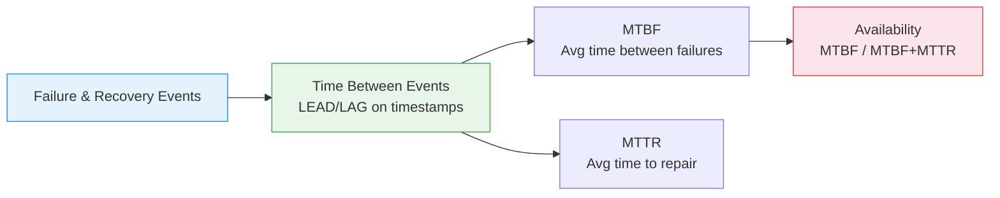

# :material-shield-check: Reliability Metrics

Compute **MTBF, MTTR, failure rate, and availability percentage** — core reliability
engineering metrics derived from failure and recovery events.

---

## :material-sitemap: Metrics Flow



---

## :material-code-tags: Syntax

### Sample data

```sql
CREATE OR REPLACE TEMP VIEW incidents AS
SELECT * FROM VALUES
  ('server_1', TIMESTAMP '2024-01-05 08:00', TIMESTAMP '2024-01-05 08:45'),
  ('server_1', TIMESTAMP '2024-01-20 14:00', TIMESTAMP '2024-01-20 14:30'),
  ('server_1', TIMESTAMP '2024-02-10 03:00', TIMESTAMP '2024-02-10 04:15'),
  ('server_1', TIMESTAMP '2024-03-01 11:00', TIMESTAMP '2024-03-01 11:20'),
  ('server_2', TIMESTAMP '2024-01-15 09:00', TIMESTAMP '2024-01-15 10:30'),
  ('server_2', TIMESTAMP '2024-02-28 16:00', TIMESTAMP '2024-02-28 16:45')
AS t(resource_id, failure_time, recovery_time);
```

---

### MTBF and MTTR per resource

```sql
WITH repair_times AS (
    SELECT
        resource_id,
        failure_time,
        recovery_time,
        (UNIX_TIMESTAMP(recovery_time) - UNIX_TIMESTAMP(failure_time)) / 3600.0
                                                   AS ttr_hours,
        LEAD(failure_time) OVER (
            PARTITION BY resource_id ORDER BY failure_time
        )                                          AS next_failure,
        (UNIX_TIMESTAMP(LEAD(failure_time) OVER (
            PARTITION BY resource_id ORDER BY failure_time
        )) - UNIX_TIMESTAMP(recovery_time)) / 3600.0
                                                   AS tbf_hours
    FROM incidents
)
SELECT
    resource_id,
    COUNT(*)                                       AS total_failures,
    ROUND(AVG(ttr_hours), 2)                       AS mttr_hours,
    ROUND(AVG(tbf_hours), 2)                       AS mtbf_hours,
    -- Failure rate (failures per day)
    ROUND(
        COUNT(*) * 1.0
        / (DATEDIFF(MAX(failure_time), MIN(failure_time)) + 1),
        4
    )                                              AS failures_per_day,
    -- Availability: MTBF / (MTBF + MTTR)
    ROUND(
        AVG(tbf_hours) * 100.0
        / (AVG(tbf_hours) + AVG(ttr_hours)),
        2
    )                                              AS availability_pct
FROM repair_times
GROUP BY resource_id
ORDER BY availability_pct ASC;
```

---

### Failure trend (improving or degrading?)

```sql
SELECT
    resource_id,
    failure_time,
    recovery_time,
    ROUND(
        (UNIX_TIMESTAMP(recovery_time) - UNIX_TIMESTAMP(failure_time)) / 60.0, 1
    )                                              AS ttr_minutes,
    ROUND(
        (UNIX_TIMESTAMP(failure_time)
         - UNIX_TIMESTAMP(LAG(recovery_time) OVER (
             PARTITION BY resource_id ORDER BY failure_time
         ))) / 3600.0, 1
    )                                              AS tbf_hours,
    ROW_NUMBER() OVER (PARTITION BY resource_id ORDER BY failure_time)
                                                   AS failure_number
FROM incidents
ORDER BY resource_id, failure_time;
```

---

## :material-information-outline: Key Concepts

| Metric | Formula | Meaning |
|--------|---------|---------|
| **MTBF** | `AVG(next_failure - recovery)` | Mean Time Between Failures |
| **MTTR** | `AVG(recovery - failure)` | Mean Time To Repair |
| **Availability** | `MTBF / (MTBF + MTTR) × 100` | Operational uptime % |
| **Failure Rate** | `failures / observation_period` | Frequency of incidents |

---

## :material-lightbulb-outline: When to Use

| Scenario | Metric |
|----------|--------|
| SLA compliance | Availability % against target (99.9%) |
| Vendor comparison | MTBF across hardware vendors |
| Maintenance scheduling | Predict next failure from MTBF trend |
| Incident response improvement | Track MTTR reduction over time |

---

## :material-arrow-right: Related

- [Utilization Analysis](utilization_analysis.md) — uptime/downtime measurement
- [Time Allocation](time_allocation.md) — state-based time breakdown
- [Trend Detection](trend_detection.md) — are metrics improving?
