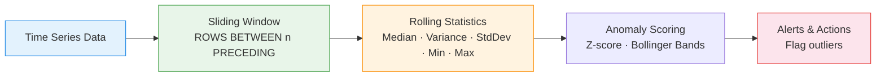

# :material-chart-bell-curve: Rolling Statistics

Compute **rolling median, variance, standard deviation, and min/max** over sliding
windows — essential for anomaly detection, control charts, and adaptive thresholds.

!!! note "Source"
    Full runnable example: `sql/timeseries/sliding.sql`

---

## :material-sitemap: Rolling Statistics Pipeline



---

## :material-code-tags: Syntax

### Sample data

```sql
CREATE OR REPLACE TEMP VIEW sensor_readings AS
SELECT * FROM VALUES
  ('sensor_a', TIMESTAMP '2024-03-01 08:00', 72.1),
  ('sensor_a', TIMESTAMP '2024-03-01 09:00', 71.8),
  ('sensor_a', TIMESTAMP '2024-03-01 10:00', 73.5),
  ('sensor_a', TIMESTAMP '2024-03-01 11:00', 72.9),
  ('sensor_a', TIMESTAMP '2024-03-01 12:00', 74.2),
  ('sensor_a', TIMESTAMP '2024-03-01 13:00', 71.6),
  ('sensor_a', TIMESTAMP '2024-03-01 14:00', 95.3),
  ('sensor_a', TIMESTAMP '2024-03-01 15:00', 73.1),
  ('sensor_a', TIMESTAMP '2024-03-01 16:00', 72.4),
  ('sensor_a', TIMESTAMP '2024-03-01 17:00', 73.8),
  ('sensor_a', TIMESTAMP '2024-03-01 18:00', 74.5),
  ('sensor_a', TIMESTAMP '2024-03-01 19:00', 72.0),
  ('sensor_a', TIMESTAMP '2024-03-01 20:00', 71.5),
  ('sensor_a', TIMESTAMP '2024-03-01 21:00', 73.2),
  ('sensor_b', TIMESTAMP '2024-03-01 08:00', 45.0),
  ('sensor_b', TIMESTAMP '2024-03-01 09:00', 46.2),
  ('sensor_b', TIMESTAMP '2024-03-01 10:00', 44.8),
  ('sensor_b', TIMESTAMP '2024-03-01 11:00', 45.5),
  ('sensor_b', TIMESTAMP '2024-03-01 12:00', 47.1),
  ('sensor_b', TIMESTAMP '2024-03-01 13:00', 44.3),
  ('sensor_b', TIMESTAMP '2024-03-01 14:00', 45.9),
  ('sensor_b', TIMESTAMP '2024-03-01 15:00', 46.5)
AS t(sensor_id, reading_time, value);
```

---

### Rolling min and max

Detect peaks and troughs within a lookback window.

```sql
SELECT
    sensor_id,
    reading_time,
    value,
    MIN(value) OVER w                              AS rolling_min_6,
    MAX(value) OVER w                              AS rolling_max_6,
    MAX(value) OVER w - MIN(value) OVER w          AS rolling_range_6,
    -- Position within range (0 = at min, 1 = at max)
    ROUND(
        (value - MIN(value) OVER w)
        / NULLIF(MAX(value) OVER w - MIN(value) OVER w, 0),
        4
    )                                              AS range_position
FROM sensor_readings
WINDOW w AS (
    PARTITION BY sensor_id
    ORDER BY reading_time
    ROWS BETWEEN 5 PRECEDING AND CURRENT ROW
)
ORDER BY sensor_id, reading_time;
```

---

### Rolling variance and standard deviation

Measure dispersion for volatility tracking and control limits.

```sql
SELECT
    sensor_id,
    reading_time,
    value,
    ROUND(AVG(value) OVER w, 3)                    AS rolling_avg_6,
    ROUND(VARIANCE(value) OVER w, 4)               AS rolling_var_6,
    ROUND(STDDEV(value) OVER w, 4)                 AS rolling_stddev_6,
    -- Coefficient of variation (normalised volatility)
    ROUND(
        STDDEV(value) OVER w / NULLIF(AVG(value) OVER w, 0),
        5
    )                                              AS coeff_variation
FROM sensor_readings
WINDOW w AS (
    PARTITION BY sensor_id
    ORDER BY reading_time
    ROWS BETWEEN 5 PRECEDING AND CURRENT ROW
)
ORDER BY sensor_id, reading_time;
-- Result (sensor_a, rows 6-8):
-- |reading_time|value|rolling_avg|rolling_stddev|
-- |13:00       |71.6 |72.68      |0.96          |
-- |14:00       |95.3 |76.25      |8.87          |  ← spike!
-- |15:00       |73.1 |76.77      |8.36          |
```

---

### Rolling median (approximate)

Use `PERCENTILE_APPROX` for a rolling median — more robust to outliers than mean.

```sql
SELECT
    sensor_id,
    reading_time,
    value,
    ROUND(AVG(value) OVER w, 2)                    AS rolling_avg_6,
    -- Approximate median over the window via subquery
    ROUND(
        PERCENTILE_APPROX(value, 0.5) OVER w,
        2
    )                                              AS rolling_median_6,
    -- Median absolute deviation (MAD) proxy
    ROUND(
        ABS(value - PERCENTILE_APPROX(value, 0.5) OVER w),
        3
    )                                              AS deviation_from_median
FROM sensor_readings
WINDOW w AS (
    PARTITION BY sensor_id
    ORDER BY reading_time
    ROWS BETWEEN 5 PRECEDING AND CURRENT ROW
)
ORDER BY sensor_id, reading_time;
```

!!! note "PERCENTILE_APPROX in windows"
    Spark supports `PERCENTILE_APPROX` as a window aggregate since Spark 3.1+.
    For exact median on small windows, use `PERCENTILE(value, 0.5)` (requires
    Databricks or Spark 3.4+).

---

### Z-score anomaly detection

Flag readings that deviate significantly from the rolling mean.

```sql
WITH stats AS (
    SELECT
        sensor_id,
        reading_time,
        value,
        AVG(value) OVER w                          AS rolling_avg,
        STDDEV(value) OVER w                       AS rolling_stddev
    FROM sensor_readings
    WINDOW w AS (
        PARTITION BY sensor_id
        ORDER BY reading_time
        ROWS BETWEEN 5 PRECEDING AND CURRENT ROW
    )
)
SELECT
    sensor_id,
    reading_time,
    value,
    ROUND(rolling_avg, 2)                          AS rolling_avg,
    ROUND(rolling_stddev, 3)                       AS rolling_stddev,
    ROUND(
        (value - rolling_avg) / NULLIF(rolling_stddev, 0),
        3
    )                                              AS z_score,
    CASE
        WHEN ABS((value - rolling_avg) / NULLIF(rolling_stddev, 0)) > 3
            THEN 'CRITICAL'
        WHEN ABS((value - rolling_avg) / NULLIF(rolling_stddev, 0)) > 2
            THEN 'WARNING'
        ELSE 'NORMAL'
    END                                            AS alert_level
FROM stats
ORDER BY sensor_id, reading_time;
-- Result (sensor_a at 14:00):
-- |value|rolling_avg|rolling_stddev|z_score|alert_level|
-- |95.3 |76.25      |8.870         |2.147  |WARNING    |
```

---

### Bollinger Bands (rolling mean ± 2σ)

Create upper and lower control limits for visual anomaly detection.

```sql
SELECT
    sensor_id,
    reading_time,
    value,
    ROUND(AVG(value) OVER w, 2)                    AS middle_band,
    ROUND(
        AVG(value) OVER w + 2 * STDDEV(value) OVER w,
        2
    )                                              AS upper_band,
    ROUND(
        AVG(value) OVER w - 2 * STDDEV(value) OVER w,
        2
    )                                              AS lower_band,
    CASE
        WHEN value > AVG(value) OVER w + 2 * STDDEV(value) OVER w
            THEN 'ABOVE'
        WHEN value < AVG(value) OVER w - 2 * STDDEV(value) OVER w
            THEN 'BELOW'
        ELSE 'WITHIN'
    END                                            AS band_status
FROM sensor_readings
WINDOW w AS (
    PARTITION BY sensor_id
    ORDER BY reading_time
    ROWS BETWEEN 5 PRECEDING AND CURRENT ROW
)
ORDER BY sensor_id, reading_time;
```

---

### Complete rolling statistics summary

All statistics in one query with named window reuse.

```sql
SELECT
    sensor_id,
    reading_time,
    value,
    -- Central tendency
    ROUND(AVG(value) OVER w, 2)                    AS rolling_avg,
    ROUND(PERCENTILE_APPROX(value, 0.5) OVER w, 2)
                                                   AS rolling_median,
    -- Dispersion
    ROUND(STDDEV(value) OVER w, 3)                 AS rolling_stddev,
    ROUND(VARIANCE(value) OVER w, 3)               AS rolling_var,
    -- Extremes
    MIN(value) OVER w                              AS rolling_min,
    MAX(value) OVER w                              AS rolling_max,
    MAX(value) OVER w - MIN(value) OVER w          AS rolling_range,
    -- Anomaly indicators
    ROUND(
        (value - AVG(value) OVER w)
        / NULLIF(STDDEV(value) OVER w, 0), 3
    )                                              AS z_score,
    COUNT(*) OVER w                                AS window_size
FROM sensor_readings
WINDOW w AS (
    PARTITION BY sensor_id
    ORDER BY reading_time
    ROWS BETWEEN 5 PRECEDING AND CURRENT ROW
)
ORDER BY sensor_id, reading_time;
```

---

## :material-information-outline: Key Concepts

| Statistic | Function | Use Case |
|-----------|----------|----------|
| **Rolling Min/Max** | `MIN/MAX ... OVER w` | Peak/trough detection, range monitoring |
| **Rolling Variance** | `VARIANCE ... OVER w` | Volatility measurement |
| **Rolling StdDev** | `STDDEV ... OVER w` | Control limits, Bollinger Bands |
| **Rolling Median** | `PERCENTILE_APPROX(col, 0.5) OVER w` | Outlier-robust central tendency |
| **Z-score** | `(value - avg) / stddev` | Anomaly magnitude scoring |
| **Coefficient of Variation** | `stddev / avg` | Normalised volatility comparison |

!!! tip "Window size selection"
    - **Short windows (3–6)**: Responsive to recent changes, more false positives
    - **Medium windows (7–14)**: Balanced sensitivity
    - **Long windows (30+)**: Stable baselines, slower to detect shifts

!!! warning "Warmup period"
    The first N-1 rows in each partition have fewer than N values in the window.
    Filter with `COUNT(*) OVER w >= 6` to exclude incomplete windows from alerting.

---

## :material-lightbulb-outline: When to Use

| Scenario | Recommended Statistics |
|----------|----------------------|
| IoT sensor monitoring | StdDev + Z-score for spike detection |
| Financial price alerts | Bollinger Bands (mean ± 2σ) |
| SLA compliance | Rolling min/max against thresholds |
| Capacity planning | Rolling avg + trend (is avg increasing?) |
| Data quality checks | Variance spike = upstream data issue |

---

## :material-speedometer: Performance Notes

| Tip | Reason |
|-----|--------|
| Named `WINDOW w AS (...)` | Single sort pass shared across all aggregates |
| `ROWS` not `RANGE` | Deterministic count-based windows |
| `PERCENTILE_APPROX` over `PERCENTILE` | O(n) approximate vs O(n log n) exact |
| Filter partitions by date range | Reduces data scanned before windowing |
| Materialise rolling stats for dashboards | Avoid recomputing on every query |

---

## :material-arrow-right: Related

- [Forecast Features](forecast_features.md) — lag + rolling stats for ML pipelines
- [Lag & Lead Analysis](lag_and_lead.md) — point-in-time comparisons
- [Seasonality Detection](seasonality_detection.md) — periodic pattern identification
- [Gap Filling](gap_filling.md) — handle missing timestamps before rolling calculations
