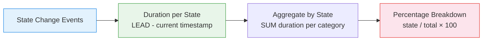

# :material-clock-outline: Time Allocation

Split total time into **Running, Idle, Error, and Maintenance** states — calculate
the proportion spent in each state for operational reporting and SLA tracking.

______________________________________________________________________

## :material-animation-play: Interactive Demo

Hover each segment to inspect the exact hours and share of time spent in each operational state.

<div id="viz-time-allocation" class="ts-viz"></div>

*The single normalized bar shows a full 24-hour day split across Running, Idle, Error, and Maintenance states.*

______________________________________________________________________

## :material-sitemap: Allocation Flow



______________________________________________________________________

## :material-code-tags: Syntax

### Sample data

```sql
CREATE OR REPLACE TEMP VIEW system_states AS
SELECT * FROM VALUES
  ('server_1', 'Running',     TIMESTAMP '2024-03-01 00:00:00'),
  ('server_1', 'Idle',        TIMESTAMP '2024-03-01 06:00:00'),
  ('server_1', 'Running',     TIMESTAMP '2024-03-01 08:00:00'),
  ('server_1', 'Error',       TIMESTAMP '2024-03-01 11:30:00'),
  ('server_1', 'Maintenance', TIMESTAMP '2024-03-01 12:00:00'),
  ('server_1', 'Running',     TIMESTAMP '2024-03-01 13:00:00'),
  ('server_1', 'Idle',        TIMESTAMP '2024-03-01 20:00:00'),
  ('server_1', 'Running',     TIMESTAMP '2024-03-01 21:00:00'),
  ('server_2', 'Running',     TIMESTAMP '2024-03-01 00:00:00'),
  ('server_2', 'Idle',        TIMESTAMP '2024-03-01 04:00:00'),
  ('server_2', 'Running',     TIMESTAMP '2024-03-01 07:00:00'),
  ('server_2', 'Idle',        TIMESTAMP '2024-03-01 18:00:00')
AS t(resource_id, state, state_start);
```

______________________________________________________________________

### Time allocation breakdown

```sql
WITH durations AS (
    SELECT
        resource_id,
        state,
        state_start,
        COALESCE(
            LEAD(state_start) OVER (
                PARTITION BY resource_id ORDER BY state_start
            ),
            TIMESTAMP '2024-03-02 00:00:00'
        )                                          AS state_end,
        (UNIX_TIMESTAMP(COALESCE(
            LEAD(state_start) OVER (
                PARTITION BY resource_id ORDER BY state_start
            ),
            TIMESTAMP '2024-03-02 00:00:00'
        )) - UNIX_TIMESTAMP(state_start)) / 3600.0
                                                   AS hours
    FROM system_states
)
SELECT
    resource_id,
    ROUND(SUM(CASE WHEN state = 'Running' THEN hours ELSE 0 END), 2)     AS running_hrs,
    ROUND(SUM(CASE WHEN state = 'Idle' THEN hours ELSE 0 END), 2)        AS idle_hrs,
    ROUND(SUM(CASE WHEN state = 'Error' THEN hours ELSE 0 END), 2)       AS error_hrs,
    ROUND(SUM(CASE WHEN state = 'Maintenance' THEN hours ELSE 0 END), 2) AS maint_hrs,
    ROUND(SUM(hours), 2)                                                  AS total_hrs,
    -- Percentages
    ROUND(SUM(CASE WHEN state = 'Running' THEN hours ELSE 0 END) * 100.0
          / SUM(hours), 1)                         AS running_pct,
    ROUND(SUM(CASE WHEN state = 'Idle' THEN hours ELSE 0 END) * 100.0
          / SUM(hours), 1)                         AS idle_pct,
    ROUND(SUM(CASE WHEN state = 'Error' THEN hours ELSE 0 END) * 100.0
          / SUM(hours), 1)                         AS error_pct,
    ROUND(SUM(CASE WHEN state = 'Maintenance' THEN hours ELSE 0 END) * 100.0
          / SUM(hours), 1)                         AS maint_pct
FROM durations
GROUP BY resource_id
ORDER BY resource_id;
```

______________________________________________________________________

### Hourly state distribution

```sql
WITH durations AS (
    SELECT
        resource_id, state, state_start,
        COALESCE(
            LEAD(state_start) OVER (PARTITION BY resource_id ORDER BY state_start),
            TIMESTAMP '2024-03-02 00:00:00'
        ) AS state_end
    FROM system_states
)
SELECT
    HOUR(state_start)                              AS hr,
    ROUND(SUM(CASE WHEN state = 'Running'
        THEN LEAST(
            (UNIX_TIMESTAMP(state_end) - UNIX_TIMESTAMP(state_start)) / 3600.0, 1
        ) ELSE 0 END)
        / COUNT(DISTINCT resource_id), 2)          AS avg_running_fraction
FROM durations
GROUP BY HOUR(state_start)
ORDER BY hr;
```

______________________________________________________________________

## :material-information-outline: Key Concepts

| State           | Meaning              | SLA Impact                      |
| --------------- | -------------------- | ------------------------------- |
| **Running**     | Actively processing  | Productive time                 |
| **Idle**        | Available but unused | Wasted capacity                 |
| **Error**       | Failed / degraded    | Downtime (counts against SLA)   |
| **Maintenance** | Planned outage       | Excluded from availability calc |

!!! tip "Availability formula"

    `Availability % = (Running + Idle) / (Total - Maintenance) × 100` —
    planned maintenance is excluded from the denominator.

______________________________________________________________________

## :material-lightbulb-outline: When to Use

| Scenario               | Key Output                                  |
| ---------------------- | ------------------------------------------- |
| SLA reporting          | Running% + Error% = uptime/downtime         |
| Cost allocation        | Charge departments by running time used     |
| Efficiency analysis    | High idle% = over-provisioned               |
| Maintenance scheduling | Find optimal windows (already idle periods) |

______________________________________________________________________

## :material-database-search: [Databricks] Real-World Example — System Tables

!!! note "[Databricks] Unity Catalog system tables"

    `system.lakeflow.job_run_timeline` is a built-in Unity Catalog system
    table (no sample data setup needed) that records real execution intervals.
    An account admin must grant `USE CATALOG` on `system`, `USE SCHEMA` on
    `system.lakeflow`, and `SELECT` on
    `system.lakeflow.job_run_timeline` before these queries will return rows.

### Daily runtime allocation by job and trigger type

```sql
-- [Databricks] Requires SELECT on system.lakeflow.job_run_timeline
WITH durations AS (
    SELECT
        job_id,
        trigger_type,
        DATE(period_start_time) AS run_date,
        ROUND(
            (UNIX_TIMESTAMP(period_end_time) - UNIX_TIMESTAMP(period_start_time)) / 3600.0,
            2
        ) AS run_hours
    FROM system.lakeflow.job_run_timeline
    WHERE period_start_time >= CURRENT_TIMESTAMP() - INTERVAL 14 DAYS
      AND period_end_time IS NOT NULL
)
SELECT
    run_date,
    job_id,
    trigger_type,
    ROUND(SUM(run_hours), 2) AS total_run_hours,
    ROUND(
        SUM(run_hours) * 100.0
        / SUM(SUM(run_hours)) OVER (PARTITION BY run_date),
        1
    ) AS daily_allocation_pct
FROM durations
GROUP BY run_date, job_id, trigger_type
ORDER BY run_date DESC, total_run_hours DESC;
-- Result (illustrative):
-- run_date   | job_id | trigger_type | total_run_hours | daily_allocation_pct
-- ---------- | ------ | ------------ | --------------- | --------------------
-- 2024-07-02 | 4512   | SCHEDULED    | 6.75            | 41.8
-- 2024-07-02 | 9921   | MANUAL       | 3.10            | 19.2
```

!!! tip "Allocated runtime is just duration grouped by a business dimension"

    Once each run has a start and end time, the same duration-splitting logic
    works for teams, trigger types, environments, or any other grouping key
    you attach to operational jobs.

______________________________________________________________________

## :material-arrow-right: Related

- [Utilization Analysis](utilization-analysis.md) — detailed busy/idle measurement
- [Reliability Metrics](reliability-metrics.md) — MTBF, MTTR from state transitions
- [Idle Time Analysis](idle-time-analysis.md) — focused idle period examination
