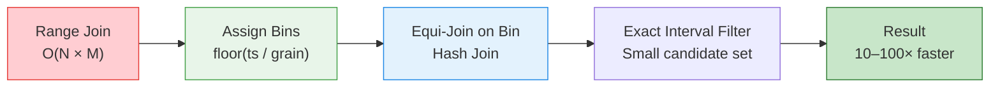

# :material-clock-fast: Time Binning

Convert expensive **range joins** into fast **equi-joins** by assigning intervals
and events to coarse-grained time bins (hour, 15-min, day), joining on the bin first,
then applying the exact interval predicate on a dramatically reduced dataset.

---

## :material-sitemap: How It Works



**Without binning** — Spark cannot use a hash join on inequality predicates. It falls
back to sort-merge with nested loop evaluation or broadcast nested loop, comparing
every fact row against every candidate interval:

```sql
-- Slow: range join with business key
-- Spark performs SortMergeJoin on customer_id, then evaluates
-- the range predicate against ALL SCD2 versions per customer
SELECT f.event_id,
       f.customer_id,
       f.event_time,
       d.tier,
       d.rate
FROM fact_events AS f                          -- 1B rows
JOIN dim_customer_rates AS d                   -- 50M rows (SCD2)
    ON  f.customer_id = d.customer_id          -- equi-join (good)
    AND f.event_time >= d.valid_from           -- range (expensive)
    AND f.event_time <  d.valid_to;            -- range (expensive)
-- Execution: for each customer, Spark compares event against
-- every version (5–50 per customer) → billions of comparisons
```

```sql
-- Worse: pure temporal join with NO business key
-- Spark has no equi-join anchor → BroadcastNestedLoop or cartesian
SELECT f.event_id,
       f.event_time,
       r.rate_name,
       r.multiplier
FROM fact_events AS f                          -- 1B rows
JOIN time_of_day_rates AS r                    -- 24 rate periods
    ON f.event_time >= r.period_start          -- no equi predicate
    AND f.event_time <  r.period_end;          -- pure range → cartesian
-- Execution: every fact row compared against all 24 rate periods
-- 1B × 24 = 24B comparisons (even though result is 1B rows)
```

**With binning** — add an equi-join column derived from the timestamp. Spark
performs a hash join on the bin (fast), then validates the range on the tiny
candidate set remaining:

```sql
-- Fast: business key + time bin + range filter
-- Spark performs HashJoin on (customer_id, day_bin), then applies
-- range predicate against only 1–2 SCD2 versions active that day
SELECT f.event_id,
       f.customer_id,
       f.event_time,
       d.tier,
       d.rate
FROM fact_events AS f                          -- 1B rows, has day_bin
JOIN dim_customer_rates_binned AS d            -- expanded to day bins
    ON  f.customer_id = d.customer_id          -- equi (hash join key)
    AND f.day_bin     = d.day_bin              -- equi (narrows to 1 day)
    AND f.event_time >= d.valid_from           -- filter on tiny set
    AND f.event_time <  d.valid_to;
-- Execution: hash join eliminates 95%+ candidates BEFORE range eval
```

```sql
-- Fast: temporal-only join with hour bin
-- Converts cartesian → hash join by bucketing both sides
SELECT f.event_id,
       f.event_time,
       r.rate_name,
       r.multiplier
FROM fact_events AS f                          -- 1B rows, has hour_bin
JOIN time_of_day_rates_binned AS r             -- 24 periods × hour bins
    ON  f.hour_bin = r.hour_bin                -- equi-join (hash)
    AND f.event_time >= r.period_start         -- filter on 1–2 rows
    AND f.event_time <  r.period_end;
-- Execution: each event matches 1 bin → 1B comparisons (not 24B)
```

!!! note "Key insight"
    The bin column acts as a **coarse-grained filter** that Spark can use for
    hash partitioning. The expensive range predicate then runs only on the
    small set of rows that share the same bin — typically reducing comparisons
    by **10× to 1000×**.

---

## :material-database: Sample Data

```sql
-- Query history: intervals with varying durations
CREATE OR REPLACE TEMP VIEW query_history AS
SELECT * FROM VALUES
  ('Q001', 'wh-prod',  TIMESTAMP '2024-03-01 09:12:00', TIMESTAMP '2024-03-01 11:28:00', 'team_data'),
  ('Q002', 'wh-prod',  TIMESTAMP '2024-03-01 10:30:00', TIMESTAMP '2024-03-01 12:05:00', 'team_ml'),
  ('Q003', 'wh-prod',  TIMESTAMP '2024-03-01 14:02:00', TIMESTAMP '2024-03-01 14:18:00', 'team_web'),
  ('Q004', 'wh-dev',   TIMESTAMP '2024-03-01 08:45:00', TIMESTAMP '2024-03-01 09:55:00', 'team_data'),
  ('Q005', 'wh-dev',   TIMESTAMP '2024-03-01 11:00:00', TIMESTAMP '2024-03-01 15:30:00', 'team_ml'),
  ('Q006', 'wh-prod',  TIMESTAMP '2024-03-01 22:10:00', TIMESTAMP '2024-03-02 02:45:00', 'team_data'),
  ('Q007', 'wh-prod',  TIMESTAMP '2024-03-02 06:30:00', TIMESTAMP '2024-03-02 06:42:00', 'team_web')
AS t(query_id, warehouse_id, start_time, end_time, team);

-- Hourly billing rates (time-varying prices)
CREATE OR REPLACE TEMP VIEW hourly_rates AS
SELECT * FROM VALUES
  (TIMESTAMP '2024-03-01 00:00', TIMESTAMP '2024-03-01 08:00', 0.50, 'off-peak'),
  (TIMESTAMP '2024-03-01 08:00', TIMESTAMP '2024-03-01 18:00', 1.20, 'peak'),
  (TIMESTAMP '2024-03-01 18:00', TIMESTAMP '2024-03-02 00:00', 0.80, 'evening'),
  (TIMESTAMP '2024-03-02 00:00', TIMESTAMP '2024-03-02 08:00', 0.50, 'off-peak'),
  (TIMESTAMP '2024-03-02 08:00', TIMESTAMP '2024-03-02 18:00', 1.20, 'peak')
AS t(rate_start, rate_end, hourly_rate, rate_tier);

-- SCD2 customer dimension (point-in-time lookups)
CREATE OR REPLACE TEMP VIEW dim_customer_scd2 AS
SELECT * FROM VALUES
  ('C100', 'Acme Corp',   'Enterprise', TIMESTAMP '2023-01-01', TIMESTAMP '2024-02-15'),
  ('C100', 'Acme Inc',    'Enterprise', TIMESTAMP '2024-02-15', TIMESTAMP '9999-12-31'),
  ('C200', 'Beta LLC',    'Startup',    TIMESTAMP '2023-06-01', TIMESTAMP '2024-01-01'),
  ('C200', 'Beta Inc',    'Growth',     TIMESTAMP '2024-01-01', TIMESTAMP '9999-12-31'),
  ('C300', 'Gamma Labs',  'Startup',    TIMESTAMP '2024-01-15', TIMESTAMP '9999-12-31')
AS t(customer_id, customer_name, segment, valid_from, valid_to);

-- Fact table with customer events
CREATE OR REPLACE TEMP VIEW fact_events AS
SELECT * FROM VALUES
  ('E001', 'C100', TIMESTAMP '2024-03-01 09:30:00', 150.00),
  ('E002', 'C100', TIMESTAMP '2024-03-01 14:15:00', 280.00),
  ('E003', 'C200', TIMESTAMP '2024-03-01 10:00:00', 95.00),
  ('E004', 'C200', TIMESTAMP '2024-03-01 16:45:00', 120.00),
  ('E005', 'C300', TIMESTAMP '2024-03-01 11:20:00', 75.00),
  ('E006', 'C100', TIMESTAMP '2024-03-02 07:00:00', 310.00)
AS t(event_id, customer_id, event_time, amount);
```

---

## :material-code-tags: Hour-Based Binning

### Step 1: Create bin IDs from timestamps

Convert timestamps to epoch hours using `FLOOR(UNIX_TIMESTAMP / 3600)`:

```sql
SELECT
    query_id,
    warehouse_id,
    start_time,
    end_time,
    FLOOR(UNIX_TIMESTAMP(start_time) / 3600) AS start_bin,
    FLOOR(UNIX_TIMESTAMP(end_time) / 3600)   AS end_bin
FROM query_history;
```

??? success "Expected output"

    | query_id | start_time          | end_time            | start_bin | end_bin |
    |----------|---------------------|---------------------|-----------|---------|
    | Q001     | 2024-03-01 09:12:00 | 2024-03-01 11:28:00 | 473553    | 473555  |
    | Q002     | 2024-03-01 10:30:00 | 2024-03-01 12:05:00 | 473554    | 473556  |
    | Q003     | 2024-03-01 14:02:00 | 2024-03-01 14:18:00 | 473558    | 473558  |
    | Q006     | 2024-03-01 22:10:00 | 2024-03-02 02:45:00 | 473566    | 473570  |

### Step 2: Expand intervals into relevant bins only

Instead of exploding to minute-level (1440 rows/day), expand only to hour bins:

```sql
WITH query_bins AS (
    SELECT
        query_id,
        warehouse_id,
        team,
        start_time,
        end_time,
        EXPLODE(
            SEQUENCE(
                FLOOR(UNIX_TIMESTAMP(start_time) / 3600),
                FLOOR(UNIX_TIMESTAMP(end_time) / 3600)
            )
        )                                          AS hour_bin
    FROM query_history
)
SELECT * FROM query_bins
WHERE query_id = 'Q001'
ORDER BY hour_bin;
```

??? success "Expected output (Q001: 09:12 → 11:28 spans 3 hour bins)"

    | query_id | warehouse_id | start_time          | end_time            | hour_bin |
    |----------|-------------|---------------------|---------------------|----------|
    | Q001     | wh-prod     | 2024-03-01 09:12:00 | 2024-03-01 11:28:00 | 473553   |
    | Q001     | wh-prod     | 2024-03-01 09:12:00 | 2024-03-01 11:28:00 | 473554   |
    | Q001     | wh-prod     | 2024-03-01 09:12:00 | 2024-03-01 11:28:00 | 473555   |

    Only 3 rows — not 136 rows (one per minute).

### Step 3: Join events on bin, then validate exact interval

```sql
WITH query_bins AS (
    SELECT
        query_id,
        warehouse_id,
        team,
        start_time,
        end_time,
        EXPLODE(
            SEQUENCE(
                FLOOR(UNIX_TIMESTAMP(start_time) / 3600),
                FLOOR(UNIX_TIMESTAMP(end_time) / 3600)
            )
        )                                          AS hour_bin
    FROM query_history
),
event_stream AS (
    -- Simulated per-minute warehouse events
    SELECT
        warehouse_id,
        event_time,
        FLOOR(UNIX_TIMESTAMP(event_time) / 3600)  AS hour_bin
    FROM (
        SELECT 'wh-prod' AS warehouse_id,
            EXPLODE(SEQUENCE(
                TIMESTAMP '2024-03-01 09:00',
                TIMESTAMP '2024-03-01 15:00',
                INTERVAL 5 MINUTES
            )) AS event_time
    )
)
SELECT
    e.warehouse_id,
    e.event_time,
    q.query_id,
    q.team
FROM event_stream AS e
JOIN query_bins AS q
    ON  e.warehouse_id = q.warehouse_id
    AND e.hour_bin     = q.hour_bin              -- fast equi-join
WHERE e.event_time >= q.start_time              -- exact validation
  AND e.event_time <  q.end_time
ORDER BY e.event_time
LIMIT 10;
```

!!! tip "Why this is fast"

    The `hour_bin = hour_bin` equi-join lets Spark use a hash join.
    The `WHERE` clause then filters a small set of candidates (same hour)
    rather than comparing every event against every interval.

---

## :material-cash: Databricks Cost Attribution with Binning

Attribute query runtime cost to hourly rate tiers without exploding to minute-level:

```sql
WITH query_bins AS (
    SELECT
        query_id,
        warehouse_id,
        team,
        start_time,
        end_time,
        EXPLODE(
            SEQUENCE(
                FLOOR(UNIX_TIMESTAMP(start_time) / 3600),
                FLOOR(UNIX_TIMESTAMP(end_time) / 3600)
            )
        )                                          AS hour_bin
    FROM query_history
),
rate_bins AS (
    SELECT
        hourly_rate,
        rate_tier,
        rate_start,
        rate_end,
        EXPLODE(
            SEQUENCE(
                FLOOR(UNIX_TIMESTAMP(rate_start) / 3600),
                FLOOR(UNIX_TIMESTAMP(rate_end) / 3600) - 1
            )
        )                                          AS hour_bin
    FROM hourly_rates
),
-- Join on bin, then compute exact overlap per hour
cost_segments AS (
    SELECT
        q.query_id,
        q.warehouse_id,
        q.team,
        r.rate_tier,
        r.hourly_rate,
        -- Clamp to both query interval and rate interval
        GREATEST(q.start_time, r.rate_start,
            CAST(FROM_UNIXTIME(q.hour_bin * 3600) AS TIMESTAMP)
        )                                          AS seg_start,
        LEAST(q.end_time, r.rate_end,
            CAST(FROM_UNIXTIME((q.hour_bin + 1) * 3600) AS TIMESTAMP)
        )                                          AS seg_end
    FROM query_bins AS q
    JOIN rate_bins AS r
        ON q.hour_bin = r.hour_bin                 -- equi-join on bin
)
SELECT
    query_id,
    warehouse_id,
    team,
    rate_tier,
    hourly_rate,
    seg_start,
    seg_end,
    ROUND(
        (UNIX_TIMESTAMP(seg_end) - UNIX_TIMESTAMP(seg_start)) / 3600.0, 4
    )                                              AS hours_in_segment,
    ROUND(
        hourly_rate
        * (UNIX_TIMESTAMP(seg_end) - UNIX_TIMESTAMP(seg_start)) / 3600.0,
        4
    )                                              AS segment_cost_usd
FROM cost_segments
WHERE seg_end > seg_start
ORDER BY query_id, seg_start;
```

??? success "Expected output (Q001: spans peak hours only)"

    | query_id | team      | rate_tier | hourly_rate | seg_start           | seg_end             | hours   | cost    |
    |----------|-----------|-----------|-------------|---------------------|---------------------|---------|---------|
    | Q001     | team_data | peak      | 1.20        | 2024-03-01 09:12:00 | 2024-03-01 10:00:00 | 0.8000  | 0.9600  |
    | Q001     | team_data | peak      | 1.20        | 2024-03-01 10:00:00 | 2024-03-01 11:00:00 | 1.0000  | 1.2000  |
    | Q001     | team_data | peak      | 1.20        | 2024-03-01 11:00:00 | 2024-03-01 11:28:00 | 0.4667  | 0.5600  |

    Total Q001 cost: $2.72 (2.27 hours × $1.20/hr)

??? example "Compare: Q006 spans three rate tiers (evening → off-peak → off-peak)"

    | query_id | team      | rate_tier | hourly_rate | hours   | cost    |
    |----------|-----------|-----------|-------------|---------|---------|
    | Q006     | team_data | evening   | 0.80        | 1.8333  | 1.4667  |
    | Q006     | team_data | off-peak  | 0.50        | 2.7500  | 1.3750  |

    Running overnight saves $1.17 vs peak rates.

---

## :material-account-key: SCD2 Lookups with Day Binning

### Problem: temporal join on large SCD2 dimension

```sql
-- Slow: range join scans all dimension versions for every event
SELECT f.*, d.customer_name, d.segment
FROM fact_events AS f
JOIN dim_customer_scd2 AS d
    ON  f.customer_id = d.customer_id
    AND f.event_time >= d.valid_from
    AND f.event_time <  d.valid_to;
```

### Solution: add day bin to both sides

```sql
-- Create day bins for the dimension (expand to cover each valid day)
WITH dim_day_bins AS (
    SELECT
        d.customer_id,
        d.customer_name,
        d.segment,
        d.valid_from,
        d.valid_to,
        EXPLODE(
            SEQUENCE(
                DATE(d.valid_from),
                DATE(LEAST(d.valid_to, TIMESTAMP '2024-12-31')),
                INTERVAL 1 DAY
            )
        )                                          AS day_bin
    FROM dim_customer_scd2 AS d
),
-- Day bin for facts
fact_binned AS (
    SELECT *,
        DATE(event_time)                           AS day_bin
    FROM fact_events
)
SELECT
    f.event_id,
    f.customer_id,
    f.event_time,
    f.amount,
    d.customer_name,
    d.segment
FROM fact_binned AS f
JOIN dim_day_bins AS d
    ON  f.customer_id = d.customer_id              -- business key
    AND f.day_bin     = d.day_bin                   -- day bin equi-join
    AND f.event_time >= d.valid_from               -- exact validation
    AND f.event_time <  d.valid_to
ORDER BY f.event_time;
```

??? success "Expected output"

    | event_id | customer_id | event_time          | amount | customer_name | segment    |
    |----------|-------------|---------------------|--------|---------------|------------|
    | E001     | C100        | 2024-03-01 09:30:00 | 150.00 | Acme Inc      | Enterprise |
    | E003     | C200        | 2024-03-01 10:00:00 | 95.00  | Beta Inc      | Growth     |
    | E005     | C300        | 2024-03-01 11:20:00 | 75.00  | Gamma Labs    | Startup    |
    | E002     | C100        | 2024-03-01 14:15:00 | 280.00 | Acme Inc      | Enterprise |
    | E004     | C200        | 2024-03-01 16:45:00 | 120.00 | Beta Inc      | Growth     |
    | E006     | C100        | 2024-03-02 07:00:00 | 310.00 | Acme Inc      | Enterprise |

!!! warning "Dimension explosion tradeoff"

    Expanding a 10-year SCD2 dimension to day bins creates ~3650 rows per version.
    For large dimensions, limit the spine to the relevant analysis window:
    ```sql
    SEQUENCE(
        GREATEST(valid_from, TIMESTAMP '2024-01-01'),  -- clip to window
        LEAST(valid_to, TIMESTAMP '2024-12-31'),
        INTERVAL 1 DAY
    )
    ```

---

## :material-clock-time-four: 15-Minute Binning for Utilization Analysis

For warehouse utilization and fine-grained capacity planning, 15-minute bins
balance precision with performance:

```sql
-- 15-minute bin formula: 900 seconds = 15 minutes
WITH query_15min_bins AS (
    SELECT
        query_id,
        warehouse_id,
        team,
        start_time,
        end_time,
        EXPLODE(
            SEQUENCE(
                FLOOR(UNIX_TIMESTAMP(start_time) / 900),
                FLOOR(UNIX_TIMESTAMP(end_time) / 900)
            )
        )                                          AS bin_15min
    FROM query_history
)
SELECT
    warehouse_id,
    bin_15min,
    -- Convert bin back to readable timestamp
    FROM_UNIXTIME(bin_15min * 900)                  AS bucket_start,
    COUNT(DISTINCT query_id)                        AS concurrent_queries,
    COLLECT_SET(team)                               AS active_teams
FROM query_15min_bins
GROUP BY warehouse_id, bin_15min
HAVING COUNT(DISTINCT query_id) > 1
ORDER BY warehouse_id, bin_15min;
```

??? success "Expected output (concurrency hotspots)"

    | warehouse_id | bucket_start        | concurrent_queries | active_teams         |
    |-------------|---------------------|-------------------|----------------------|
    | wh-prod     | 2024-03-01 10:30:00 | 2                 | [team_data, team_ml] |
    | wh-prod     | 2024-03-01 10:45:00 | 2                 | [team_data, team_ml] |
    | wh-prod     | 2024-03-01 11:00:00 | 2                 | [team_data, team_ml] |

---

## :material-layers-triple: Multi-Level Binning for Very Large Tables

When intervals span days or weeks (e.g., SCD2 validity periods, long-running ETL),
use a hierarchical binning strategy:

```text
Level 1: Day bin      →  coarse filter (partition pruning)
Level 2: Hour bin     →  equi-join (hash join)
Level 3: Exact range  →  final validation (small candidate set)
```

```sql
-- Hybrid 3-level join for billion-row tables
SELECT f.*
FROM fact_events AS f
JOIN scd2_dim AS d
    ON  f.customer_id = d.customer_id              -- business key
    AND f.event_date  = d.day_bin                   -- Level 1: partition prune
    AND f.hour_bin    = d.hour_bin                   -- Level 2: hash join
    AND f.event_time >= d.valid_from               -- Level 3: exact
    AND f.event_time <  d.valid_to;
```

!!! tip "Pre-materialize bins in Delta tables"

    For tables queried repeatedly, add bin columns during ingestion:
    ```sql
    -- [Databricks] Add during write
    ALTER TABLE query_history ADD COLUMNS (
        hour_bin   BIGINT GENERATED ALWAYS AS (FLOOR(UNIX_TIMESTAMP(start_time) / 3600)),
        bin_15min  BIGINT GENERATED ALWAYS AS (FLOOR(UNIX_TIMESTAMP(start_time) / 900)),
        event_date DATE   GENERATED ALWAYS AS (DATE(start_time))
    );

    -- Optimize for bin-based joins
    OPTIMIZE query_history
    ZORDER BY (warehouse_id, hour_bin);
    ```

---

## :material-window-maximize: Window Functions with Binning

Window functions combined with time bins avoid joins entirely for many analytics
patterns — compute aggregates, detect anomalies, and track trends using only
the binned column as a partition/order key.

### Running concurrency per bin (no join)

Count how many queries are active in each bin using the +1/−1 delta technique
with a running sum:

```sql
WITH boundaries AS (
    SELECT
        warehouse_id,
        FLOOR(UNIX_TIMESTAMP(start_time) / 3600)   AS hour_bin,
        1                                           AS delta
    FROM query_history
    UNION ALL
    SELECT
        warehouse_id,
        FLOOR(UNIX_TIMESTAMP(end_time) / 3600),
        -1
    FROM query_history
),
running AS (
    SELECT
        warehouse_id,
        hour_bin,
        FROM_UNIXTIME(hour_bin * 3600)              AS bucket_start,
        SUM(delta) OVER (
            PARTITION BY warehouse_id
            ORDER BY hour_bin, delta DESC
            ROWS UNBOUNDED PRECEDING
        )                                           AS concurrent_queries
    FROM boundaries
)
SELECT
    warehouse_id,
    bucket_start,
    concurrent_queries,
    MAX(concurrent_queries) OVER (
        PARTITION BY warehouse_id
    )                                               AS peak_concurrency
FROM running
ORDER BY warehouse_id, hour_bin;
```

??? success "Expected output"

    | warehouse_id | bucket_start        | concurrent_queries | peak_concurrency |
    |-------------|---------------------|-------------------|-----------------|
    | wh-prod     | 2024-03-01 09:00:00 | 1                 | 3               |
    | wh-prod     | 2024-03-01 10:00:00 | 2                 | 3               |
    | wh-prod     | 2024-03-01 11:00:00 | 3                 | 3               |
    | wh-prod     | 2024-03-01 12:00:00 | 2                 | 3               |

### Bin-level aggregation with running totals

Compute per-bin metrics and cumulative cost without joining to a rate table:

```sql
WITH query_bins AS (
    SELECT
        query_id,
        warehouse_id,
        team,
        start_time,
        end_time,
        EXPLODE(
            SEQUENCE(
                FLOOR(UNIX_TIMESTAMP(start_time) / 3600),
                FLOOR(UNIX_TIMESTAMP(end_time) / 3600)
            )
        )                                           AS hour_bin
    FROM query_history
),
bin_stats AS (
    SELECT
        warehouse_id,
        hour_bin,
        FROM_UNIXTIME(hour_bin * 3600)              AS bucket_start,
        COUNT(DISTINCT query_id)                    AS active_queries,
        COUNT(DISTINCT team)                        AS active_teams,
        -- Duration each query spends in THIS bin (clamped to 1 hour max)
        SUM(
            (UNIX_TIMESTAMP(
                LEAST(end_time, CAST(FROM_UNIXTIME((hour_bin + 1) * 3600) AS TIMESTAMP))
            ) - UNIX_TIMESTAMP(
                GREATEST(start_time, CAST(FROM_UNIXTIME(hour_bin * 3600) AS TIMESTAMP))
            )) / 3600.0
        )                                           AS total_compute_hours
    FROM query_bins
    GROUP BY warehouse_id, hour_bin
)
SELECT
    warehouse_id,
    bucket_start,
    active_queries,
    active_teams,
    ROUND(total_compute_hours, 3)                   AS compute_hours,
    ROUND(
        SUM(total_compute_hours) OVER (
            PARTITION BY warehouse_id
            ORDER BY hour_bin
            ROWS UNBOUNDED PRECEDING
        ), 3
    )                                               AS cumulative_hours,
    ROUND(
        AVG(total_compute_hours) OVER (
            PARTITION BY warehouse_id
            ORDER BY hour_bin
            ROWS BETWEEN 2 PRECEDING AND CURRENT ROW
        ), 3
    )                                               AS rolling_3h_avg
FROM bin_stats
ORDER BY warehouse_id, hour_bin;
```

??? success "Expected output"

    | warehouse_id | bucket_start        | active_queries | compute_hours | cumulative_hours | rolling_3h_avg |
    |-------------|---------------------|---------------|--------------|-----------------|---------------|
    | wh-prod     | 2024-03-01 09:00:00 | 1             | 0.800        | 0.800           | 0.800         |
    | wh-prod     | 2024-03-01 10:00:00 | 2             | 2.000        | 2.800           | 1.400         |
    | wh-prod     | 2024-03-01 11:00:00 | 2             | 1.467        | 4.267           | 1.422         |
    | wh-prod     | 2024-03-01 12:00:00 | 1             | 0.083        | 4.350           | 1.183         |

### Gap detection between bins (idle periods)

Use `LEAD` on binned data to find hours with no activity:

```sql
WITH active_bins AS (
    SELECT DISTINCT
        warehouse_id,
        FLOOR(UNIX_TIMESTAMP(start_time) / 3600)   AS hour_bin
    FROM query_history
    UNION
    SELECT DISTINCT
        warehouse_id,
        FLOOR(UNIX_TIMESTAMP(end_time) / 3600)
    FROM query_history
),
with_gaps AS (
    SELECT
        warehouse_id,
        hour_bin,
        FROM_UNIXTIME(hour_bin * 3600)              AS bucket_start,
        LEAD(hour_bin) OVER (
            PARTITION BY warehouse_id
            ORDER BY hour_bin
        )                                           AS next_bin,
        LEAD(hour_bin) OVER (
            PARTITION BY warehouse_id
            ORDER BY hour_bin
        ) - hour_bin                                AS gap_bins
    FROM active_bins
)
SELECT
    warehouse_id,
    bucket_start                                    AS last_active_hour,
    FROM_UNIXTIME(next_bin * 3600)                  AS next_active_hour,
    gap_bins                                        AS idle_hours
FROM with_gaps
WHERE gap_bins > 1
ORDER BY warehouse_id, hour_bin;
```

??? success "Expected output"

    | warehouse_id | last_active_hour    | next_active_hour    | idle_hours |
    |-------------|---------------------|---------------------|-----------|
    | wh-prod     | 2024-03-01 15:00:00 | 2024-03-01 22:00:00 | 7         |
    | wh-dev      | 2024-03-01 15:00:00 | 2024-03-02 08:00:00 | 17        |

### Bin-over-bin comparison (period trends)

Compare each bin to the same bin in the prior period using `LAG`:

```sql
WITH daily_hour_stats AS (
    SELECT
        warehouse_id,
        DATE(start_time)                            AS event_date,
        HOUR(start_time)                            AS hour_of_day,
        COUNT(*)                                    AS query_count,
        SUM(UNIX_TIMESTAMP(end_time) - UNIX_TIMESTAMP(start_time))
            / 3600.0                                AS total_runtime_hours
    FROM query_history
    GROUP BY warehouse_id, DATE(start_time), HOUR(start_time)
)
SELECT
    warehouse_id,
    event_date,
    hour_of_day,
    query_count,
    ROUND(total_runtime_hours, 2)                   AS runtime_hours,
    LAG(query_count) OVER (
        PARTITION BY warehouse_id, hour_of_day
        ORDER BY event_date
    )                                               AS prev_day_count,
    ROUND(
        query_count * 100.0 / NULLIF(
            LAG(query_count) OVER (
                PARTITION BY warehouse_id, hour_of_day
                ORDER BY event_date
            ), 0
        ) - 100, 1
    )                                               AS pct_change
FROM daily_hour_stats
ORDER BY warehouse_id, event_date, hour_of_day;
```

??? success "Expected output"

    | warehouse_id | event_date | hour_of_day | query_count | prev_day_count | pct_change |
    |-------------|-----------|------------|------------|---------------|-----------|
    | wh-prod     | 2024-03-01 | 9          | 1          | NULL           | NULL      |
    | wh-prod     | 2024-03-01 | 10         | 2          | NULL           | NULL      |
    | wh-prod     | 2024-03-02 | 9          | 3          | 1              | 200.0     |
    | wh-prod     | 2024-03-02 | 10         | 1          | 2              | -50.0     |

### Percentile and outlier detection per bin

Flag bins where compute hours exceed the p90 threshold using `PERCENT_RANK`:

```sql
WITH query_bins AS (
    SELECT
        warehouse_id,
        FLOOR(UNIX_TIMESTAMP(start_time) / 3600)   AS hour_bin,
        SUM(
            (UNIX_TIMESTAMP(end_time) - UNIX_TIMESTAMP(start_time)) / 3600.0
        )                                           AS bin_compute_hours
    FROM query_history
    GROUP BY warehouse_id, FLOOR(UNIX_TIMESTAMP(start_time) / 3600)
)
SELECT
    warehouse_id,
    FROM_UNIXTIME(hour_bin * 3600)                  AS bucket_start,
    ROUND(bin_compute_hours, 3)                     AS compute_hours,
    ROUND(
        PERCENT_RANK() OVER (
            PARTITION BY warehouse_id
            ORDER BY bin_compute_hours
        ), 3
    )                                               AS pct_rank,
    CASE
        WHEN PERCENT_RANK() OVER (
            PARTITION BY warehouse_id
            ORDER BY bin_compute_hours
        ) >= 0.90 THEN 'HOTSPOT'
        WHEN PERCENT_RANK() OVER (
            PARTITION BY warehouse_id
            ORDER BY bin_compute_hours
        ) <= 0.10 THEN 'IDLE'
        ELSE 'NORMAL'
    END                                             AS bin_classification
FROM query_bins
ORDER BY warehouse_id, hour_bin;
```

??? success "Expected output"

    | warehouse_id | bucket_start        | compute_hours | pct_rank | bin_classification |
    |-------------|---------------------|--------------|---------|-------------------|
    | wh-prod     | 2024-03-01 09:00:00 | 0.800        | 0.250   | NORMAL            |
    | wh-prod     | 2024-03-01 10:00:00 | 2.500        | 0.750   | NORMAL            |
    | wh-prod     | 2024-03-01 11:00:00 | 3.200        | 1.000   | HOTSPOT           |
    | wh-prod     | 2024-03-01 14:00:00 | 0.267        | 0.000   | IDLE              |

!!! tip "Window functions vs joins for bin analytics"

    | Pattern | Use Window Function | Use Bin Join |
    |---------|-------------------|-------------|
    | Concurrency counting | ✓ (+1/−1 delta) | — |
    | Running totals | ✓ (SUM OVER) | — |
    | Gap detection | ✓ (LEAD/LAG) | — |
    | Period-over-period | ✓ (LAG by partition) | — |
    | Outlier detection | ✓ (PERCENT_RANK) | — |
    | Cost attribution to rates | — | ✓ (rate table join) |
    | SCD2 point-in-time lookup | — | ✓ (dimension join) |
    | Event-to-interval matching | — | ✓ (fact-dim join) |

---

## :material-compare: Before & After Comparison

### Without binning (pure range join)

```sql
-- 100M events × 5M SCD2 rows = broadcast nested loop or cartesian
SELECT *
FROM fact_events AS f           -- 100M rows
JOIN dim_customer_scd2 AS d     -- 5M rows
    ON  f.customer_id = d.customer_id
    AND f.event_time >= d.valid_from
    AND f.event_time <  d.valid_to;
```

**Execution plan**: Sort-merge join with range filter → shuffles both sides, compares
every fact row against all matching customer versions.

### With binning (equi-join + range filter)

```sql
-- Pre-binned: hash join on (customer_id, day_bin), then validate range
SELECT *
FROM fact_events_binned AS f    -- 100M rows, has day_bin column
JOIN dim_scd2_binned AS d       -- 50M rows (expanded to day bins)
    ON  f.customer_id = d.customer_id
    AND f.day_bin     = d.day_bin
    AND f.event_time >= d.valid_from
    AND f.event_time <  d.valid_to;
```

**Execution plan**: Hash join on `(customer_id, day_bin)` → each fact row only
compared against the 1–2 dimension rows valid on that day.

| Metric                   | Without Binning        | With Binning               |
| ------------------------ | ---------------------- | -------------------------- |
| Join type                | Sort-merge + range     | Hash + point filter        |
| Comparisons per fact row | All SCD2 versions (~5) | 1–2 versions on that day   |
| Shuffle                  | Both sides (150M+)     | Only mismatched partitions |
| Typical speedup          | —                      | **10–100×**                |

---

## :material-head-cog: Why Binning Works — Deep Dive

### 1. Converts range join into equi-join

Spark is heavily optimized for equi-joins (`=`) but must fall back to expensive
strategies for range predicates (`>=`, `<`):

```sql
-- Slow: range join → SortMergeJoin with range filter or BroadcastNestedLoop
f.event_time >= d.valid_from AND f.event_time < d.valid_to

-- Fast: equi-join → HashJoin (most efficient physical operator)
f.hour_bin = d.hour_bin
```

The range condition still executes — but only on the small subset of rows that
already matched the equi-join.

### 2. Reduces candidate comparisons by 10–1000×

```text
Without binning (Customer A, 5 SCD2 versions):

  Event @ 10:15  ─────→ compare against version 1 (01:00–06:00) ✗
                 ─────→ compare against version 2 (06:00–11:00) ✓
                 ─────→ compare against version 3 (11:00–15:00) ✗
                 ─────→ compare against version 4 (15:00–20:00) ✗
                 ─────→ compare against version 5 (20:00–23:59) ✗

  5 comparisons per event × 1B events = 5B comparisons


With hourly binning (same customer):

  Event @ 10:15 (bin=10) ──→ version 2 bin=10 (06:00–11:00) ✓

  1 comparison per event × 1B events = 1B comparisons
```

For customers with many SCD2 versions (frequent changes), the reduction can be
**100× or more**.

### 3. Reduces shuffle volume

```text
Without binning:
  JOIN ON customer_id + range → Spark shuffles both tables by customer_id
  Shuffle size: fact (100GB) + dim (10GB) = 110GB shuffled

With binning:
  JOIN ON (customer_id, hour_bin) → Spark shuffles by composite key
  Same shuffle size BUT: each partition has far fewer candidate matches
  → Less time spent in comparison, less memory pressure
```

When combined with partitioning or clustering on the bin column, shuffle
can be **eliminated entirely** via co-located joins.

### 4. Enables data skipping with ZORDER / Liquid Clustering

```sql
-- [Databricks] Cluster data by the join key
OPTIMIZE fact_events ZORDER BY (customer_id, hour_bin);
```

```text
File layout after ZORDER:

  File 1: customer_id=A, hour_bin=8–12  ← scan only this
  File 2: customer_id=A, hour_bin=13–17
  File 3: customer_id=B, hour_bin=8–12
  ...

Query for Customer A at hour_bin=10:
  → Spark reads File 1 only (data skipping via min/max stats)
  → Skips 90%+ of files
```

Without the bin column in ZORDER, Spark must scan all files for a customer
and evaluate the range predicate on every row.

### 5. Makes broadcast joins practical

```text
Without binning:
  dim_customer_scd2: 5M rows × 200 bytes = 1GB
  → Too large for broadcast (default limit: 10MB)
  → Falls back to SortMergeJoin

With day binning (filter to 1-day window):
  dim_customer_scd2 WHERE day_bin = 20240301: ~14K rows × 200 bytes = 2.8MB
  → Fits broadcast easily
  → BroadcastHashJoin (no shuffle of fact table at all)
```

Even without explicit filtering, the optimizer can choose broadcast when
the binned dimension's partition is small enough.

### Performance impact summary

| Mechanism              | Without Binning       | With Binning        | Improvement        |
| ---------------------- | --------------------- | ------------------- | ------------------ |
| Join operator          | SortMerge + range     | Hash + point filter | 5–10× faster       |
| Comparisons per event  | All versions (~5–100) | 1–2 per bin         | 5–100× fewer       |
| Shuffle volume         | Full table scan       | Partitioned by bin  | 2–10× less         |
| File I/O (with ZORDER) | Scan all files        | Skip 90%+ files     | 10–100× less       |
| Broadcast eligibility  | Rarely possible       | Often possible      | Eliminates shuffle |
| **Combined effect**    | Hours                 | Minutes             | **10–1000×**       |

!!! tip "Rule of thumb"

    In large Databricks workloads — SCD2 joins, query history analysis,
    warehouse utilization, DBU attribution — time binning commonly reduces
    shuffle volume and candidate comparisons by **10× to 1000×**, turning
    multi-hour interval joins into queries that complete in minutes.

---

## :material-tune-vertical: Choosing the Right Bin Size

### Too large (1 day for hourly data)

```text
Problem: many intervals per bin, many false matches

  Day bin = 2024-03-01
  ├─ 100 intervals active that day
  └─ Each event compares against all 100 → barely faster than no bin
```

### Too small (1 minute for day-spanning intervals)

```text
Problem: huge EXPLODE, large storage, large shuffle

  Interval: 09:00–17:00 (8 hours)
  Exploded to 1-min bins: 480 rows per interval
  10M intervals × 480 = 4.8B rows → OOM risk
```

### Balanced (match bin to interval duration)

| Use Case                 | Typical Interval Duration | Recommended Bin  | Expansion Factor |
| ------------------------ | ------------------------- | ---------------- | ---------------- |
| SCD2 lookup              | Days to months            | 1 day            | 1–30 rows        |
| Data Vault PIT           | Days to months            | 1 day            | 1–30 rows        |
| Query runtime analysis   | Minutes to hours          | 15 min or 1 hour | 1–8 rows         |
| Warehouse utilization    | Minutes to hours          | 15 min           | 1–4 rows         |
| Job runtime analysis     | Minutes to hours          | 15 min or 1 hour | 1–8 rows         |
| Session analytics        | Seconds to minutes        | 5 min or 15 min  | 1–4 rows         |
| Cost attribution         | Minutes to hours          | 15 min or 1 hour | 1–8 rows         |
| Real-time event matching | Sub-second to seconds     | 1 min            | ~1 row           |

!!! warning "Expansion budget"

    Keep total expanded rows under **10× source rows**. If a 1-hour bin creates
    more than 10 rows per interval on average, switch to a coarser bin (day)
    with a second-level refinement pass.

- [x] Add equi-join business key before any range predicate
- [x] Choose bin size based on average interval duration
- [x] Limit `SEQUENCE` expansion to the analysis window (don't explode 10 years)
- [x] Pre-materialize bin columns in Delta tables for repeated queries
- [x] ZORDER on `(business_key, bin_column)` for file-level pruning
- [x] Use Liquid Clustering for tables accessed across variable time ranges
- [x] Monitor expansion factor — keep under 10× source rows
- [x] Consider multi-level binning (day → hour → exact) for billion-row joins

---

## :material-lightbulb-outline: When to Use

| Scenario                                | Bin Strategy                                        |
| --------------------------------------- | --------------------------------------------------- |
| Warehouse utilization (DBU attribution) | 15-min bins + ZORDER on `(warehouse_id, bin_15min)` |
| Query cost attribution                  | Hourly bins, join against rate periods              |
| SCD2 point-in-time lookups              | Day bins on `(customer_id, day_bin)`                |
| Session analysis                        | 15-min or hour bins                                 |
| Job runtime analysis                    | Hour bins                                           |
| Overlap detection (large scale)         | Hour bins + exact interval validation               |
| Real-time event matching                | 1-min bins                                          |
| Cost chargeback/showback                | Hour bins split across rate tiers                   |

---

## :material-arrow-right: Related

- [Interval Analytics](interval_analytics.md) — full interval pattern catalog with performance best practices
- [Cost Attribution](cost_attribution.md) — extended cost allocation patterns
- [Utilization Analysis](utilization_analysis.md) — resource busy/idle measurement
- [Time Aggregation](time_aggregation.md) — bucketed aggregation patterns
