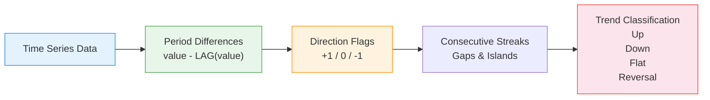

# :material-trending-up: Trend Detection

Detect **upward, downward, and flat trends** in time series data — using window
comparisons, consecutive increase/decrease counting, and linear regression slopes.

______________________________________________________________________

## :material-animation-play: Interactive Demo

Click the control to cycle through **upward**, **downward**, and **flat** examples while the regression slope reclassifies the series.

<div id="viz-trend-detection" class="ts-viz"></div>

*The solid line is the observed series; the dashed overlay is the least-squares trend line used for the classification label.*

______________________________________________________________________

## :material-sitemap: Detection Flow



______________________________________________________________________

## :material-code-tags: Syntax

### Sample data

```sql
CREATE OR REPLACE TEMP VIEW daily_metrics AS
SELECT * FROM VALUES
  ('revenue', DATE '2024-03-01', 1200),
  ('revenue', DATE '2024-03-02', 1250),
  ('revenue', DATE '2024-03-03', 1310),
  ('revenue', DATE '2024-03-04', 1380),
  ('revenue', DATE '2024-03-05', 1420),
  ('revenue', DATE '2024-03-06', 1390),
  ('revenue', DATE '2024-03-07', 1350),
  ('revenue', DATE '2024-03-08', 1280),
  ('revenue', DATE '2024-03-09', 1300),
  ('revenue', DATE '2024-03-10', 1320),
  ('revenue', DATE '2024-03-11', 1360),
  ('revenue', DATE '2024-03-12', 1410),
  ('revenue', DATE '2024-03-13', 1450),
  ('revenue', DATE '2024-03-14', 1480),
  ('users',   DATE '2024-03-01', 500),
  ('users',   DATE '2024-03-02', 510),
  ('users',   DATE '2024-03-03', 505),
  ('users',   DATE '2024-03-04', 520),
  ('users',   DATE '2024-03-05', 530),
  ('users',   DATE '2024-03-06', 525),
  ('users',   DATE '2024-03-07', 540),
  ('users',   DATE '2024-03-08', 555),
  ('users',   DATE '2024-03-09', 560),
  ('users',   DATE '2024-03-10', 558),
  ('users',   DATE '2024-03-11', 570),
  ('users',   DATE '2024-03-12', 580),
  ('users',   DATE '2024-03-13', 590),
  ('users',   DATE '2024-03-14', 605)
AS t(metric_name, metric_date, value);
```

______________________________________________________________________

### Direction detection with LAG

Classify each point as increasing, decreasing, or flat compared to the previous value.

```sql
SELECT
    metric_name,
    metric_date,
    value,
    LAG(value, 1) OVER w                           AS prev_value,
    value - LAG(value, 1) OVER w                   AS change,
    CASE
        WHEN value > LAG(value, 1) OVER w THEN 'UP'
        WHEN value < LAG(value, 1) OVER w THEN 'DOWN'
        ELSE 'FLAT'
    END                                            AS direction
FROM daily_metrics
WINDOW w AS (PARTITION BY metric_name ORDER BY metric_date)
ORDER BY metric_name, metric_date;
-- Result (revenue):
-- |metric_date|value|prev_value|change|direction|
-- |2024-03-01 |1200 |NULL      |NULL  |FLAT     |
-- |2024-03-02 |1250 |1200      |50    |UP       |
-- |2024-03-03 |1310 |1250      |60    |UP       |
-- |2024-03-06 |1390 |1420      |-30   |DOWN     |
```

______________________________________________________________________

### Consecutive trend streaks (gaps and islands)

Count how many consecutive periods the metric has been moving in the same direction.

```sql
WITH directions AS (
    SELECT
        metric_name,
        metric_date,
        value,
        CASE
            WHEN value > LAG(value, 1) OVER w THEN 1
            WHEN value < LAG(value, 1) OVER w THEN -1
            ELSE 0
        END                                        AS dir
    FROM daily_metrics
    WINDOW w AS (PARTITION BY metric_name ORDER BY metric_date)
),
islands AS (
    SELECT
        *,
        ROW_NUMBER() OVER (PARTITION BY metric_name ORDER BY metric_date)
        - ROW_NUMBER() OVER (
            PARTITION BY metric_name, dir ORDER BY metric_date
        )                                          AS grp
    FROM directions
)
SELECT
    metric_name,
    dir,
    CASE dir WHEN 1 THEN 'UPTREND' WHEN -1 THEN 'DOWNTREND' ELSE 'FLAT' END
                                                   AS trend,
    MIN(metric_date)                               AS streak_start,
    MAX(metric_date)                               AS streak_end,
    COUNT(*)                                       AS streak_length,
    MIN(value)                                     AS start_value,
    MAX(value)                                     AS end_value
FROM islands
WHERE dir != 0
GROUP BY metric_name, dir, grp
HAVING COUNT(*) >= 3
ORDER BY metric_name, streak_start;
-- Result (revenue):
-- |trend    |streak_start|streak_end|streak_length|start_value|end_value|
-- |UPTREND  |2024-03-02  |2024-03-05|4            |1250       |1420     |
-- |DOWNTREND|2024-03-06  |2024-03-08|3            |1280       |1390     |
-- |UPTREND  |2024-03-09  |2024-03-14|6            |1300       |1480     |
```

______________________________________________________________________

### Rolling slope (linear trend indicator)

Approximate the slope of the last N periods — positive slope = uptrend, negative = downtrend.

```sql
WITH numbered AS (
    SELECT
        metric_name,
        metric_date,
        value,
        ROW_NUMBER() OVER (
            PARTITION BY metric_name ORDER BY metric_date
        )                                          AS x
    FROM daily_metrics
),
rolling_regression AS (
    SELECT
        metric_name,
        metric_date,
        value,
        x,
        -- Slope = (n*Σxy - Σx*Σy) / (n*Σx² - (Σx)²) over last 7 points
        COUNT(*) OVER w                            AS n,
        SUM(x * value) OVER w                      AS sum_xy,
        SUM(x) OVER w                              AS sum_x,
        SUM(value) OVER w                          AS sum_y,
        SUM(x * x) OVER w                         AS sum_x2
    FROM numbered
    WINDOW w AS (
        PARTITION BY metric_name
        ORDER BY metric_date
        ROWS BETWEEN 6 PRECEDING AND CURRENT ROW
    )
)
SELECT
    metric_name,
    metric_date,
    value,
    ROUND(
        (n * sum_xy - sum_x * sum_y)
        / NULLIF(n * sum_x2 - sum_x * sum_x, 0),
        2
    )                                              AS slope_7,
    CASE
        WHEN (n * sum_xy - sum_x * sum_y)
             / NULLIF(n * sum_x2 - sum_x * sum_x, 0) > 5
            THEN 'STRONG UP'
        WHEN (n * sum_xy - sum_x * sum_y)
             / NULLIF(n * sum_x2 - sum_x * sum_x, 0) > 0
            THEN 'MILD UP'
        WHEN (n * sum_xy - sum_x * sum_y)
             / NULLIF(n * sum_x2 - sum_x * sum_x, 0) < -5
            THEN 'STRONG DOWN'
        WHEN (n * sum_xy - sum_x * sum_y)
             / NULLIF(n * sum_x2 - sum_x * sum_x, 0) < 0
            THEN 'MILD DOWN'
        ELSE 'FLAT'
    END                                            AS trend_class
FROM rolling_regression
WHERE n >= 7
ORDER BY metric_name, metric_date;
```

______________________________________________________________________

### Trend reversal detection

Identify points where the trend direction changes (pivot points).

```sql
WITH directions AS (
    SELECT
        metric_name,
        metric_date,
        value,
        CASE
            WHEN value > LAG(value, 1) OVER w THEN 1
            WHEN value < LAG(value, 1) OVER w THEN -1
            ELSE 0
        END                                        AS dir,
        CASE
            WHEN LAG(value, 1) OVER w > LAG(value, 2) OVER w THEN 1
            WHEN LAG(value, 1) OVER w < LAG(value, 2) OVER w THEN -1
            ELSE 0
        END                                        AS prev_dir
    FROM daily_metrics
    WINDOW w AS (PARTITION BY metric_name ORDER BY metric_date)
)
SELECT
    metric_name,
    metric_date,
    value,
    CASE
        WHEN prev_dir = 1 AND dir = -1 THEN 'PEAK_REVERSAL'
        WHEN prev_dir = -1 AND dir = 1 THEN 'TROUGH_REVERSAL'
        ELSE NULL
    END                                            AS reversal_type
FROM directions
WHERE (prev_dir = 1 AND dir = -1)
   OR (prev_dir = -1 AND dir = 1)
ORDER BY metric_name, metric_date;
-- Result (revenue):
-- |metric_date|value|reversal_type  |
-- |2024-03-06 |1390 |PEAK_REVERSAL  |  ← was going up, now going down
-- |2024-03-09 |1300 |TROUGH_REVERSAL|  ← was going down, now going up
```

______________________________________________________________________

### Multi-period trend comparison

Compare short-term vs long-term trend to detect divergence.

```sql
WITH slopes AS (
    SELECT
        metric_name,
        metric_date,
        value,
        -- Short-term: last 3 days
        (value - LAG(value, 3) OVER w) / 3.0       AS slope_3d,
        -- Medium-term: last 7 days
        (value - LAG(value, 7) OVER w) / 7.0       AS slope_7d
    FROM daily_metrics
    WINDOW w AS (PARTITION BY metric_name ORDER BY metric_date)
)
SELECT
    metric_name,
    metric_date,
    value,
    ROUND(slope_3d, 2)                             AS slope_3d,
    ROUND(slope_7d, 2)                             AS slope_7d,
    CASE
        WHEN slope_3d > 0 AND slope_7d > 0 THEN 'CONFIRMED UP'
        WHEN slope_3d < 0 AND slope_7d < 0 THEN 'CONFIRMED DOWN'
        WHEN slope_3d > 0 AND slope_7d < 0 THEN 'EARLY RECOVERY'
        WHEN slope_3d < 0 AND slope_7d > 0 THEN 'EARLY WEAKNESS'
        ELSE 'NEUTRAL'
    END                                            AS trend_signal
FROM slopes
WHERE slope_3d IS NOT NULL AND slope_7d IS NOT NULL
ORDER BY metric_name, metric_date;
```

______________________________________________________________________

## :material-information-outline: Key Concepts

| Technique               | Formula                            | Detects                         |
| ----------------------- | ---------------------------------- | ------------------------------- |
| Direction flag          | `SIGN(value - LAG(value))`         | Point-by-point movement         |
| Consecutive streaks     | Gaps-and-islands on direction      | Sustained trends                |
| Rolling slope           | Linear regression over window      | Trend strength and direction    |
| Reversal detection      | Direction change (prev_dir != dir) | Pivot points                    |
| Multi-period comparison | Short slope vs long slope          | Trend confirmation / divergence |

!!! tip "Minimum streak length"

    Filter streaks with `HAVING COUNT(*) >= 3` to avoid noise from single-point
    fluctuations. Adjust the threshold based on data volatility.

!!! note "Slope normalisation"

    Compare slopes across metrics with different scales by dividing by the
    rolling average: `slope / rolling_avg` gives a percentage rate of change.

______________________________________________________________________

## :material-lightbulb-outline: When to Use

| Scenario              | Approach                                                          |
| --------------------- | ----------------------------------------------------------------- |
| Growth monitoring     | Consecutive streak detection — alert on 5+ day uptrend            |
| Decline early warning | Reversal detection — flag peak-to-decline transitions             |
| Trend strength        | Rolling slope magnitude — distinguish strong vs mild trends       |
| Strategy timing       | Multi-period comparison — confirm trends before acting            |
| Automated reporting   | Direction flags — generate "Revenue is up for 6 consecutive days" |

______________________________________________________________________

## :material-speedometer: Performance Notes

| Tip                                        | Reason                                           |
| ------------------------------------------ | ------------------------------------------------ |
| Named `WINDOW w AS (...)`                  | Single sort for LAG, LEAD, and aggregates        |
| Pre-aggregate to target granularity        | Daily trends don't need minute-level data        |
| Filter recent date range                   | Limits window computation scope                  |
| Use `SIGN()` instead of CASE for direction | Simpler and optimiser-friendly                   |
| Materialise direction flags                | Reuse across streak, reversal, and slope queries |

______________________________________________________________________

## :material-database-search: [Databricks] Real-World Example — System Tables

!!! note "[Databricks] Unity Catalog system tables"

    `system.billing.usage` is a built-in Unity Catalog system table (no
    sample data setup needed) with a natural daily signal in `usage_date`.
    An account admin must grant `USE CATALOG` on `system`, `USE SCHEMA` on
    `system.billing`, and `SELECT` on `system.billing.usage` before these
    queries will return rows.

### Daily usage direction and short-term trend

```sql
-- [Databricks] Requires SELECT on system.billing.usage
WITH daily_usage AS (
    SELECT
        workspace_id,
        usage_date,
        ROUND(SUM(usage_quantity), 2) AS daily_usage_quantity
    FROM system.billing.usage
    WHERE usage_date >= DATE_SUB(CURRENT_DATE(), 30)
    GROUP BY workspace_id, usage_date
)
SELECT
    workspace_id,
    usage_date,
    daily_usage_quantity,
    LAG(daily_usage_quantity, 1) OVER w AS prev_day_usage,
    CASE
        WHEN daily_usage_quantity > LAG(daily_usage_quantity, 1) OVER w THEN 'UP'
        WHEN daily_usage_quantity < LAG(daily_usage_quantity, 1) OVER w THEN 'DOWN'
        ELSE 'FLAT'
    END AS direction,
    ROUND(AVG(daily_usage_quantity) OVER (
        PARTITION BY workspace_id
        ORDER BY usage_date
        ROWS BETWEEN 6 PRECEDING AND CURRENT ROW
    ), 2) AS rolling_avg_7
FROM daily_usage
WINDOW w AS (PARTITION BY workspace_id ORDER BY usage_date)
ORDER BY workspace_id, usage_date;
-- Result (illustrative):
-- workspace_id | usage_date  | daily_usage_quantity | prev_day_usage | direction | rolling_avg_7
-- ------------ | ----------- | -------------------- | -------------- | --------- | -------------
-- 123456789    | 2024-07-02  | 1248.40              | 1191.25        | UP        | 1187.23
-- 987654321    | 2024-07-02  | 402.75               | 418.10         | DOWN      | 415.08
```

!!! tip "Trend detection starts with ordered comparisons"

    Production trend analysis is usually just an ordered aggregate followed by
    `LAG`, rolling averages, or both. The same pattern works for spend,
    throughput, failures, or any other system-table metric.

______________________________________________________________________

## :material-arrow-right: Related

- [Peak Detection](peak-detection.md) — find maximum values and local peaks
- [Rolling Statistics](rolling-statistics.md) — stddev and variance for volatility context
- [Seasonality Detection](seasonality-detection.md) — distinguish trend from seasonal pattern
- [Gaps & Islands](../../sequence/gaps-islands.md) — the underlying technique for streak detection
