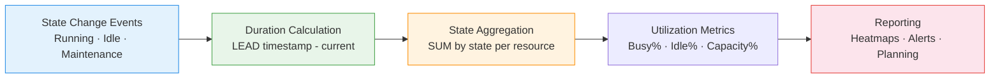

# :material-gauge: Utilization Analysis

Calculate **idle time, busy time, utilization percentage, and capacity** — essential
for warehouse operations, equipment monitoring, and resource planning.

---

## :material-sitemap: Analysis Flow



---

## :material-code-tags: Syntax

### Sample data

```sql
CREATE OR REPLACE TEMP VIEW resource_events AS
SELECT * FROM VALUES
  ('warehouse_A', 'Running',     TIMESTAMP '2024-03-01 06:00:00'),
  ('warehouse_A', 'Idle',        TIMESTAMP '2024-03-01 08:30:00'),
  ('warehouse_A', 'Running',     TIMESTAMP '2024-03-01 09:00:00'),
  ('warehouse_A', 'Maintenance', TIMESTAMP '2024-03-01 12:00:00'),
  ('warehouse_A', 'Running',     TIMESTAMP '2024-03-01 13:00:00'),
  ('warehouse_A', 'Idle',        TIMESTAMP '2024-03-01 17:00:00'),
  ('warehouse_A', 'Running',     TIMESTAMP '2024-03-01 17:30:00'),
  ('warehouse_A', 'Idle',        TIMESTAMP '2024-03-01 22:00:00'),
  ('warehouse_B', 'Running',     TIMESTAMP '2024-03-01 07:00:00'),
  ('warehouse_B', 'Idle',        TIMESTAMP '2024-03-01 10:00:00'),
  ('warehouse_B', 'Running',     TIMESTAMP '2024-03-01 10:30:00'),
  ('warehouse_B', 'Idle',        TIMESTAMP '2024-03-01 15:00:00'),
  ('warehouse_B', 'Running',     TIMESTAMP '2024-03-01 15:15:00'),
  ('warehouse_B', 'Maintenance', TIMESTAMP '2024-03-01 18:00:00'),
  ('warehouse_B', 'Running',     TIMESTAMP '2024-03-01 19:00:00'),
  ('warehouse_B', 'Idle',        TIMESTAMP '2024-03-01 21:00:00')
AS t(resource_id, state, state_start);
```

---

### Duration per state interval (LEAD)

Calculate how long each resource stays in a given state.

```sql
SELECT
    resource_id,
    state,
    state_start,
    LEAD(state_start) OVER (
        PARTITION BY resource_id ORDER BY state_start
    )                                              AS state_end,
    ROUND(
        (UNIX_TIMESTAMP(LEAD(state_start) OVER (
            PARTITION BY resource_id ORDER BY state_start
        )) - UNIX_TIMESTAMP(state_start)) / 3600.0,
        2
    )                                              AS duration_hours
FROM resource_events
ORDER BY resource_id, state_start;
-- Result (warehouse_A):
-- |state      |state_start     |state_end       |duration_hours|
-- |Running    |2024-03-01 06:00|2024-03-01 08:30|2.50          |
-- |Idle       |2024-03-01 08:30|2024-03-01 09:00|0.50          |
-- |Running    |2024-03-01 09:00|2024-03-01 12:00|3.00          |
-- |Maintenance|2024-03-01 12:00|2024-03-01 13:00|1.00          |
-- |Running    |2024-03-01 13:00|2024-03-01 17:00|4.00          |
-- |Idle       |2024-03-01 17:00|2024-03-01 17:30|0.50          |
-- |Running    |2024-03-01 17:30|2024-03-01 22:00|4.50          |
-- |Idle       |2024-03-01 22:00|NULL            |NULL          |
```

---

### Utilization percentage per resource

Aggregate state durations and compute utilization ratios.

```sql
WITH state_durations AS (
    SELECT
        resource_id,
        state,
        state_start,
        LEAD(state_start) OVER (
            PARTITION BY resource_id ORDER BY state_start
        )                                          AS state_end,
        (UNIX_TIMESTAMP(LEAD(state_start) OVER (
            PARTITION BY resource_id ORDER BY state_start
        )) - UNIX_TIMESTAMP(state_start)) / 3600.0
                                                   AS duration_hours
    FROM resource_events
)
SELECT
    resource_id,
    ROUND(SUM(CASE WHEN state = 'Running' THEN duration_hours ELSE 0 END), 2)
                                                   AS busy_hours,
    ROUND(SUM(CASE WHEN state = 'Idle' THEN duration_hours ELSE 0 END), 2)
                                                   AS idle_hours,
    ROUND(SUM(CASE WHEN state = 'Maintenance' THEN duration_hours ELSE 0 END), 2)
                                                   AS maintenance_hours,
    ROUND(SUM(duration_hours), 2)                  AS total_tracked_hours,
    -- Utilization = busy / (busy + idle)
    ROUND(
        SUM(CASE WHEN state = 'Running' THEN duration_hours ELSE 0 END) * 100.0
        / NULLIF(SUM(CASE WHEN state IN ('Running', 'Idle')
                     THEN duration_hours ELSE 0 END), 0),
        1
    )                                              AS utilization_pct,
    -- Capacity = busy / total tracked
    ROUND(
        SUM(CASE WHEN state = 'Running' THEN duration_hours ELSE 0 END) * 100.0
        / NULLIF(SUM(duration_hours), 0),
        1
    )                                              AS capacity_pct
FROM state_durations
WHERE duration_hours IS NOT NULL
GROUP BY resource_id
ORDER BY utilization_pct DESC;
-- Result:
-- |resource_id |busy_hrs|idle_hrs|maint_hrs|util_pct|capacity_pct|
-- |warehouse_A |14.00   |1.00   |1.00     |93.3    |87.5        |
-- |warehouse_B |10.75   |3.25   |1.00     |76.8    |71.7        |
```

---

### Hourly utilization heatmap

Break down utilization by hour of day for scheduling insights.

```sql
WITH state_durations AS (
    SELECT
        resource_id,
        state,
        state_start,
        COALESCE(
            LEAD(state_start) OVER (
                PARTITION BY resource_id ORDER BY state_start
            ),
            state_start + INTERVAL 1 HOUR
        )                                          AS state_end
    FROM resource_events
),
hours AS (
    SELECT EXPLODE(SEQUENCE(0, 23)) AS hr
),
hourly AS (
    SELECT
        sd.resource_id,
        h.hr,
        sd.state,
        -- Overlap between state interval and hour slot (in minutes)
        GREATEST(0,
            (LEAST(UNIX_TIMESTAMP(sd.state_end),
                   UNIX_TIMESTAMP(DATE_TRUNC('day', sd.state_start)) + (h.hr + 1) * 3600)
             - GREATEST(UNIX_TIMESTAMP(sd.state_start),
                        UNIX_TIMESTAMP(DATE_TRUNC('day', sd.state_start)) + h.hr * 3600))
        ) / 60.0                                   AS minutes_in_hour
    FROM state_durations sd
    CROSS JOIN hours h
    WHERE h.hr >= HOUR(sd.state_start)
      AND h.hr <= HOUR(sd.state_end)
)
SELECT
    resource_id,
    hr                                             AS hour_of_day,
    ROUND(
        SUM(CASE WHEN state = 'Running' THEN minutes_in_hour ELSE 0 END)
        * 100.0
        / NULLIF(SUM(minutes_in_hour), 0),
        1
    )                                              AS running_pct
FROM hourly
GROUP BY resource_id, hr
ORDER BY resource_id, hr;
```

---

### Idle gap analysis

Identify the longest idle periods for scheduling optimisation.

```sql
WITH state_durations AS (
    SELECT
        resource_id,
        state,
        state_start,
        LEAD(state_start) OVER (
            PARTITION BY resource_id ORDER BY state_start
        )                                          AS state_end,
        (UNIX_TIMESTAMP(LEAD(state_start) OVER (
            PARTITION BY resource_id ORDER BY state_start
        )) - UNIX_TIMESTAMP(state_start)) / 60.0
                                                   AS duration_minutes
    FROM resource_events
)
SELECT
    resource_id,
    state_start                                    AS idle_start,
    state_end                                      AS idle_end,
    ROUND(duration_minutes, 1)                     AS idle_minutes,
    ROUND(duration_minutes / 60.0, 2)              AS idle_hours,
    DENSE_RANK() OVER (
        PARTITION BY resource_id
        ORDER BY duration_minutes DESC
    )                                              AS idle_rank
FROM state_durations
WHERE state = 'Idle'
  AND duration_minutes IS NOT NULL
ORDER BY resource_id, duration_minutes DESC;
```

---

### Utilization trend over days

Track daily utilization to spot degradation or improvement over time.

```sql
WITH state_durations AS (
    SELECT
        resource_id,
        state,
        DATE(state_start)                          AS day,
        state_start,
        LEAD(state_start) OVER (
            PARTITION BY resource_id ORDER BY state_start
        )                                          AS state_end,
        (UNIX_TIMESTAMP(LEAD(state_start) OVER (
            PARTITION BY resource_id ORDER BY state_start
        )) - UNIX_TIMESTAMP(state_start)) / 3600.0
                                                   AS duration_hours
    FROM resource_events
)
SELECT
    resource_id,
    day,
    ROUND(SUM(CASE WHEN state = 'Running' THEN duration_hours ELSE 0 END), 2)
                                                   AS busy_hours,
    ROUND(
        SUM(CASE WHEN state = 'Running' THEN duration_hours ELSE 0 END) * 100.0
        / NULLIF(SUM(duration_hours), 0),
        1
    )                                              AS daily_util_pct,
    -- Compare to previous day
    LAG(
        ROUND(
            SUM(CASE WHEN state = 'Running' THEN duration_hours ELSE 0 END) * 100.0
            / NULLIF(SUM(duration_hours), 0), 1
        )
    ) OVER (PARTITION BY resource_id ORDER BY day)
                                                   AS prev_day_util_pct
FROM state_durations
WHERE duration_hours IS NOT NULL
GROUP BY resource_id, day
ORDER BY resource_id, day;
```

---

## :material-information-outline: Key Concepts

| Metric | Formula | Interpretation |
|--------|---------|----------------|
| **Busy Time** | `SUM(duration) WHERE state = 'Running'` | Total productive time |
| **Idle Time** | `SUM(duration) WHERE state = 'Idle'` | Wasted capacity |
| **Utilization %** | `busy / (busy + idle) × 100` | Productive use of available time |
| **Capacity %** | `busy / total_tracked × 100` | Usage including maintenance downtime |
| **Availability %** | `(busy + idle) / total × 100` | Excludes planned maintenance |

!!! tip "Utilization vs capacity"
    **Utilization** measures how much of *available* time is productive (excludes
    maintenance). **Capacity** measures how much of *total* time is productive
    (includes all states). Use utilization for operational efficiency; capacity
    for investment decisions.

!!! warning "Last event handling"
    The final event has no `LEAD` — its duration is NULL. Either set a boundary
    (end of shift/day) with `COALESCE`, or exclude it from calculations.

---

## :material-lightbulb-outline: When to Use

| Scenario | Metric |
|----------|--------|
| Warehouse throughput | Utilization % — are resources being used? |
| Equipment ROI | Capacity % — justifying new purchases |
| Shift scheduling | Hourly heatmap — identify peak/slack periods |
| Maintenance planning | Idle gaps — find windows for preventive maintenance |
| SLA monitoring | Busy time vs committed uptime |
| Fleet management | Vehicle running/idle ratio |

---

## :material-speedometer: Performance Notes

| Tip | Reason |
|-----|--------|
| Partition by `resource_id` | Parallel LEAD computation per resource |
| Filter to date range early | State tables grow unbounded; always constrain |
| Use `COALESCE` for final event boundary | Prevents NULL duration from skewing aggregates |
| Pre-compute state durations as a view/table | Reuse across utilization, heatmap, and gap queries |
| Index on `(resource_id, state_start)` | Speeds up ordered partition scans |

---

## :material-arrow-right: Related

- [Gaps & Islands](../../sequence/gaps_islands.md) — underlying technique for state interval detection
- [Event Stream Analytics](../../sequence/event_stream_analytics.md) — clickstream processing patterns
- [Peak Detection](peak_detection.md) — find maximum utilization periods
- [Seasonality Detection](seasonality_detection.md) — recurring utilization patterns
