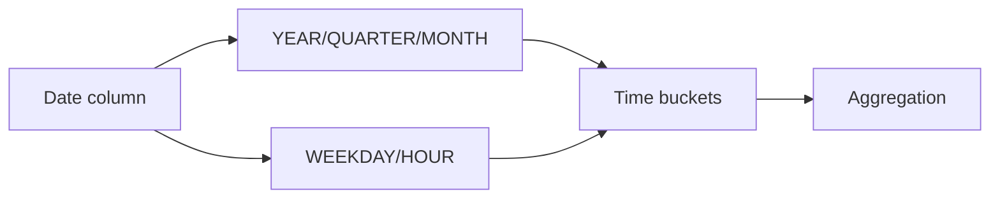

# :material-clock-time-four: Sales Date Patterns

Filter, aggregate, and compare data across date hierarchies, weekday patterns, and intra-day time bands.

______________________________________________________________________

## :material-animation-play: Interactive Demo

Hover any cell to inspect the exact date and value behind the weekly and weekday activity pattern.

<div id="viz-date-patterns" class="ts-viz"></div>

*The calendar-style grid maps weeks to rows and weekdays to columns so recurring date patterns stand out immediately.*

______________________________________________________________________

## :material-sitemap: Overview



______________________________________________________________________

## :material-pin: Quick Reference

| Technique      | Use Case                      | Key Function                                             |
| -------------- | ----------------------------- | -------------------------------------------------------- |
| YTD filter     | Current year to today         | `YEAR(col) = YEAR(CURRENT_DATE) AND col <= CURRENT_DATE` |
| Previous month | Last full calendar month      | `LAST_DAY` boundary                                      |
| YoY comparison | Year-over-year delta          | Two derived tables joined on period                      |
| Weekday filter | Weekdays only (Mon–Fri)       | `WEEKDAY(col) BETWEEN 0 AND 4`                           |
| Weekend count  | Count weekend days in a range | `SEQUENCE` + filter                                      |
| Month end      | Last day of month             | `MAKE_DATE` / `LAST_DAY`                                 |
| Hour banding   | Time-of-day categories        | `HOUR(col)` + `CASE`                                     |
| Quarter-hour   | 15-minute interval buckets    | `FLOOR(MINUTE(col) / 15) + 1`                            |

______________________________________________________________________

## :material-magnify: Examples

### Year-to-Date Aggregation

Aggregate sales for the current calendar year up to today.

```sql
--8<-- "sql/application/timeseries/aggregate_value_current_year_till_now.sql"
```

______________________________________________________________________

### Previous Month Data

Filter and aggregate data for the previous full calendar month.

```sql
--8<-- "sql/application/timeseries/previous_month_data.sql"
```

______________________________________________________________________

### Year-over-Year Color Sales

Compare sales by color across two consecutive years.

```sql
--8<-- "sql/application/timeseries/year_over_year_color_sales.sql"
```

______________________________________________________________________

### Weekday Sales Total

Aggregate sales for weekdays only using WEEKDAY().

```sql
--8<-- "sql/application/timeseries/weekday_sales_total.sql"
```

______________________________________________________________________

### Weekend Days Between Dates

Count the number of weekend days in a date range using SEQUENCE.

```sql
--8<-- "sql/application/timeseries/weekend_days_between_dates.sql"
```

______________________________________________________________________

### Last Day of Month Sales

Group and aggregate sales by the last day of each calendar month.

```sql
--8<-- "sql/application/timeseries/last_day_of_month_sales.sql"
```

______________________________________________________________________

### Time of Day Sales

Categorise sales into morning, afternoon, and evening bands.

```sql
--8<-- "sql/application/timeseries/time_of_day_sales.sql"
```

______________________________________________________________________

### Hourly Banding Sales

Aggregate sales by hour of day using HOUR() and CASE.

```sql
--8<-- "sql/application/timeseries/hourly_banding_sales.sql"
```

______________________________________________________________________

### Quarter-Hour Banding Sales

Divide each hour into 15-minute interval buckets.

```sql
--8<-- "sql/application/timeseries/quarter_hour_banding_sales.sql"
```

______________________________________________________________________

## :material-database-search: [Databricks] Real-World Example — System Tables

!!! note "[Databricks] Unity Catalog system tables"

    `system.access.audit` is a built-in Unity Catalog system table (no
    sample data setup needed) with a real timestamp column in `event_time`.
    An account admin must grant `USE CATALOG` on `system`, `USE SCHEMA` on
    `system.access`, and `SELECT` on `system.access.audit` before these
    queries will return rows.

### Previous-month weekday activity profile

```sql
-- [Databricks] Requires SELECT on system.access.audit
SELECT
    DATE(event_time) AS event_date,
    WEEKDAY(event_time) AS iso_weekday,
    COUNT(*) AS event_count
FROM system.access.audit
WHERE event_time >= DATE_TRUNC('month', ADD_MONTHS(CURRENT_DATE(), -1))
  AND event_time < DATE_TRUNC('month', CURRENT_DATE())
GROUP BY DATE(event_time), WEEKDAY(event_time)
ORDER BY event_date;
-- Result (illustrative):
-- event_date  | iso_weekday | event_count
-- ----------- | ----------- | -----------
-- 2024-06-03  | 0           | 18422
-- 2024-06-04  | 1           | 19108
-- 2024-06-08  | 5           | 2405
```

### Time-of-day bands for audit events

```sql
-- [Databricks] Requires SELECT on system.access.audit
SELECT
    service_name,
    CASE
        WHEN HOUR(event_time) BETWEEN 6 AND 11 THEN 'morning'
        WHEN HOUR(event_time) BETWEEN 12 AND 17 THEN 'afternoon'
        ELSE 'evening_or_overnight'
    END AS hour_band,
    COUNT(*) AS event_count
FROM system.access.audit
WHERE event_time >= CURRENT_TIMESTAMP() - INTERVAL 7 DAYS
GROUP BY service_name,
    CASE
        WHEN HOUR(event_time) BETWEEN 6 AND 11 THEN 'morning'
        WHEN HOUR(event_time) BETWEEN 12 AND 17 THEN 'afternoon'
        ELSE 'evening_or_overnight'
    END
ORDER BY service_name, event_count DESC;
-- Result (illustrative):
-- service_name | hour_band            | event_count
-- ------------ | -------------------- | -----------
-- notebooks    | morning              | 58210
-- notebooks    | afternoon            | 54438
-- clusters     | evening_or_overnight | 6120
```

!!! tip "Calendar functions are most useful on real event timestamps"

    Previous-month filters, weekday buckets, and hour-banding are identical
    whether the source is sample sales or production audit events. The value
    comes from applying the date logic to real operational behavior.

______________________________________________________________________

## :material-brain: When to Use

| Scenario                      | Recommended Approach             |
| ----------------------------- | -------------------------------- |
| Year-to-date report           | `aggregate_current_year` pattern |
| Prior period comparison       | `previous_month` filter          |
| Time-of-day segmentation      | `hourly_banding`                 |
| Weekend vs weekday analysis   | `weekend_days` / `weekday_sales` |
| Period-over-period comparison | `year_over_year` pattern         |

!!! note

    WEEKDAY() returns 0=Monday…6=Sunday in Spark SQL (ISO convention). Use WEEKDAY(col) BETWEEN 0 AND 4 for Mon–Fri only.

______________________________________________________________________

!!! note "Related"

    For windowing and analysis patterns on timestamped data (tumbling/hopping/sliding/
    session windows, gap fill, LAG/LEAD), see the [Time Series](../index.md) section.
