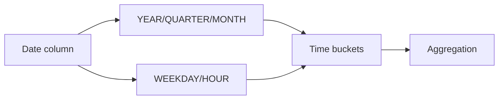

# :material-clock-time-four: Sales Date Patterns

Filter, aggregate, and compare data across date hierarchies, weekday patterns, and intra-day time bands.

______________________________________________________________________

## :material-sitemap: Overview



______________________________________________________________________

## :material-pin: Quick Reference

| Technique      | Use Case                      | Key Function                                             |
| -------------- | ----------------------------- | -------------------------------------------------------- |
| YTD filter     | Current year to today         | `YEAR(col) = YEAR(CURRENT_DATE) AND col <= CURRENT_DATE` |
| Previous month | Last full calendar month      | `LAST_DAY` boundary                                      |
| YoY comparison | Year-over-year delta          | Two derived tables joined on period                      |
| Weekday filter | Weekdays only (Mon–Fri)       | `WEEKDAY(col) BETWEEN 0 AND 4`                           |
| Weekend count  | Count weekend days in a range | `SEQUENCE` + filter                                      |
| Month end      | Last day of month             | `MAKE_DATE` / `LAST_DAY`                                 |
| Hour banding   | Time-of-day categories        | `HOUR(col)` + `CASE`                                     |
| Quarter-hour   | 15-minute interval buckets    | `FLOOR(MINUTE(col) / 15) + 1`                            |

______________________________________________________________________

## :material-magnify: Examples

### Year-to-Date Aggregation

Aggregate sales for the current calendar year up to today.

```sql
--8<-- "sql/application/timeseries/aggregate_value_current_year_till_now.sql"
```

______________________________________________________________________

### Previous Month Data

Filter and aggregate data for the previous full calendar month.

```sql
--8<-- "sql/application/timeseries/previous_month_data.sql"
```

______________________________________________________________________

### Year-over-Year Color Sales

Compare sales by color across two consecutive years.

```sql
--8<-- "sql/application/timeseries/year_over_year_color_sales.sql"
```

______________________________________________________________________

### Weekday Sales Total

Aggregate sales for weekdays only using WEEKDAY().

```sql
--8<-- "sql/application/timeseries/weekday_sales_total.sql"
```

______________________________________________________________________

### Weekend Days Between Dates

Count the number of weekend days in a date range using SEQUENCE.

```sql
--8<-- "sql/application/timeseries/weekend_days_between_dates.sql"
```

______________________________________________________________________

### Last Day of Month Sales

Group and aggregate sales by the last day of each calendar month.

```sql
--8<-- "sql/application/timeseries/last_day_of_month_sales.sql"
```

______________________________________________________________________

### Time of Day Sales

Categorise sales into morning, afternoon, and evening bands.

```sql
--8<-- "sql/application/timeseries/time_of_day_sales.sql"
```

______________________________________________________________________

### Hourly Banding Sales

Aggregate sales by hour of day using HOUR() and CASE.

```sql
--8<-- "sql/application/timeseries/hourly_banding_sales.sql"
```

______________________________________________________________________

### Quarter-Hour Banding Sales

Divide each hour into 15-minute interval buckets.

```sql
--8<-- "sql/application/timeseries/quarter_hour_banding_sales.sql"
```

______________________________________________________________________

## :material-brain: When to Use

| Scenario                      | Recommended Approach             |
| ----------------------------- | -------------------------------- |
| Year-to-date report           | `aggregate_current_year` pattern |
| Prior period comparison       | `previous_month` filter          |
| Time-of-day segmentation      | `hourly_banding`                 |
| Weekend vs weekday analysis   | `weekend_days` / `weekday_sales` |
| Period-over-period comparison | `year_over_year` pattern         |

!!! note

    WEEKDAY() returns 0=Monday…6=Sunday in Spark SQL (ISO convention). Use WEEKDAY(col) BETWEEN 0 AND 4 for Mon–Fri only.

______________________________________________________________________

!!! note "Related"

    For windowing and analysis patterns on timestamped data (tumbling/hopping/sliding/
    session windows, gap fill, LAG/LEAD), see the [Time Series](../index.md) section.
