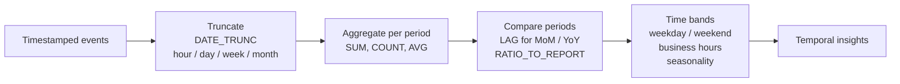

# :material-clock-time-four: Applied Date Patterns

Query, aggregate, and compare data across date hierarchies, time bands, and seasonal patterns.

______________________________________________________________________

## :material-sitemap: Temporal Analysis Pipeline

______________________________________________________________________

## :material-book-open-variant: In This Section

| Page                                    | Problem                                      | Technique                         |
| --------------------------------------- | -------------------------------------------- | --------------------------------- |
| [Sales Date Patterns](date-patterns.md) | Date hierarchy, weekday patterns, time bands | `DATE_TRUNC`, `DAYOFWEEK`, `HOUR` |

______________________________________________________________________

## :material-lightbulb-outline: When to Use

- Reporting — daily, weekly, monthly aggregations with period-over-period comparison.
- Operational analytics — identify peak hours, weekday vs weekend patterns.
- Seasonal analysis — compare same-month across years, detect trends.
