# :material-skip-next: Hopping Windows

A hopping window has a fixed size and advances (hops) by an interval **smaller** than the window length, creating **overlapping** windows. Each event can belong to multiple windows simultaneously.

---

## :material-check-circle-outline: Concept

1. **Window size**: Fixed (e.g., 1 hour)
2. **Slide interval**: How often a new window starts (e.g., every 30 minutes)
3. **Overlap**: Each event appears in `CEIL(window_size / slide)` windows

```mermaid
gantt
    title Hopping Window (Size: 1h, Slide: 30m)
    dateFormat  HH:mm
    axisFormat  %H:%M

    section Event Timeline
    E1 (10:05)   :e1, 10:05, 1m
    E2 (10:15)   :e2, 10:15, 1m
    E3 (10:35)   :e3, 10:35, 1m
    E4 (10:50)   :e4, 10:50, 1m
    E5 (11:10)   :e5, 11:10, 1m
    E6 (11:25)   :e6, 11:25, 1m
    E7 (11:45)   :e7, 11:45, 1m
    E8 (12:05)   :e8, 12:05, 1m

    section Hopping Windows (overlap shown)
    W1 [10:00–11:00]  :w1, 10:00, 60m
    W2 [10:30–11:30]  :w2, 10:30, 60m
    W3 [11:00–12:00]  :w3, 11:00, 60m
    W4 [11:30–12:30]  :w4, 11:30, 60m
```



!!! note "Event overlap"

    - E3 (10:35) and E4 (10:50) appear in **both** W1 and W2
    - E5 (11:10) appears in **both** W2 and W3
    - This overlap enables smoothed trend detection

---

## :material-database: Sample Data

### Dataset 1: Network traffic monitoring

```sql
-- Network packet counts per server over 2 hours
CREATE OR REPLACE TEMP VIEW network_traffic AS
SELECT * FROM VALUES
  (1,  'web-01', TIMESTAMP('2025-07-20 10:02:00'), 1250,  45),
  (2,  'web-02', TIMESTAMP('2025-07-20 10:08:00'), 980,   38),
  (3,  'web-01', TIMESTAMP('2025-07-20 10:18:00'), 1480,  52),
  (4,  'db-01',  TIMESTAMP('2025-07-20 10:25:00'), 320,   120),
  (5,  'web-02', TIMESTAMP('2025-07-20 10:35:00'), 1100,  41),
  (6,  'web-01', TIMESTAMP('2025-07-20 10:42:00'), 1650,  58),
  (7,  'db-01',  TIMESTAMP('2025-07-20 10:50:00'), 450,   95),
  (8,  'web-02', TIMESTAMP('2025-07-20 10:58:00'), 1320,  44),
  (9,  'web-01', TIMESTAMP('2025-07-20 11:05:00'), 1780,  62),
  (10, 'web-02', TIMESTAMP('2025-07-20 11:15:00'), 1050,  39),
  (11, 'db-01',  TIMESTAMP('2025-07-20 11:22:00'), 580,   88),
  (12, 'web-01', TIMESTAMP('2025-07-20 11:38:00'), 1900,  70),
  (13, 'web-02', TIMESTAMP('2025-07-20 11:45:00'), 1150,  43),
  (14, 'db-01',  TIMESTAMP('2025-07-20 11:52:00'), 620,   82),
  (15, 'web-01', TIMESTAMP('2025-07-20 12:03:00'), 2100,  75)
AS network_traffic(id, server, event_time, packets, latency_ms);
```

### Dataset 2: Stock price ticks

```sql
-- Stock trade ticks for moving average calculation
CREATE OR REPLACE TEMP VIEW stock_ticks AS
SELECT * FROM VALUES
  (TIMESTAMP('2025-07-20 09:30:00'), 'AAPL', 185.20, 1500),
  (TIMESTAMP('2025-07-20 09:35:00'), 'AAPL', 185.45, 2200),
  (TIMESTAMP('2025-07-20 09:42:00'), 'AAPL', 184.90, 1800),
  (TIMESTAMP('2025-07-20 09:48:00'), 'AAPL', 185.10, 3100),
  (TIMESTAMP('2025-07-20 09:55:00'), 'AAPL', 186.00, 4500),
  (TIMESTAMP('2025-07-20 10:02:00'), 'AAPL', 186.50, 2800),
  (TIMESTAMP('2025-07-20 10:08:00'), 'AAPL', 186.20, 1900),
  (TIMESTAMP('2025-07-20 10:15:00'), 'AAPL', 187.00, 5200),
  (TIMESTAMP('2025-07-20 10:22:00'), 'AAPL', 186.80, 3600),
  (TIMESTAMP('2025-07-20 10:30:00'), 'AAPL', 187.50, 4100),
  (TIMESTAMP('2025-07-20 10:38:00'), 'AAPL', 187.20, 2700),
  (TIMESTAMP('2025-07-20 10:45:00'), 'AAPL', 188.00, 6000)
AS stock_ticks(tick_time, symbol, price, volume);
```

### Dataset 3: Application error logs

```sql
-- Error events for trend detection with overlapping windows
CREATE OR REPLACE TEMP VIEW error_logs AS
SELECT * FROM VALUES
  (TIMESTAMP('2025-07-20 14:01:00'), 'auth-svc',    'ERROR',   'Token expired'),
  (TIMESTAMP('2025-07-20 14:05:00'), 'payment-svc', 'ERROR',   'Timeout'),
  (TIMESTAMP('2025-07-20 14:12:00'), 'auth-svc',    'WARNING', 'Rate limit near'),
  (TIMESTAMP('2025-07-20 14:18:00'), 'order-svc',   'ERROR',   'DB connection lost'),
  (TIMESTAMP('2025-07-20 14:25:00'), 'auth-svc',    'ERROR',   'Token expired'),
  (TIMESTAMP('2025-07-20 14:32:00'), 'payment-svc', 'ERROR',   'Gateway timeout'),
  (TIMESTAMP('2025-07-20 14:38:00'), 'order-svc',   'ERROR',   'Deadlock detected'),
  (TIMESTAMP('2025-07-20 14:42:00'), 'auth-svc',    'ERROR',   'Invalid signature'),
  (TIMESTAMP('2025-07-20 14:48:00'), 'payment-svc', 'ERROR',   'Timeout'),
  (TIMESTAMP('2025-07-20 14:55:00'), 'order-svc',   'WARNING', 'Slow query'),
  (TIMESTAMP('2025-07-20 15:02:00'), 'auth-svc',    'ERROR',   'Token expired'),
  (TIMESTAMP('2025-07-20 15:10:00'), 'payment-svc', 'ERROR',   'Circuit open')
AS error_logs(event_time, service, severity, message);
```

---

## :material-flask-outline: Examples

### Basic hopping window — 1-hour window, 30-minute slide

```sql
SELECT
    window(event_time, '1 hour', '30 minutes').start AS window_start,
    window(event_time, '1 hour', '30 minutes').end   AS window_end,
    COUNT(*)                                         AS event_count,
    SUM(packets)                                     AS total_packets,
    ROUND(AVG(latency_ms), 1)                        AS avg_latency_ms
FROM network_traffic
GROUP BY window(event_time, '1 hour', '30 minutes')
ORDER BY window_start;
```

??? success "Expected output"

    | window_start        | window_end          | event_count | total_packets | avg_latency_ms |
    |---------------------|---------------------|-------------|---------------|----------------|
    | 2025-07-20 09:30:00 | 2025-07-20 10:30:00 | 4           | 4030          | 63.8           |
    | 2025-07-20 10:00:00 | 2025-07-20 11:00:00 | 8           | 8550          | 61.6           |
    | 2025-07-20 10:30:00 | 2025-07-20 11:30:00 | 7           | 7930          | 59.0           |
    | 2025-07-20 11:00:00 | 2025-07-20 12:00:00 | 6           | 7480          | 62.3           |
    | 2025-07-20 11:30:00 | 2025-07-20 12:30:00 | 4           | 5770          | 67.5           |
    | 2025-07-20 12:00:00 | 2025-07-20 13:00:00 | 1           | 2100          | 75.0           |

---

### 30-minute moving average for stock prices (15-minute slide)

```sql
SELECT
    window(tick_time, '30 minutes', '15 minutes').start AS window_start,
    window(tick_time, '30 minutes', '15 minutes').end   AS window_end,
    COUNT(*)                                            AS tick_count,
    ROUND(AVG(price), 2)                                AS avg_price,
    ROUND(MIN(price), 2)                                AS low,
    ROUND(MAX(price), 2)                                AS high,
    SUM(volume)                                         AS total_volume
FROM stock_ticks
GROUP BY window(tick_time, '30 minutes', '15 minutes')
ORDER BY window_start;
```

??? success "Expected output"

    | window_start        | window_end          | tick_count | avg_price | low    | high   | total_volume |
    |---------------------|---------------------|------------|-----------|--------|--------|--------------|
    | 2025-07-20 09:15:00 | 2025-07-20 09:45:00 | 3          | 185.18    | 184.90 | 185.45 | 5500         |
    | 2025-07-20 09:30:00 | 2025-07-20 10:00:00 | 5          | 185.33    | 184.90 | 186.00 | 13100        |
    | 2025-07-20 09:45:00 | 2025-07-20 10:15:00 | 4          | 185.90    | 185.10 | 186.50 | 12400        |
    | 2025-07-20 10:00:00 | 2025-07-20 10:30:00 | 4          | 186.43    | 186.00 | 187.00 | 14500        |
    | 2025-07-20 10:15:00 | 2025-07-20 10:45:00 | 4          | 186.88    | 186.20 | 187.50 | 15600        |
    | 2025-07-20 10:30:00 | 2025-07-20 11:00:00 | 3          | 187.57    | 187.20 | 188.00 | 12800        |
    | 2025-07-20 10:45:00 | 2025-07-20 11:15:00 | 1          | 188.00    | 188.00 | 188.00 | 6000         |

---

### Error rate trend detection (30-minute window, 10-minute slide)

```sql
SELECT
    window(event_time, '30 minutes', '10 minutes').start AS window_start,
    window(event_time, '30 minutes', '10 minutes').end   AS window_end,
    COUNT(*)                                             AS total_events,
    SUM(CASE WHEN severity = 'ERROR' THEN 1 ELSE 0 END) AS error_count,
    ROUND(
        SUM(CASE WHEN severity = 'ERROR' THEN 1 ELSE 0 END) * 100.0 / COUNT(*), 1
    ) AS error_rate_pct
FROM error_logs
GROUP BY window(event_time, '30 minutes', '10 minutes')
HAVING COUNT(*) >= 2
ORDER BY window_start;
```

??? success "Expected output"

    | window_start        | window_end          | total_events | error_count | error_rate_pct |
    |---------------------|---------------------|--------------|-------------|----------------|
    | 2025-07-20 13:50:00 | 2025-07-20 14:20:00 | 4            | 3           | 75.0           |
    | 2025-07-20 14:00:00 | 2025-07-20 14:30:00 | 5            | 4           | 80.0           |
    | 2025-07-20 14:10:00 | 2025-07-20 14:40:00 | 5            | 4           | 80.0           |
    | 2025-07-20 14:20:00 | 2025-07-20 14:50:00 | 5            | 5           | 100.0          |
    | 2025-07-20 14:30:00 | 2025-07-20 15:00:00 | 5            | 4           | 80.0           |
    | 2025-07-20 14:40:00 | 2025-07-20 15:10:00 | 4            | 4           | 100.0          |
    | 2025-07-20 14:50:00 | 2025-07-20 15:20:00 | 3            | 3           | 100.0          |

---

### Per-server traffic with hopping windows

```sql
SELECT
    window(event_time, '1 hour', '30 minutes').start AS window_start,
    server,
    COUNT(*)                                         AS events,
    SUM(packets)                                     AS total_packets,
    MAX(latency_ms)                                  AS peak_latency_ms
FROM network_traffic
GROUP BY window(event_time, '1 hour', '30 minutes'), server
ORDER BY window_start, server;
```

??? success "Expected output (first 9 rows)"

    | window_start        | server | events | total_packets | peak_latency_ms |
    |---------------------|--------|--------|---------------|-----------------|
    | 2025-07-20 09:30:00 | db-01  | 1      | 320           | 120             |
    | 2025-07-20 09:30:00 | web-01 | 2      | 2730          | 52              |
    | 2025-07-20 09:30:00 | web-02 | 1      | 980           | 38              |
    | 2025-07-20 10:00:00 | db-01  | 2      | 770           | 120             |
    | 2025-07-20 10:00:00 | web-01 | 4      | 6160          | 62              |
    | 2025-07-20 10:00:00 | web-02 | 3      | 3400          | 44              |
    | 2025-07-20 10:30:00 | db-01  | 2      | 1030          | 95              |
    | 2025-07-20 10:30:00 | web-01 | 3      | 5330          | 70              |
    | 2025-07-20 10:30:00 | web-02 | 3      | 3520          | 44              |

---

### Error spike alerting — compare adjacent windows

```sql
WITH windowed AS (
    SELECT
        window(event_time, '30 minutes', '10 minutes').start AS window_start,
        SUM(CASE WHEN severity = 'ERROR' THEN 1 ELSE 0 END) AS error_count
    FROM error_logs
    GROUP BY window(event_time, '30 minutes', '10 minutes')
)
SELECT
    window_start,
    error_count,
    LAG(error_count) OVER (ORDER BY window_start) AS prev_window_errors,
    error_count - COALESCE(LAG(error_count) OVER (ORDER BY window_start), 0) AS delta
FROM windowed
ORDER BY window_start;
```

??? success "Expected output"

    | window_start        | error_count | prev_window_errors | delta |
    |---------------------|-------------|--------------------|-------|
    | 2025-07-20 13:40:00 | 1           | NULL               | 1     |
    | 2025-07-20 13:50:00 | 3           | 1                  | 2     |
    | 2025-07-20 14:00:00 | 4           | 3                  | 1     |
    | 2025-07-20 14:10:00 | 4           | 4                  | 0     |
    | 2025-07-20 14:20:00 | 5           | 4                  | 1     |
    | 2025-07-20 14:30:00 | 4           | 5                  | -1    |
    | 2025-07-20 14:40:00 | 4           | 4                  | 0     |
    | 2025-07-20 14:50:00 | 3           | 4                  | -1    |

---

### Batch equivalent using self-join on time range

```sql
-- Hopping window simulation without window() for pure batch/Delta tables
-- 1-hour window, 30-minute slide using generate_series approach
WITH time_slots AS (
    SELECT EXPLODE(SEQUENCE(
        TIMESTAMP('2025-07-20 10:00:00'),
        TIMESTAMP('2025-07-20 12:00:00'),
        INTERVAL 30 MINUTES
    )) AS window_start
)
SELECT
    ts.window_start,
    ts.window_start + INTERVAL 1 HOUR AS window_end,
    COUNT(nt.id)                       AS event_count,
    COALESCE(SUM(nt.packets), 0)       AS total_packets
FROM time_slots ts
LEFT JOIN network_traffic nt
    ON nt.event_time >= ts.window_start
    AND nt.event_time < ts.window_start + INTERVAL 1 HOUR
GROUP BY ts.window_start
ORDER BY ts.window_start;
```

??? success "Expected output"

    | window_start        | window_end          | event_count | total_packets |
    |---------------------|---------------------|-------------|---------------|
    | 2025-07-20 10:00:00 | 2025-07-20 11:00:00 | 8           | 8550          |
    | 2025-07-20 10:30:00 | 2025-07-20 11:30:00 | 7           | 7930          |
    | 2025-07-20 11:00:00 | 2025-07-20 12:00:00 | 6           | 7480          |
    | 2025-07-20 11:30:00 | 2025-07-20 12:30:00 | 4           | 5770          |
    | 2025-07-20 12:00:00 | 2025-07-20 13:00:00 | 1           | 2100          |

---

## :material-animation-play: Interactive Demo

> Hover any window row to highlight the events it contains and see the event count.

<div id="viz-hopping" class="ts-viz"></div>

---

## :material-table: Properties

| Property | Value |
|----------|-------|
| Window size | Fixed (e.g., 1 hour) |
| Slide interval | Fixed, smaller than window size (e.g., 30 min, 15 min, 10 min) |
| Overlap | Yes — each event appears in `CEIL(size / slide)` windows |
| SQL function | `window(ts, windowDuration, slideDuration)` |
| Batch alternative | Self-join on generated time slots or `SEQUENCE()` |
| Typical use | Smoothed trends, moving averages, SLA monitoring |

!!! warning "HOP() TVF does not exist in Spark or Databricks"

    `HOP()` is an Apache Flink SQL TVF — it is **not** available in Spark SQL or Databricks SQL.
    Use `window(ts, size, slide)` for streaming or a self-join approach for batch.

---

## :material-compare: Hopping vs Tumbling vs Sliding

| Factor | Hopping | Tumbling | Sliding (row-based) |
|--------|---------|----------|---------------------|
| Window size | Fixed time | Fixed time | Fixed row count |
| Advances by | Slide interval < size | Size (no overlap) | 1 row at a time |
| Overlap | Yes | No | Yes |
| Event membership | Multiple windows | Exactly one window | One result per row |
| SQL function | `window(ts, size, slide)` | `window(ts, size)` / `date_trunc()` | `OVER (ROWS BETWEEN ...)` |
| Use case | Smoothed metrics | Period reports | Per-row analytics |

---

## :material-magnify: Behavior Notes

1. Each event belongs to `CEIL(window_size / slide_interval)` windows. A 1-hour window with a 30-min slide → up to 2 windows per event.
2. Bucket boundaries are aligned to the Unix epoch by default — pass a `startTime` string to `window()` to shift alignment.
3. Smaller slide intervals produce smoother trends but generate more output rows and more computation.
4. `window()` works in both batch and Structured Streaming contexts in Spark SQL.
5. For batch-only workloads on Delta tables, consider the self-join + `SEQUENCE()` approach for explicit control over window boundaries.
6. Use `EXPLAIN` to verify that Spark uses the `TimeWindowGroupLimit` optimization for hopping window queries.
