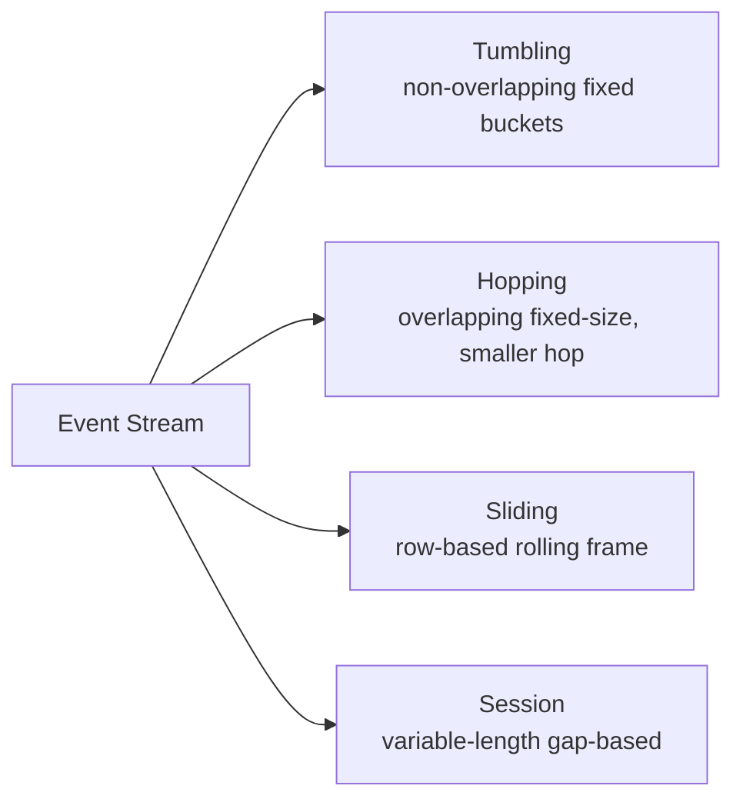

# :material-timeline: Time Series Data

Time series queries analyse data that changes over time — logs, sensor readings, sales, stock prices, IoT events.
Every row is associated with a timestamp and queries typically involve windowed aggregation, ordering, and gap handling.

---

## :material-view-grid: In This Section

| Page | What You Will Learn |
|------|---------------------|
| [Time Aggregation](analysis/time_aggregation.md) | Date truncation, daily/weekly/monthly aggregation, YoY comparison |
| [Tumbling Windows](windowing/tumbling_window.md) | Fixed non-overlapping time buckets — hourly reports, batch aggregation |
| [Hopping Windows](windowing/hopping_window.md) | Fixed-size overlapping windows that advance at a smaller interval |
| [Sliding Windows](windowing/sliding_window.md) | Row-based rolling windows — moving averages, smoothing |
| [Session Windows](windowing/session_window.md) | Variable-length gap-based windows — user sessions, clickstreams |
| [LAG & LEAD](analysis/lag_and_lead.md) | Period-over-period comparisons, state transitions, streak counting |
| [Gap Fill](analysis/gap_filling.md) | Date spines, zero-fill, forward-fill, interpolation |

---

## :material-sitemap: Window Type Overview



---

## :material-animation-play: Interactive Overview

<div id="viz-docs-overview" class="ts-viz"></div>

---

## :material-table: Window Type Comparison

| Property | Tumbling | Hopping | Sliding (row-based) | Session |
|----------|:--------:|:-------:|:-------------------:|:-------:|
| Fixed size | Yes | Yes | Yes (rows) | No — gap-based |
| Overlapping | No | Yes | Yes | No |
| Events per window | Exclusive | Multiple | Rolling N rows | Unbounded |
| SQL function | `window(t, size)` | `window(t, size, slide)` | `ROWS/RANGE frame` | LAG + cumulative SUM |
| Spark native | Yes | Yes | Yes | Manual pattern |
| Typical use | Hourly reports | Near-real-time trends | Moving averages | User sessions |
| Example | 10:00–11:00, 11:00–12:00 | 10:00–11:00, 10:30–11:30 | Last 7 rows at each row | Events within 30-min gap |

---

## :material-clock-outline: Core Concepts

### 1 — Timestamp Columns

All time series queries require a proper timestamp field (`event_time`, `created_at`, etc.).
Use `CAST(col AS TIMESTAMP)` or `TO_TIMESTAMP(col, fmt)` if the column arrives as a string.

### 2 — Ordering

Correct window calculations depend on deterministic ordering — always specify `ORDER BY timestamp` inside window specs.

### 3 — Sparse Data

Real-world series often have missing intervals. See [Gap Fill](analysis/gap_filling.md) for strategies to generate a complete time spine before aggregating.

---

## :material-flask-outline: Quick Example

```sql
-- Tumbling 1-hour window: event count per hour
SELECT
    window(event_time, '1 hour').start AS hour_start,
    COUNT(*)                           AS event_count
FROM events
GROUP BY window(event_time, '1 hour')
ORDER BY hour_start;

-- 7-day rolling average per region (sliding)
SELECT
    region,
    sale_date,
    revenue,
    ROUND(AVG(revenue) OVER (
        PARTITION BY region
        ORDER BY sale_date
        ROWS BETWEEN 6 PRECEDING AND CURRENT ROW
    ), 2) AS ma_7d
FROM daily_sales
ORDER BY region, sale_date;
```

---

## :material-magnify: Behavior Notes

1. Spark's `window(timestamp, windowDuration)` function aligns buckets to the Unix epoch (1970-01-01 00:00:00 UTC) by default; pass a `startTime` offset to shift alignment.
2. `window()` returns a struct with `.start` and `.end` fields — use `window.start` in `GROUP BY` or `SELECT`.
3. For streaming workloads, use Structured Streaming `watermark` to handle late-arriving data in tumbling/hopping windows.
4. Session windows are not natively supported in Spark SQL batch mode — use the LAG + cumulative SUM pattern.
5. `ROWS BETWEEN` operates on physical row positions; `RANGE BETWEEN` operates on logical value distances — use `ROWS` for time series unless you need true range semantics.


---

!!! note "Related"
    For applied, sales-oriented date patterns (date hierarchies, weekday and intra-day
    banding, year-over-year), see [Time Series applications](../application/temporal/time_series/index.md).
