# :material-window-closed: Tumbling Window

Non-overlapping, fixed-size time intervals where each event belongs to exactly one window. Use `window()` for streaming or `date_trunc()` for batch queries.

---

### :material-sitemap: Overview

```mermaid
gantt
    dateFormat HH:mm
    axisFormat %H:%M
    section Window 1
    00:00 - 01:00 :a1, 00:00, 60m
    section Window 2
    01:00 - 02:00 :a2, 01:00, 60m
    section Window 3
    02:00 - 03:00 :a3, 02:00, 60m
```



---

## :material-window-closed: Concept

1. **Window size**: Fixed (e.g., 1 hour)
2. **No overlap** — non-overlapping, contiguous intervals
3. Each event belongs to **exactly one** window

```mermaid
gantt
    title Tumbling Window (Size: 1 Hour)
    dateFormat  HH:mm
    axisFormat  %H:%M

    section Event Timeline
    Event1       :e1, 10:05, 1m
    Event2       :e2, 10:15, 1m
    Event3       :e3, 10:45, 1m
    Event4       :e4, 11:05, 1m
    Event5       :e5, 11:30, 1m
    Event6       :e6, 11:45, 1m
    Event7       :e7, 12:10, 1m
    Event8       :e8, 12:50, 1m

    section Tumbling Windows (No Overlap)
    Window1 [10:00–11:00]  :w1, 10:00, 1h
    Window2 [11:00–12:00]  :w2, 11:00, 1h
    Window3 [12:00–13:00]  :w3, 12:00, 1h
```



---

## :material-database: Sample Data

### Dataset 1: IoT sensor readings

```sql
-- IoT sensor readings spanning 3 hours across 3 devices
CREATE OR REPLACE TEMP VIEW sensor_readings AS
SELECT * FROM VALUES
  -- Window 1: 10:00–11:00
  (1,  'sensor-A', TIMESTAMP('2025-07-20 10:02:00'), 22.5,  'normal'),
  (2,  'sensor-B', TIMESTAMP('2025-07-20 10:15:00'), 35.1,  'warning'),
  (3,  'sensor-A', TIMESTAMP('2025-07-20 10:30:00'), 23.0,  'normal'),
  (4,  'sensor-C', TIMESTAMP('2025-07-20 10:45:00'), 41.8,  'critical'),
  (5,  'sensor-B', TIMESTAMP('2025-07-20 10:55:00'), 34.7,  'warning'),
  -- Window 2: 11:00–12:00
  (6,  'sensor-A', TIMESTAMP('2025-07-20 11:05:00'), 24.2,  'normal'),
  (7,  'sensor-C', TIMESTAMP('2025-07-20 11:20:00'), 39.5,  'warning'),
  (8,  'sensor-B', TIMESTAMP('2025-07-20 11:35:00'), 33.0,  'normal'),
  (9,  'sensor-A', TIMESTAMP('2025-07-20 11:50:00'), 25.8,  'normal'),
  -- Window 3: 12:00–13:00
  (10, 'sensor-C', TIMESTAMP('2025-07-20 12:10:00'), 42.3,  'critical'),
  (11, 'sensor-B', TIMESTAMP('2025-07-20 12:25:00'), 36.0,  'warning'),
  (12, 'sensor-A', TIMESTAMP('2025-07-20 12:40:00'), 26.1,  'normal')
AS sensor_readings(reading_id, device_id, reading_time, temperature, status);
```

### Dataset 2: E-commerce orders

```sql
-- Online store orders spanning a full business day
CREATE OR REPLACE TEMP VIEW orders AS
SELECT * FROM VALUES
  -- Morning rush: 09:00–12:00
  (101, 'user-1', TIMESTAMP('2025-07-20 09:05:00'), 'electronics', 299.99, 'completed'),
  (102, 'user-2', TIMESTAMP('2025-07-20 09:22:00'), 'clothing',     59.90, 'completed'),
  (103, 'user-3', TIMESTAMP('2025-07-20 09:45:00'), 'electronics', 149.00, 'completed'),
  (104, 'user-1', TIMESTAMP('2025-07-20 10:10:00'), 'books',        24.95, 'completed'),
  (105, 'user-4', TIMESTAMP('2025-07-20 10:35:00'), 'clothing',     89.50, 'cancelled'),
  (106, 'user-2', TIMESTAMP('2025-07-20 11:00:00'), 'electronics', 499.00, 'completed'),
  (107, 'user-5', TIMESTAMP('2025-07-20 11:20:00'), 'books',        35.00, 'completed'),
  (108, 'user-3', TIMESTAMP('2025-07-20 11:55:00'), 'clothing',    120.00, 'completed'),
  -- Afternoon: 12:00–15:00
  (109, 'user-6', TIMESTAMP('2025-07-20 12:15:00'), 'electronics', 799.00, 'completed'),
  (110, 'user-1', TIMESTAMP('2025-07-20 12:40:00'), 'books',        18.50, 'completed'),
  (111, 'user-4', TIMESTAMP('2025-07-20 13:05:00'), 'electronics', 350.00, 'completed'),
  (112, 'user-2', TIMESTAMP('2025-07-20 13:30:00'), 'clothing',     45.00, 'cancelled'),
  (113, 'user-7', TIMESTAMP('2025-07-20 14:10:00'), 'electronics', 199.99, 'completed'),
  (114, 'user-5', TIMESTAMP('2025-07-20 14:45:00'), 'books',        72.00, 'completed'),
  -- Evening: 15:00–18:00
  (115, 'user-3', TIMESTAMP('2025-07-20 15:20:00'), 'clothing',    210.00, 'completed'),
  (116, 'user-8', TIMESTAMP('2025-07-20 16:00:00'), 'electronics', 599.00, 'completed'),
  (117, 'user-6', TIMESTAMP('2025-07-20 16:30:00'), 'books',        28.00, 'completed'),
  (118, 'user-1', TIMESTAMP('2025-07-20 17:15:00'), 'clothing',     95.00, 'completed')
AS orders(order_id, user_id, order_time, category, amount, status);
```

### Dataset 3: Web server access logs

```sql
-- HTTP access logs with response times (5-minute granularity examples)
CREATE OR REPLACE TEMP VIEW access_logs AS
SELECT * FROM VALUES
  (TIMESTAMP('2025-07-20 14:00:12'), '/api/users',    200, 45),
  (TIMESTAMP('2025-07-20 14:00:35'), '/api/orders',   200, 120),
  (TIMESTAMP('2025-07-20 14:01:10'), '/api/users',    200, 52),
  (TIMESTAMP('2025-07-20 14:01:55'), '/api/products', 500, 3500),
  (TIMESTAMP('2025-07-20 14:02:30'), '/api/users',    200, 48),
  (TIMESTAMP('2025-07-20 14:03:05'), '/api/orders',   200, 95),
  (TIMESTAMP('2025-07-20 14:03:45'), '/api/products', 200, 180),
  (TIMESTAMP('2025-07-20 14:04:20'), '/api/users',    404, 12),
  (TIMESTAMP('2025-07-20 14:05:10'), '/api/orders',   200, 110),
  (TIMESTAMP('2025-07-20 14:05:55'), '/api/products', 500, 4200),
  (TIMESTAMP('2025-07-20 14:06:30'), '/api/users',    200, 55),
  (TIMESTAMP('2025-07-20 14:07:15'), '/api/orders',   200, 88),
  (TIMESTAMP('2025-07-20 14:08:00'), '/api/products', 200, 160),
  (TIMESTAMP('2025-07-20 14:09:40'), '/api/users',    200, 42),
  (TIMESTAMP('2025-07-20 14:10:20'), '/api/orders',   503, 5000),
  (TIMESTAMP('2025-07-20 14:11:05'), '/api/users',    200, 50)
AS access_logs(request_time, endpoint, status_code, response_ms);
```

---

## :material-flask-outline: Examples

### Basic tumbling window — hourly sensor aggregation

```sql
SELECT
    window(reading_time, '1 hour').start AS window_start,
    window(reading_time, '1 hour').end   AS window_end,
    COUNT(*)                             AS reading_count,
    ROUND(AVG(temperature), 1)           AS avg_temp
FROM sensor_readings
GROUP BY window(reading_time, '1 hour')
ORDER BY window_start;
```

??? success "Expected output"

    | window_start        | window_end          | reading_count | avg_temp |
    |---------------------|---------------------|---------------|----------|
    | 2025-07-20 10:00:00 | 2025-07-20 11:00:00 | 5             | 31.4     |
    | 2025-07-20 11:00:00 | 2025-07-20 12:00:00 | 4             | 30.6     |
    | 2025-07-20 12:00:00 | 2025-07-20 13:00:00 | 3             | 34.8     |

---

### Batch alternative using `date_trunc()`

```sql
-- Equivalent tumbling window without the window() function
-- Works in batch queries on regular/Delta tables
SELECT
    DATE_TRUNC('hour', reading_time)   AS window_start,
    COUNT(*)                           AS reading_count,
    ROUND(AVG(temperature), 1)         AS avg_temp,
    MAX(temperature)                   AS max_temp
FROM sensor_readings
GROUP BY DATE_TRUNC('hour', reading_time)
ORDER BY window_start;
```

??? success "Expected output"

    | window_start        | reading_count | avg_temp | max_temp |
    |---------------------|---------------|----------|----------|
    | 2025-07-20 10:00:00 | 5             | 31.4     | 41.8     |
    | 2025-07-20 11:00:00 | 4             | 30.6     | 39.5     |
    | 2025-07-20 12:00:00 | 3             | 34.8     | 42.3     |

!!! warning "TUMBLE() TVF does not exist in Spark or Databricks"

    Apache Flink SQL provides `TUMBLE()`, `HOP()`, and `CUMULATE()` TVFs — **Spark SQL does not**.
    Spark 3.4 introduced general TVF support (e.g., `range()`, `explode()`), but no windowing TVFs.

    | Feature | Apache Flink | Spark SQL | Databricks SQL |
    |---------|:---:|:---:|:---:|
    | `TUMBLE()` TVF | :material-check: | :material-close: | :material-close: |
    | `HOP()` TVF | :material-check: | :material-close: | :material-close: |
    | `window()` function | :material-close: | :material-check: | :material-check: |
    | `date_trunc()` | N/A | :material-check: | :material-check: |

    **Use instead:**

    - **Batch**: `date_trunc('hour', ts)` with `GROUP BY`
    - **Structured Streaming**: `window(ts, '1 hour')` with `GROUP BY`

---

### Aggregate by device per window

```sql
SELECT
    window(reading_time, '1 hour').start AS hour_start,
    device_id,
    COUNT(*)                             AS readings,
    ROUND(AVG(temperature), 1)           AS avg_temp,
    SUM(CASE WHEN status = 'critical' THEN 1 ELSE 0 END) AS critical_count
FROM sensor_readings
GROUP BY window(reading_time, '1 hour'), device_id
ORDER BY hour_start, device_id;
```

??? success "Expected output"

    | hour_start          | device_id | readings | avg_temp | critical_count |
    |---------------------|-----------|----------|----------|----------------|
    | 2025-07-20 10:00:00 | sensor-A  | 2        | 22.8     | 0              |
    | 2025-07-20 10:00:00 | sensor-B  | 2        | 34.9     | 0              |
    | 2025-07-20 10:00:00 | sensor-C  | 1        | 41.8     | 1              |
    | 2025-07-20 11:00:00 | sensor-A  | 2        | 25.0     | 0              |
    | 2025-07-20 11:00:00 | sensor-B  | 1        | 33.0     | 0              |
    | 2025-07-20 11:00:00 | sensor-C  | 1        | 39.5     | 0              |
    | 2025-07-20 12:00:00 | sensor-A  | 1        | 26.1     | 0              |
    | 2025-07-20 12:00:00 | sensor-B  | 1        | 36.0     | 0              |
    | 2025-07-20 12:00:00 | sensor-C  | 1        | 42.3     | 1              |

---

### Hourly revenue and order count (e-commerce)

```sql
SELECT
    DATE_TRUNC('hour', order_time)                            AS hour_start,
    COUNT(*)                                                  AS total_orders,
    COUNT(*) FILTER (WHERE status = 'completed')              AS completed,
    COUNT(*) FILTER (WHERE status = 'cancelled')              AS cancelled,
    ROUND(SUM(amount) FILTER (WHERE status = 'completed'), 2) AS revenue
FROM orders
GROUP BY DATE_TRUNC('hour', order_time)
ORDER BY hour_start;
```

??? success "Expected output"

    | hour_start          | total_orders | completed | cancelled | revenue  |
    |---------------------|--------------|-----------|-----------|----------|
    | 2025-07-20 09:00:00 | 3            | 3         | 0         | 508.89   |
    | 2025-07-20 10:00:00 | 2            | 1         | 1         | 24.95    |
    | 2025-07-20 11:00:00 | 3            | 3         | 0         | 654.00   |
    | 2025-07-20 12:00:00 | 2            | 2         | 0         | 817.50   |
    | 2025-07-20 13:00:00 | 2            | 1         | 1         | 350.00   |
    | 2025-07-20 14:00:00 | 2            | 2         | 0         | 271.99   |
    | 2025-07-20 15:00:00 | 1            | 1         | 0         | 210.00   |
    | 2025-07-20 16:00:00 | 2            | 2         | 0         | 627.00   |
    | 2025-07-20 17:00:00 | 1            | 1         | 0         | 95.00    |

---

### Hourly revenue by category

```sql
SELECT
    DATE_TRUNC('hour', order_time) AS hour_start,
    category,
    COUNT(*)                       AS order_count,
    ROUND(SUM(amount), 2)          AS category_revenue
FROM orders
WHERE status = 'completed'
GROUP BY DATE_TRUNC('hour', order_time), category
ORDER BY hour_start, category;
```

??? success "Expected output (first 8 rows)"

    | hour_start          | category    | order_count | category_revenue |
    |---------------------|-------------|-------------|------------------|
    | 2025-07-20 09:00:00 | clothing    | 1           | 59.90            |
    | 2025-07-20 09:00:00 | electronics | 2           | 448.99           |
    | 2025-07-20 10:00:00 | books       | 1           | 24.95            |
    | 2025-07-20 11:00:00 | books       | 1           | 35.00            |
    | 2025-07-20 11:00:00 | clothing    | 1           | 120.00           |
    | 2025-07-20 11:00:00 | electronics | 1           | 499.00           |
    | 2025-07-20 12:00:00 | books       | 1           | 18.50            |
    | 2025-07-20 12:00:00 | electronics | 1           | 799.00           |

---

### 5-minute SLA monitoring (access logs)

```sql
-- Monitor P95 response time and error rate in 5-minute buckets
SELECT
    DATE_TRUNC('minute', request_time)
        - INTERVAL (MINUTE(request_time) % 5) MINUTES AS bucket_start,
    COUNT(*)                                           AS total_requests,
    SUM(CASE WHEN status_code >= 500 THEN 1 ELSE 0 END) AS server_errors,
    ROUND(SUM(CASE WHEN status_code >= 500 THEN 1 ELSE 0 END)
        * 100.0 / COUNT(*), 1)                         AS error_rate_pct,
    ROUND(AVG(response_ms), 0)                         AS avg_response_ms,
    MAX(response_ms)                                   AS max_response_ms
FROM access_logs
GROUP BY DATE_TRUNC('minute', request_time)
    - INTERVAL (MINUTE(request_time) % 5) MINUTES
ORDER BY bucket_start;
```

??? success "Expected output"

    | bucket_start        | total_requests | server_errors | error_rate_pct | avg_response_ms | max_response_ms |
    |---------------------|----------------|---------------|----------------|-----------------|-----------------|
    | 2025-07-20 14:00:00 | 8              | 1             | 12.5           | 507             | 3500            |
    | 2025-07-20 14:05:00 | 6              | 1             | 16.7           | 1584            | 4200            |
    | 2025-07-20 14:10:00 | 2              | 1             | 50.0           | 2525            | 5000            |

---

### Offset bucket start time

```sql
-- Align windows to 15 minutes past the hour (10:15, 11:15, 12:15)
SELECT
    window(reading_time, '1 hour', '1 hour', '15 minutes').start AS window_start,
    COUNT(*) AS reading_count
FROM sensor_readings
GROUP BY window(reading_time, '1 hour', '1 hour', '15 minutes')
ORDER BY window_start;
```

??? success "Expected output"

    | window_start        | reading_count |
    |---------------------|---------------|
    | 2025-07-20 09:15:00 | 1             |
    | 2025-07-20 10:15:00 | 5             |
    | 2025-07-20 11:15:00 | 3             |
    | 2025-07-20 12:15:00 | 3             |

---

### 30-minute tumbling windows

```sql
SELECT
    window(reading_time, '30 minutes').start AS window_start,
    window(reading_time, '30 minutes').end   AS window_end,
    COUNT(*)                                 AS reading_count,
    ROUND(AVG(temperature), 1)               AS avg_temp
FROM sensor_readings
GROUP BY window(reading_time, '30 minutes')
ORDER BY window_start;
```

??? success "Expected output"

    | window_start        | window_end          | reading_count | avg_temp |
    |---------------------|---------------------|---------------|----------|
    | 2025-07-20 10:00:00 | 2025-07-20 10:30:00 | 2             | 28.8     |
    | 2025-07-20 10:30:00 | 2025-07-20 11:00:00 | 3             | 33.2     |
    | 2025-07-20 11:00:00 | 2025-07-20 11:30:00 | 2             | 31.9     |
    | 2025-07-20 11:30:00 | 2025-07-20 12:00:00 | 2             | 29.4     |
    | 2025-07-20 12:00:00 | 2025-07-20 12:30:00 | 2             | 39.2     |
    | 2025-07-20 12:30:00 | 2025-07-20 13:00:00 | 1             | 26.1     |

---

### Peak hour detection

```sql
-- Find the busiest hour of the day
WITH hourly AS (
    SELECT
        DATE_TRUNC('hour', order_time) AS hour_start,
        COUNT(*)                       AS order_count,
        ROUND(SUM(amount), 2)          AS revenue
    FROM orders
    WHERE status = 'completed'
    GROUP BY DATE_TRUNC('hour', order_time)
)
SELECT
    hour_start,
    order_count,
    revenue,
    RANK() OVER (ORDER BY order_count DESC) AS busy_rank
FROM hourly
ORDER BY busy_rank
LIMIT 3;
```

??? success "Expected output"

    | hour_start          | order_count | revenue | busy_rank |
    |---------------------|-------------|---------|-----------|
    | 2025-07-20 09:00:00 | 3           | 508.89  | 1         |
    | 2025-07-20 11:00:00 | 3           | 654.00  | 1         |
    | 2025-07-20 12:00:00 | 2           | 817.50  | 3         |

---

### Window comparison — current vs previous hour

```sql
WITH hourly AS (
    SELECT
        DATE_TRUNC('hour', order_time) AS hour_start,
        ROUND(SUM(amount), 2)          AS revenue
    FROM orders
    WHERE status = 'completed'
    GROUP BY DATE_TRUNC('hour', order_time)
)
SELECT
    hour_start,
    revenue,
    LAG(revenue) OVER (ORDER BY hour_start) AS prev_hour_revenue,
    ROUND(
        (revenue - LAG(revenue) OVER (ORDER BY hour_start))
        / NULLIF(LAG(revenue) OVER (ORDER BY hour_start), 0) * 100, 1
    ) AS change_pct
FROM hourly
ORDER BY hour_start;
```

??? success "Expected output"

    | hour_start          | revenue | prev_hour_revenue | change_pct |
    |---------------------|---------|-------------------|------------|
    | 2025-07-20 09:00:00 | 508.89  | NULL              | NULL       |
    | 2025-07-20 10:00:00 | 24.95   | 508.89            | -95.1      |
    | 2025-07-20 11:00:00 | 654.00  | 24.95             | 2521.2     |
    | 2025-07-20 12:00:00 | 817.50  | 654.00            | 25.0       |
    | 2025-07-20 13:00:00 | 350.00  | 817.50            | -57.2      |
    | 2025-07-20 14:00:00 | 271.99  | 350.00            | -22.3      |
    | 2025-07-20 15:00:00 | 210.00  | 271.99            | -22.8      |
    | 2025-07-20 16:00:00 | 627.00  | 210.00            | 198.6      |
    | 2025-07-20 17:00:00 | 95.00   | 627.00            | -84.8      |

---

## :material-animation-play: Interactive Demo

> Hover any event dot to see its temperature and which window it belongs to.
> Window totals are shown at the bottom of each bucket.

<div id="viz-tumbling" class="ts-viz"></div>

---

## :material-table: Properties

| Property | Value |
|----------|-------|
| Window size | Fixed (e.g., 30 min, 1 hour, 1 day) |
| Overlap | None — each event belongs to exactly one window |
| Boundary alignment | Unix epoch (1970-01-01 00:00 UTC) by default |
| SQL function (streaming) | `window(timestamp, windowDuration)` |
| SQL function (batch) | `date_trunc(grain, timestamp)` |
| Typical use | Hourly reports, batch aggregations, SLA monitoring |

---

## :material-magnify: Behavior Notes

1. `window(ts, size)` returns a struct with `.start` and `.end` fields.
2. Each event belongs to **exactly one** tumbling window — this distinguishes tumbling from hopping/sliding.
3. Pass a `startTime` offset (fourth parameter) to shift bucket alignment away from the epoch.
4. `window()` is primarily designed for Structured Streaming; for batch queries, `date_trunc()` is simpler and more portable.
5. Use tumbling windows for reports where double-counting across periods is not acceptable.
6. Window boundaries are **inclusive start, exclusive end**: `[start, end)`.
