# :material-clock-fast: Session Windows

A session window groups events that are close in time into a single session.
A new session begins whenever the gap between consecutive events exceeds a configurable **inactivity timeout**.

Unlike tumbling or hopping windows, session windows are **variable in length** — one session can span 2 minutes while another spans 3 hours.

______________________________________________________________________

## :material-chart-gantt: Overview

```mermaid
gantt
    title Session Windows (30-minute inactivity timeout)
    dateFormat HH:mm
    axisFormat %H:%M

    section Alice - Session 1
    page_view   :a1, 09:00, 5m
    btn_click   :a2, 09:05, 7m
    purchase    :a3, 09:12, 3m

    section Gap over 30min
    idle        :crit, 09:15, 95m

    section Alice - Session 2
    page_view   :a4, 10:50, 5m
    btn_click   :a5, 10:55, 5m
```



______________________________________________________________________

## :material-compare-horizontal: Concept

| Property          | Session Window                               |
| ----------------- | -------------------------------------------- |
| Size              | Variable (gap-based)                         |
| Overlap           | No                                           |
| Trigger           | Inactivity gap threshold                     |
| Events per window | Unbounded                                    |
| Use case          | User behaviour, clickstream, funnel analysis |

______________________________________________________________________

## :material-code-braces: SQL Pattern

Session windows are not a native SQL construct — they are computed using **LAG + cumulative SUM**:

1. Use `LAG(event_time)` to measure the gap to the previous event.
2. Mark rows where the gap exceeds the timeout as session boundaries (`is_new_session = 1`).
3. `SUM(is_new_session) OVER (PARTITION BY user ORDER BY time ROWS UNBOUNDED PRECEDING)` assigns a monotonically increasing session ID.

______________________________________________________________________

## :material-identifier: Assign Session IDs

```sql
WITH boundaries AS (
    SELECT
        event_id,
        user_id,
        event_time,
        event_type,
        revenue,
        CASE
            WHEN UNIX_TIMESTAMP(event_time)
                 - UNIX_TIMESTAMP(LAG(event_time) OVER (PARTITION BY user_id ORDER BY event_time)) > 1800
                 OR LAG(event_time) OVER (PARTITION BY user_id ORDER BY event_time) IS NULL
            THEN 1
            ELSE 0
        END AS is_new_session
    FROM user_events
)

SELECT
    user_id,
    event_time,
    event_type,
    revenue,
    SUM(is_new_session) OVER (
        PARTITION BY user_id
        ORDER BY event_time
        ROWS BETWEEN UNBOUNDED PRECEDING AND CURRENT ROW
    ) AS session_id
FROM boundaries
ORDER BY user_id, event_time;
```

______________________________________________________________________

## :material-sigma: Session Aggregations

```sql
SELECT
    user_id,
    session_id,
    MIN(event_time)                                                     AS session_start,
    MAX(event_time)                                                     AS session_end,
    ROUND((UNIX_TIMESTAMP(MAX(event_time))
           - UNIX_TIMESTAMP(MIN(event_time))) / 60.0, 1)               AS duration_minutes,
    COUNT(*)                                                            AS event_count,
    SUM(revenue)                                                        AS total_revenue,
    COLLECT_LIST(event_type)                                            AS event_sequence
FROM sessions
GROUP BY user_id, session_id
ORDER BY user_id, session_id;
```

______________________________________________________________________

## :material-filter-outline: Filter Sessions Containing a Purchase

```sql
SELECT user_id, session_id, MIN(event_time) AS session_start, SUM(revenue) AS revenue
FROM sessions
WHERE session_id IN (
    SELECT DISTINCT session_id FROM sessions WHERE event_type = 'purchase'
)
GROUP BY user_id, session_id
ORDER BY user_id, session_id;
```

______________________________________________________________________

## :material-table-check: When to Use

| Scenario                   | Recommended Pattern                |
| -------------------------- | ---------------------------------- |
| User session analytics     | Session window with 30-min timeout |
| Clickstream funnel         | Session window + COLLECT_LIST      |
| IoT device active periods  | Session window per device_id       |
| Chat conversation grouping | Session window with custom timeout |

!!! note "Streaming equivalent"

    Spark Structured Streaming supports `SESSION_WINDOW(event_time, '30 minutes')` natively (Spark 3.2+).
    For batch processing, use the LAG + cumulative SUM approach shown above.

______________________________________________________________________

## :material-database-search: [Databricks] Real-World Example — System Tables

!!! note "[Databricks] Unity Catalog system tables"

    `system.access.audit` is a built-in Unity Catalog system table (no sample
    data setup needed) with per-user event timestamps in `event_time` and
    `user_identity`. An account admin must grant `USE CATALOG` on `system`,
    `USE SCHEMA` on `system.access`, and `SELECT` on `system.access.audit`
    before these queries will return rows.

### Sessionize audit activity with a 30-minute timeout

```sql
-- [Databricks] Requires SELECT on system.access.audit
WITH ordered AS (
    SELECT
        user_identity.email AS user_email,
        event_time,
        service_name,
        action_name,
        CASE
            WHEN LAG(event_time, 1) OVER (
                PARTITION BY user_identity.email
                ORDER BY event_time
            ) IS NULL
                OR UNIX_TIMESTAMP(event_time) - UNIX_TIMESTAMP(LAG(event_time, 1) OVER (
                    PARTITION BY user_identity.email
                    ORDER BY event_time
                )) > 1800
                THEN 1
            ELSE 0
        END AS is_new_session
    FROM system.access.audit
    WHERE event_time >= CURRENT_TIMESTAMP() - INTERVAL 1 DAY
      AND user_identity.email IS NOT NULL
),
sessionized AS (
    SELECT
        user_email,
        event_time,
        service_name,
        action_name,
        SUM(is_new_session) OVER (
            PARTITION BY user_email
            ORDER BY event_time
            ROWS BETWEEN UNBOUNDED PRECEDING AND CURRENT ROW
        ) AS session_id
    FROM ordered
)
SELECT
    user_email,
    session_id,
    MIN(event_time) AS session_start,
    MAX(event_time) AS session_end,
    COUNT(*) AS event_count
FROM sessionized
GROUP BY user_email, session_id
ORDER BY user_email, session_start;
-- Result (illustrative):
-- user_email        | session_id | session_start       | session_end         | event_count
-- ----------------- | ---------- | ------------------- | ------------------- | -----------
-- analyst@dataco.io | 1          | 2024-07-02 09:01:12 | 2024-07-02 09:24:44 | 18
-- analyst@dataco.io | 2          | 2024-07-02 11:03:08 | 2024-07-02 11:18:39 | 7
```

!!! tip "Session windows are often reconstructed from audit trails"

    Many production systems store events, not explicit sessions. The same
    `LAG` plus cumulative `SUM` pattern shown in the tutorial is exactly how
    you turn real user activity streams into analyzable sessions.

______________________________________________________________________

## :material-animation-play: Interactive Demo

> Hover any event dot to see the user, time, session number, and session duration.
> The red dashed line marks where a gap exceeds the 30-minute timeout, triggering a new session.

<div id="viz-session" class="ts-viz"></div>

______________________________________________________________________

!!! note "Related"

    For the sequence/SQL take on gap-based grouping (session numbering, boundaries,
    session-over-session comparison), see [Sessionization](../../sequence/sessionization.md).
