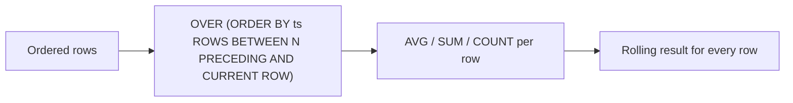

# :material-chevron-right-box: Sliding Window Aggregation

A **sliding window** (also called a rolling window) computes an aggregate over a fixed-width frame that moves row-by-row through ordered data. Unlike tumbling windows, every row gets its own window result.

______________________________________________________________________

## :material-sitemap: Overview



______________________________________________________________________

## :material-table: Frame Specification Options

| Frame clause                                              | Meaning                                               |
| --------------------------------------------------------- | ----------------------------------------------------- |
| `ROWS BETWEEN N PRECEDING AND CURRENT ROW`                | Current + N previous rows (fixed row count)           |
| `ROWS BETWEEN UNBOUNDED PRECEDING AND CURRENT ROW`        | Cumulative from start of partition                    |
| `ROWS BETWEEN 1 PRECEDING AND 1 FOLLOWING`                | Centered 3-row window                                 |
| `RANGE BETWEEN INTERVAL N DAYS PRECEDING AND CURRENT ROW` | All rows within N days of the current row's timestamp |

!!! tip

    Prefer `ROWS BETWEEN` for time series — it is deterministic regardless of duplicate timestamps.
    Use `RANGE BETWEEN INTERVAL` when you need true time-distance semantics.

______________________________________________________________________

## :material-flask-outline: Examples

### Sample data

```sql
CREATE OR REPLACE TEMP VIEW events AS
SELECT * FROM VALUES
  (1001, 1, TIMESTAMP('2025-07-20 10:00:00'), 'click',    50),
  (1002, 2, TIMESTAMP('2025-07-20 11:05:00'), 'view',     30),
  (1003, 1, TIMESTAMP('2025-07-20 10:10:00'), 'click',    70),
  (1004, 3, TIMESTAMP('2025-07-20 11:15:00'), 'purchase', 90),
  (1005, 2, TIMESTAMP('2025-07-20 10:20:00'), 'click',    20)
AS events(event_id, user_id, event_time, event_type, value);
```

### 7-day rolling average per region

```sql
SELECT
    region,
    sale_date,
    revenue,
    ROUND(AVG(revenue) OVER (
        PARTITION BY region
        ORDER BY sale_date
        ROWS BETWEEN 6 PRECEDING AND CURRENT ROW
    ), 2) AS ma_7d
FROM daily_sales
ORDER BY region, sale_date;
```

### Sliding 1-day window every 1 hour (using `window()` function)

```sql
SELECT
    window.start AS start_time,
    window.end   AS end_time,
    COUNT(*)     AS total_events
FROM (
    SELECT window(event_time, '1 day', '1 hour') AS window
    FROM events
)
GROUP BY window
ORDER BY start_time;
```

### Cumulative sum (expanding window)

```sql
SELECT
    user_id,
    event_time,
    value,
    SUM(value) OVER (
        PARTITION BY user_id
        ORDER BY event_time
        ROWS BETWEEN UNBOUNDED PRECEDING AND CURRENT ROW
    ) AS cumulative_value
FROM events
ORDER BY user_id, event_time;
```

### Centered 3-row moving average (smoothing)

```sql
SELECT
    sale_date,
    revenue,
    ROUND(AVG(revenue) OVER (
        ORDER BY sale_date
        ROWS BETWEEN 1 PRECEDING AND 1 FOLLOWING
    ), 2) AS centered_ma3
FROM daily_sales
ORDER BY sale_date;
```

### 30-day rolling count of distinct users

```sql
SELECT
    event_date,
    COUNT(DISTINCT user_id) OVER (
        ORDER BY event_date
        RANGE BETWEEN INTERVAL 29 DAYS PRECEDING AND CURRENT ROW
    ) AS rolling_30d_dau
FROM (
    SELECT DISTINCT TO_DATE(event_time) AS event_date, user_id FROM events
)
ORDER BY event_date;
```

### Rolling min / max (Bollinger-style band)

```sql
SELECT
    sale_date,
    revenue,
    MIN(revenue) OVER (ORDER BY sale_date ROWS BETWEEN 19 PRECEDING AND CURRENT ROW) AS ma20_low,
    AVG(revenue) OVER (ORDER BY sale_date ROWS BETWEEN 19 PRECEDING AND CURRENT ROW) AS ma20_mid,
    MAX(revenue) OVER (ORDER BY sale_date ROWS BETWEEN 19 PRECEDING AND CURRENT ROW) AS ma20_high
FROM daily_sales
ORDER BY sale_date;
```

______________________________________________________________________

## :material-compare: Sliding vs Tumbling vs Hopping

| Factor       | Sliding (row-based)             | Tumbling             | Hopping                   |
| ------------ | ------------------------------- | -------------------- | ------------------------- |
| Output rows  | One per input row               | One per window       | Multiple per event        |
| Overlap      | Yes                             | No                   | Yes                       |
| Window size  | N rows (or N time units)        | Fixed time interval  | Fixed time interval       |
| SQL function | `OVER (ROWS/RANGE BETWEEN ...)` | `window(ts, size)`   | `window(ts, size, slide)` |
| Use case     | Moving averages, smoothing      | Batch period reports | Near-real-time trends     |

______________________________________________________________________

## :material-magnify: Behavior Notes

1. `ROWS BETWEEN N PRECEDING AND CURRENT ROW` produces `N+1` row windows (e.g., `6 PRECEDING` = 7-day MA when data is daily).
2. For the first N rows in a partition, the window is smaller — `AVG` still divides by the actual number of rows in the frame.
3. `RANGE BETWEEN INTERVAL N DAYS PRECEDING` requires the `ORDER BY` column to be a date or timestamp type.
4. `COUNT(DISTINCT ...)` inside a window frame is **not supported** in standard Spark SQL — use the subquery + `RANGE` workaround shown above.
5. Window functions do not reduce row count — every input row produces one output row.

______________________________________________________________________

## :material-database-search: [Databricks] Real-World Example — System Tables

!!! note "[Databricks] Unity Catalog system tables"

    `system.access.audit` is a built-in Unity Catalog system table (no sample
    data setup needed) with dense timestamped events that suit rolling-window
    analysis. An account admin must grant `USE CATALOG` on `system`,
    `USE SCHEMA` on `system.access`, and `SELECT` on `system.access.audit`
    before these queries will return rows.

### Rolling 24-hour audit volume per service

```sql
-- [Databricks] Requires SELECT on system.access.audit
WITH hourly_events AS (
    SELECT
        service_name,
        DATE_TRUNC('hour', event_time) AS hour_bucket,
        COUNT(*) AS event_count
    FROM system.access.audit
    WHERE event_time >= CURRENT_TIMESTAMP() - INTERVAL 7 DAYS
    GROUP BY service_name, DATE_TRUNC('hour', event_time)
)
SELECT
    service_name,
    hour_bucket,
    event_count,
    ROUND(AVG(event_count) OVER (
        PARTITION BY service_name
        ORDER BY hour_bucket
        ROWS BETWEEN 23 PRECEDING AND CURRENT ROW
    ), 2) AS rolling_avg_24h,
    SUM(event_count) OVER (
        PARTITION BY service_name
        ORDER BY hour_bucket
        ROWS BETWEEN 23 PRECEDING AND CURRENT ROW
    ) AS rolling_total_24h
FROM hourly_events
ORDER BY service_name, hour_bucket;
-- Result (illustrative):
-- service_name | hour_bucket         | event_count | rolling_avg_24h | rolling_total_24h
-- ------------ | ------------------- | ----------- | --------------- | -----------------
-- notebooks    | 2024-07-02 09:00:00 | 942         | 854.75          | 20514
-- clusters     | 2024-07-02 09:00:00 | 128         | 111.46          | 2675
```

!!! tip "Sliding windows work best after light pre-aggregation"

    Real audit streams can be extremely dense. Pre-aggregate to hourly or
    daily buckets first, then apply the same rolling `OVER (...)` frame to
    get production-ready moving baselines.

______________________________________________________________________

## :material-play-circle: Interactive Demo

The chart below shows 10 days of daily revenue (blue bars) and a **3-day rolling average** (orange line).
The highlighted region is the active sliding window — **drag it left or right**, or use the **Prev / Next** buttons to step through each position. The `MA = $…` label updates live as you move the window.

<div id="viz-sliding" class="ts-viz"></div>

```
Legend
  ■ Blue bars   — daily revenue
  ── Orange line — 3-day moving average (MA)
  ░ Purple band  — current sliding window (drag to move)
```
