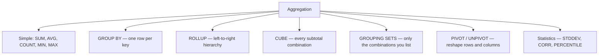

# :material-sigma: Aggregation in Spark SQL

Aggregation reduces many input rows into summary rows. In PySpark 4.2, Spark SQL supports plain `GROUP BY`, hierarchical subtotals with `ROLLUP`, full cross-dimensional totals with `CUBE`, custom subtotal layouts with `GROUPING SETS`, and row/column reshaping with `PIVOT` and `UNPIVOT`.

______________________________________________________________________

## :material-sitemap: Overview



### :material-animation-play: Interactive Visualization — Aggregation Map

<div id="viz-agg-index-map" class="ts-viz"></div>

Use the buttons to compare when Spark keeps one row per group, emits subtotal rows, or rotates dimensions into new columns.

______________________________________________________________________

## :material-check-decagram-outline: Verified PySpark 4.2 behaviors

| Feature                             | Verified behavior                                                                                                          |
| ----------------------------------- | -------------------------------------------------------------------------------------------------------------------------- |
| `COUNT(*)`                          | Counts every row, including rows containing `NULL` values.                                                                 |
| `COUNT(col)`                        | Skips rows where `col` is `NULL`.                                                                                          |
| `COUNT(DISTINCT a, b)`              | Counts only distinct tuples where **both** expressions are non-`NULL`.                                                     |
| `SUM(INT)` / `SUM(SMALLINT)`        | Widens to `BIGINT`; `SUM(FLOAT)` widens to `DOUBLE`.                                                                       |
| `AVG(INT)` / `AVG(BIGINT)`          | Returns `DOUBLE`; `AVG(DECIMAL(10,2))` widens to `DECIMAL(14,6)`.                                                          |
| `ROLLUP` / `CUBE` / `GROUPING SETS` | Real `NULL` data and subtotal-placeholder `NULL` values coexist; use `GROUPING()` or `GROUPING_ID()` to tell them apart.   |
| `PIVOT`                             | Any columns left outside the pivoted dimension remain grouping columns.                                                    |
| `UNPIVOT`                           | Drops `NULL` output rows by default; `INCLUDE NULLS` retains them.                                                         |
| `APPROX_COUNT_DISTINCT(col, rsd)`   | Lower `rsd` usually tracks the exact cardinality more closely, but it is a probabilistic target, not a per-run hard bound. |

______________________________________________________________________

## :material-pin: Aggregation patterns

| Pattern              | Produces                                          | Typical use                         |
| -------------------- | ------------------------------------------------- | ----------------------------------- |
| `GROUP BY`           | One row per distinct grouping key                 | Revenue per region                  |
| `ROLLUP(a, b)`       | Detail rows + left-prefix subtotals + grand total | Year → quarter → month              |
| `CUBE(a, b)`         | Every subset of the listed dimensions             | Cross-tab BI summary                |
| `GROUPING SETS(...)` | Only the subtotal combinations you enumerate      | Report-specific subtotal layout     |
| `PIVOT`              | Category values become output columns             | Sales by year or region             |
| `UNPIVOT`            | Wide columns become labelled rows                 | Quarterly columns back to long form |

______________________________________________________________________

## :material-flask-outline: Quick examples

### Grouped total

```sql
SELECT
    region,
    SUM(amount) AS total_sales
FROM sales
GROUP BY region;
```

### Hierarchical subtotal

```sql
SELECT
    region,
    product,
    SUM(amount) AS total_sales,
    GROUPING_ID(region, product) AS grp_id
FROM sales
GROUP BY ROLLUP (region, product)
ORDER BY grp_id, region NULLS LAST, product NULLS LAST;
```

### Column rotation

```sql
SELECT *
FROM sales
PIVOT (
    SUM(amount) AS revenue
    FOR region IN ('East' AS east, 'West' AS west, 'North' AS north)
);
```

______________________________________________________________________

## :material-brain: When to use what

| Scenario                                | Recommended guide                        |
| --------------------------------------- | ---------------------------------------- |
| Basic grouped metrics                   | [`GROUP BY`](group.md)                   |
| Strict hierarchy with subtotals         | [`ROLLUP`](olap/rollup.md)               |
| All combinations of a few dimensions    | [`CUBE`](olap/cube.md)                   |
| Only a custom subset of subtotal levels | [`GROUPING SETS`](olap/group-set.md)     |
| Rotate rows into columns                | [`PIVOT`](pivoting/pivot/spark.md)       |
| Normalize wide columns into rows        | [`UNPIVOT`](pivoting/unpivot.md)         |
| Distinct counts, sums, means, min/max   | [`Simple Aggregations`](simple/index.md) |
| Dispersion, covariance, percentiles     | [`Statistical Aggregations`](stats.md)   |

### :material-sitemap: Related guides

- [Simple Aggregations](simple/index.md)
- [GROUP BY](group.md)
- [ROLLUP](olap/rollup.md)
- [CUBE](olap/cube.md)
- [GROUPING SETS](olap/group-set.md)
- [PIVOT](pivoting/pivot/spark.md)
- [UNPIVOT](pivoting/unpivot.md)
- [Statistical Aggregations](stats.md)
