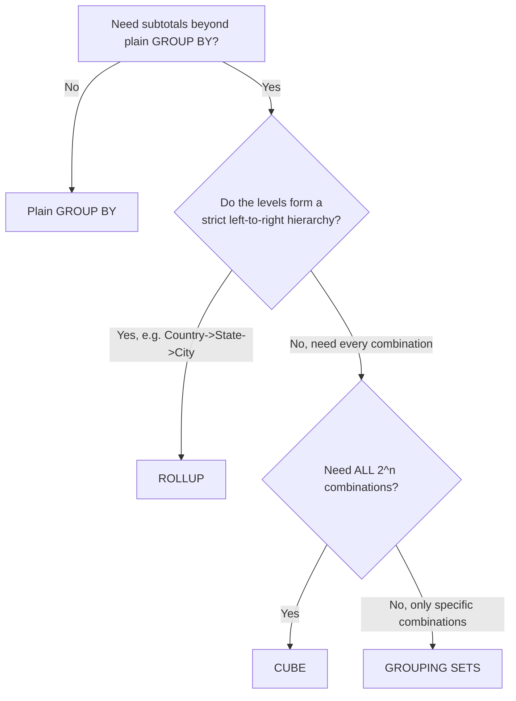

# :material-chart-tree: Advanced Aggregation — Beyond `GROUP BY`

Plain `GROUP BY` produces exactly one grouping level. Real reporting needs often require
**several levels of subtotal in a single result set** — for example a
`Country` → `Country + State` → `Country + State + City` → `Grand Total` hierarchy for a
sales dashboard. Spark SQL provides three constructs for this, all built on the same
underlying `Expand` operator:

| Construct                       | Grouping sets produced                              | Use when                                                                                                       |
| ------------------------------- | --------------------------------------------------- | -------------------------------------------------------------------------------------------------------------- |
| [`ROLLUP`](rollup.md)           | `n + 1` sets, strictly hierarchical (right-to-left) | Levels form a **parent-child hierarchy** (geography, time, org chart).                                         |
| [`CUBE`](cube.md)               | `2ⁿ` sets, every combination                        | You need **all cross-cuts**, not just the hierarchy (e.g., region alone AND product alone AND region×product). |
| [`GROUPING SETS`](group-set.md) | Exactly the sets you list                           | You need a **specific, non-hierarchical, or partial** subset of subtotals.                                     |

`ROLLUP` and `CUBE` are both syntactic sugar for `GROUPING SETS` with a fixed set list —
see [Equivalences](group-set.md#equivalences).

## :material-flask-outline: One Query, an Entire Hierarchy

```sql
CREATE OR REPLACE TEMP VIEW sales AS SELECT * FROM VALUES
    ('USA',    'CA', 'Los Angeles',   100),
    ('USA',    'CA', 'San Francisco', 150),
    ('USA',    'NY', 'New York',      200),
    ('Canada', 'ON', 'Toronto',        80),
    ('Canada', 'BC', 'Vancouver',      60)
AS sales(country, state, city, revenue);

SELECT
    country,
    state,
    city,
    SUM(revenue)                        AS revenue,
    GROUPING_ID(country, state, city)   AS gid
FROM sales
GROUP BY ROLLUP (country, state, city)
ORDER BY gid, country, state, city;
```

```text
+-------+-----+-------------+-------+---+
|country|state|city         |revenue|gid|
+-------+-----+-------------+-------+---+
|Canada |BC   |Vancouver    |60     |0  |   -- detail: Country + State + City
|Canada |ON   |Toronto      |80     |0  |
|USA    |CA   |Los Angeles  |100    |0  |
|USA    |CA   |San Francisco|150    |0  |
|USA    |NY   |New York     |200    |0  |
|Canada |BC   |NULL         |60     |1  |   -- Country + State subtotal
|Canada |ON   |NULL         |80     |1  |
|USA    |CA   |NULL         |250    |1  |
|USA    |NY   |NULL         |200    |1  |
|Canada |NULL |NULL         |140    |3  |   -- Country subtotal
|USA    |NULL |NULL         |450    |3  |
|NULL   |NULL |NULL         |590    |7  |   -- Grand Total
+-------+-----+-------------+-------+---+
```

!!! success "Verified: a single scan produces every level"

    `EXPLAIN` on the query above shows one `Expand` operator generating all four grouping
    sets from a single `LocalTableScan`, followed by one `HashAggregate`/shuffle/`HashAggregate`
    pair — Spark reads the source data **once**, not once per hierarchy level:

    ```text
    +- HashAggregate(keys=[country, state, city, spark_grouping_id], functions=[sum(revenue)])
       +- Exchange hashpartitioning(country, state, city, spark_grouping_id, 200)
          +- HashAggregate(keys=[country, state, city, spark_grouping_id], functions=[partial_sum(revenue)])
             +- Expand [[revenue, country, state, city, 0],
                        [revenue, country, state, null, 1],
                        [revenue, country, null, null, 3],
                        [revenue, null, null, null, 7]]
                +- LocalTableScan [revenue, country, state, city]
    ```

    This is the core cost advantage over hand-writing four separate `UNION ALL GROUP BY`
    queries, which would scan the source table four times.

## :material-sitemap: Choosing the Right Construct



| Scenario                                                                       | Construct                                         |
| ------------------------------------------------------------------------------ | ------------------------------------------------- |
| `Country` → `Country + State` → `Country + State + City` → Total               | `ROLLUP(country, state, city)`                    |
| Region alone, Product alone, AND Region × Product, AND Total                   | `CUBE(region, product)`                           |
| Only `(region, product)`, `(region)`, and grand total — skip `(product)` alone | `GROUPING SETS ((region, product), (region), ())` |
| Replace 3 separate `UNION ALL` queries with one scan                           | `GROUPING SETS (...)`                             |

## :material-book-open-variant: Deep Dives

- [`ROLLUP`](rollup.md) — hierarchical subtotals, `GROUPING_ID()`, time and geography hierarchies, pitfalls, performance tips.
- [`CUBE`](cube.md) — all cross-cutting subtotals, BI/warehouse patterns, incremental refresh.
- [`GROUPING SETS`](group-set.md) — explicit control over exactly which subtotal rows are produced.

## :material-link-variant: Related

- [`GROUP BY`](../group.md) — the base construct all three extend.
- [Pivoting](../pivoting/pivot/spark.md) — turning grouped rows into columns, the orthogonal reshaping operation.
- [HAVING on aggregates](../../having/having_advanced.md) — filtering rollup/cube output by `GROUPING()`/`GROUPING_ID()`.
