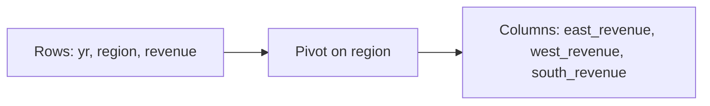

# :material-table-pivot: `PIVOT`

Spark SQL's `PIVOT` clause turns distinct values from one dimension into output columns. It is concise for static, known pivot values, but the `IN (...)` list must be enumerated up front.

______________________________________________________________________

## :material-sitemap: Overview



### :material-animation-play: Interactive Visualization — Native Pivot Layout

<div id="viz-pivot-native-layout" class="ts-viz"></div>

The visualization highlights a common gotcha: every non-pivot column that survives the subquery becomes part of the grouping key.

______________________________________________________________________

## :material-pin: Syntax

```sql
SELECT *
FROM source_table
PIVOT (
    aggregate_expression [AS agg_alias] [, ...]
    FOR pivot_column IN (value_expr [AS value_alias] [, ...])
);
```

______________________________________________________________________

## :material-magnify: Verified behavior

1. `PIVOT` is static: Spark does not discover pivot values automatically inside pure SQL.
2. Any columns still present before `PIVOT` but not named in `FOR ... IN (...)` become grouping columns.
3. Multiple aggregates are supported; Spark appends the aggregate alias after the pivot-value alias.
4. Missing pivot cells produce `NULL`, even for `COUNT(*)` inside the pivot.
5. `PIVOT` and manual `CASE` pivots are semantically similar; `PIVOT` is shorter, while `CASE` gives finer control.

______________________________________________________________________

## :material-flask-outline: Practical examples

### Basic pivot by year

```sql
SELECT *
FROM (
    SELECT * FROM VALUES
        (2023, 'East', 5000),
        (2023, 'East', 2000),
        (2023, 'West', 3000),
        (2023, 'West', 1400),
        (2023, 'South', 4000),
        (2023, 'South', 1200),
        (2024, 'East', 6000),
        (2024, 'West', 5000),
        (2024, 'South', 1600),
        (2024, 'East', 1400)
    AS t(yr, region, revenue)
) src
PIVOT (
    SUM(revenue) AS revenue,
    COUNT(*) AS cnt
    FOR region IN ('East' AS east, 'West' AS west, 'South' AS south)
)
ORDER BY yr;
```

Verified result:

| yr   | east_revenue | east_cnt | west_revenue | west_cnt | south_revenue | south_cnt |
| ---- | ------------ | -------- | ------------ | -------- | ------------- | --------- |
| 2023 | 7000         | 2        | 4400         | 2        | 5200          | 2         |
| 2024 | 7400         | 2        | 5000         | 1        | 1600          | 1         |

### Why extra columns matter

```sql
SELECT *
FROM (
    SELECT * FROM VALUES
        (1, 2023, 'East', 5000),
        (2, 2023, 'East', 2000)
    AS t(sale_id, yr, region, revenue)
) src
PIVOT (
    SUM(revenue) AS revenue
    FOR region IN ('East' AS east)
);
```

Because `sale_id` survives the subquery, Spark groups by `sale_id, yr`; you get one row per input sale instead of one row per year.

### Missing cells stay `NULL`

```sql
SELECT *
FROM (
    SELECT * FROM VALUES
        (2023, 'East', 10),
        (2023, 'West', 20),
        (2024, 'East', 30)
    AS t(yr, region, revenue)
) src
PIVOT (
    SUM(revenue) AS revenue,
    COUNT(*) AS cnt
    FOR region IN ('East' AS east, 'West' AS west, 'South' AS south)
)
ORDER BY yr;
```

Verified PySpark 4.2 result: `south_revenue` and `south_cnt` were `NULL`, not `0`, because there were no matching rows for those cells.

### Dynamic pivot via SQL generation

`PIVOT` itself is static — the `IN (...)` list must be literal values known when the
query is parsed. To pivot on values discovered at runtime, query the distinct values
first, then generate the `IN (...)` list before running the pivot:

```python
# Step 1: discover the pivot values at runtime
months = [r["month"] for r in spark.sql(
    "SELECT DISTINCT month FROM sales ORDER BY month"
).collect()]
# months = ['Feb', 'Jan', 'Mar']  <- alphabetical, NOT calendar order (see gotcha below)

# Step 2: build the IN list and generate the SQL
in_list = ", ".join(f"'{m}'" for m in months)
query = f"""
    SELECT * FROM sales
    PIVOT (SUM(revenue) FOR month IN ({in_list}))
"""

# Step 3: run the generated SQL
spark.sql(query).show()
```

```text
+--------+----+---+---+
|customer| Feb|Jan|Mar|
+--------+----+---+---+
|       A| 200|100|150|
|       B|NULL| 80|120|
+--------+----+---+---+
```

!!! warning "Verified gotcha: `ORDER BY month` sorts alphabetically, not calendar order"

    `SELECT DISTINCT month ORDER BY month` on string month names ('Jan', 'Feb', 'Mar')
    sorts **alphabetically** (`Feb, Jan, Mar` — verified above), not chronologically.
    Either sort by a numeric month column (`month_num`) if one exists, or map through
    an explicit calendar-order list (`CASE month WHEN 'Jan' THEN 1 WHEN 'Feb' THEN 2 ...`) before building the `IN (...)` list — don't rely on lexical string order for
    month/day names.

If you're already in PySpark rather than pure SQL, the DataFrame API's `.pivot()`
avoids the string-building step entirely — pass the discovered list directly:

```python
sales_df.groupBy("customer").pivot("month", months).sum("revenue")
```

Calling `.pivot("month")` **without** a values list also works and produces the
identical result (verified) — Spark runs an extra distinct-values job internally to
discover them, then pivots. This is the most concise option but costs one additional
pass over the data just to enumerate values; passing the values list explicitly (as
returned by your own `SELECT DISTINCT`, or a known reference list) skips that extra
job — prefer it when the source table is large or the pivot runs repeatedly.

______________________________________________________________________

## :material-brain: When to use

| Scenario                                   | Recommended pattern            |
| ------------------------------------------ | ------------------------------ |
| Small, fixed set of known pivot values     | `PIVOT`                        |
| Need multiple aggregates per pivot value   | `PIVOT`                        |
| Need runtime-discovered pivot values       | Generate SQL in PySpark        |
| Need custom cell logic or custom null fill | [`CASE` pivot](select-case.md) |
