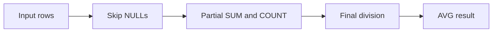

# :material-sigma: AVG

`AVG` returns the arithmetic mean of the non-`NULL` input values in each group.

______________________________________________________________________

## :material-sitemap: Overview



### :material-animation-play: Interactive Visualization — AVG Type and Weighting Rules

<div id="viz-avg-type-behavior" class="ts-viz"></div>

The same mean operation behaves differently for integral, decimal, and pre-aggregated inputs; Spark carries `SUM` and `COUNT`, not partial averages.

______________________________________________________________________

## :material-pin: Syntax

```sql
AVG(expr)
AVG(DISTINCT expr)
AVG(expr) FILTER (WHERE condition)
```

______________________________________________________________________

## :material-magnify: Verified behavior

1. `AVG` ignores `NULL` in both the numerator and denominator.
2. In PySpark 4.2, `AVG(SMALLINT)`, `AVG(INT)`, and `AVG(BIGINT)` returned `DOUBLE`.
3. `AVG(DECIMAL(10,2))` widened to `DECIMAL(14,6)` in our check.
4. `AVG(DISTINCT col)` removes duplicates before averaging.
5. Spark computes averages from partial `SUM` and `COUNT`; averaging already-averaged batches is only correct when batch counts are equal.

______________________________________________________________________

## :material-flask-outline: Practical examples

```sql
CREATE OR REPLACE TEMP VIEW sales AS
SELECT * FROM VALUES
    (1, 'East',  120.00),
    (2, 'West',  340.00),
    (3, 'East',   80.00),
    (4, 'North', 210.00),
    (5, 'West',  150.00),
    (6, 'East',  450.00),
    (7, 'North',  90.00),
    (8, 'West',  270.00),
    (9, 'East',  NULL)
AS sales(order_id, region, amount);
```

### `NULL` handling

```sql
SELECT
    COUNT(*) AS total_rows,
    COUNT(amount) AS non_null_rows,
    ROUND(AVG(amount), 2) AS avg_amount
FROM sales;
```

Verified result: `COUNT(*) = 9`, `COUNT(amount) = 8`, `AVG(amount) = 213.75`.

### Group average

```sql
SELECT
    region,
    COUNT(*) AS order_count,
    ROUND(AVG(amount), 2) AS avg_sale
FROM sales
GROUP BY region
ORDER BY avg_sale DESC;
```

### Type widening

```sql
SELECT
    typeof(AVG(CAST(1 AS INT))) AS avg_int_type,
    typeof(AVG(CAST(1.23 AS DECIMAL(10,2)))) AS avg_decimal_type;
```

Verified PySpark 4.2 result: `double` and `decimal(14,6)`.

### Why averaging averages is wrong

```sql
WITH daily_rollups(day_id, daily_avg, daily_count) AS (
    VALUES (1, 150.00, 2),
           (2,  25.00, 4)
)
SELECT
    ROUND(AVG(daily_avg), 2) AS wrong_avg_of_avgs,
    ROUND(SUM(daily_avg * daily_count) / SUM(daily_count), 2) AS correct_weighted_avg
FROM daily_rollups;
```

Verified result: `87.50` vs `50.00`.

______________________________________________________________________

## :material-brain: When to use

| Scenario                        | Recommended pattern                                       |
| ------------------------------- | --------------------------------------------------------- |
| Mean over raw rows              | `AVG(col)`                                                |
| Mean over unique values         | `AVG(DISTINCT col)`                                       |
| Conditional mean                | `AVG(col) FILTER (WHERE ...)`                             |
| Combine pre-aggregated averages | Reconstruct `SUM(avg * count)` and divide by `SUM(count)` |
