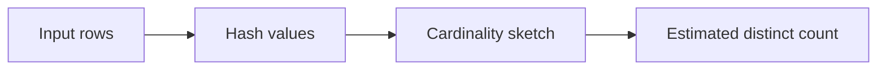

# :material-counter: APPROX_COUNT_DISTINCT

`APPROX_COUNT_DISTINCT` estimates cardinality with a probabilistic sketch. It is much cheaper than `COUNT(DISTINCT ...)` on very large datasets, but the result is intentionally approximate.

______________________________________________________________________

## :material-sitemap: Overview



### :material-animation-play: Interactive Visualization — RSD vs Estimate

<div id="viz-approx-count-rsd" class="ts-viz"></div>

Lower `rsd` usually hugs the exact answer more closely, but the estimate is probabilistic, so treat it as an accuracy target rather than a fixed error guarantee.

______________________________________________________________________

## :material-pin: Syntax

```sql
APPROX_COUNT_DISTINCT(expr [, rsd])
```

______________________________________________________________________

## :material-magnify: Verified behavior

1. `NULL` values are ignored.
2. The return type is `BIGINT`.
3. The second argument is a relative standard deviation target: lower values generally improve accuracy at higher memory cost.
4. `FILTER (WHERE ...)` is supported in Spark 4.2.
5. Error is not monotonic on every individual run, but lower `rsd` should be closer on average.

______________________________________________________________________

## :material-flask-outline: Practical examples

### Small table

```sql
SELECT
    APPROX_COUNT_DISTINCT(user_id) AS approx_users,
    COUNT(DISTINCT user_id) AS exact_users
FROM events;
```

On small inputs, the estimate is often exact.

### Observed `rsd` trade-off in PySpark 4.2

```sql
SELECT
    COUNT(DISTINCT id) AS exact_ct,
    APPROX_COUNT_DISTINCT(id) AS approx_default,
    APPROX_COUNT_DISTINCT(id, 0.01D) AS approx_1pct,
    APPROX_COUNT_DISTINCT(id, 0.20D) AS approx_20pct
FROM (SELECT id % 10000 AS id FROM range(1000000));
```

Verified result from one run:

| exact_ct | approx_default | approx_1pct | approx_20pct |
| -------- | -------------- | ----------- | ------------ |
| 10000    | 9571           | 9965        | 7939         |

### Why It's Cheaper: The Shuffle `EXPLAIN` Avoids

`COUNT(DISTINCT ...)` must physically group by the distinct column before it can count
groups — this adds an extra shuffle that a sketch-based aggregate doesn't need. Verified
on local Spark 4.2 with 2M rows / 50,000 distinct values:

```sql
EXPLAIN SELECT COUNT(DISTINCT user_id) FROM events;
```

```text
+- HashAggregate(keys=[], functions=[count(distinct user_id)])
   +- Exchange SinglePartition                                  <- 2nd shuffle: combine counts
      +- HashAggregate(keys=[], functions=[partial_count(distinct user_id)])
         +- HashAggregate(keys=[user_id], functions=[])          <- must group by the raw value
            +- Exchange hashpartitioning(user_id, 200)          <- 1st shuffle: dedup by value
               +- HashAggregate(keys=[user_id], functions=[])
                  +- Project [...]
```

```sql
EXPLAIN SELECT APPROX_COUNT_DISTINCT(user_id) FROM events;
```

```text
+- HashAggregate(keys=[], functions=[approx_count_distinct(user_id, 0.05, 0, 0)])
   +- Exchange SinglePartition                                  <- only shuffle: merge sketches
      +- HashAggregate(keys=[], functions=[partial_approx_count_distinct(user_id, 0.05, 0, 0)])
         +- Project [...]
```

`APPROX_COUNT_DISTINCT` uses a HyperLogLog++ sketch: each partition folds its rows into
a small, fixed-size sketch (`partial_approx_count_distinct`) with **no need to shuffle
the raw distinct values first** — only the tiny sketches move across the network in the
final `Exchange SinglePartition`. `COUNT(DISTINCT ...)` has to shuffle every row by
`user_id` (`Exchange hashpartitioning(user_id, 200)`) just to deduplicate it before it
can even start counting. On this 2M-row local run, that extra shuffle stage measurably
slowed the exact query down versus the approximate one — the gap widens sharply as
cardinality and data volume grow, since the exact path's shuffle size scales with the
number of distinct values while the sketch's does not.

!!! tip "Sketches generalize beyond distinct counts"

    The same idea — replace an expensive exact computation with a small, mergeable
    probabilistic summary — also backs `APPROX_PERCENTILE`/`PERCENTILE_APPROX` (a
    t-digest/quantile sketch instead of sorting the full dataset; see
    [Statistical Aggregates](../../stats.md)). Reach for a sketch-based aggregate
    whenever a dashboard or monitoring query only needs an estimate, not an exact value.

### `NULL` handling and `FILTER`

```sql
SELECT
    APPROX_COUNT_DISTINCT(v) AS approx_no_nulls,
    APPROX_COUNT_DISTINCT(v) FILTER (WHERE v < 3) AS approx_lt3
FROM (SELECT * FROM VALUES (1), (1), (2), (NULL), (3), (NULL) AS t(v));
```

Verified result: `approx_no_nulls = 3`, `approx_lt3 = 2`.

______________________________________________________________________

## :material-brain: When to use

| Scenario                                                                      | Recommended pattern                                                                     |
| ----------------------------------------------------------------------------- | --------------------------------------------------------------------------------------- |
| DAU / MAU or unique-visitor metrics at scale                                  | `APPROX_COUNT_DISTINCT(user_id)`                                                        |
| Accuracy more important than memory                                           | Use a lower `rsd`                                                                       |
| Exact answer required                                                         | `COUNT(DISTINCT col)`                                                                   |
| High-cardinality column and exact `COUNT(DISTINCT)` is too slow/shuffle-heavy | `APPROX_COUNT_DISTINCT` — avoids the extra `hashpartitioning` shuffle on the raw values |
| Need an approximate quantile/median instead of a count                        | `PERCENTILE_APPROX`/`APPROX_PERCENTILE` (a different sketch, same trade-off)            |
