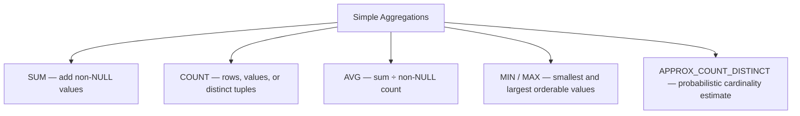

# :material-sigma: Simple Aggregations

Simple aggregate functions collapse a set of rows into one numeric or scalar answer. In PySpark 4.2, they all ignore `NULL` inputs except `COUNT(*)`, which counts rows regardless of content.

______________________________________________________________________

## :material-sitemap: Overview



### :material-animation-play: Interactive Visualization — Simple Aggregate Semantics

<div id="viz-simple-aggregate-null" class="ts-viz"></div>

Toggle the sample rows to see which functions skip `NULL`, which keep counting rows, and where Spark widens result types.

______________________________________________________________________

## :material-pin: Function reference

| Function                | Common syntax                                                  | Verified PySpark 4.2 return type                                                                 |
| ----------------------- | -------------------------------------------------------------- | ------------------------------------------------------------------------------------------------ |
| `SUM`                   | `SUM(col)`, `SUM(DISTINCT col)`, `SUM(col) FILTER (WHERE ...)` | `BIGINT` for integral inputs, `DOUBLE` for floating inputs, widened `DECIMAL` for decimal inputs |
| `COUNT`                 | `COUNT(*)`, `COUNT(col)`, `COUNT(DISTINCT col)`                | `BIGINT`                                                                                         |
| `AVG`                   | `AVG(col)`, `AVG(DISTINCT col)`                                | `DOUBLE` for non-decimal numerics, widened `DECIMAL` for decimal inputs                          |
| `MIN` / `MAX`           | `MIN(col)`, `MAX(col)`                                         | Same data type as the compared expression                                                        |
| `APPROX_COUNT_DISTINCT` | `APPROX_COUNT_DISTINCT(col [, rsd])`                           | `BIGINT`                                                                                         |

All five families also work as window functions with `OVER (...)`.

______________________________________________________________________

## :material-check-decagram-outline: Practical reminders

1. `COUNT(*)` and `COUNT(1)` behave the same in Spark 4.2.
2. `SUM` over an empty filtered input returns `NULL`, not `0`.
3. `AVG(INT)` uses floating-point division, so `AVG(1, 2)` is `1.5`, not `1`.
4. `MIN` / `MAX` compare strings lexicographically and dates chronologically.
5. `APPROX_COUNT_DISTINCT` skips `NULL` and trades memory for accuracy via its `rsd` argument.

______________________________________________________________________

## :material-flask-outline: Example

```sql
CREATE OR REPLACE TEMP VIEW sales AS
SELECT * FROM VALUES
    (1, 'East',  120.00),
    (2, 'West',  340.00),
    (3, 'East',   80.00),
    (4, 'North', 210.00),
    (5, 'West',  150.00),
    (6, 'East',  450.00),
    (7, 'North',  90.00),
    (8, 'West',  270.00),
    (9, 'East',  NULL)
AS sales(order_id, region, amount);

SELECT
    COUNT(*)                      AS total_rows,
    COUNT(amount)                 AS non_null_amount_rows,
    SUM(amount)                   AS total_revenue,
    ROUND(AVG(amount), 2)         AS avg_amount,
    MIN(amount)                   AS min_amount,
    MAX(amount)                   AS max_amount,
    APPROX_COUNT_DISTINCT(region) AS approx_regions
FROM sales;
```

______________________________________________________________________

## :material-brain: Guides by function

- [AVG](avg/spark-avg.md)
- [COUNT](count/spark-count-aggr.md)
- [APPROX_COUNT_DISTINCT](count/approx-count-distinct.md)
- [MIN / MAX](minmax/min-max-agg.md)
- [SUM](sum/sum-aggregation.md)
