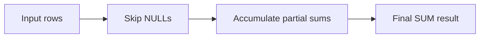

# :material-sigma: SUM

`SUM` adds the non-`NULL` values in each group. In Spark 4.2, the important details are result-type widening and ANSI overflow behavior.

______________________________________________________________________

## :material-sitemap: Overview



### :material-animation-play: Interactive Visualization — SUM Types and Overflow

<div id="viz-sum-overflow-types" class="ts-viz"></div>

Compare how Spark widens integral and decimal inputs, then see what changes when a `BIGINT` total crosses the 64-bit limit.

______________________________________________________________________

## :material-pin: Syntax

```sql
SUM(expr)
SUM(DISTINCT expr)
SUM(expr) FILTER (WHERE condition)
```

______________________________________________________________________

## :material-magnify: Verified behavior

1. `SUM` ignores `NULL`; an all-`NULL` or empty filtered input returns `NULL`.
2. In PySpark 4.2, `SUM(SMALLINT)`, `SUM(INT)`, and `SUM(BIGINT)` returned `BIGINT`.
3. `SUM(FLOAT)` widened to `DOUBLE`.
4. `SUM(DECIMAL(10,2))` widened to `DECIMAL(20,2)` in our check.
5. With Spark 4.2 ANSI mode enabled by default, overflowing a `BIGINT` sum raised `[ARITHMETIC_OVERFLOW]`.
6. With `spark.sql.ansi.enabled = false`, the same overflowing `BIGINT` sum wrapped to `-9223372036854775808`.

______________________________________________________________________

## :material-flask-outline: Practical examples

```sql
CREATE OR REPLACE TEMP VIEW sales AS
SELECT * FROM VALUES
    (1, 'East',  'Widget', 120.00),
    (2, 'West',  'Gadget', 340.00),
    (3, 'East',  'Widget',  80.00),
    (4, 'North', 'Gadget', 210.00),
    (5, 'West',  'Widget', 150.00),
    (6, 'East',  'Gadget', 450.00),
    (7, 'North', 'Widget',  90.00),
    (8, 'West',  'Gadget', 270.00)
AS sales(order_id, region, product, amount);
```

### Grouped sums

```sql
SELECT
    region,
    SUM(amount) AS total_sales
FROM sales
GROUP BY region
ORDER BY total_sales DESC;
```

Verified result: `West = 760.0`, `East = 650.0`, `North = 300.0`.

### Type widening

```sql
SELECT
    typeof(SUM(CAST(1 AS INT))) AS sum_int_type,
    typeof(SUM(CAST(1.5 AS FLOAT))) AS sum_float_type,
    typeof(SUM(CAST(1.23 AS DECIMAL(10,2)))) AS sum_decimal_type;
```

Verified PySpark 4.2 result: `bigint`, `double`, `decimal(20,2)`.

### Overflow under ANSI mode

```sql
SELECT SUM(x) AS s
FROM (
    SELECT CAST(9223372036854775807 AS BIGINT) AS x
    UNION ALL
    SELECT CAST(1 AS BIGINT) AS x
);
```

This raised `[ARITHMETIC_OVERFLOW]` in our PySpark 4.2 run. Cast to `DECIMAL` before summing when totals can exceed 64-bit range.

______________________________________________________________________

## :material-brain: When to use

| Scenario                   | Recommended pattern           |
| -------------------------- | ----------------------------- |
| Total of a measure         | `SUM(col)`                    |
| Conditional subtotal       | `SUM(col) FILTER (WHERE ...)` |
| Deduplicated subtotal      | `SUM(DISTINCT col)`           |
| Very large integral totals | Cast to `DECIMAL` first       |
