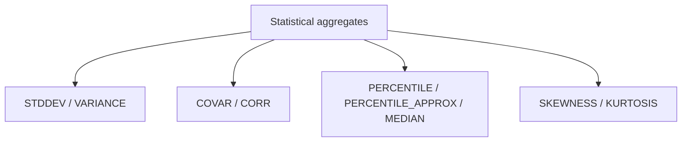

# :material-chart-bar: Statistical Aggregations

Spark SQL includes aggregate functions for spread, covariance, correlation, and percentiles. The notes below were re-checked against PySpark 4.2 so edge cases match current behavior instead of older Spark assumptions.

!!! note "Source"

    Full runnable example: `sql/aggregation/stats/stats.sql`

______________________________________________________________________

## :material-sitemap: Overview



### :material-animation-play: Interactive Visualization — Distribution Summary

<div id="viz-stats-distribution" class="ts-viz"></div>

Move the percentile marker to see how median, quartiles, and spread describe different parts of the same distribution.

______________________________________________________________________

## :material-pin: Function reference

| Function                  | Meaning                        | Verified PySpark 4.2 note                                                             |
| ------------------------- | ------------------------------ | ------------------------------------------------------------------------------------- |
| `STDDEV`, `STDDEV_SAMP`   | Sample standard deviation      | Divide by `n - 1`                                                                     |
| `STDDEV_POP`              | Population standard deviation  | Divide by `n`                                                                         |
| `VARIANCE`, `VAR_SAMP`    | Sample variance                | Divide by `n - 1`                                                                     |
| `VAR_POP`                 | Population variance            | Divide by `n`                                                                         |
| `COVAR_SAMP`, `COVAR_POP` | Sample / population covariance | Returned `0.0` when one side was constant in our test                                 |
| `CORR`                    | Pearson correlation            | Under ANSI mode, zero variance can raise `DIVIDE_BY_ZERO` instead of returning `NULL` |
| `PERCENTILE`              | Exact percentile               | `PERCENTILE(x, 0.5)` matched `MEDIAN(x)`                                              |
| `PERCENTILE_APPROX`       | Approximate percentile         | Sketch-based approximation; not a HyperLogLog cardinality function                    |
| `MEDIAN`                  | Exact 50th percentile          | Returned `DOUBLE` in our PySpark 4.2 checks                                           |
| `SKEWNESS`, `KURTOSIS`    | Shape of the distribution      | Spark 4.2 returned numeric values even on very small samples                          |

______________________________________________________________________

## :material-magnify: Verified behavior

1. All of these aggregates skip `NULL` inputs.
2. `PERCENTILE_APPROX(expr, ARRAY(...), accuracy)` can calculate several quantiles in one pass.
3. For integer inputs, `PERCENTILE_APPROX` can still return an integral type, while `MEDIAN` and exact `PERCENTILE` returned `DOUBLE` in our tests.
4. `CORR(x, y)` over `(1, 5), (2, 5), (3, 5)` raised `[DIVIDE_BY_ZERO]` with Spark 4.2's ANSI mode because `y` had zero variance.
5. `COVAR_SAMP` and `COVAR_POP` on the same constant-`y` input returned `0.0` rather than failing.
6. `SKEWNESS` and `KURTOSIS` did not return `NULL` for 2-row and 3-row samples in PySpark 4.2, so treat tiny-sample results as unstable rather than absent.

______________________________________________________________________

## :material-flask-outline: Practical examples

### Dispersion by region

```sql
CREATE OR REPLACE TEMP VIEW measurements AS
SELECT * FROM VALUES
    ('East',  23.5),
    ('East',  25.1),
    ('East',  22.8),
    ('West',  31.4),
    ('West',  29.7),
    ('West',  33.2),
    ('North', 18.0),
    ('North', 19.5),
    ('North', 17.2)
AS measurements(region, reading);

SELECT
    region,
    ROUND(AVG(reading), 2) AS avg_reading,
    ROUND(STDDEV(reading), 4) AS stddev_sample,
    ROUND(STDDEV_POP(reading), 4) AS stddev_pop,
    ROUND(VARIANCE(reading), 4) AS variance_sample,
    ROUND(VAR_POP(reading), 4) AS variance_pop,
    MEDIAN(reading) AS median_reading,
    PERCENTILE_APPROX(reading, ARRAY(0.25, 0.75), 50000) AS iqr_bounds
FROM measurements
GROUP BY region
ORDER BY region;
```

### Exact vs approximate median

```sql
SELECT
    MEDIAN(x) AS median_exact,
    PERCENTILE(x, 0.5) AS percentile_exact,
    PERCENTILE_APPROX(x, 0.5) AS percentile_approx
FROM (SELECT * FROM VALUES (1D), (2D), (100D), (101D) AS t(x));
```

Verified result in PySpark 4.2: `MEDIAN` = `51.0`, exact `PERCENTILE(..., 0.5)` = `51.0`, but `PERCENTILE_APPROX(..., 0.5)` returned `2.0` on this tiny skewed sample.

### Correlation with a valid, non-constant pair

```sql
SELECT
    ROUND(CORR(x, y), 4) AS corr,
    ROUND(COVAR_SAMP(x, y), 4) AS covar_samp,
    ROUND(COVAR_POP(x, y), 4) AS covar_pop
FROM (SELECT * FROM VALUES
    (1D, 2D),
    (2D, 4D),
    (3D, 6D)
AS t(x, y));
```

### Guarding zero-variance correlation under ANSI mode

```sql
WITH pairs AS (
    SELECT * FROM VALUES
        (1D, 5D),
        (2D, 5D),
        (3D, 5D)
    AS t(x, y)
)
SELECT
    CASE
        WHEN VAR_POP(x) = 0 OR VAR_POP(y) = 0 THEN NULL
        ELSE CORR(x, y)
    END AS safe_corr
FROM pairs;
```

______________________________________________________________________

## :material-brain: When to use

| Scenario                                 | Recommended function      |
| ---------------------------------------- | ------------------------- |
| Spread around the mean                   | `STDDEV`, `VARIANCE`      |
| Full-population spread                   | `STDDEV_POP`, `VAR_POP`   |
| Linear relationship between two measures | `CORR`                    |
| Joint movement without normalization     | `COVAR_SAMP`, `COVAR_POP` |
| Exact median or percentile               | `MEDIAN`, `PERCENTILE`    |
| Large-scale percentile estimate          | `PERCENTILE_APPROX`       |
| Shape diagnostics                        | `SKEWNESS`, `KURTOSIS`    |
