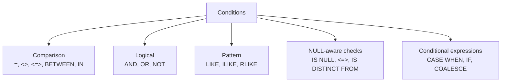

# :material-filter-check: Conditions and Predicates

Conditions (predicates) are boolean expressions used in `WHERE`, `HAVING`, `JOIN ... ON`, and `CASE WHEN`.
They decide which rows survive, how joins match, and how values are classified.

______________________________________________________________________

## :material-play-circle: In This Section

| Page                           | What it covers                                               |
| ------------------------------ | ------------------------------------------------------------ |
| [Comparison](comparison.md)    | `=`, `<>`, `<=>`, `BETWEEN`, `IN`, `IS DISTINCT FROM`        |
| [Logical](logical.md)          | `AND`, `OR`, `NOT`, precedence, and three-valued logic       |
| [Pattern Matching](pattern.md) | `LIKE`, `ILIKE`, `RLIKE`, wildcards, escaping                |
| [CASE WHEN](case-when.md)      | Searched and simple `CASE`, branch order, implicit `NULL`    |
| [IF / IIF](if-iif.md)          | `IF`, `IFNULL`, `NULLIF`, `COALESCE`, and `[Databricks] IIF` |

______________________________________________________________________

## :material-check-decagram: Verified PySpark 4.2 Highlights

| Claim checked in PySpark 4.2             | Verified result                                                                                        |
| ---------------------------------------- | ------------------------------------------------------------------------------------------------------ |
| `CASE` without `ELSE`                    | Unmatched rows return `NULL`                                                                           |
| `CASE expr WHEN NULL`                    | Does **not** match `NULL`; use `WHEN expr IS NULL` instead                                             |
| `IF(NULL, 'yes', 'no')`                  | Returns `'no'`                                                                                         |
| Open-source Spark support for `IIF(...)` | `IIF` is unresolved; use `IF` unless you are on Databricks                                             |
| `FALSE AND NULL`, `TRUE OR NULL`         | Return `FALSE` and `TRUE` respectively                                                                 |
| `NULL = NULL` vs `NULL <=> NULL`         | `=` returns `NULL`; `<=>` returns `TRUE`                                                               |
| ANSI mode effect                         | Invalid implicit casts such as `'abc' = 1` return `NULL` with ANSI off but raise an error with ANSI on |

______________________________________________________________________

## :material-sitemap: Predicate Taxonomy

______________________________________________________________________

## :material-table: Three-Valued Logic Snapshot

Spark SQL uses `TRUE`, `FALSE`, and `NULL` (unknown). Nullable boolean expressions can appear in predicates; rows survive only when the final predicate is `TRUE`.

| A       | B       | `A AND B` | `A OR B` |
| ------- | ------- | --------- | -------- |
| `TRUE`  | `TRUE`  | `TRUE`    | `TRUE`   |
| `TRUE`  | `FALSE` | `FALSE`   | `TRUE`   |
| `TRUE`  | `NULL`  | `NULL`    | `TRUE`   |
| `FALSE` | `NULL`  | `FALSE`   | `NULL`   |
| `NULL`  | `NULL`  | `NULL`    | `NULL`   |

!!! note "Verified nuance"

    A bare `NULL` literal is not a valid predicate in Spark SQL 4.2 because it has type `VOID`.
    `WHERE NULL` fails analysis, while `WHERE CAST(NULL AS BOOLEAN)` is valid and filters out every row.

______________________________________________________________________

## :material-link: Related Guides

- [Filter](../filter/index.md) - `WHERE`, `QUALIFY`, `LIMIT`
- [NULL Handling](../nulls/index.md) - `NULL` in aggregates, joins, and subqueries
- [HAVING Clause](../having/index.md) - post-aggregation filters
- [Subquery Filters](../filter/sub-query.md) - `EXISTS`, `IN`, correlated subqueries
